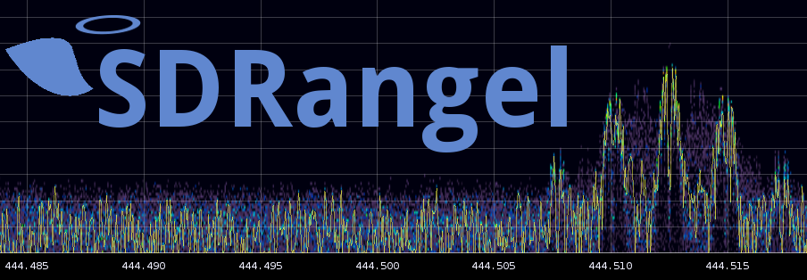

**SDRangel** is an open-source Qt5 / OpenGL 3.0+ SDR and signal analyzer frontend to various hardware.

**Wiki**: Most of the information and documentation related to SDRangel can be found in the [Wiki](https://github.com/f4exb/sdrangel/wiki). Please make sure to check it in case of questions or trouble and before you post issues on GitHub. You may also seek help from other users using the discussion group below. Before running the program, make sure you read at least the [Home](https://github.com/f4exb/sdrangel/wiki) and [Quick Start](https://github.com/f4exb/sdrangel/wiki/Quick-start) pages.

**Discussion group**: You can ask other users for help or discuss subjects related to SDRangel and its ancillary projects [here](https://groups.io/g/sdrangel).

**Ancillary projects**

* [SDRangelcli](https://github.com/f4exb/sdrangelcli) is a web application that can be used to control a headless (server flavor) instance of SDRangel. It can also be used as a remote control for the GUI flavor.
* [SDRangel-Docker](https://github.com/f4exb/sdrangel-docker) is a collection of Docker files and scripts to facilitate building and running SDRangel in a Docker container. Works for either the GUI (only on a Linux host) or the server.
