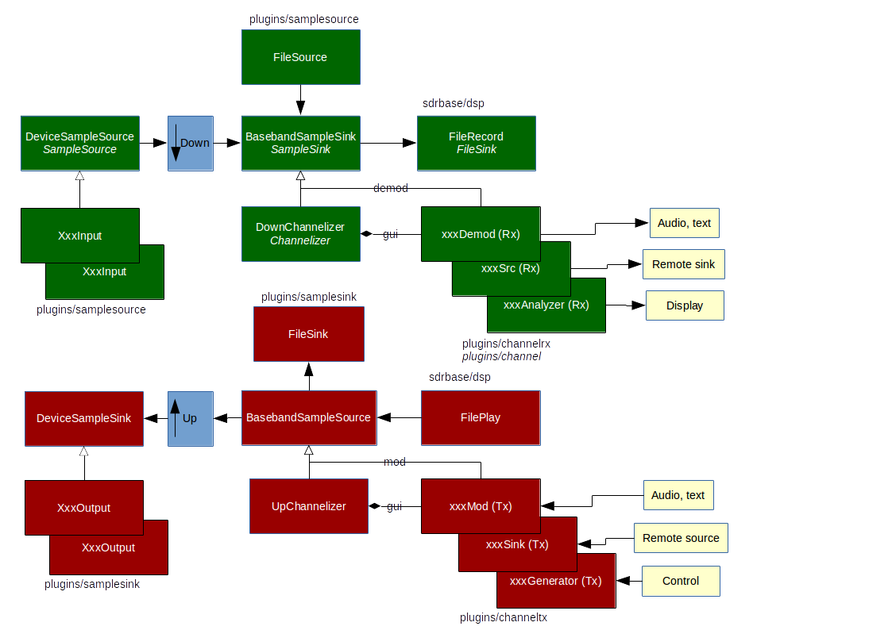
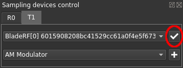

<h1>SDRangel Developer's notes</h1>

<h2>Build options</h2>

The release type can be specified with the `-DBUILD_TYPE` cmake option. It takes the following values:

  - `RELEASE` (default): produces production release code i.e.optimized and no debug symbols
  - `RELEASEWITHDBGINFO`: optimized with debug info
  - `DEBUG`: unoptimized with debug info

You can specify whether or not you want to see debug messages printed out to the console with the `-DDEBUG_OUTPUT` cmake option:

  - `OFF` (default): no debug output
  - `ON`: debug output

You can add `-Wno-dev` on the `cmake` command line to avoid warnings.

<h2>Global code structure and flow</h2>

The existing receiving flow is represented with green boxes. The futrue Tx flow with red boxes. Some classes and file paths in the Rx part were renamed to avoid collision with future Tx names in this case the old name appears below the present name in italics.

<h3>Rx path</h3>

 - The I/Q samples are collected from a physical device or UDP flow with a device plugin that derives from the `DeviceSampleSource` class.
 - These I/Q samples are downsampled by a factor set in the device plugin GUI and fed into a `BasebandSampleSink`
 - The `DownChannelizer`class downsamples further down (or not) the baseband I/Q samples depending on the requirements of the Rx plugin. It cascades the downsampling from the center, left or right half of the baseband in order to fit the Rx plugin bandwidth. It contains the NCO to adjust to the Rx plugin center frequency.
 - The special `FileSource` plugin reads a file that was recorded using the `FileRecord` class directly into the baseband as there is no downsampling from the sample rate at which the file was recorded.
 - The baseband I/Q samples can be recorded to a file using the `FileRecord` class
 
<h3>Device sample source plugins</h3>

At present the following plugins are available:

  - `AirspyXxx` classes in `plugins/samplesource/airspy`: Inteface with Airspy devices
  - `BladeRFXxx` classes in `plugins/samplesource/bladerf`: Inteface with BladeRF devices
  - `BladeRFXxx` classes in `plugins/samplesource/bladerf`: Inteface with BladeRF devices
  - `FCDProXxx` classes in `plugins/samplesource/fcdpro`: Inteface with Funcube Pro devices
  - `FCDProPlusXxx` classes in `plugins/samplesource/fcdproplus`: Inteface with Funcube Pro+ devices
  - `HackRFXxx` classes in `plugins/samplesource/hackrf`: Inteface with HackRF devices
  - `RTLSDRXxx` classes in `plugins/samplesource/rtlsdr`: Inteface with RTL-SDR devices
  - `SDRDaemonXxx` classes in `plugins/samplesource/sdrdaemon`: Special inteface collecting I/Q samples from an UDP flow sent by a remote device using [SDRdaemon](https://github.com/f4exb/sdrdaemon).
  - `SDRDaemonFECXxx` classes in `plugins/samplesource/sdrdaemonfec`: Special inteface collecting I/Q samples from an UDP flow sent by a remote device using [SDRdaemon](https://github.com/f4exb/sdrdaemon) with FEC protection of blocks.
  - `FileSource` classes in `plugins/samplesource/filesource`: Special inteface reading I/Q samples from a file directly into the baseband skipping the downsampling block

<h3>Device sample sink plugins</h3>

At present the following plugins are available:

  - `FileSink` classes in `plugins/samplesink/filesink`: Special inteface writing baseband I/Q samples to a file skipping the final upsampling block

<h3>Channel receiver (Rx) plugins</h3>

At present the following plugins are available:

  - `ChannelAnalyzerXxx` classes in `plugins/channelrx/chanalyzer`: Signal analysis tool pretty much like a DSA/DSO signal analyzer like the venerable HP 4406A (although still far from it!)
  - `AMDemodXxx` classes in `plugins/channelrx/demodam`: AM demodulator with audio output
  - `BFMDemodXxx` classes in `plugins/channelrx/demodbfm`: Broadcast FM demodulator with audio mono/stereo output and RDS
  - `DSDDemodXxx` classes in `plugins/channelrx/demoddsd`: Digital Speech demodulator/decoder built on top of the [DSDcc library](https://github.com/f4exb/dsdcc). Produces audio output and some communication data from various digital voice standards: DMR, dPMR, D-Star, Yaesu System Fusion (YSF).
  - `LoraDemodXxx` classes in `plugins/channelrx/demodlora`: Decodes [LoRa](http://www.semtech.com/images/datasheet/an1200.22.pdf) transmissions. This is legacy code that is not very well maintained so it may or may not work.
  - `NFMDemodXxx` classes in `plugins/channelrx/demodnfm`: Narrowband FM demodulator with audio output.
  - `SSBDemodXxx` classes in `plugins/channelrx/demodssb`: SSB/DSB/CW demodulator with audio output.
  - `WFMDemodXxx` classes in `plugins/channelrx/demodwfm`: Wideband FM demodulator with audio output. This is a basic demodulator.
  - `TCPSrcXxx` classes in `plugins/channelrx/tcpsrc`: Sends channel I/Q samples via TCP
  - `UDPSrcXxx` classes in `plugins/channelrx/udpsrc`: Sends channel I/Q or FM demodulated samples via UDP

<h3>Channel transmitter (Tx) plugins</h3>

At present the following plugins are available:

  - `AMMmodXxx` classes in `plugins/channeltx/modam`: AM modulator with simple sine

<h2>Source tree structure</h2>

At the first subdirectory level `indclude` and `sdrbase` contain the common core components include and source files respectively. They are further broken down in subdirectories corresponding to a specific area:

  - `audio` contains the interface with the audio device(s)
  - `dsp` contains the common blocks for Digital Signal Processing like filters, scope and spectrum analyzer internals
  - `gui` contains the common Graphical User Interface components like the scope and spectrum analyzer controls and display
  - `plugin` contains the common blocks for managing plugins
  - `settings` contains components to manage presets and preferences
  - `util` contains common utilities such as the message queue

The `plugins` subdirectory contains the associated plugins used to manage devices and channel components. Naming convention of various items depend on the usage and Rx (reception side) or Tx (transmission side) affinity. Transmission side is a work in progress.

  - Receiver functions (Rx):
    - `samplesource`: Device managers:
      - `xxx` : Device manager (e.g. xxx = airspy)
        - `xxxinput.h/cpp` : Device interface
        - `xxxgui.h/cpp` : GUI
        - `xxxplugin.h/cpp` : Plugin interface
        - `xxxsettings.h/cpp` : Configuration manager
        - `xxxthread.h/cpp` : Reading samples
        - `xxx.pro` : Qt .pro file for Windows/Android build        
    - `channelrx`: Channel handlers:
      - `demodxxx` : Demodulator internal handler (e.g xxx = demodam)
        - `xxxdemod.h/cpp` : Demodulator core
        - `xxxdemodgui.h/cpp` : Demodulator GUI
        - `xxxdemodplugin.h/cpp` : Plugin interface
        - `demodxxx.pro` : Qt .pro file for Windows/Android build
      - `xxxanalyzer` : Analyzer internal handler (e.g xxx = channel)
        - `xxxanalyzer.h/cpp` : Analyzer core
        - `xxxanalyzergui.h/cpp` : Analyzer GUI
        - `xxxanalyzerplugin.h/cpp` : Analyzer plugin manager
        - `xxxanalyzer.pro` : Qt .pro file for Windows/Android build
      - `xxxsrc` : Interface to the outside (e.g xxx = udp):
        - `xxxsrc.h/cpp` : Inteface core
        - `xxxsrcgui.h/cpp` : Interface GUI
        - `xxxsrcplugin/h/cpp` : Interface plugin manager
        - `xxxsrc.pro` : Qt .pro file for Windows/Android build

  - Transmitter functions (Tx):
    - `samplesink`: Device managers:
      - `xxx` : Device manager (e.g. xxx = bladerf)
        - `xxxsinkoutput.h/cpp` : Device interface
        - `xxxsinkgui.h/cpp` : GUI
        - `xxxsinkplugin.h/cpp` : Plugin interface
        - `xxxsinksettings.h/cpp` : Configuration manager
        - `xxxsinkthread.h/cpp` : Writing samples
        - `xxxsink.pro` : Qt .pro file for Windows/Android build        
    - `channeltx`: Channel handlers:
      - `modxxx` : Modulator internal handler (e.g xxx = modam)
        - `xxxmod.h/cpp` : Modulator core
        - `xxxmodgui.h/cpp` : Modulator GUI
        - `xxxmodplugin.h/cpp` : Plugin interface
        - `modxxx.pro` : Qt .pro file for Windows/Android build
      - `xxxgenerator` : Generator internal handler (e.g xxx = channel)
        - `xxxgenerator.h/cpp` : Generator core
        - `xxxgeneratorgui.h/cpp` : Generator GUI
        - `xxxgeneratorplugin.h/cpp` : Generator plugin manager
        - `xxxgenerator.pro` : Qt .pro file for Windows/Android build
      - `xxxsink` : Interface to the outside (e.g xxx = udp):
        - `xxxsink.h/cpp` : Inteface core
        - `xxxsinkgui.h/cpp` : Interface GUI
        - `xxxsinklugin/h/cpp` : Interface plugin manager
        - `xxxsink.pro` : Qt .pro file for Windows/Android build
        
<h2>Device interface and GUI lifecycle</h2>

<h3>Overview</h3>

Since version 3.4.0 the opening and closing of the physical device has been split off the start and stop methods of the device interface. The opening and closing of the physical device is handled in private methods called from the constructor and destructor of the device interface respectively.

The device interface is itself created in the constructor of the GUI and is deleted at the destruction of the GUI.

The lifecycle of the GUI is controlled from the "Sampling Device Control" device selector in the main window using the plugin manager. When there is a change in the hardware device selection (you can also re-cycle the same device by clicking again on this button) validated by the confirmation button (check sign icon). the following steps are executed in sequence:

  - Stop streaming
  - Delete the current GUI this will in turn delete the device interface and always close the physical device unless the physical device has a SISO or MIMO architecture (more on that later)
  - Remove the current device API from the relevant buddies lists. Buddies list are effective only for physical devices with SISO or MIMO architecture (more on that later)
  - Create the new device API 
  - Add the new device API to the relevant devices APIs buddies list
  - creates tne new GUI and hence new device interface. This will always open the physical device unless the physical device has a SISO or MIMO architecture

Here is the relevant par ot the code (source side) in the `MainWindow::on_sampleSource_confirmClicked` method:

    deviceUI->m_deviceSourceAPI->stopAcquisition();
    deviceUI->m_deviceSourceAPI->setSampleSourcePluginInstanceUI(0); // deletes old UI and input object
    deviceUI->m_deviceSourceAPI->clearBuddiesLists(); // clear old API buddies lists
    m_pluginManager->selectSampleSourceByDevice(devicePtr, deviceUI->m_deviceSourceAPI); // sets the new API
    // add to buddies list
    ... here it looks for open tabs with the same physical device and adds the deviceUI->m_deviceSourceAPI to the corresponding m_deviceSourceAPI buddies list ...
    // constructs new GUI and input object
    QWidget *gui;
    PluginManager::SamplingDevice *sampleSourceDevice = (PluginManager::SamplingDevice *) devicePtr; // lightweight representation of the device
    PluginInstanceUI *pluginUI = sampleSourceDevice->m_plugin->createSampleSourcePluginInstanceUI(sampleSourceDevice->m_deviceId, &gui, deviceUI->m_deviceSourceAPI);
    deviceUI->m_deviceSourceAPI->setSampleSourcePluginInstanceUI(pluginUI);
    deviceUI->m_deviceSourceAPI->setInputGUI(gui, sampleSourceDevice->m_displayName);
    
<h3>SISO and MIMO devices support</h3>

Some SDR hardware have Rx/Tx capabilities in a SISO or MIMO configuration. That is a physical device can handle more than one I/Q sample flow in either direction. Such devices supported by SDRangel are the following:

  - SISO full duplex: BladeRF
  - SISO half duplex: HackRF
  - MIMO: LimeSDR
  
Note that the following would also work for multiple sample channels Rx or Tx only devices but none exists or is supported at this moment.
  
In SDRangel there is a complete receiver or transmitter per I/Q sample flow. These transmitters and receivers are visually represented by the Rn and Tn tabs in the main window. They are created and disposed in the way explained in the previous paragraph using the source or sink selection confirmation button. In fact it acts as if each receiver or transmitter was controlled independently. In single input or single output (none at the moment) devices this is a true independence but with SISO or MIMO devices this cannot be the case and although each receiver or transmitter looks like it was handled independently there are things in common that have to be taken into account. For example in all cases the device handle should be unique and opening and closing the device has to be done only once per physical device usage cycle.

This is where the "buddies list" come into play. Receivers exhibit a generic interface in the form of the DeviceSourceAPI class and transmitter have the DeviceSinkAPI with the same role. Through these APIs some information and control can flow between receivers and trasmitters. The point is that all receivers and/or transmitters pertaining to the same physical device must "know" each other in order to be able to exchange information or control each other. For this purpose the DeviceSourceAPI or DeviceSinkAPI maintain a list of DeviceSourceAPI siblings and a list of DeviceSinkAPI siblings called "buddies". Thus any multi flow Rx/Tx configuration can be handled.

The exact behaviour of these coupled receivers and/or transmitters is dependent on the hardware therefore a generic pointer attached to the API can be used to convey any kind of class or structure taylored for the exact hardware use case. Through this structure the state of the receiver or transmitter can be exposed therefore there is one structure per receiver and transmitter in the device interface. This structure may contain pointers to common areas (dynamically allocated) related to the physical device. One such "area" is the device handle which is present in all cases.

Normally the first buddy would create the common areas (through new) and the last would delete them (through delete) and the indovidual structure (superstructure) would be on the stack of each buddy. Thus by copying this superstructure a buddy would gain access to common areas from another (already present) buddy along with static information from the other buddy (such as which hadrware Rx or Tx channel it uses in a MIMO architecture). Exchange of dynamic information between buddies is done using message passing.

The degree of entanglement between the different coupled flows in a single hardware can be very different:

  - BladeRF: a single Rx and Tx in SISO configuration loosely coupled:
    - independent Rx and Tx sample rates
    - independent Rx and Tx center frequencies
    - independent Gain, bandwidth, ...
    - only the device handle and indication of the presence of the XB200 accesory board is common
    
  - HackRF: this is a half duplex device. Rx and Tx might appear as tightly coupled but since you can use only one or the other then in fact you can control them differently as this is done in sequence. In fact only the common device handle has to be taken care of
  
  - LimeSDR: dual Rx and dual Tx in MIMO configuration. This implies tightly coupling between receivers on one part and transmitter on the other. But in the case of the LimeSDR (LMS7002M chip) there is even a tight coupling between Rx and Tx parts since the ADC/DAC clock is in common which means both have the same base sample rate that can only be varied by the mean of the hardware decimators and interpolators. This means:
    - Rx share the same sample rate, hardware decimation factor and center frequency
    - Tx share the same sample rate, hardware interpolation factor and center frequency
    - Rx and Tx share the same base sample rate (decimation/interpolation apart)
    - Independent Rx and Tx center frequencies
    - Independent gains, bandwidths, etc... per Rx or Tx channel
     
The openDevice and closeDevice methods of the device interface are designed specifically for each physical device type in order to manage the common resources appropriately at receiver or transmitter construction and destruction. For example opening and closing the device and the related device handle is always done this way:

  - openDevice:
    - check if there is any "buddy" present in one of the lists
    - if there is a buddy then grab the device handle and use it for next operations
    - if there is no buddy open the device and store the handle in the common area so it will be visible for future buddies
   
  - closeDevice:
    - if there are no buddies then effectively close the device else just zero out the own copy of the device handle
    
Exchange of dynamic information when necessary such as sample rate or center frequency is done by message passing between buddies.
