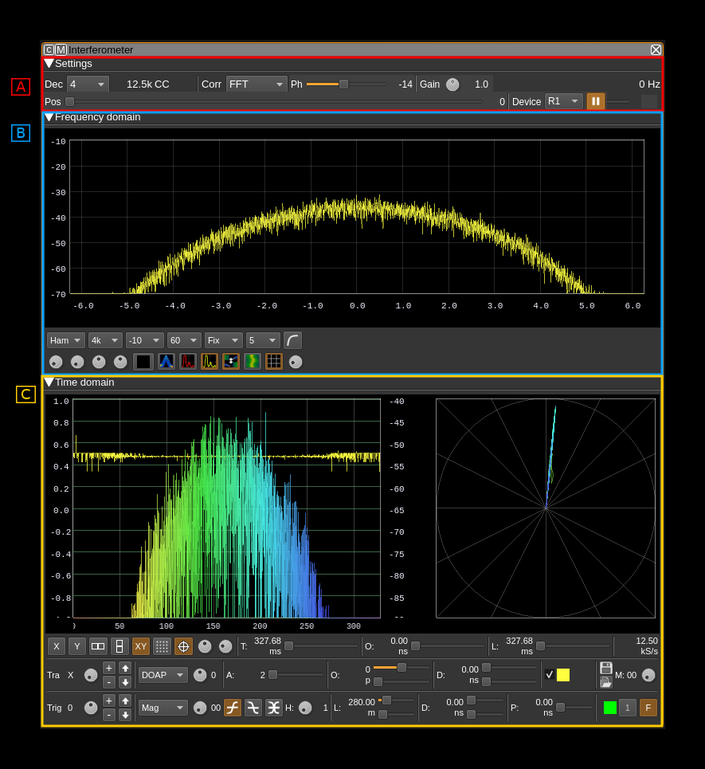
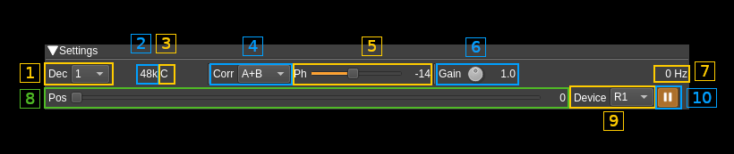

<h1>Interferometer plugin</h1>

<h2>Introduction</h2>

This MIMO reception only (MI) plugin can be used to study phase difference between two coherent streams. It must be connected to a device that exposes at least two input streams and will connect to streams 0 and 1 as channels A and B respectively.

<h2>Interface</h2>

The top and bottom bars of the channel window are described [here](../../../sdrgui/channel/readme.md)

The interface is divided in 3 sections that will be detailed next:
  - A: settings. These are the plugin controls
  - B: spectrum (frequency domain). This is a spectrum display analogous to other spectrum displays. Its input varies depending on the correlation function selected. Details on the spectrum view and controls can be found [here](../../../sdrgui/gui/spectrum.md)
  - C: scope (time domain). This is a scope display analogous to other scope displays. Its input varies depending on the correlation function selected. For FFT type correlation this is not a time domain but a frequency domain display transposed to time analogous to a frequency sweep.

<h2>A. Settings section</h2>

<h3>A.1. Decimation</h3>

Input streams from baseband are decimated by a power of two. Use this combo to select from 0 (no decimation) to 64 (2^6). The resulting channel sample rate is displayed next (A.2)

<h3>A.2. Channel sample rate</h3>

This is the channel sample rate in kilo or mega samples per second indicated by the `k` or `M` letter.

<h3>A.3. Half-band filter chain sequence display</h3>

This string represents the sequence of half-band filters used in the decimation from device baseband to channel stream and controlled by (A.7). Each character represents a filter type:

  - **L**: lower half-band
  - **H**: higher half-band
  - **C**: centered

<h3>A.4. Correlation function</h3>

This combo selects which function is applied to A and B channel inputs to obtain resulting correlation signal.
  - **A**: A channel only (no correlation)
  - **B**: B channel only (no correlation)
  - **A+B**: This is the complex sum of A and B
  - **A.B***: This is the complex multiplication of A with the conjugate of B
  - **IFFT**: This is a time correlation obtained by FFT. The FFT of A is multiplied by the conjugate of the FFT of B and the result is passed to an IFFT to obtain the final result. This can be used for passive radar.
  - **IFFT***: Same FFT operations as above but the IFFT is handled differently: sums the first half of IFFT with the reversed second half as one is the conjugate of the other so this should yield constant phase
  - **FFT**: The FFT of A is multiplied by the conjugate of the FFT of B (no IFFT) thus the result is in the frequency domain. This is sometimes called "interspectrum". It can be used in practice to evaluate the direction of arrival (DOA) of a plane wave (see next)
  - **IFFT2**: Same as IFFT but looks at the entire time domain including "negative" times.

<h4>Spectrum and scope inputs</h4>

The spectrum and scope displays inputs vary depending on the correlation types and are summarized in the table below:

<table>
<tr>
    <th>Correlation type</th>
    <th>Spectrum</th>
    <th>Scope</th>
</tr>
<tr>
    <td>A</td>
    <td>FFT(A)</td>
    <td>A(t)</td>
</tr>
<tr>
    <td>B</td>
    <td>FFT(B)</td>
    <td>B(t)</td>
</tr>
<tr>
    <td>A+B</td>
    <td>FFT(A+B)</td>
    <td>(A+B)(t)</td>
</tr>
<tr>
    <td>A.B*</td>
    <td>FFT(A.B*)</td>
    <td>(A.B*)(t)</td>
</tr>
<tr>
    <td>IFFT</td>
    <td>FFT(A)*FFT(B)*</td>
    <td>IFFT(FFT(A).FFT(B)*)</td>
</tr>
<tr>
    <td>IFFT</td>
    <td>FFT(A)*FFT(B)*</td>
    <td>IFFT(FFT(A).FFT(B)*) with special manipulation (see above)</td>
</tr>
<tr>
    <td>FFT</td>
    <td>FFT(A)*FFT(B)* over 1 FFT length</td>
    <td>FFT(A)*FFT(B)* possibly over several FFT lengths depending on trace length</td>
</tr>
<tr>
    <td>IFFT2</td>
    <td>FFT(A)*FFT(B)*</td>
    <td>IFFT(FFT(A).FFT(B)*) with positive and negative times</td>
</tr>
</table>

<h4>Direction Of Arrival (DOA) estimation with FFT correlation</h4>

The "FFT" correlation function can be selected for DOA estimation. "A.B*" should yield similar results but is less precise because FFT analysis helps in removing non essential contributions. The FFT analysis can also show different DOAs for signals at different frequencies.

It assumes that channel A is connected to the antenna of reference (device stream 0) and channel B is connected to the second antenna (device stream 1) in the following configuration:

The scope is configured to have X and Y displays with Y1 set to a magnitude display projection and X to a phase related projection. See scope controls in C section for setup. Here are the different possibilities:
  - **X**: Phi, DOAP, DOAN
  - **Y1**: Mag, MagSq, MagDB (this one is usually the most convenient)

You will select the XY display on the scope and you can use the polar grid display to show phase or direction angles directly.

Angles are counted from -&pi; to &pi; and normalized to &pi; for display thus displayed from -1.0 to 1.0

The phase difference on X input (`Phi` selected) is then the actual phase difference between the reference signal A and the second signal B. Thus for a given phase difference the wave may come from the positive side of angles (0 to &pi;) or the negative side (-&pi; to 0). Angles of arrival are referenced to the axis perpendicular to the axis passing by the two antennas.

Thus when antennas are separated by half the wavelength the relation between the angle of arrival &theta; and the phase difference &phi; can be expressed as:

&phi; = &pi; cos(&theta;) thus &theta; = acos(&phi; / &pi;)

This angle can be displayed directly when `DOAP` (positive angles) or `DOAN` (negative angles) is selected for X input.

Thus a possible procedure to determine DOA could be the following:

1. Arrange antennas axis so that the phase difference &phi; or DOA angle &theta; is roughly &pi;/2 (zero phase difference)
2. Make an assumption for the wave to come from the positive or negative angles side
3. Rotate the antennas axis slightly and if the DOA angle moves in the direction corresponding to your assumption (2) then the assumption is correct and the wave is coming from the side corresponding to your assumption. You can then refine the antenna axis direction to obtain a &pi;/2 or -&pi;/2 angle depending from which side the wave is coming. The scope `DOAP` projection is for waves coming from the positive angles side and `DOAN` for the negative angles side
4. If when performing previous step (3) the DOA angle moves in the opposite direction to the one corresponding to your assumption then the wave is coming from the opposite side w.r to your assumption. You can then refine the antenna axis direction to obtain a &plusmn;&pi;/2 DOA as in (3).
5. Once the  &plusmn;&pi;/2 DOA angle (zero phase difference) is obtained at &lambda;/2 distance between antennas you can move your antennas further apart to refine the &plusmn;&pi;/2 DOA angle.

<h3>A.5. Phase difference correction</h3>

This is the phase correction in degrees applied to signal in channel B.

<h3>A.6 Center frequency shift</h3>

This is the shift of the channel center frequency from the device center frequency. Its value is driven by the baseband sample rate, the decimation factor (A.1) and the filter chain sequence (A.7).

<h3>A.7. Half-band filter chain sequence adjust</h3>

The slider moves the channel center frequency roughly from the lower to the higher frequency in the device baseband. The number on the right represents the filter sequence as the decimal value of a base 3 number. Each base 3 digit represents the filter type and its sequence from MSB to LSB in the filter chain:

  - **0**: lower half-band
  - **1**: centered
  - **2**: higher half-band

The resulting filter chain sequence is represented in (A.3)

<h2>B. Spectrum display</h2>

This is the spectrum (frequency domain) display. This display and controls are identical to all spectrum displays in the software. Further details on spectrum controls can be found [here](https://github.com/f4exb/sdrangel/tree/master/sdrgui#4-spectrum-display-control)

<h2>C. Scope display</h2>

This is the scope (mainly time domain) display. This display and controls are identical to all scope displays in the software. Further details can be found in [Channel Analyzer documentation](../../channelrx/chanalyzer/readme.md)
