<h1>Channel Analyzer (New Generation) plugin</h1>

<h2>A. Introduction</h2>

This is an enhancement of the Channel Analyzer plugin with a new scope display hence the "New Generation" or "NG" qualifier.

This plugin can be used to analyze the complex signal received in its passband. You can visualize the spectrum (Channel Spectrum section) or waveforms related to the complex signal (Channel Scope section). These waveforms can be:

  - Real part
  - Imaginary part
  - Magnitude linear
  - Power i.e. squared magnitude linear
  - Power i.e. squared magnitude log (dB)
  - Phase
  - Phase derivative (instant frequency)
  - Direction Of Arrival on Positive side
  - Direction Of Arrival on Negative side
  - BPSK symbol mapping
  - QPSK symbol mapping
  - 8-PSK symbol mapping
  - 16-PSK symbol mapping

The same waveforms can be used to trigger the scope trace

<h2>B. General interface</h2>

The top and bottom bars of the channel window are described [here](../../../sdrgui/channel/readme.md)

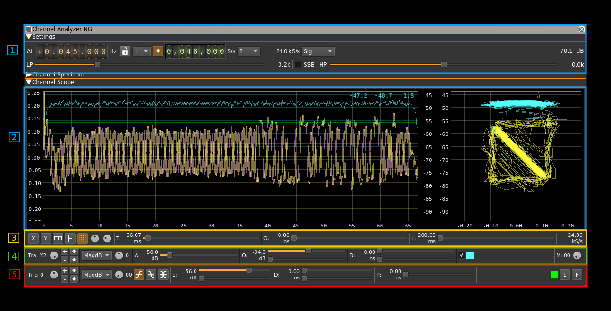

The interface is essentially divided in the following sections

  1. Channel controls
  2. Scope view (Channel scope)
  3. Scope global controls
  4. Scope trace control
  5. Scope trigger control

Note 1: the scope trace is updated continuously for sweep times of 1 second or more else the display is refreshed only when the trace finishes.

Note 2: details on the spectrum view and controls can be found [here](../../../sdrgui/gui/spectrum.md)

<h2>C. Channel controls</h2>

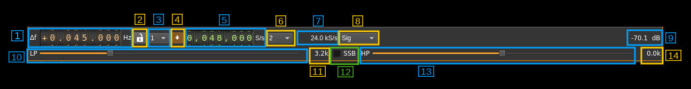

<h3>1: Frequency shift from center frequency of reception</h3>

Use the wheels to adjust the frequency shift in Hz from the center frequency of reception. Left click on a digit sets the cursor position at this digit. Right click on a digit sets all digits on the right to zero. This effectively floors value at the digit position. Wheels are moved with the mousewheel while pointing at the wheel or by selecting the wheel with the left mouse click and using the keyboard arrows. Pressing shift simultaneously moves digit by 5 and pressing control moves it by 2.

<h3>2: Decimation by a power of two</h3>

This combo can select half-band decimation from baseband sample rate by a power of two.

<h3>3: Toggle the rational downsampler</h3>

The channel sample rate is given by the baseband sample rate possibly decimated by a power of two with the control above. This sample rate can be optionally further downsampled to any value between 1.0 and 0.5 using a rational downsampler. Thus the final sample rate available to the analyzer (sink sample rate) can take any value between consecutive half-band decimator values. In conjunction with the decimator this permits a precise control of the timings independently of the baseband sample rate. Some devices are flexible on their sample rate some like the Airspy are not.

<h3>4: Rational downsampler output rate</h3>

Use the wheels to adjust the sample rate. Left click on a digit sets the cursor position at this digit. Right click on a digit sets all digits on the right to zero. This effectively floors value at the digit position. The minimum value is 2000 S/s and the maximum value is the source plugin output sample rate. Wheels are moved with the mousewheel while pointing at the wheel or by selecting the wheel with the left mouse click and using the keyboard arrows. Pressing shift simultaneously moves digit by 5 and pressing control moves it by 2.

<h3>5: Analyzer (sink) sample rate</h3>

This is the resulting sample rate after decimation and possible rational downsampler that is used by the spectrum and scope visualizations

<h3>6: signal selection</h3>

Use this combo to select which (complex) signal to use as the display source:

  - Sig: the main signal possibly mixed with PLL/FLL output (see 2 and 3)
  - Lock: the output signal (NCO) from PLL or FLL
  - ACorr: Auto-correlation of the main signal. It is a fixed 4096 point auto-correlation using FFT technique thus spanning the length of 4096 samples. The trace may show more samples in which case you will see the successive auto-correlation results.

&#9758; Auto-correlation hint: because there is always a peak of magnitude at t=0 triggering on the magnitude will make sure the trace starts at t=0

<h3>7: Locked loop</h3>

Locks a PLL or FLL on the signal and mixes its NCO with the input signal. This is mostly useful for carrier recovery on PSK modulations (PLL is used). This effectively de-rotates the signal and symbol points (constellation) can be seen in XY mode with real part as X and imaginary part as Y.

When the PLL is locked the icon lights up in green. The frequency shift from carrier appears in the tooltip. Locking indicator is pretty sharp with about +/- 100 Hz range. The FLL has no indicator.

When enabled an extra line of control appears:

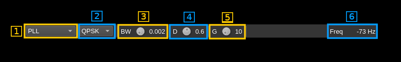

<h3>7.1: Locked loop mode</h3>

  - **PLL**: Classical PLL
  - **FLL**: Frequency Locked Loop for CW signals
  - **Costas Loop**: Costas loop based PLL

<h3>7.2: Locked loop type</h3>

Use this combo to control the locked loop type:

  - **CW**: PLL/FLL with no phase modulation. Locks to CW carrier. In FLL mode this effectively implements an AFC for FM modulations.
  - **BPSK**: PLL for BPSK modulation (bi-phase). Locks to a BPSK transmission
  - **QPSK**: PLL for QPSK modulation (quad-phase). Locks to a QPSK transmission
  - **8PSK**: PLL for 8-PSK modulation (octo-phase). Locks to a 8-PSK transmission
  - **16PSK**: PLL for 16-PSK modulation (16-phase). Locks to a 16-PSK transmission

<h3>7.3: Loop bandwidth</h3>

The loop bandwidth is the channel bandwidth multiplied by this factor

<h3>7.4: Loop damping factor</h3>

An exponential average with alpha equal to this value is applied on the loop signal

<h3>7.5: Loop gain</h3>

Gain applied to the loop signal

<h3>7.6: Frequency shift from carrier</h3>

Frequency shift from carrier in Hz

<h3>9. Channel power</h3>

Average total power in dB relative to a +/- 1.0 amplitude signal received in the pass band.

<h3>10. Toggle root raised cosine filter</h3>

Use this toggle button to activate or de-activate the root raised cosine (RRC) filter. When active the bandpass boxcar filter is replaced by a RRC filter. This takes effect only in normal (DSB) mode (see control 14).

<h3>11. Tune RRC filter rolloff factor</h3>

This button tunes the rolloff factor (a.k.a alpha) of the RRC filter in 0.01 steps between 0.1 and 0.7. Default is 0.35.

<h3>12. Select lowpass filter cut-off frequency</h3>

In SSB mode this filter is a complex filter that can lowpass on either side of the center frequency. It is therefore labeled as "LP". For negative frequencies (LSB) the cut-off frequency is therefore negative. In fact setting a negative frequency in SSB mode automatically turns on the LSB mode processing and the spectrum is reversed.

In normal (DSB) mode this filter is a real filter that lowpass on both sides of the zero (center) frequency symmetrically. Therefore it acts as a bandpass filter centered on the zero frequency and therefore it is labeled as "BP". The value displayed in (9) is the full bandwidth of the filter.

The bandwidth value display depends on SSB/DSB selection:
  - in SSB mode this is the complex cut-off frequency and is negative for LSB.
  - in normal (DSB) mode this is the full bandwidth of the real lowpass filter centered around zero frequency.

<h3>13. SSB filtering</h3>

When this toggle is engaged the signal is filtered either above (USB) or below (LSB) the channel center frequency. The sideband is selected according to the sign of the lowpass filter cut-off frequency (8): if positive the USB is selected else the LSB. In LSB mode the spectrum is reversed.

When SSB is off the lowpass filter is actually a bandpass filter around the channel center frequency.

<h3>14. Select highpass filter cut-off frequency</h3>

In SSB mode this controls the cut-off frequency of the complex highpass filter which is the filter closest to the zero frequency. This cut-off frequency is always at least 0.1 kHz in absolute value below the lowpass filter cut-off frequency (8).

In normal (DSB) mode this filter is not active.

The value displayed is the cut-off frequency of the highpass filter in kHz. It is zero or negative in LSB mode.

<h2>D. Scope global controls line</h2>

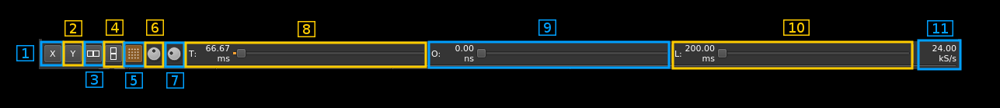

<h3>1. X only display</h3>

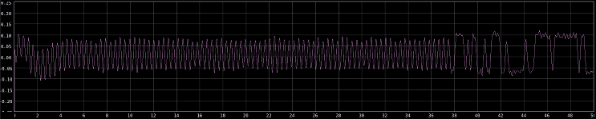

Scope displays are categorized in the X display for trace index 0 and Y display for traces with indexes > 0. Thus the trace index 0 is named the "X" trace and traces with index > 0 are named "Yn" traces where n is the trace index thus Y1, Y2, Y3, Y4 as there is a maximum of 5 traces.

This button selects the "X" trace display only on the whole surface of the scope screen

<h3>2. Y only display</h3>

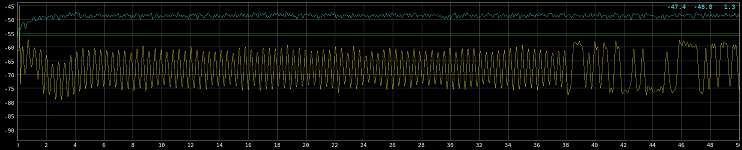

This button selects the display of all "Yn" traces on the whole surface of the scope screen

<h3>3. X and Y displays horizontally arranged</h3>

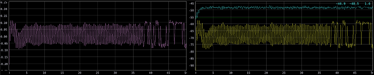

This button selects the display of "X" and "Yn" traces side by side with "X" trace on the left

<h3>4. X and Y displays vertically arranged</h3>

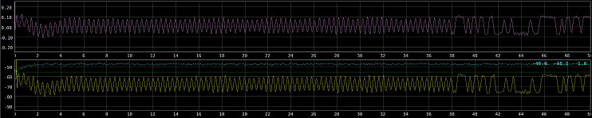

This button selects the display of "X" and "Yn" traces on top of each other with "X" trace on the top

<h3>5. All traces and polar display</h3>

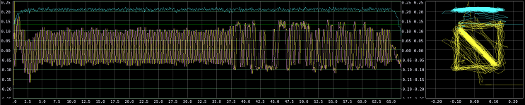

This button selects the display of all traces on the left side of the screen and the polar display of the "Yn" traces using the "X" trace as the x coordinates.

<h3>6. Line or points only display on the 2D XY display (right)</h3>

Use this button to toggle points display (on) or line display (off) for the 2D XY display on the right. The points display may yield a more visible graph when the distinct artifact is an accumulation of points.

<h3>7. Rectangular or polar grid</h3>

Use this button to switch between a rectangular and polar grid overlay on the XY display. Polar grid makes sense only if the X axis represents a phase from -1.0 to 1.0 in normalized value (radians divided by &pi;) i.e. zero centered between -&pi; and +&pi;. In practice it means Phase, DOA positive or DOA negative projections only with largest amplitude setting and zero offset. The grid represents the unit circle and axes for angles in degrees: -180, -150, -135, -120, -90, -60, -45, -30, 0, 30, 45, 60, 90, 135, 150, (180) as illustrated below:

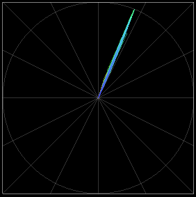

<h3>8. Select trace intensity</h3>

This button lets you adjust the traces intensity. The value in percent of the maximum intensity appears as a tooltip

<h3>9. Select grid intensity</h3>

This button lets you adjust the grid intensity. The value in percent of the maximum intensity appears as a tooltip

<h3>10. Displayed trace length</h3>

This slider lets you adjust the length of the traces on display. Each step further divides the length of the full trace controlled by (10). The duration of the full length shown on display appears on the left of the slider and the corresponding number of samples appears as a tooltip.

<h3>11. Trace offset</h3>

This slider lets you move the start of traces on display. Each step moves the trace by an amount of time corresponding to 1/100 of the length of the full trace controlled by (10). The time offset from the start of the traces appears on the left of the slider and the corresponding number of samples appears as a tooltip.

<h3>12. Trace length</h3>

This slider lets you control the full length of the trace. Each step increases the corresponding amount of samples by 4800 samples with a minimum of 4800 samples and a maximum of 20*4800 = 96000 samples. The duration of a full trace appears on the left of the slider and he corresponding number of samples appears as a tooltip.

<h3>13. Trace sample rate</h3>

This is the sample rate used by the scope and corresponds to the final sample rate after the whole decimation chain. It should be the same amount as the one displayed on the plugin control (C.6)

<h2>E. Scope trace control line</h2>

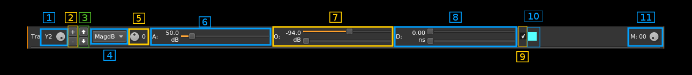

Traces are arranged as the X trace for trace index 0 and Y traces for traces with indexes > 0. The Y traces are suffixed by a trace number corresponding to the trace index thus we have Y1, Y2, Y3 and Y4 traces as there is a maximum of 5 traces. In the polar display the X trace is used for the x coordinates and the Y traces for y coordinates hence their name.

<h3>1.Select trace</h3>

This button lets you select which trace is affected by the controls. The trace name appears on the left of the button. The Y scale and the top right overlay on the displays also correspond to the selected trace (4).

<h3>2. Add/delete trace</h3>

The top "+" button lets you add a new trace. The trace controls are copied from the current selected trace. The bottom "-" button deletes the currently selected trace. You can never delete the first trace (X trace). Use the move buttons (see next) when you want to change the X trace.

<h3>3. Move trace</h3>

The top button with the up arrow lets you move the currently selected trace up by one index position. Thus the trace at the next position takes the current position and the trace at the current position takes the next position. This movement can wrap around so when the last trace is selected and moved up it will take the place of the first trace which is the X trace.

The bottom button with the down arrow lets you move the currently selected trace down by one index position. Thus the trace at the position below takes the current position and the trace at the current position takes the position below. This movement does not wrap around so the first trace (the X trace) cannot be moved down.

<h3>4. Projection selector</h3>

To construct a trace which represents real values the incoming complex signal must be "projected" on the real axis. This combo lets you select the projection scheme:

  - **Real**: take the real part
  - **Imag**: take the imaginary part
  - **Mag**: calculate magnitude in linear representation. This is just the module of the complex sample
  - **MagSq**: calculate power in linear representation. This is the squared module of the complex sample
  - **MagDB**: calculate power in log representation as 10*log10(x) or decibel (dB) representation. This is the squared module of the complex sample expressed in decibels
  - **Phi**: instantaneous phase. This is the argument of the complex sample.
  - **DOAP**: direction of arrival on the positive side. Assumes the phase of signal is the phase difference between two sources at half wavelength distance. Axis of reference (towards angle zero) is assumed to be the half line between reference source (1) and probe source (2). Assumes the angle is positive (left side of axis)
  - **DOAN**: direction of arrival on the negative side. Assumes the phase of signal is the phase difference between two sources at half wavelength distance. Axis of reference (towards angle zero) is assumed to be the half line between reference source (1) and probe source (2). Assumes the angle is negative (right side of axis)
  - **dPhi**: instantaneous derivative of the phase. This is the difference of arguments between successive samples thus represents the instantaneous frequency.
  - **BPSK**: maps -&#960; to &#960; phase into two &#960; wide sectors centered on 0 and &#960; on the -1 to +1 range (sector is 1.0 wide):
    - 0 &rarr; 0.5,
    - &#960; &rarr; -0.5
  - **QPSK**: maps -&#960; to &#960; phase into four &#960;/2 wide sectors centered on 0, &#960;/2, &#960;, -&#960;/2 on the -1 to +1 range (sector is 0.5 wide):
    - 0 &rarr; 0.25
    - &#960;/2 &rarr; 0.75
    - &#960; &rarr; -0.75
    - -&#960;/2 &rarr; -0.25
  - **8PSK**: maps -&#960; to &#960; phase into eight &#960;/4 wide sectors centered on 0, &#960;/4, &#960;/2, 3&#960;/4, &#960;, -3&#960;/4, -&#960;/2, -&#960;/4 on the -1 to +1 range (sector is 0.25 wide):
    - 0 &rarr; 0.125
    - &#960;/4 &rarr; 0.375
    - &#960;/2 &rarr; 0.625
    - 3&#960;/4 &rarr; 0.875
    - &#960; &rarr; -0.875
    - -3&#960;/4 &rarr; -0.625
    - -&#960;/2 &rarr; -0.375
    - -&#960;/4 &rarr; -0.125
  - **16PSK**: maps -&#960; to &#960; phase into sixteen &#960;/8 wide sectors centered on 0, &#960;/8, &#960;/4, 3&#960;/8, &#960;/2, 5&#960;/8, 3&#960;/4, 7&#960;/8, &#960;, -7&#960;/8, -3&#960;/4, -5&#960;/8, -&#960;/2, -3&#960;/8, -&#960;/4, -&#960;/8 on the -1 to +1 range (sector is 0.125 wide):
    - 0 &rarr; 0.0625
    - &#960;/8 &rarr; 0.1875
    - &#960;/4 &rarr; 0.3125
    - 3&#960;/8 &rarr; 0.4375
    - &#960;/2 &rarr; 0.5625
    - 5&#960;/8 &rarr; 0.6875
    - 3&#960;/4 &rarr; 0.8125
    - 7&#960;/8 &rarr; 0.9375
    - &#960; &rarr; -0.9375
    - -7&#960;/8 &rarr; -0.8125
    - -3&#960;/4 &rarr; -0.6875
    - -5&#960;/8 &rarr; -0.5625
    - -&#960;/2 &rarr; -0.4375
    - -3&#960;/8 &rarr; -0.3125
    - -&#960;/4 &rarr; -0.1875
    - -&#960;/8 &rarr; -0.0625

**Note1**: example of QPSK projection on a synchronized Tetra signal:

The signal is synchronized with the PLL in 4 phase mode (locker icon is green).
 - A Tetra signal is QPSK modulated at 18 kSym/s therefore the sample rate is set at 90 kS/s thus we have an integer number of samples per symbol (5 samples per symbol). See green square.
 - We have set two traces (X and Y1) with QPSK projection. The Y1 trace is delayed by two symbols (10 samples) which makes a 111.11 &#956;s delay. See blue square
 - In XY mode on the XY display (right) we can see an accumulation of points around the 16 possible symbol transitions. In two places the same symbol is repeated several times which results in a stronger accumulation. One is with the symbol at 0 (see red circle and square) and the other is with the symbol at &#960; (see yellow circle and square).
 - On the left panel of the XY mode display we can see that the 4 possible symbols mark 4 vertical stronger areas centered on 0.25, 0.75, -0.25 and -0.75.

**Note2**: in the MagDB mode when the trace is selected (1) the display overlay on the top right of the trace shows 3 figures. From left to right: peak power in dB, average power in dB and peak to average difference in dB.

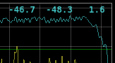

**Note3**: in the MagSq mode when the trace is selected (1) the display overlay on the top right of the trace shows 2 figures in scientific notation. From left to right: peak power and average power.

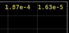

<h3>5. Source select</h3>

This is for future use when more than one incoming complex signals can be applied. The signal index appears on the right of the button

<h3>6. Amplitude adjustment</h3>

The amplitude range (vertical scale) can be set to any value from 1e-10 to 9.999e+10. Values are entered as mantissa (6.3 and 6.4) and exponent (6.5) values.

I/Q signal range is +/-1 however values larger than 1 are accommodated for the general usage of the scope in other plugins.

When displayed signal can be negative (+/- scale) the range is -range to +range. When displayed signal is positive (ex: magnitudes) the range is 0 to 2&times;range.

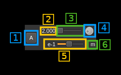

<h4>6.1. Amplitude scale reset</h4>

Push this button to reset amplitude scale to 1.

<h4>6.2. Mantissa display</h4>

The amplitude range is M&times;10E. This displays the M value.

<h4>6.3 Mantissa fine control</h4>

This slider sets the decimal digits of the mantissa from .000 to .999

<h4>6.4 Mantissa coarse control</h4>

This dial button sets the integer part of the mantissa from 1 to 9.

<h4>6.5 Exponent control</h4>

This slider sets the exponent from -10 to +10. The value is displayed at the left of the slider in exponent notation.

<h4>6.6 Unit multiplier on vertical scale</h4>

This displays the unit multiplier for values on the vertical scale of the display.

  - **p**: pico (&times;10-12)
  - **n**: nano (&times;10-9)
  - **&mu;**: micro (&times;10-6)
  - **m**: milli (&times;10-3)
  - **-**: none (&times;1)
  - **k**: kilo (&times;103)
  - **M**: mega (&times;106)
  - **G**: giga (&times;109)

<h3>7. Offset adjustment</h3>

The amplitude range can be offset by any value from -5&times;10-10 to 5&times;1010.

I/Q signal range is +/-1 however values larger than 1 are accommodated for the general usage of the scope in other plugins.

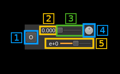

<h4>7.1. Amplitude offset reset</h4>

Push this button to reset amplitude offset to 0.

<h4>7.2. Mantissa display</h4>

The amplitude offset is M&times;10E. This displays the M value.

<h4>7.3 Mantissa fine control</h4>

This slider sets the decimal digits of the mantissa from .000 to 0.999 and jump to next unit (so 5.000 can be reached)

<h4>7.4 Mantissa coarse control</h4>

This dial button sets the integer part of the mantissa from -5 to 4.

<h4>7.5 Exponent control</h4>

This slider sets the exponent from -10 to +10. The value is displayed at the left of the slider in exponent notation.

<h3>8. Trace delay adjustment</h3>

This pair of sliders let you control the time offset of the trace from the global starting point. The time offset value appears on the left of the slider and the corresponding number of samples appears as a tooltip.

The top slider is a coarse adjustment. Each step moves trace by 100 samples

The bottom slider is a fine adjustment. Each step moves trace by 1 sample

<h3>9. Trace display enable</h3>

By default the trace display is enabled and this checkbox is checked. You can optionally "mute" the trace by unchecking this checkbox.

<h3>10. Trace color</h3>

This area shows the current trace color. When clicking on it a color chooser dialog appears that lets you change the color of the current trace

<h3>11. Save traces in memory</h3>

While in memory mode (see E.13 next) use this button to save the bank of traces in memory (50 last traces) to file. A file dialog will open to let you choose the file name and location. By default the file extension is `.trcm`.

<h3>12. Load traces into memory</h3>

While in memory mode (see E.13 next) use this button to load traces previously saved to file using the (E.11) button into the traces memory bank (50 traces). A file dialog will open to let you select the file. It will look for files with `.trcm` extension by default.

<h3>13. Memory select</h3>

The last 50 traces are stored in memory and this button lets you browse through traces in memory. The memory index appears on the left of the button. Traces in memory are sorted from latest (1) to oldest (50). The memory index 0 is the current live trace. When indexes > 0 are selected the live trace is suspended.

It is the complex signal that is memorized actually so when a trace in memory is selected you can still use the global and trace controls to change the display. In particular the projection mode and the number of traces can be changed. Only the full trace length cannot be modified. When in memory mode the triggers are disabled since they only apply to a live trace.

While in memory trace the save (E.11) and load (E.12) traces to file buttons can be used.

<h2>F. Trigger control line</h2>

<h3>1. Select trigger</h3>

This button lets you select which trigger condition is affected by the controls. The trigger index appears on the left of the button.

Up to 10 triggers (index 0..9) can be chained to give the final trigger top. The first trigger condition (index 0) is tested then if the trigger is raised the next trigger condition (index 1) is activated then when trigger is raised it passes control to the next trigger etc... until the last trigger is raised then the trace process starts. This established to point in time of the trigger. Optionally the trace can start some time before this point (this is pre-trigger - see 11)

<h3>2. Add/delete trigger</h3>

The top "+" button lets you add a new trigger condition. The trigger condition details are copied from the current selected trigger. The bottom "-" button deletes the currently selected trigger. You can never delete the first trigger (index 0).

<h3>3. Move trigger</h3>

The top button with the up arrow lets you move the currently selected trigger up by one index position. Thus the trigger at the next position takes the current position and the trigger at the current position takes the next position. This movement can wrap around so when the last trigger is selected and moved up it will take the place of the first trigger at index 0.

The bottom button with the down arrow lets you move the currently selected trigger down by one index position. Thus the trigger at the position below takes the current position and the trigger at the current position takes the position below. This movement does not wrap around so the first trigger (at index 0) cannot be moved down.

<h3>4. Projection selector</h3>

The trigger tests a threshold from real values therefore the incoming complex signal must be "projected" on the real axis before testing. The projection schemes are the same used in for calculating the traces (E.4):

Real: take the real part
Imag: take the imaginary part
Mag: calculate magnitude in linear representation. This is just the module of the complex sample
MagDB: calculate power in log representation as 10*log10(x) or decibel (dB) representation. This is the squared module of the complex sample expressed in decibels
Phi: instantaneous phase. This is the argument of the complex sample.
dPhi: instantaneous derivative of the phase. This is the difference of arguments between successive samples thus represents the instantaneous frequency.

<h3>5. Trigger repetition</h3>

This number of trigger conditions must be met before the actual trigger is raised.

<h3>6. Positive edge select</h3>

This button selects the positive edge triggering. Trigger is raised only of the current sample is above threshold and the previous sample is below threshold

<h3>7. Positive edge select</h3>

This button selects the negative edge triggering. Trigger is raised only of the current sample is below threshold and the previous sample is above threshold

<h3>8. Both edges select</h3>

This button selects both signal edges triggering. Trigger is raised if the signal crosses threshold in any direction. This actually combines the positive and negative edge testing with an or condition.

<h3>9. Trigger holdoff</h3>

Use this button to control the trigger holdoff in a number of samples from 1 to 12.

The above level condition is counted for a number of samples and if it is has been true for the holdoff number of samples the condition is declared true. A similar count is used for the false condition (below level).

When the condition is declared true the counter of false conditions is reset and accordingly when the condition is declared false the counter of true conditions is reset.

A value above 1 helps eliminating false triggers when small spikes appear on the leading or falling edge of a larger pulse. A value of 1 (minimum) means that the holdoff is not active.

<h3>10. Trigger level adjustment</h3>

This pair of sliders let you adjust the trigger level, The level appears on the left of the sliders.

The top slider is a coarse adjustment. Each step moves the trigger level by an amount that depends on the projection type:

  - Real, Imag: 0.01
  - Mag: 0.01
  - MagSq: 0.01
  - MagDB: 1 dB
  - Phi, dPhi: 0.01

The bottom slider is a fine adjustment. Each step moves the trigger level by an amount that depends on the projection type:

  - Real, Imag: 20.0E-6
  - Mag: 20.0sE-6
  - MagSq: 20.0sE-6
  - MagDB: 0.01 dB
  - Phi, dPhi: 20.0E-6

<h3>11: Trigger delay</h3>

The actual trigger top can be moved forward by a number of samples. This pair of slider lets you adjust this delay. The delay in time units appears at the left of the sliders and the amount of samples as a tooltip

The top slider is a coarse adjustment. Each step moves the delay by a trace length. The bottom slider is a fine adjustment. Each step moves the delay by 20 samples

<h3>12. Pre-trigger delay</h3>

The trace can start an amount of time before the trigger top. This pair of sliders let you adjust this amount of time which is displayed at the left of the sliders. The corresponding number of samples appear as a tooltip.

The top slider is a coarse adjustment. Each step moves the delay by a hundreth of the trace length. The bottom slider is a fine adjustment. Each step moves the delay by 20 samples.

<h3>13. Trigger line color</h3>

This area shows the current trigger line color. When clicking on it a color chooser dialog appears that lets you change the color of the current trigger line color. This line appears when the selected trace projection matches the trigger projection.

<h3>14. One-shot trigger</h3>

This button toggles a one shot trigger. When the (final) trigger is raised only one trace is processed until the button is released.

<h3>15. Freerun</h3>

When active the triggers are disabled and traces are processed continuously. This is the default at plugin start time.

<h2>G. Markers</h2>

Markers can be set on the X and Y individual views. This does not apply to the XY combined and polar view. Y values apply to Y1 trace.

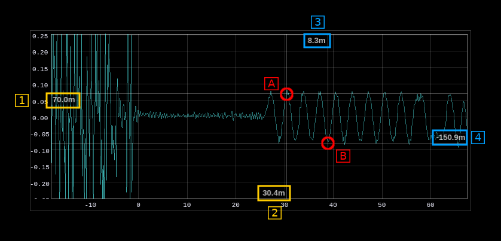

Use Shift and mouse left click to set a new marker. There is a maximum of two markers with a different status:
  - The first marker (A) will display time (2) and value on the scale side of the view (1). Value units are whatever corresponds to the trace type and is suffixed with a multiplier character (see next). Time units are in seconds suffixed with a  multiplier character
  - The second marker (B) will display time difference (3) and value difference (4) with the first marker on the opposite side of the scales. Displayed values are suffixed with a multiplier character.

Displayed values are suffixed with a multiplier character:
  - **p**: pico (times 1e-12)
  - **n**: nano (times 1e-9)
  - **u**: micro (times 1e-6)
  - **m**: milli (times 1e-3)
  - no character: no change (times one)
  - **k**: kilo (times 1e3)
  - **M**: mega (times 1e6)
  - **G**: giga (times 1e9)

Use mouse right click anywhere in the view to remove the last entered marker. Use shift and mouse right click to remove all markers.

Any change in the trace settings is not reflected in the markers. You have to clear them and make a new measurement if any critical setting of the trace is changed.
