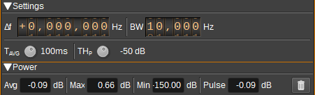

<h1>Channel Power Plugin</h1>

<h2>Introduction</h2>

This plugin can be used to calculate channel power. Channel power is measured as average power, maximum peak power, minimum peak power as well as pulse average power (i.e. average power above a threshold) over a specified bandwidth.

<h2>Interface</h2>

The top and bottom bars of the channel window are described [here](../../../sdrgui/channel/readme.md)

<h3>1: Channel frequency entry mode</h3>

Select from one of the following modes to determine how the channel center frequency is calculated:

* Δf - Specify an offset in Hz from device center frequency.
* f - Specific a frequency in Hz.

<h3>2: Channel Frequency</h3>

Specifies channel center frequency according to frequency entry mode (1):

* Δf - Offset in Hz from device center frequency.
* f - Absolute frequency in Hz.

<h3>3: BW - Channel Bandwidth</h3>

Bandwidth in Hz of the channel for which power is to be measured.

<h3>4: Tavg - Average Time</h3>

Time period over which the channel power is averaged. Values range from 10us to 10s in powers of 10. The available values depend upon the sample rate.

<h3>5: THp - Pulse Threshold</h3>

The pulse threshold sets the power in dB for which the channel power needs to exceed, in order to be included in the pulse average power measurement.

<h3>6: Avg - Average Power</h3>

Displays the most recent average power measurement in dB.

<h3>7: Max - Max Peak Power</h3>

Displays the maximum instantaneous peak power measurement in dB.

<h3>8: Min - Min Peak Power</h3>

Displays the minimum instantaneous peak power measurement in dB.

<h3>9: Pulse - Pulse Average Power</h3>

Displays the most recent pulse average power measurement in dB.

<h3>10: Clear Data</h3>

Clears current measurements (min and max values are reset).
