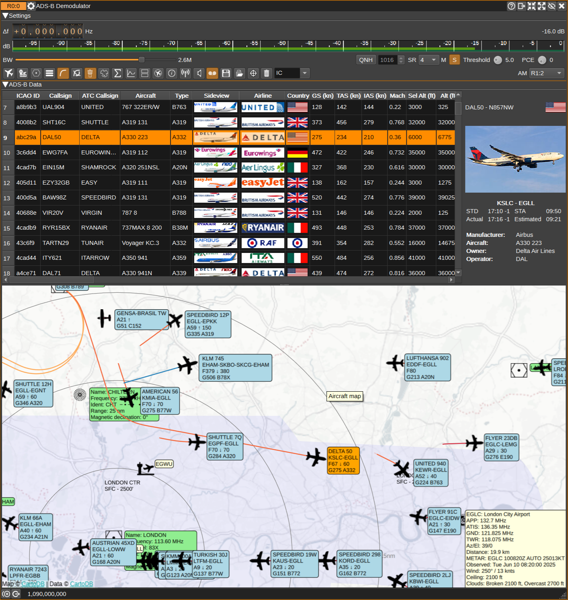
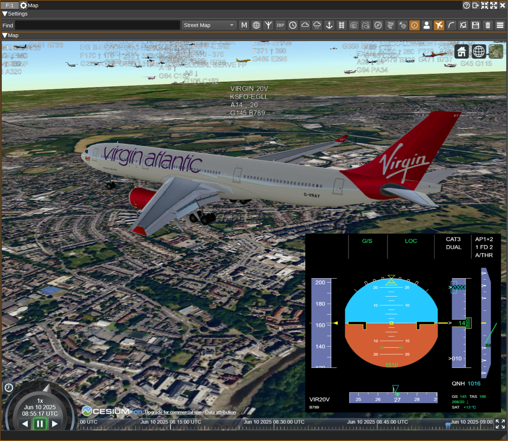
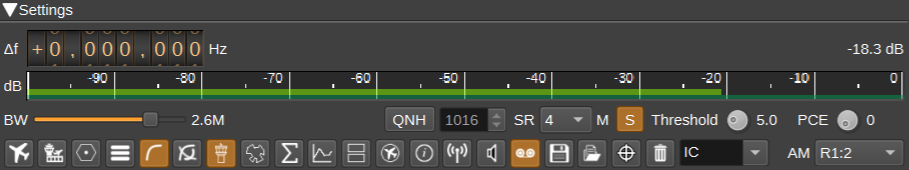
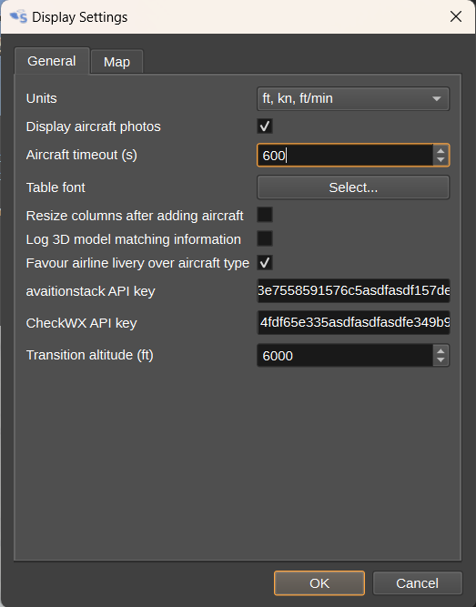
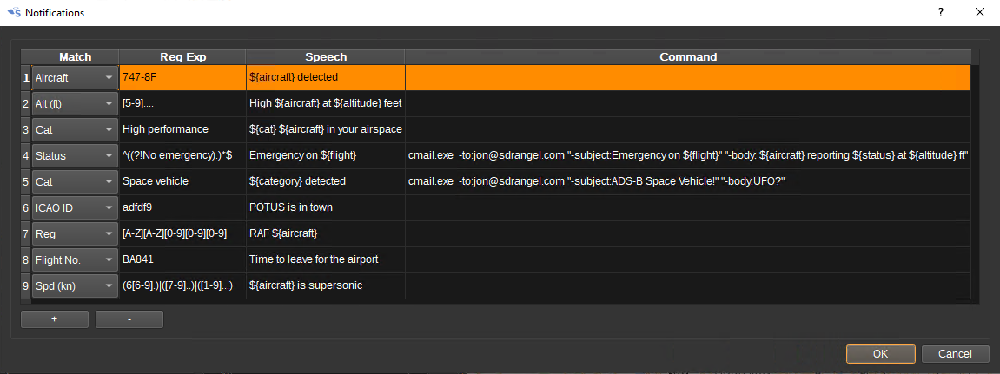
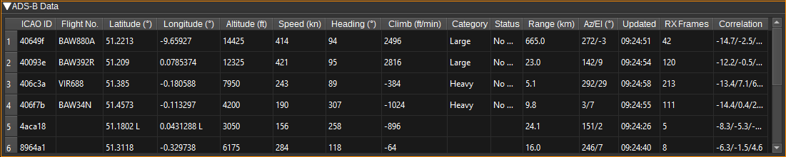
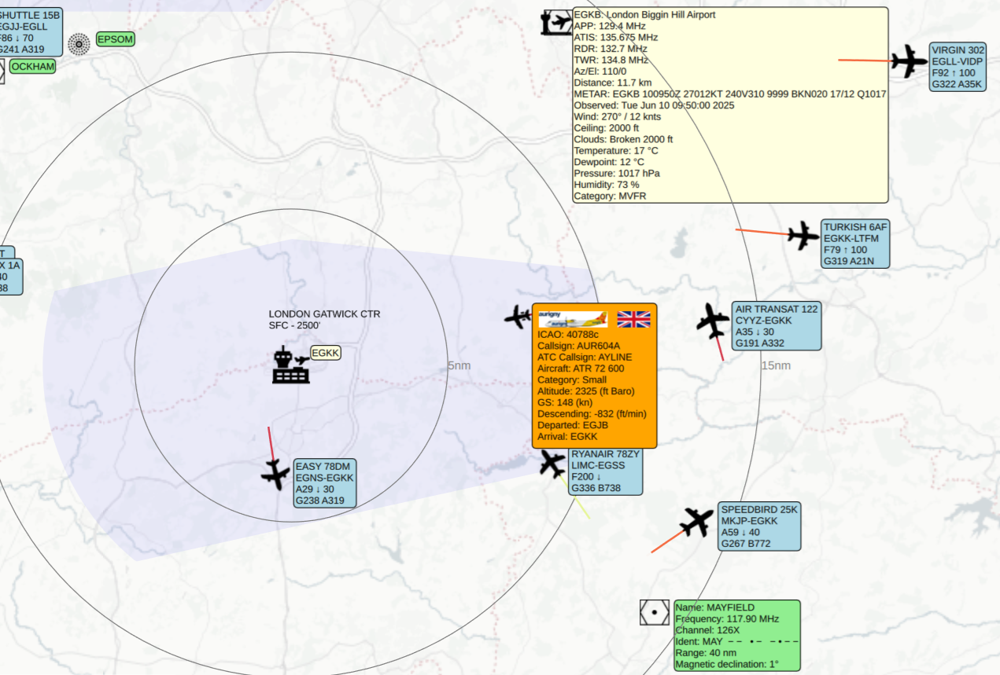
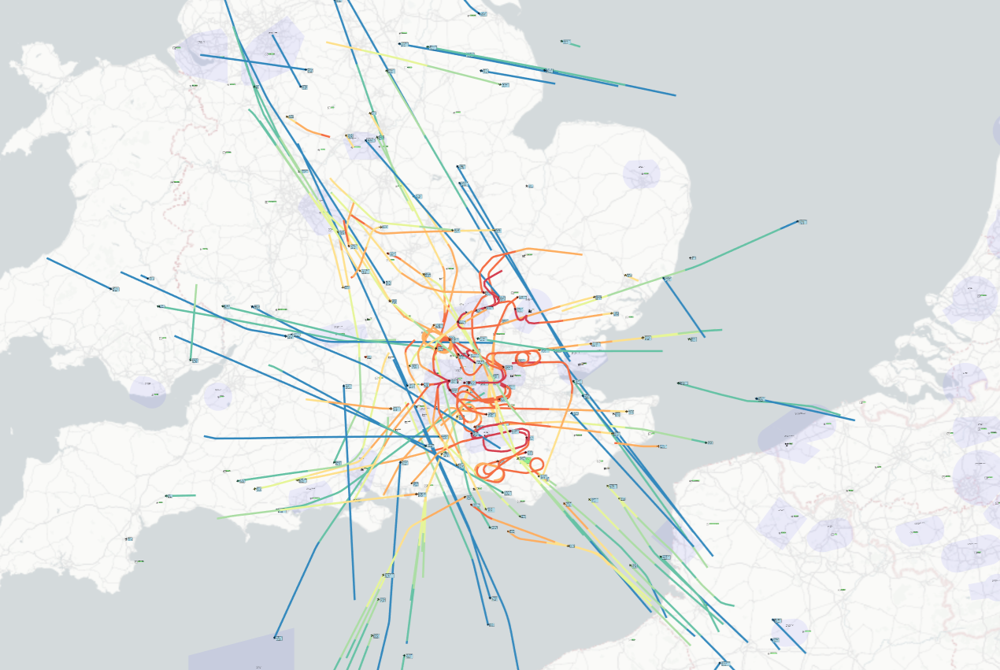

<h1>ADS-B demodulator plugin</h1>

<h2>Introduction</h2>

The ADS-B demodulator plugin can be used to receive and display ADS-B and Mode-S frames broadcast by aircraft. These contain information about an aircraft, such as position, altitude, heading and speed, broadcast by aircraft on 1090MHz. ADS-B and Mode-S frames have a chip rate of 2Mchip/s, so the baseband sample rate should be set to 2MSa/s or greater.

As well as displaying information received via ADS-B and Mode-S, the plugin can also combine information from a number of databases to display more information about the aircraft and flight, airports and weather.

The ADS-B plugin can send aircraft for display on the [Map Feature](../../feature/map/readme.md) alongside objects from other plugins and in 3D.

<h2>Interface</h2>

The top and bottom bars of the channel window are described [here](../../../sdrgui/channel/readme.md)

<h3>1: Frequency shift from center frequency of reception value</h3>

Use the wheels to adjust the frequency shift in Hz from the center frequency of reception. Right click on a digit sets all digits on the right to zero. This effectively floors value at the digit position. Wheels are moved with the mousewheel while pointing at the wheel or by selecting the wheel with the left mouse click and using the keyboard arrows. Pressing shift simultaneously moves digit by 5 and pressing control moves it by 2. Left click on a digit sets the cursor position at this digit.

<h3>2: Channel power</h3>

Average total power in dB relative to a +/- 1.0 amplitude signal received in the pass band.

<h3>3: Level meter in dB</h3>

  - top bar (green): average value
  - bottom bar (blue green): instantaneous peak value
  - tip vertical bar (bright green): peak hold value

<h3>4: RF bandwidth</h3>

This is the bandwidth in MHz of the channel signal before demodulation.

<h3>5: SR - Channel Sample Rate</h3>

This specifies the channel sample rate the demodulator uses. Values of 2M-12MSa/s are supported, 2MSa/s steps. Ideally, this should be set to the same value as the baseband sample rate (the sample rate received from the radio). If it is different from the baseband sample rate, interpolation or decimation will be performed as needed to match the rates. However, interpolation currently requires a significant amount of processing power and may result in dropped samples.

2 MSa/s should give decent decodes. Higher rates may be experimented with if your hardware allows it (radio device and processing power). However the higher the rate the more processing power required.

<h3>6: S - Demodulate Mode-S frames</h3>

Checking the S button will enable demodulation of Mode-S ELS (Elementary Surveillance), EHS (Enhanced Surveillance) and MRAR (Meteorological Routine Air Report) frames.

<h3>7: FP - Correlate Against Full Preamble</h3>

When the FP button is checked, the demodulator will correlated the received signal against all expected 8 bits of the ES1090 preamble. When unchecked, the correlation will only be against the first 6 bits. Only correlating the first 6 bits can reduce the processing requirements, but may result in more invalid frames.

<h3>8: Threshold</h3>

This sets the correlation threshold in dB between the received signal and expected 1090ES preamble, that is required to be exceeded before the demodulator will try to decode a frame. Lower values should decode more frames and will require more processing power, but will more often decode invalid frames. You may also look at correlation values obtained with reliable signals in the "Correlation" column of the data table.

<h3>9: Download Opensky-Network Aircraft Database</h3>

Clicking this will download the [Opensky-Network](https://opensky-network.org/) aircraft database. This database contains information about aircraft, such as registration, aircraft model and owner details, that is not broadcast via ADS-B. Once downloaded, this additional information will be displayed in the table alongside the ADS-B data. The database should only need to be downloaded once, as it is saved to disk, and it is recommended to download it before enabling the demodulator.

<h3>10: Download OurAirports Airport Databases</h3>

Clicking this will download the [OurAirports](https://ourairports.com/) airport databases. These contains names and locations for airports allowing them to be drawn on the map, as well as their corresponding ATC frequencies, which can also be displayed next to the airport on the map, by clicking the airport name. The size of airports that will be displayed on the map, and whether heliports are displayed, can be set in the Display Settings dialog.

<h3>11: Download OpenAIP Airspace and NAVAID Databases</h3>

Clicking this will download the [OpenAIP](https://www.openaip.net/) airspace and NAVAID databases. These can be displayed on the map. The airspace categories to be displayed can individually be selected in the Display Settings dialog.

<h3>12: Display Settings</h3>

Clicking the Display Settings button will open the Display Settings dialog, which allows you to choose:

* The units for altitude, speed and vertical climb rate. These can be either ft (feet), kn (knots) and ft/min (feet per minute), or m (metres), kph (kilometers per hour) and m/s (metres per second).
* The map provider. This can be osm for OpenStreetMaps or mapboxgl for Mapbox. mapboxgl is not supported on Windows. mapboxgl should be used on Linux with Qt 5.15.3, as osm maps will cause SDRangel to hang, due to a bug in Qt.
* The type of map that will be displayed. This can either be a light or dark aviation map (with no place names to reduce clutter), a street map or satellite imagery.
* The minimum zoom level (0 min zoom - 15 max zoom) at which aircraft icons will be scaled.
* The minimum size airport that will be displayed on the map: small, medium or large. Use small to display GA airfields, medium for regional airports and large for international airports.
* Whether or not to display heliports.
* The distance (in kilometres), from the location set under Preferences > My Position, at which airports will be displayed on the map. Displaying too many airports will slow down drawing of the map.
* What category of airspaces should be displayed.
* The distance (in kilometres), from the location set under Preferences > My Position, at which airspaces will be displayed on the map. Displaying too many airspaces will slow down drawing of the map.
* Whether NAVAIDs, such as VORs, are displayed on the map.
* Whether aircraft photos are displayed for the highlighted aircraft.
* The timeout, in seconds, after which an aircraft will be removed from the table and map, if an ADS-B frame has not been received from it.
* The font used for the table.
* Whether demodulator statistics are displayed (primarily an option for developers).
* Whether the columns in the table are automatically resized after an aircraft is added to it. If unchecked, columns can be resized manually and should be saved with presets.

You can also enter an [aviationstack](https://aviationstack.com/product) API key, needed to download flight information (such as departure and arrival airports and times).

A [CheckWX](https://www.checkwxapi.com/) API key can be entered in order to download airport weather (METARs) which can be displayed on the map.

<h3>13: Display Flight Path</h3>

Checking this button draws a line on the map showing the highlighted aircraft's flight paths, as determined from received ADS-B frames.

<h3>14: Display Flight All Paths</h3>

Checking this button draws flight paths for all aircraft.

<h3>15: Download flight information for selected flight</h3>

When clicked, flight information (departure and arrival airport and times) is downloaded for the aircraft highlighted in the ADS-B data table using the aviationstack.com API.
To be able to use this, a callsign for the highlighted aircraft must have been received. Also, the callsign must be mappable to a flight number, which is not always possible (this is typically
the case for callsigns that end in two characters, as for these, some digits from the flight number will have been omitted).

To use this feature, an [aviationstack](https://aviationstack.com) API Key must be entered in the Display Settings dialog (12). A free key giving 500 API calls per month is [available](https://aviationstack.com/product).

<h3>16: Feed</h3>

Checking Feed enables feeding received ADS-B frames to aggregators such as [ADS-B Exchange](https://www.adsbexchange.com), [ADSBHub](https://www.adsbhub.org) or [OpenSky Network](https://opensky-network.org/)
and receiving aircraft state from anywhere in the world from [OpenSky Network](https://opensky-network.org/). Right clicking on the Feed button opens the Feed Settings dialog.

The ADS-B plugin can export ADS-B frames acting as both a client and server. When a client, the ADS-B plugin opens a connection to a remote host. When a server, the remote computer connects to this computer.

As a client:

* For ADS-B Exchange, check Enable Client, set Server hostname to feed.adsbexchange.com, Port to 30005 and Format to Beast binary. You can check for successful feeding (after about 30 seconds) at: https://www.adsbexchange.com/myip/
* For ADSBHub, check Enable Client, set Server hostname to data.adsbhub.org, Port to 5002 and Format to Beast hex. You will need to have setup an account on ADSBHub first. You can check for successful feeding at: https://www.adsbhub.org/statistic.php

As a server:

* For OpenSky Network, check Enable Server and set Port to 30005. You can check for successful feeding at: https://opensky-network.org/my-opensky

The Beast binary and Hex formats are as detailed here: https://wiki.jetvision.de/wiki/Mode-S_Beast:Data_Output_Formats

When Enable import is checked, aircraft data for aircraft anywhere in the world can be imported from OpenSky Network.
A username and password are not required, but when specified, this allows the update period to be reduced to 5 seconds instead of 10 seconds.
To limit network traffic and processing power requirements, a geographical region can be set via the minimum and maximum latitude and longitude fields.

<h3>17: Open Notifications Dialog</h3>

When clicked, opens the Notifications Dialog, which allows speech notifications or programs/scripts to be run when aircraft matching user-defined rules are seen.

For example, you might want an audible notification when a particularly interesting aircraft is nearby or when an aircraft declares an emergency.
By running a program such as [cmail](https://www.inveigle.net/cmail/download), e-mail notifications can be sent.

Also you can set the target aircraft to the matching aircraft automatically by checking the box in the "Auto target" column.

Here are a few examples:

Aircraft categories are:

* Light
* Small
* Large
* High vortex
* Heavy
* High performance
* Rotorcraft
* Glider/sailplane
* Lighter-than-air
* Parachutist
* Ultralight
* UAV
* Space vehicle
* Emergency vehicle
* Service vehicle
* Ground obstruction
* Cluster obstacle
* Line obstacle

Emergency status are:

* No emergency
* General emergency
* Lifeguard/Medical
* Minimum fuel
* No communications
* Unlawful interference
* Downed aircraft

In the Speech and Command strings, variables can be used to substitute in data from the ADS-B table for the aircraft:

* ${icao},
* ${callsign}
* ${aircraft}
* ${verticalRate}
* ${gs}
* ${tas}
* ${is}
* ${mach}
* ${selAltitude}
* ${altitude}
* $(verticalRate}
* ${selHeading}
* ${heading}
* ${turnRate}
* ${roll}
* ${range}
* ${azel}
* ${category}
* ${status}
* ${squawk}
* ${registration}
* ${manufacturer}
* ${owner}
* ${operator}
* ${ap}
* ${vMode}
* ${lMode}
* ${baro}
* ${headwind}
* ${windSpeed}
* ${windDirection}
* ${staticPressure}
* ${staticAirTemperature}
* ${humidity}
* ${latitude}
* ${longitude}
* ${rssi}
* ${flightstatus}
* ${departure}
* ${arrival}
* ${std}
* ${etd}
* ${atd}
* ${sta}
* ${eta}
* ${ata}

<h3>18: Start/stop Logging ADS-B frames to .csv File</h3>

When checked, writes all received ADS-B frames to a .csv file.

<h3>19: .csv Log Filename</h3>

Click to specify the name of the .csv file which received ADS-B frames are logged to.

<h3>20: Read Data from .csv File</h3>

Click to specify a previously written ADS-B .csv log file, which is read and used to update the ADS-B data table and map.

<h3>21: Select device set</h3>

Specify the SDRangel device set that will be have its centre frequency set when an airport ATC frequency is clicked on the map. Typically, this device set would be a second SDR (as ATC frequencies are around 120MHz, so they can not be received simultaneously with 1090MHz for ADS-B) and have an AM Demodulator channel plugin.

<h3>ADS-B Data</h3>

The table displays the decoded ADS-B and Mode-S data for each aircraft along side data available for the aircraft from the Opensky Network database (DB) and aviationstack (API). The data is not all able to be transmitted in a single ADS-B frame, so the table displays an amalgamation of the latest received data of each type.

* ICAO ID - 24-bit hexadecimal ICAO aircraft address. This is unique for each aircraft. (ADS-B)
* Callsign - Aircraft callsign (which is sometimes also the flight number). (ADS-B / Mode-S)
* Aircraft - The aircraft model. (DB)
* Airline - The logo of the operator of the aircraft (or owner if no operator known). (DB)
* Country - The flag of the country the aircraft is registered in. (DB)
* GS - Groundspeed in knots or kilometers per hour. (Mode-S)
* TAS - True airspeed in knots or kilometers per hour. (Mode-S)
* IAS - Indicated airspeed in knots or kilometers per hour. (Mode-S)
* Mach - Mach number. (Mode-S)
* Sel Alt - Selected altitude (as set on MCP/FCU or by FMS) in feet or metres. (ADS-B / Mode-S)
* Alt - Altitude in feet or metres. (ADS-B / Mode-S)
* VR - The vertical climb rate (or descent rate if negative) in feet/minute or m/s. (ADS-B / Mode-S)
* Sel Hd - Selected heading (as set on MCP/FCU or by FMS) in degrees. (ADS-B / Mode-S)
* Hd - The aircraft heading or track, in degrees. (ADS-B / Mode-S)
* TR - Turn rate in degrees per second. (Mode-S)
* Roll - Roll angle in degrees. Positive is right wing down. (Mode-S)
* D - The distance to the aircraft from the receiving antenna in kilometres. The location of the receiving antenna is set under the Preferences > My Position menu.
* Az/El - The azimuth and elevation angles to the aircraft from the receiving antenna in degrees. These values can be sent to a rotator controller Feature plugin to track the aircraft.
* Category (Cat) - The vehicle category, such as Light, Large, Heavy or Rotorcraft. (ADS-B)
* Status - The status of the flight, including if there is an emergency. (ADS-B)
* Squawk - The squawk code (Mode-A transponder code). (ADS-B / Mode-S)
* Registration (Reg) - The registration number of the aircraft. (DB)
* Registered - The date when the aircraft was registered. (DB)
* Manufacturer - The manufacturer of the aircraft. (DB)
* Owner - The owner of the aircraft. (DB)
* Operator - The operator ICAO. (DB)
* AP - Whether autopilot is enabled. (ADS-B)
* V Mode - Vertical navigation mode. This may be VNAV (Vertical navigation), HOLD (Altitude hold) or APP (Approach). (ADS-B / Mode-S)
* L Mode - Lateral navigation mode. This may be LNAV (Lateral navigation) or APP (Approach). (ADS-B)
* Baro - Baro setting in mb. (ADS-B / Mode-S)
* H Wnd - Headwind in knots or kilometers per hour. Negative values indicate a tailwind. (Derived from Mode-S)
* OAT - Outside air temperature in degrees Celsius, estimated from Mach and TAS. (Derived from Mode-S)
* Wnd - Wind speed in knots or kilometers per hour. (Mode-S)
* Wnd - Wind direction in degrees. (Mode-S)
* P - Average static air pressure in hectopascals. (Mode-S)
* T - Static air temperature in degrees Celsius. (Mode-S)
* U - Humidity in percent. (Mode-S)
* Latitude (Lat) - Vertical position coordinate, in decimal degrees. North positive. (ADS-B)
* Longitude (Lon) - Horizontal position coordinate, in decimal degrees. East positive. (ADS-B)
* Updated - The local time at which the last message was received. (ADS-B / Mode-S)
* RX Frames - A count of the number of frames received from this aircraft. (ADS-B / Mode-S)
* TIS-B - A count of the number of TIS-B frames for this aircraft. (ADS-B)
* Correlation - Displays the minimum, average and maximum of the preamble correlation in dB for each received frame. These values can be used to help select a threshold setting. This correlation value is the ratio between the presence and absence of the signal corresponding to the "ones" and the "zeros" of the sync word adjusted by the bits ratio. It can be interpreted as a SNR estimation.
* RSSI - This Received Signal Strength Indicator is based on the signal power during correlation estimation. This is the power sum during the expected presence of the signal i.e. the "ones" of the sync word.
* Flight status - scheduled, active, landed, cancelled, incident or diverted. (API)
* Dep - Departure airport. (API)
* Arr - Arrival airport. (API)
* STD - Scheduled time of departure. (API)
* ETD - Estimated time of departure. (API)
* ATD - Actual time of departure. (API)
* STA - Scheduled time of arrival. (API)
* ETA - Estimated time of arrival. (API)
* ATA - Actual time of arrival. (API)

If an ADS-B frame has not been received from an aircraft for 60 seconds, the aircraft is removed from the table and map. This timeout can be adjusted in the Display Settings dialog.

* Single clicking in a cell will highlight the row and the corresponding aircraft information box on the map will be coloured orange, rather than blue.
* Right clicking on the header will open a menu allowing you to select which columns are visible.
* To reorder the columns, left click and drag left or right a column header.
* Left click on a header to sort the table by the data in that column.
* Double clicking in an ICAO ID cell will open a Web browser and search for the corresponding aircraft on https://www.planespotters.net/
* Double clicking in an Callsign cell will open a Web browser and search for the corresponding flight on https://www.flightradar24.com/
* Double clicking in an Az/El cell will set the aircraft as the active target. The azimuth and elevation to the aircraft will be sent to a rotator controller plugin. The aircraft information box will be coloured green, rather than blue, on the map.
* Double clicking on any other cell in the table will centre the map on the corresponding aircraft.

<h2>Map</h2>

The map displays aircraft locations and data geographically. Four types of map can be chosen from in the Display Settings dialog: Aviation, Aviation (Dark), Street and Satellite.

The antenna location is placed according to My Position set under the Preferences > My Position menu.
If My Position is not set correctly, the position of aircraft may not be computed correctly.

Aircraft are only placed upon the map when a position can be calculated, which can require several frames to be received.

* To pan around the map, click the left mouse button and drag. To zoom in or out, use the mouse scroll wheel.
* Left clicking on an aircraft will highlight the corresponding row in the table for the aircraft and the information box on the map will be coloured orange, rather than blue.
* Double clicking on an aircraft will set it as the active target and the information box will be coloured green.
* Left clicking the information box next to an aircraft will reveal more information. It can be closed by clicking it again.
* Left clicking the information box next to an airport will reveal ATC frequencies for the airport (if the OurAirports database has been downloaded) and METAR weather information (if the CheckWX API key has been entered).
The METAR for the airport is downloaded each time the information box is opened.
This information box can be closed by left clicking on the airport identifier.
Double clicking on one of the listed frequencies, will set it as the centre frequency on the selected SDRangel device set (21).
The Az/El row gives the azimuth and elevation of the airport from the location set under Preferences > My Position. Double clicking on this row will set the airport as the active target.

<h2>Attribution</h2>

Airline logos and flags are by Steve Hibberd from https://radarspotting.com

Map icons are by Alice Design, Alex Ahineev, Botho Willer, Verry Obito, Sean Maldjia, Tinashe Mugayi, Georgiana Ionescu, Andreas Vögele, Tom Fricker, Will Sullivan, Tim Tores, BGBOXXX Design, and Angriawan Ditya Zulkarnain from the Noun Project https://thenounproject.com/

NDB icon is by Inductiveload from WikiMedia.
