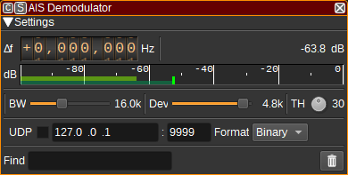
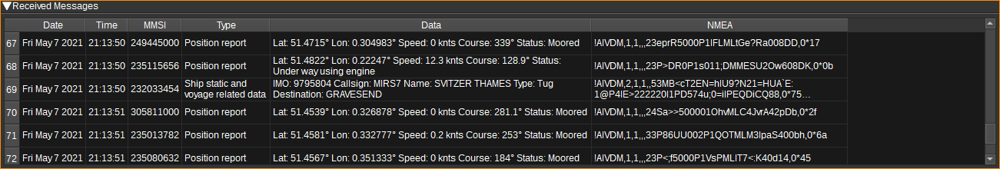

<h1>AIS demodulator plugin</h1>

<h2>Introduction</h2>

This plugin can be used to demodulate AIS (Automatic Identification System) messages. AIS can be used to track ships and other marine vessels at sea, that are equipped with AIS transponders. It is also used by shore-side infrastructure known as base stations, aids-to-navigation such as buoys and some search and rescue aircraft.

AIS is broadcast globally on 25kHz channels at 161.975MHz and 162.025MHz, with other frequencies being used regionally or for special purposes. This demodulator is single channel, so if you wish to decode multiple channels simultaneously, you will need to add one AIS demodulator per frequency. As most AIS messages are on 161.975MHz and 162.025MHz, you can set the center frequency as 162MHz, with a sample rate of 100k+Sa/s, with one AIS demod with an input offset -25kHz and another at +25kHz.

The AIS demodulators can send received messages to the [AIS feature](../../feature/ais/readme.md), which displays a table combining the latest data for vessels amalgamated from multiple demodulators and sends their positiosn to the [Map Feature](../../feature/map/readme.ais) for display in 2D or 3D.

AIS uses GMSK/FM modulation at a baud rate of 9,600, with a modulation index of 0.5. The demodulator works at a sample rate of 57,600Sa/s.

Received AIS messages can be NMEA encoded and forwarded via UDP to 3rd party applications.

The AIS specification is ITU-R M.1371-5: https://www.itu.int/dms_pubrec/itu-r/rec/m/R-REC-M.1371-5-201402-I!!PDF-E.pdf

<h2>Interface</h2>

The top and bottom bars of the channel window are described [here](../../../sdrgui/channel/readme.md)

<h3>1: Frequency shift from center frequency of reception</h3>

Use the wheels to adjust the frequency shift in Hz from the center frequency of reception. Left click on a digit sets the cursor position at this digit. Right click on a digit sets all digits on the right to zero. This effectively floors value at the digit position. Wheels are moved with the mousewheel while pointing at the wheel or by selecting the wheel with the left mouse click and using the keyboard arrows. Pressing shift simultaneously moves digit by 5 and pressing control moves it by 2.

<h3>2: Channel power</h3>

Average total power in dB relative to a +/- 1.0 amplitude signal received in the pass band.

<h3>3: Level meter in dB</h3>

  - top bar (green): average value
  - bottom bar (blue green): instantaneous peak value
  - tip vertical bar (bright green): peak hold value

<h3>4: BW - RF Bandwidth</h3>

This specifies the bandwidth of a LPF that is applied to the input signal to limit the RF bandwidth. While AIS channels are 25kHz wide, more messages seem to be able to be received if this is around 16kHz.

<h3>5: Dev - Frequency deviation</h3>

Adjusts the expected frequency deviation in 0.1 kHz steps from 1 to 6 kHz. Typical values are 4.8 kHz, corresponding to a modulation index of 0.5 at 9,600 baud.

<h3>6: TH - Correlation Threshold</h3>

The correlation threshold between the received signal and the preamble (training sequence). A lower value should be able to demodulate weaker signals, but increases processor usage and may result in invalid messages if too low.

<h3>7: Find</h3>

Entering a regular expression in the Find field displays only messages where the source MMSI matches the given regular expression.

<h3>8: Clear Messages from table</h3>

Pressing this button clears all messages from the table.

<h3>9: UDP</h3>

When checked, received messages are forwarded to the specified UDP address (12) and port (13).

<h3>10: UDP address</h3>

IP address of the host to forward received messages to via UDP.

<h3>11: UDP port</h3>

UDP port number to forward received messages to.

<h3>12: UDP format</h3>

The format the messages are forwarded via UDP in. This can be either binary (which is useful for SDRangel's PERTester feature) or NMEA (which is useful for 3rd party applications such as OpenCPN).

<h3>13: Start/stop Logging Messages to .csv File</h3>

When checked, writes all received AIS messages to a .csv file.

<h3>14: .csv Log Filename</h3>

Click to specify the name of the .csv file which received AIS messages are logged to.

<h3>15: Read Data from .csv File</h3>

Click to specify a previously written AIS .csv log file, which is read and used to update the table.

<h3>Received Messages Table</h3>

The received messages table displays information about each AIS message received. Only messages with valid CRCs are displayed.

* Date - The date the message was received.
* Time - The time the message was received.
* MMSI - The Maritime Mobile Service Identity number of the source of the message. Double clicking on this column will search for the MMSI on https://www.vesselfinder.com/
* Type - The type of AIS message. E.g. Position report, Base station report or Ship static and voyage related data.
* Data - A textual decode of the message displaying the most interesting fields.
* NMEA - The message in NMEA format.
* Hex - The message in hex format.

Right clicking on the table header allows you to select which columns to show. The columns can be reorderd by left clicking and dragging the column header. Right clicking on an item in the table allows you to copy the value to the clipboard.
