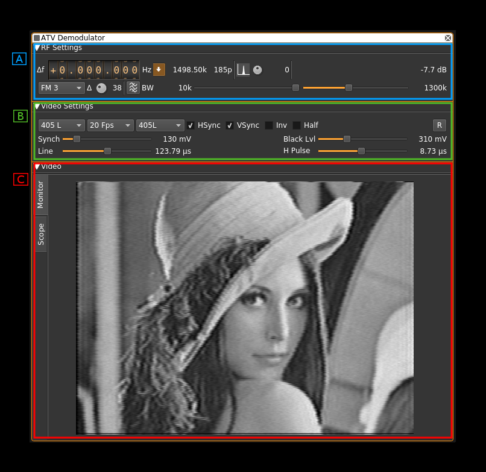
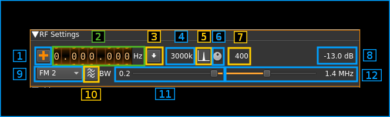
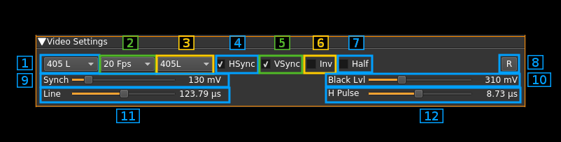
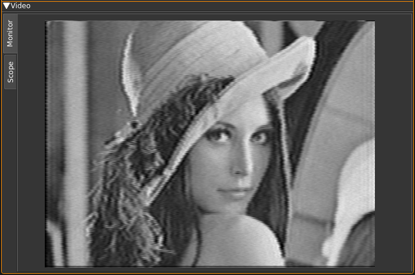
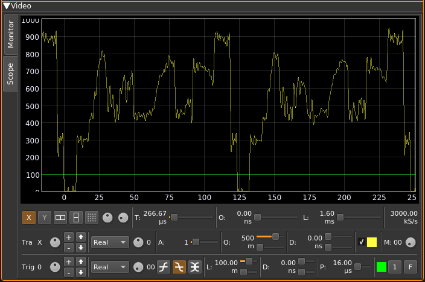

<h1>ATV demodulator plugin</h1>

<h2>Introduction</h2>

This plugin can be used to view amateur analog television transmissions a.k.a ATV. The transmitted video signal can be black and white or color (PAL, NTSC) but only the black and white level (luminance) is retained and hence image is black and white. There is no provision to demodulate the audio subcarrier either. The modulation can be either AM or FM (SSB with carrier is only experimental). A plugin supporting audio can be used in the same baseband to demodulate an audio carrier but this does not work for a subcarrier which excludes FM.

A standard image quality for broadcast standard modes requires a sample rate of at least 4 MS/s. The Airspy Mini 3 MS/s mode may still be acceptable.

Experimental modes with smaller number of lines and FPS values can be used in conjunction with the [ATV Modulator plugin](https://github.com/f4exb/sdrangel/tree/master/plugins/channeltx/modatv) to reduce sample rate and occupied bandwidth. Very low line frequencies and thus small bandwidths are reachable with degraded image quality. This is known as NBTV see: [Wikipedia article](https://en.wikipedia.org/wiki/Narrow-bandwidth_television) and [NBTV.org](http://www.nbtv.org/)

<h2>Interface</h2>

The top and bottom bars of the channel window are described [here](../../../sdrgui/channel/readme.md)

The interface is divided into three collapsible sections:

  - A: the RF settings
  - B: the video settings
  - C: the video monitor and scope in a tabbed panel arrangement

Each part is detailed next

<h2>A: RF settings</h2>

<h3>1: Frequency shift from center frequency of reception</h3>

Use the wheels to adjust the frequency shift in Hz from the center frequency of reception. Left click on a digit sets the cursor position at this digit. Right click on a digit sets all digits on the right to zero. This effectively floors value at the digit position. Wheels are moved with the mousewheel while pointing at the wheel or by selecting the wheel with the left mouse click and using the keyboard arrows.Pressing shift simultaneously moves digit by 5 and pressing control moves it by 2.

<h3>2: Channel sample rate</h3>

This is the baseband sample rate as no decimation takes place in this channel plugin.

<h3>3: Number of integer points or samples per line and fractional remainder</h3>

Format is `<points>p+<remainder>`

<h4>Integer points</h4>

This is the number of integer points or samples per complete line including sync and padding. It is calculated with the following formula:

n = Sb / (l &times; F) (Euclidean division)

Where:
  - Sb is the baseband sample rate
  - n is the number of integer points
  - l is the number of lines
  - F is the frame rate in frames/second

Let's take an example with a 625 lines 12 frames/s video signal in a 2500 kS/s baseband.
  - Sb = 2500 kS/s
  - l &times; F = 7500
  - thus n = 333

<h4>Fractional remainder</h4>

This is the fractional part of Sb &divide; (l &times; F). The demodulator can accommodate a non integral value of points per horizontal line. This value represents the fraction of a point needed to complete the real number of points per line.

With the previous example this value is 0.333... rounded to 0.33 in the display. Thus a line contains effectively 333.333... points.

<h3>4: BFO PLL lock indicator</h3>

&#9888; this is experimental.

When single sideband demodulation is selected (USB, LSB) the BFO is phased locked to the carrier. This indicator turns green if the PLL is locked.

<h3>5: BFO frequency adjustment</h3>

&#9888; this is experimental.

This allows adjustment of BFO frequency in 1 Hz steps from -2 to +2 kHz. You will have to look for the right value to lock to the carrier. See (6) for the lock indicator. This will work only at relatively low sample rates say below 1 MS/s.

The BFO base frequency in Hz appears on the right. Actual frequency may change according to PLL locking to the carrier.

<h3>6: Channel power</h3>

Average total power in dB relative to a &#177;1.0 amplitude signal generated in the pass band.

<h3>7: Modulation</h3>

  - **FM1**: this is Frequency Modulation with approximative demodulation algorithm not using atan2
  - **FM2**: this is Frequency Modulation with less approximative demodulation algorithm still not using atan2
  - **FM3**: this is Frequency Modulation with atan2 approximation for phase calculation and then a discrete differentiation is applied
  - **AM**: this is Amplitude Modulation. It can be used for vestigial sideband transmissions in conjunction with the asymmetrical filter (11, 12, 13)
  - **USB**: &#9888; USB demodulation synchronous to the carrier (experimental)
  - **LSB**: &#9888; LSB demodulation synchronous to the carrier (experimental)

For FM choose the algorithm that best suits your conditions.

&#9758; only FM3 is accurate with regard to FM deviation (see 10).

&#9888; in AM modes (also USB and LSB) there is an automatic amplitude scaling so that the video signal fits in the 0.0 to 1.0 range. For synchronization standards other than HSkip (see B.3) it may be difficult for the system to find the appropriate level when the standard changes or the signal power changes abruptly. In this case you have to select HSkip (B.3) until the video signal reaches the 0.0 to 1.0 range approximately (use scope tab see C) before returning to the desired standard.

&#9888; USB and LSB modes are experimental and do not show good results for sample rates greater than 1 MS/s. Adjusting the BFO can be picky and unstable.

<h3>8: FM deviation adjustment</h3>

Using this button you can adjust the nominal FM deviation as a percentage of the channel bandwidth that is displayed on the right of the button. When a signal with this deviation is received the demodulated signal is in the range -0.5/+0.5 which is shifted to a 0/1 range video signal.

&#9758; The value is accurate only with the atan2 differential demodulator i.e. FM3. With FM1 and FM2 you will have to adjust it for best image results. You can use the scope as an aid to try to fit the video signal in the 0/1 range.

<h3>9: AM signal range correction factor</h3>

This is a factor in % applied to the detected AM signal range. Because of possible overshoots the detected range may be artificially reduced from the original causing possible errors on the different detection levels on the video signal. This control lets you correct this. Watch the video signal in the scope tab for fine tuning. It affects only AM signals.

<h3>10: AM signal range offset correction factor</h3>

This is a factor in % applied to the signal resulting from the previous correction and that shifts its relative position. Using this control you can position the video signal correctly so that the black level is around 0.3V. Again watch the video signal in the scope tab for fine tuning. It affects only AM signals.

<h3>11: FFT asymmetrical filter toggle</h3>

Use this button to enable/disable the FFT asymmetrical filter. Use this filter when you want to optimize the reception of vestigial sideband AM signals.

<h3>12: FFT asymmetrical filter opposite band cutoff frequency</h3>

For all modulations except LSB this is the lower side band.

This slider lets you adjust the opposite band cutoff frequency of the FFT asymmetrical filter. The value in kHz appears on the left of the slider.

<h3>13: FFT asymmetrical filter in band cutoff frequency</h3>

For all modulations except LSB this is the upper side band.

This slider lets you adjust the in band cutoff frequency of the FFT asymmetrical filter. The value in kHz appears on the left of the slider.

<h2>B: Video settings</h2>

<h3>1: Number of lines</h3>

This is the total number of lines including all possible synchronization signals.

Choice is between 819, 640, 625, 525, 480, 405, 360, 343, 240, 180, 120, 90, 60 and 32 lines. The actual number of image lines depends on the synchronization scheme.

<h3>2: Frames Per Second</h3>

This combo lets you chose between a 30, 25, 20, 16, 12, 10, 8, 5, 2 and 1 FPS. This is the resulting FPS. In interleaved modes the half frame rate is doubled.

&#9758; Perception of continuous motion is said to be acceptable down to 16 FPS. Down to 8 FPS fluidity is still acceptable. The 5 to 1 FPS modes can be used for transmission of images with only few movements or where motion is not important such as fixed webcams. Low FPS will allow for more lines and therefore definition in the same bandwidth.

<h3>3: Synchronization standard</h3>

This combo lets you set the TV standard type. This sets the number of lines per complete image, frame synchronization parameters and number of blank (black) lines. Choice is between:

  - **PAL625**: this is based on the classical 625 lines PAL system. It uses 7 or 8 synchronization lines depending on the half frame (field). It has also 17 black lines on the top of each half frame.
  - **PAL525**: the only difference with PAL625 is the number of black lines which is down to 15
  - **819L**: this is the 819 lines system F (Belgium).
  - **ShortI**: this is an experimental mode that uses the least possible vertical sync lines as possible. That is one line for a long synchronization pulse and one line equalizing (short) pulses level to reset the vertical sync condition. Thus only 2 lines are consumed for vertical sync and the rest is left to the image. In this mode the frames are interleaved and an odd number of lines should be used.
  - **ShortNI**: this is the same as above but with non interleaved frames.
  - **HSkip**: this is the horizontal sync skip technique for vertical synchronization. This has been in use in the first TV experiments with a small number of lines. This method just skips one horizontal synchronization pulse to mark the last or the first line (here it is the last). This method does not use any full line for vertical sync and all lines can be used for the image thus it suits the modes with a small number of lines. With more lines however the risk of missing pulses gets higher in adverse conditions because the pulses get shorter and may get swallowed by a stray pulse or a stray pulse can be taken for a valid one. In this case two images might get out of sync instead of just two lines. In practice this is suitable up to 90~120 lines.

When the standard chosen matches the standard of transmission the image should appear in full size and proper aspect ratio.

&#9758; Interleaved mode requires an odd number of lines because the system recognizes the even and odd frames depending on a odd or even number of lines respectively for the half images

&#9758; For non interleaved mode all standards are supposed to work for any number of lines. You may experiment with any and see if it fits your purpose. However it will be easier to obtain good or optimal results in general with the recommendations in the next table provided the transmitter is set to the same standard. Official standards are only 819L (Belgian), PAL625 and PAL525. In this case one should stick to their respective number of lines:

<table>
    <tr>
        <th>#lines</th>
        <th>standard</th>
    </tr>
    <tr>
        <td>819</td>
        <td>819L, ShortI, ShortNI</td>
    </tr>
    <tr>
        <td>640</td>
        <td>ShortNI</td>
    </tr>
    <tr>
        <td>625</td>
        <td>PAL625, PAL525, ShortI, ShortNI</td>
    </tr>
    <tr>
        <td>525</td>
        <td>PAL525, ShortI, ShortNI</td>
    </tr>
    <tr>
        <td>480</td>
        <td>ShortNI</td>
    </tr>
    <tr>
        <td>405</td>
        <td>ShortI, ShortNI</td>
    </tr>
    <tr>
        <td>360</td>
        <td>ShortNI</td>
    </tr>
    <tr>
        <td>343</td>
        <td>ShortI, ShortNI</td>
    </tr>
    <tr>
        <td>240</td>
        <td>ShortNI</td>
    </tr>
    <tr>
        <td>180</td>
        <td>ShortNI</td>
    </tr>
    <tr>
        <td>120</td>
        <td>ShortNI, HSkip</td>
    </tr>
    <tr>
        <td>90</td>
        <td>ShortNI, HSkip</td>
    </tr>
    <tr>
        <td>60</td>
        <td>ShortNI, HSkip</td>
    </tr>
    <tr>
        <td>32</td>
        <td>HSkip, ShortNI with 2 lines loss</td>
    </tr>
</table>

<h3>4: Horizontal sync</h3>

Check/uncheck this box to toggle horizontal synchronization processing.

<h3>5: Vertical sync</h3>

Check/uncheck this box to toggle vertical synchronization processing.

<h3>6: Invert video</h3>

Check/uncheck this box to toggle video signal inversion. This does not work well in AM for now.

<h3>7: Half frames</h3>

Check this box to render only half of the frames for slow processors.

<h3>8: Reset defaults</h3>

Use this push button to reset values to a standard setting:

  - FM1 modulation
  - 625 lines
  - 25 FPS
  - PAL625 standard
  - Horizontal and vertical syncs active
  - No video inversion
  - Interleaving
  - 100 mV sync level
  - 310 mV black level
  - 64 microsecond line length (middle)
  - 4.7 microsecond sync pulse length (middle)

<h3>9: Synchronization level</h3>

Use this slider to adjust the trigger level of the synchronization pulse on a 0 to 1V scale. The value in mV appears on the right of the slider. Nominal value: 150 mV.

<h3>10: Line length</h3>

This is the line length in time units. The value depends on the line frequency. For example with 625 lines and 12 FPS The line frequency is 625 &times; 12 = 7500 Hz thus the nominal line time is the inverse of this value that is &#8776;133.33 &mu;s

<h3>10: Black level</h3>

Use this slider to adjust the black level of the video signal on a 0 to 1V scale. This also triggers the end of horizontal synchronization pulse. The value in mV appears on the right of the slider. Nominal value: 300 mV.

<h3>12: Horizontal synchronization pulse length</h3>

This is the length in time units of a horizontal or line synchronization pulse. The value depends on the nominal line length as described above. The pulse length is derived from the 4.7 &mu;s pulse of a 625 lines and 25 FPS standard system with a 64 &mu;s line length. For example with a 625 lines &#times; 12 FPS transmission that has a line length of &#8776;133.33 &mu;s this is (4.7 &divide; 64) &times; 133.33 &#8776; 9.79 &mu;s.

<h2>C: Image</h2>

<h3>Monitor</h3>

Select monitor with the monitor tab on the left side.

This is where the TV image appears. Yes on the screenshot this is the famous [Lenna](https://en.wikipedia.org/wiki/Lenna). The original image is 512 &#215; 512 pixels so it has been cropped to fit the 4:3 format. The screen geometry ratio is fixed to 4:3 format. You will have to choose the standard (B.3) matching the transmission to ensure that the transmitted image fits perfectly.

<h3>Scope</h3>

Select scope with the scope tab on the left side.

This is a scope widget fed with the video signal. Controls of the scope are the same as with the ChannelAnalyzerNG plugin. Please refer to [this plugin](https://github.com/f4exb/sdrangel/tree/master/plugins/channelrx/chanalyzerng) for more details.

Note that the video signal is a real signal so the imaginary part is always null. Therefore only the "Real" mode for both the trace and the trigger is interesting.
