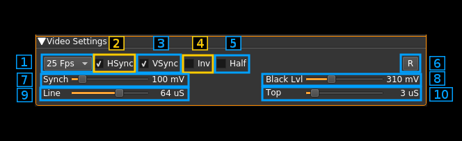

<h1>ATV demodulator plugin</h1>

<h2>Introduction</h2>

This plugin can be used to view amateur analog television transmissions a.k.a ATV. The transmitted video signal can be black and white or color (PAL, NTSC) but only the black and white levels (luminance) is retained and hence image is black and white. There is no provision to demodulate the audio subcarrier either. The modulation can be either AM or FM. A plugin supporting audio can be used in the same passband to demodulate an audio carrier but not a subcarrier which excludes FM.

The whole bandwidth available to the channel is used. That is it runs at the device sample rate possibly downsampled by a power of two in the source plugin. It expects an integer number of MS/s and standard image quality requires a sample rate of at least 4 MS/s. The Airspy Mini 3 MS/s mode may still be acceptable. Anything below should be considered experimental quality.

<h2>Interface</h2>

The interface is divided into three collapsable sections:

  - A: the RF settings
  - B: the video screen
  - C: the video settings

Each part is detailed next

<h2>A: RF settings</h2>

<h3>1: Frequency shift from center frequency of reception direction</h3>

The "+/-" button on the left side of the dial toggles between positive and negative shift.

<h3>2: Frequency shift from center frequency of reception value</h3>

Use the wheels to adjust the frequency shift in Hz from the center frequency of reception. Left click on a digit sets the cursor position at this digit. Right click on a digit sets all digits on the right to zero. This effectively floors value at the digit position.

<h3>3: Rational downsampler toggle</h3>

Use this toggle button to enable or disable the rational downsampler. 

Without downsampling the sample rate given by the source plugin is directly applied to the channel.

When the downsampler is engaged the channel sample rate is the closest integer MS/s below the source sample rate. e.g for a source sample rate of 3.2 MS/s this will be 3 MS/s. If a positive number of MS/s cannot be obtained the decimator is disabled and the source sample rate is used instead. 

When the downsampler is engaged the signal is lowpass filtered and the cutoff frequency can be adjusted with the in band filter cutoff slider (12). This works also when the decimation ratio is 1.0 e.g source sample rate is 3 MS/s.

<h3>4: Channel sample rate</h3>

This is the channel sample rate in kS/s possibly downsampled from source when rational downsampler is engaged (3).

<h3>5: BFO PLL lock indicator</h3>

Warning: this is experimental.

When single sideband demodulation is selected (USB, LSB) the BFO is phased locked to the carrier. This indicator turns green if the PLL is locked.

<h3>6: BFO frequency adjustment</h3>

Warning: this is experimental.

This allows adjstment of BFO frequency in 10 Hz steps from -5 to +5 kHz. You will have to look for the right value to lock to the carrier. See (5) for the lock indicator.

<h3>7: BFO frequency</h3>

Warning: this is experimental.

This is the BFO base frequency in Hz. Actual frequency may change acoording to PLL locking to the carrier.

<h3>8: Channel power</h3>

Average total power in dB relative to a &#177;1.0 amplitude signal generated in the pass band.

<h3>9: Modulation</h3>

  - FM1: this is Frequency Modulation with approximative demodulation algorithm not using atan2
  - FM2: this is Frequency Modulation with less approximative demodulation algorithm still not using atan2
  - AM: this is Amplitude Modulation
  - USB: USB demodulation synchronous to the carrier
  - LSB: USB demodulation synchronous to the carrier
  
For FM choose the algorithm that best suits your conditions.

USB and LSB modes are experimental and do not show good results for present standards sample rates.

<h3>10: FFT asymmetrical filter toggle</h3>

Use this button to enable/disable the FFT asymmetrical filter.

<h3>11: FFT asymmetrical filter opposite band cutoff frequency</h3>

For all modulations except LSB this is the lower side band.

This slider lets you adjust the opposite band cutoff frequency of the FFT asymmetrical filter. The value in MHz appears on the left of the slider.

<h3>12: FFT asymmetrical filter in band cutoff frequency</h3>

For all modulations except LSB this is the upper side band.

This slider lets you adjust the in band cutoff frequency of the FFT asymmetrical filter. The value in MHz appears on the left of the slider.

If the rational downsampler is engaged (3) and the FFT filter is not engaged (10) this slider controls the downsampler cutoff frequency.

<h2>B: Image</h2>

This is where the TV image appears. Yes on the screenshot this is the famous [Lenna](https://en.wikipedia.org/wiki/Lenna). The original image is 512 &#215; 512 pixels so it has been cropped to fit the 4:3 format. The screen geometry ratio is fixed to 4:3 format.

<h2>C: Video settings</h2>

<h3>1: Frames Per Second</h3>

This combo lets you chose between a 25 FPS or 30 FPS standard.

  - 25 FPS corresponds to the PAL 625 lines standard (PAL B,G,I,L)
  - 30 FPS corresponds to the PAL 525 lines standard (PAL M)

<h3>2: Horizontal sync</h3>

Check/uncheck this box to toggle horizontal synchronization processing.

<h3>3: Vertical sync</h3>

Check/uncheck this box to toggle vertical synchronization processing.

<h3>4: Invert video</h3>

Check/uncheck this box to toggle video signal inversion. This does not work well in AM for now.

<h3>5: Half frames</h3>

Check this box to render only half of the frames for slow processors.

<h3>6: Reset defaults</h3>

Use this push button to reset values to a standard setting:

  - FM1 modulation
  - 25 FPS
  - Horizontal and vertical syncs active
  - No video inversion
  - Interlacing
  - 100 mV sync level
  - 310 mV black level
  - 64 microsecond line length
  - 3 microsecond sync length
  
<h3>7: Synchronization level</h3>

Use this slider to adjust the top level of the synchronization pulse on a 0 to 1V scale. The value in mV appears on the right of the slider. Nominal value: 100 mV.

<h3>8: Black level</h3>

Use this slider to adjust the black level of the video signal on a 0 to 1V scale. The value in mV appears on the right of the slider. Nominal value: 310 mV.

<h3>9: Line length</h3>

This is the line length in time units. The value in microseconds appears on the right of the slider. Nominal value: 64 microseconds.

<h3>10: Top length</h3>

This is the length in time units of a synchronization top. The value in microseconds appears on the right of the slider. Nominal value 3 microseconds.