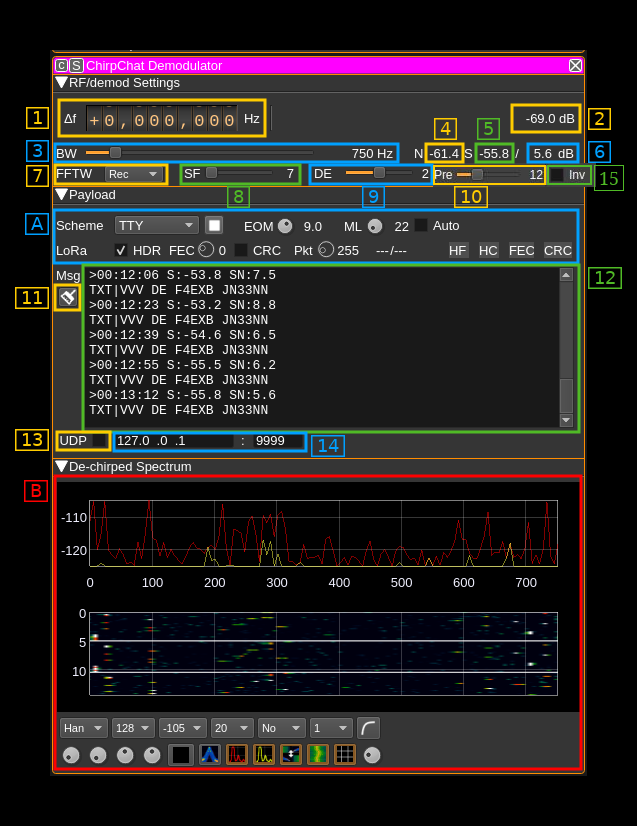
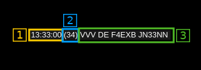
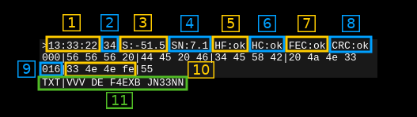

<h1>ChirpChat demodulator plugin</h1>

<h2>Introduction</h2>

This plugin can be used to demodulate and decode transmissions based on Chirp Spread Spectrum (CSS). The basic idea is to transform each symbol of a MFSK modulation to an ascending frequency ramp shifted in time. It could equally be a descending ramp but this one is reserved to detect a break in the preamble sequence (synchronization). This plugin has been designed to work in conjunction with the ChirpChat modulator plugin that should be used ideally on the transmission side.

It has clearly been inspired by the LoRa technique but is designed for experimentation and extension to other protocols mostly inspired by amateur radio techniques using chirp modulation to transmit symbols. Thanks to the MFSK to chirp translation it is possible to adapt any MFSK based mode.

LoRa is a property of Semtech and the details of the protocol are not made public. However a LoRa compatible protocol has been implemented based on the reverse engineering performed by the community. It is mainly based on the work done in https://github.com/myriadrf/LoRa-SDR. You can find more information about LoRa and chirp modulation here:

  - To get an idea of what is LoRa: [here](https://www.link-labs.com/blog/what-is-lora)
  - A detailed inspection of LoRa modulation and protocol: [here](https://static1.squarespace.com/static/54cecce7e4b054df1848b5f9/t/57489e6e07eaa0105215dc6c/1464376943218/Reversing-Lora-Knight.pdf)

&#9888; Only spread factors of 11 and 12 are working in LoRa mode thus with the distance enhancement active (DE=2)

Transmissions from the RN2483 module (SF=11 and SF=12 with DE=2) could be successfully received. It has not been tested with Semtech SX127x hardware. This LoRa decoder is designed for experimentation. For production grade applications it is recommended to use dedicated hardware instead.

Modulation characteristics from LoRa have been augmented with more bandwidths and FFT bin collations (DE factor). Plain TTY and ASCII have also been added and there are plans to add some more complex typically amateur radio MFSK based modes like JT65.

In any case it is recommended to use a non zero distance enhancement factor for successful transmissions.

Note: this plugin is officially supported since version 6.

<h2>Interface</h2>

The top and bottom bars of the channel window are described [here](../../../sdrgui/channel/readme.md)

<h3>1: Frequency shift from center frequency of reception</h3>

Use the wheels to adjust the frequency shift in Hz from the center frequency of reception. Left click on a digit sets the cursor position at this digit. Right click on a digit sets all digits on the right to zero. This effectively floors value at the digit position. Wheels are moved with the mousewheel while pointing at the wheel or by selecting the wheel with the left mouse click and using the keyboard arrows. Pressing shift simultaneously moves digit by 5 and pressing control moves it by 2.

<h3>2: De-chirped channel power</h3>

This is the total power in the FFT of the de-chirped signal in dB. When no ChirpChat signal is detected this corresponds to the power received in the bandwidth (3). It will show a significant increase in presence of a ChirpChat signal that can be detected.

<h3>3: Bandwidth</h3>

This is the bandwidth of the ChirpChat signal. Similarly to LoRa the signal sweeps between the lower and the upper frequency of this bandwidth. The sample rate of the ChirpChat signal in seconds is exactly one over this bandwidth in Hertz.

In the LoRa standard there are 2 base bandwidths: 500 and 333.333 kHz. A 400 kHz base has been added. Possible bandwidths are obtained by a division of these base bandwidths by a power of two from 1 to 64. Extra divisor of 128 is provided to achieve smaller bandwidths that can fit in a SSB channel. Finally special divisors from a 384 kHz base are provided to allow even more narrow bandwidths.

Thus available bandwidths are:

  - **500000** (500000 / 1) Hz
  - **400000** (400000 / 1) Hz not in LoRa standard
  - **333333** (333333 / 1) Hz
  - **250000** (500000 / 2) Hz
  - **200000** (400000 / 2) Hz not in LoRa standard
  - **166667** (333333 / 2) Hz
  - **125000** (500000 / 4) Hz
  - **100000** (400000 / 4) Hz not in LoRa standard
  - **83333** (333333 / 4) Hz
  - **62500** (500000 / 8) Hz
  - **50000** (400000 / 8) Hz not in LoRa standard
  - **41667** (333333 / 8) Hz
  - **31250** (500000 / 16) Hz
  - **25000** (400000 / 16) Hz not in LoRa standard
  - **20833** (333333 / 16) Hz
  - **15625** (500000 / 32) Hz
  - **12500** (400000 / 32) Hz not in LoRa standard
  - **10417** (333333 / 32) Hz
  - **7813** (500000 / 64) Hz
  - **6250** (400000 / 64) Hz not in LoRa standard
  - **5208** (333333 / 64) Hz
  - **3906** (500000 / 128) Hz not in LoRa standard
  - **3125** (400000 / 128) Hz not in LoRa standard
  - **2604** (333333 / 128) Hz not in LoRa standard
  - **1500** (384000 / 256) Hz not in LoRa standard
  - **750** (384000 / 512) Hz not in LoRa standard
  - **375** (384000 / 1024) Hz not in LoRa standard

The ChirpChat signal is oversampled by two therefore it needs a baseband of at least twice the bandwidth. This drives the maximum value on the slider automatically.

<h3>4: De-chirped noise maximum power</h3>

This is the maximum power received in one FFT bin (the argmax bin) in dB when no signal is detected. It is averaged over 10 values.

<h3>5. De-chirped signal maximum power</h3>

This is the maximum power received in one FFT bin (the argmax bin) in dB when a signal is detected. It is averaged over 10 values.

<h3>6: De-chirped signal over noise ratio</h3>

The noise level reference is the noise maximum power just before the detected signal starts and the signal level the signal maximum power just before the detected signal stops. To get a significant reading you have to adjust correctly the number of preamble chirps (9) and the End Of Message squelch level (A.3) and/or the message length (A.4) so that signal boundaries are determined correctly.

Decode errors are very likely to happen when this value falls below 4 dB.

<h3>7: FFT Window</h3>

A choice of FFT Windows to apply to the FFT performed on the de-chirped signal is provided. These are the same windows as those used in the spectrum display. The effect of windowing is to reduce the spill over in adjacent bins at the expense of a flatter top and fatter main lobe. When the purpose is frequency detection this is not what is desired necessarily and thus the "Rectangular" window (i.e. no window) should be chosen. However a variety of windows is provided to experiment with. Experimentally the best alternative to "Rectangular" is "Kaiser" then "Bartlett" and "Hanning". The complete list is:

  - **Bart**: Bartlett
  - **B-H**: 4 term Blackman-Harris
  - **FT**: Flat Top
  - **Ham**: Hamming
  - **Han**: Hanning
  - **Rec**: Rectangular (no window)
  - **Kai**: Kaiser with &alpha; = &pi;
  - **Black**: Blackman (3 term)
  - **B-H7**: 7 term Blackman-Harris

<h3>8: Spread Factor</h3>

This is the Spread Factor parameter of the ChirpChat signal. This is the log2 of the FFT size used over the bandwidth (3). The number of symbols is 2SF-DE where SF is the spread factor and DE the  Distance Enhancement factor (8)

<h3>9: Distance Enhancement factor</h3>

The LoRa standard specifies 0 (no DE) or 2 (DE active). The ChirpChat DE range is extended to all values between 0 and 4 bits.

This is the log2 of the number of FFT bins used for one symbol. Extending the number of FFT bins per symbol decreases the probability to detect the wrong symbol as an adjacent bin. It can also overcome frequency drift on long messages.

In practice it is difficult to make correct decodes if only one FFT bin is used to code one symbol (DE=0) therefore it is recommended to use a DE factor of 2 or more. With medium SNR DE=1 can still achieve good results.

<h3>10: Number of expected preamble chirps</h3>

This is the number of chirps expected in the preamble and has to be agreed between the transmitter and receiver.

<h3>A: Payload controls and indicators</h3>

<h4>A.1: Coding scheme</h4>

In addition to the LoRa standard plain ASCII and TTY have been added for pure text messages. ASCII and TTY have no form of FEC.

  - **LoRa**: LoRa standard (see LoRa documentation)
  - **ASCII**: This is plain 7 bit ASCII coded characters. It needs exactly 7 effective bits per symbols (SF - DE = 7)
  - **TTY**: Baudot (Teletype) 5 bit encoded characters. It needs exactly 5 effective bits per symbols (SF - DE = 5)

<h4>A.2: Start/Stop decoder</h4>

You can suspend and resume decoding activity using this button. This is useful if you want to freeze the payload content display.

<h4>A.3: End Of Message squelch</h4>

This is used to determine the end of message automatically. It can be de-activated by turning the button completely to the right (as shown on the picture). In this case it relies on the message length set with (A.4).

During paylaod detection the maximum power value in the FFT (at argmax) Pmax is stored and compared to the current argmax power value Pi if SEOM is this squelch value the end of message is detected if SEOM &times; Si &lt; Smax

<h4>A.4: Expected message length in symbols</h4>

This is the expected number of symbols in a message. When a header is present in the payload it should match the size given in the header (A.11).

<h4>A.5: Auto mesasge length</h4>

LoRa mode only. Set message length (A.4) equal to the number of symbols specified in the message just received. When messages are sent repeatedly this helps adjusting in possible message length changes automatically.

<h4>A.6: Sync word</h4>

This is the message 1 byte sync word displayed in hexadecimal.

<h4>A.7: Expect header in message</h4>

LoRa mode only. Use this checkbox to tell if you expect or not a header in the message.

<h4>A.8: Number of FEC parity bits</h4>

LoRa mode only. This is the number of parity bits in the Hamming code used in the FEC. The standard values are 1 to 4 for H(4,5) to H(4,8) encoding. 0 is a non-standard value to specify no FEC.

When a header is expected this control is disabled because the value used is the one found in the header.

<h4>A.9: Payload CRC presence</h4>

Use this checkbox to tell if you expect a 2 byte CRC at the end of the payload.

When a header is expected this control is disabled because the value used is the one found in the header.

<h4>A.10: Packet length</h4>

This is the expected packet length in bytes without header and CRC.

When a header is expected this control is disabled because the value used is the one found in the header.

<h4>A.11: Number of symbols and codewords</h4>

This is the number of symbols (left of slash) and codewords (right of slash) used for the payload including header and CRC.

<h4>A.12: Header FEC indicator</h4>

Header uses a H(4,8) FEC. The color of the indicator gives the status of header parity checks:

  - **Grey**: undefined
  - **Red**: unrecoverable error
  - **Blue**: recovered error
  - **Green**: no errors

<h4>A.13: Header CRC indicator</h4>

The header has a one byte CRC. The color of this indicator gives the CRC status:

  - **Green**: CRC OK
  - **Red**: CRC error

<h4>A.14: Payload FEC indicator</h4>

The color of the indicator gives the status of payload parity checks:

  - **Grey**: undefined
  - **Red**: unrecoverable error. H(4,7) cannot distinguish between recoverable and unrecoverable error. Therefore this is never displayed for H(4,7)
  - **Blue**: recovered error
  - **Green**: no errors

<h4>A.15: Payload CRC indicator</h4>

The payload can have a two byte CRC. The color of this indicator gives the CRC status:

  - **Grey**: No CRC
  - **Green**: CRC OK
  - **Red**: CRC error

<h3>11: Clear message window</h3>

Use this push button to clear the message window (12)

<h3>12: Message window</h3>

This is where the message and status data are displayed. The display varies if the coding scheme is purely text based (TTY, ASCII) or text/binary mixed based (LoRa). The text vs binary consideration concerns the content of the message not the way it is transmitted on air that is by itself binary.

<h4>12.a: Text messages</h4>

The format of a message line is the following:

  - 1: Timestamp in HH:MM:SS format
  - 2: Signal level. Same as (5) for the current message
  - 3: Signal Over Noise. Same as (6) for the current message
  - 4: Start of text indicator
  - 5: Text

<h4>12.b: Binary messages</h4>

  - 1: Timestamp in HH:NN:SS format
  - 2: Sync word. This is the sync word (byte) displayed in hex. Corresponds to (A.5) in the current message.
  - 3: De-chirped signal level. This is the de-chirped signal level in dB. Corresponds to (5) in the current message.
  - 4: De-chirped signal to noise ratio. This is the de-chirped signal to noise ratio in dB. Corresponds to (6) in the current message.
  - 5: Header FEC status. Corresponds to (A.12) indicator in the current message:
    - **n/a**: unknown or not applicable
    - **err**: unrecoverable error
    - **fix**: corrected error
    - **ok**: OK
  - 6: Header CRC status. Corresponds to (A.13) indicator in the current message
    - **ok**: CRC OK
    - **err**: CRC error
    - **n/a**: not applicable
  - 7: Payload FEC status. Corresponds to (A.14) indicator in the current message. If the end of message is reached before expectation then `ERR: too early` is displayed instead and no payload CRC status (next) is displayed.
    - **n/a**: unknown or not applicable
    - **err**: unrecoverable error
    - **fix**: corrected error
    - **ok**: OK
  - 8: Payload CRC status. Corresponds to (A.15) indicator in the current message:
    - **ok**: CRC OK
    - **err**: CRC error
    - **n/a**: not applicable
  - 9: Displacement at start of line. 16 bytes in 4 groups of 4 bytes are displayed per line starting with the displacement in decimal.
  - 10: Bytes group. This is a group of 4 bytes displayed as hexadecimal values. The payload is displayed with its possible CRC and without the header.
  - 11: Message as text with "TXT" as prefix indicating it is the translation of the message to character representation

<h3>13: Send message via UDP</h3>

Select to send the decoded message via UDP.

<h3>14: UDP address and port</h3>

This is the UDP address and port to where the decoded message is sent when (12) is selected.

<h3>B: De-chirped spectrum</h3>

This is the spectrum of the de-chirped signal when a ChirpChat signal can be decoded. Details on the spectrum view and controls can be found [here](../../../sdrgui/gui/spectrum.md)

The frequency span corresponds to the bandwidth of the ChirpChat signal (3). Default FFT size is 2SF where SF is the spread factor (7).

Sequences of successful ChirpChat signal demodulation are separated by blank lines (generated with a string of high value bins).

Controls are the usual controls of spectrum displays with the following restrictions:

  - The window type is non operating because the FFT window is chosen by (7)
  - The FFT size can be changed however it is set to 2SF where SF is the spread factor and thus displays correctly
