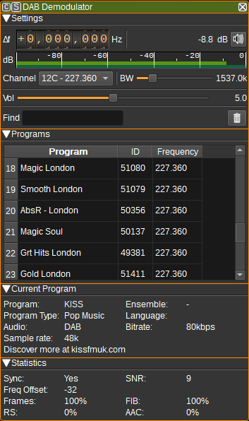

<h1>DAB demodulator plugin</h1>

<h2>Introduction</h2>

This plugin can be used to demodulate DAB and DAB+ radio.

The DAB demodulator uses a sample rate of 2.048MHz.

<h2>Interface</h2>

The top and bottom bars of the channel window are described [here](../../../sdrgui/channel/readme.md)

<h3>1: Frequency shift from center frequency of reception</h3>

Use the wheels to adjust the frequency shift in Hz from the center frequency of reception. Left click on a digit sets the cursor position at this digit. Right click on a digit sets all digits on the right to zero. This effectively floors value at the digit position. Wheels are moved with the mousewheel while pointing at the wheel or by selecting the wheel with the left mouse click and using the keyboard arrows. Pressing shift simultaneously moves digit by 5 and pressing control moves it by 2.

<h3>2: Channel power</h3>

Average total power in dB relative to a +/- 1.0 amplitude signal received in the pass band.

<h3>3: Audio mute</h3>

Left click on this button to toggle audio mute for this channel.

If you right click on it, it will open a dialog to select the audio output device. See [audio management documentation](../../../sdrgui/audio.md) for details.

<h3>4: RF level meter in dB</h3>

  - top bar (green): average value
  - bottom bar (blue green): instantaneous peak value
  - tip vertical bar (bright green): peak hold value

<h3>5: Audio volume</h3>

This is the volume of the audio signal from 0.0 (mute) to 10.0 (maximum). It can be varied continuously in 0.1 steps using the dial button. A value of 5.0 corresponds to a gain of 0dB.

<h3>8: Channel</h3>

Displays a list of DAB Band III channels and frequencies. Selecting an item will set the Device center frequency accordingly.
If the center frequency is set manually, this box will be updated to reflect the corresponding channel, or left blank if there is not a channel that corresponds to the current centre frequency.

<h3>5: RF Bandwidth</h3>

This specifies the bandwidth of a filter that is applied to the input signal before decimation or interpolation to limit the received signal's bandwidth. This should typically be 1.537 MHz.

<h3>6: Find</h3>

Enter a regular expression used to filter the program table.

<h3>7: Clear programs</h3>

Clear all programs in the table.

<h3>Program Table</h3>

The program table shows programs that have been detected within a tuned ensemble. Double clicking on a program will cause
the demodulator to set the corresponding center frequency and then to play audio for the program.

<h3>Current Program</h3>

The current program area display information about the currently playing program, including:

* Program name.
* Ensemble name.
* Program type (E.g. News / Pop).
* Language.
* Audio (DAB or DAB+).
* Bitrate in kbps.
* Audio sample rate (in kSa/s). If this does not match the sample rate of the selected audio device, it will be resampled to match.
* Data broadcast with the program (E.g. song name).

<h3>Statistics</h3>

The statistics areas displays statistics generated by the demodulator that may give an indication of the quality of the received signal.

If you are hearing dropouts in audio, try adjusting your antenna in order to improve the reported SNR.

<h3>Transmitter</h3>

Displays the TII (Transmitter Identification Information) main and sub IDs in hexadecimal, which can identify which transmitter the DAB signal is being primarily received from.
Pressing the "Find Transmitter on Map" button will attempt to locate the transmitter with the same IDs and Ensemble name on the [Map](../../feature/map/readme.md) feature.

<h2>Attribution</h2>

The DAB demodulator uses the DAB library by Jvan Katwijk.

