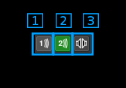
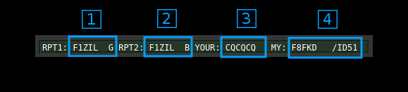
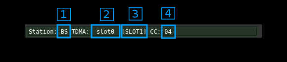
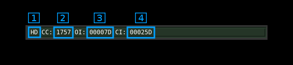
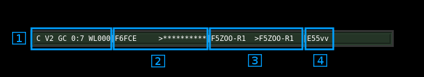
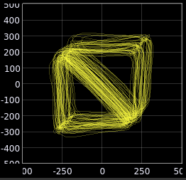
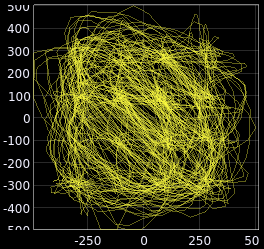
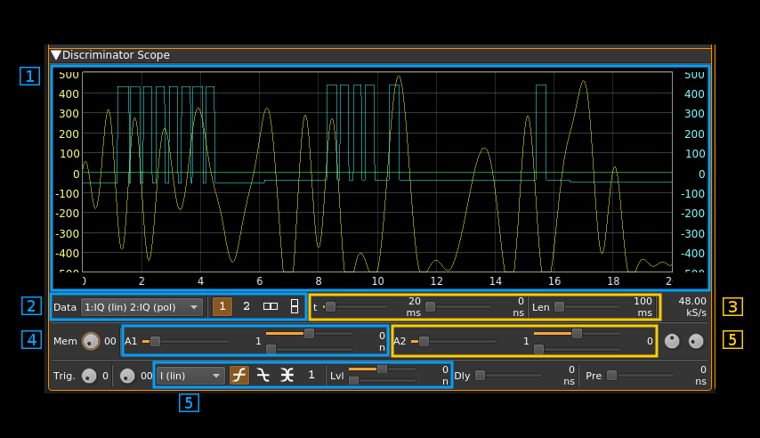

<h1>DSD (Digital Speech Decoder) demodulator and decoder plugin</h1>

<h2>Introduction</h2>

This plugin uses the [DSDcc](https://github.com/f4exb/dsdcc) library that has been rewritten from the original [DSD](https://github.com/szechyjs/dsd) program to decode several digital speech formats. At present it covers the following:

  - DMR/MOTOTRBO: ETSI two slot TDMA standard. MOTOTRBO is a popular implementation of this standard.
  - dPMR: Another ETSI standard at slower rate (2400 Baud / 6.25 kHz) and FDMA
  - D-Star: developed and promoted by Icom for Amateur Radio customers.
  - Yaesu System Fusion (YSF): developed and promoted by Yaesu for Amateur Radio customers. Voice full rate with DV serial devices is not supported

It can only detect the following standards (no data, no voice):

  - NXDN: A joint Icom (IDAS) and Kenwood (Nexedge) standard with 2400 and 4800 Baud versions.

The modulation and standard is automatically detected and switched depending on the Baud rate chosen.

To enable this plugin at compile time you will need to have DSDcc installed in your system. Please follow instructions in [DSDcc readme](https://github.com/f4exb/dsdcc/blob/master/Readme.md) to build and install DSDcc. If you install it in a custom location say `/opt/install/dsdcc` you will need to add these defines to the cmake command: `-DLIBDSDCC_INCLUDE_DIR=/opt/install/dsdcc/include/dsdcc -DLIBDSDCC_LIBRARIES=/opt/install/dsdcc/lib/libdsdcc.so`

<h2>DV serial device support</h2>

You can use a serial device connected to your system that implements and exposes the packet interface of the AMBE3000 chip. This can be for example a ThumbDV USB dongle. In order to support DV serial devices in your system you will need two things:

  - Compile with [SerialDV](https://github.com/f4exb/serialDV) support Please refer to this project Readme.md to compile and install SerialDV. If you install it in a custom location say `/opt/install/serialdv` you will need to add these defines to the cmake command: `-DLIBSERIALDV_INCLUDE_DIR=/opt/install/serialdv/include/serialdv -DLIBSERIALDV_LIBRARY=/opt/install/serialdv/lib/libserialdv.so`
  - Enable DV serial devices in your system by checking the option in the Preferences menu. YOu will need to enable the DV serial devices each time you start SDRangel.
  
Although such serial devices work with a serial interface at 400 kb in practice maybe for other reasons they are capable of handling only one conversation at a time. The software will allocate the device dynamically to a conversation with an inactivity timeout of 1 second so that conversations do not get interrupted constantly making the audio output too choppy. In practice you will have to have as many devices connected to your system as the number of conversations you would like to be handled in parallel. 

Note also that this is not supported in Windows because of trouble with COM port support (contributors welcome!).

Altermatively you can use software decoding with Mbelib. Possible copyright issues apart (see next) the audio quality with the DVSI AMBE chip is much better.

---
&#9888; Since kernel 4.4.52 the default for FTDI devices (that is in the ftdi_sio kernel module) is not to set it as low latency. This results in the ThumbDV dongle not working anymore because its response is too slow to sustain the normal AMBE packets flow. The solution is to force low latency by changing the variable for your device (ex: /dev/ttyUSB0) as follows:

`echo 1 | sudo tee /sys/bus/usb-serial/devices/ttyUSB0/latency_timer` or `sudo setserial /dev/ttyUSB0 low_latency`

---

<h2>Mbelib support</h2>

DSDcc itself can use [mbelib](https://github.com/szechyjs/mbelib) to decode AMBE frames. While DSDcc is intended to be patent-free, `mbelib` that it uses describes functions that may be covered by one or more U.S. patents owned by DVSI Inc. The source code itself should not be infringing as it merely describes possible methods of implementation. Compiling or using `mbelib` may infringe on patents rights in your jurisdiction and/or require licensing. It is unknown if DVSI will sell licenses for software that uses `mbelib`.

If you are not comfortable with this just do not install DSDcc and/or mbelib and the plugin will not be compiled and added to SDRangel. For packaged distributions just remove:

  - For Linux distributions: `plugins/channel/libdemoddsd.so`
  - For Windows distributions: `dsdcc.dll`, `mbelib.dll`, `plugins\channel\demoddsd.dll`

For software built fron source if you choose to have `mbelib` support you will need to have DSDcc compiled with `mbelib` support. You will also need to have defines for it on the cmake command. If you have mbelib installed in a custom location, say `/opt/install/mbelib` you will need to add these defines to the cmake command: `-DLIBMBE_INCLUDE_DIR=/opt/install/mbelib/include -DLIBMBE_LIBRARY=/opt/install/mbelib/lib/libmbe.so`

<h2>Interface</h2>

<h3>1: Frequency shift from center frequency of reception</h3>

Use the wheels to adjust the frequency shift in Hz from the center frequency of reception. Left click on a digit sets the cursor position at this digit. Right click on a digit sets all digits on the right to zero. This effectively floors value at the digit position. Wheels are moved with the mousewheel while pointing at the wheel or by selecting the wheel with the left mouse click and using the keyboard arroews.Pressing shift simultanoeusly moves digit by 5 and pressing control moves it by 2.

<h3>2: Symbol (Baud) rate</h3>

Here you can specify which symbol rate or Baud rate is expected. Choices are:

  - `2.4k`: 2400 S/s used for dPMR and 4800 b/s NXDN
  - `4.8k`: 4800 S/s used for 9600 b/s NXDN, DMR, D-Star and YSF.

<h3>3: Type of frame detected</h3>

This can be one of the following:

  - `+DMRd`: non-inverted DMR data frame
  - `+DMRv`: non-inverted DMR voice frame
  - `+D-STAR`: non-inverted D-Star frame
  - `-D-STAR`: inverted D-Star frame
  - `+D-STAR_HD`: non-inverted D-Star header frame encountered
  - `-D-STAR_HD`: inverted D-Star header frame encountered
  - `+dPMR`: non-inverted dPMR non-packet frame
  - `+NXDN`: non-inverted NXDN frame (detection only)
  - `+YSF`: non-inverted Yaesu System Fusion frame (detection only)

<h3>3a: Symbol PLL lock indicator</h3>

Since dsdcc version 1.7.1 the synbol synchronization can be done with a PLL fed by a ringing filter (narrow passband) tuned at the symbol rate and itself fed with the squared magnitude of the discriminator signal. For signals strong enough to lock the PLL this works significantly better than with the ringing filter alone that was the only option in versions <= 1.6.0. Version 1.7.0 had the PLL enabled permanently.

However with marginal signals the ringing filter alone and a few heuristics work better. This is why since DSDcc version 1.7.1 the PLL became optional.

You can use this button to toggle between the two options:

  - with the locker icon in locked position: PLL is engaged
  - with the locker icon in unlocked position: PLL is bypassed

When in lock position the button lights itself in green when the PLL lock is acquired. Occasional drops may occur without noticeable impact on decoding.

<h3>4: Symbol synchronization zero crossing hits in %</h3>

This is the percentage per symbols for which a valid zero crossing has been detected. The more the better the symbol synchronization is tracked however the zero crossing shifts much not deviate too much from 0 (see next).

With the PLL engaged the figure should be 100% all the time in presence of a locked signal. Occasional small drops may occur without noticeable impact on decoding.

<h3>5: Zero crossing shift</h3>
 
This is the current (at display polling time) zero crosing shift. It should be the closest to 0 as possible. However some jitter is acceptable for good symbol synchronization:

  - `2400 S/s`: +/- 5 inclusive
  - `4800 S/s`: +/- 2 inclusive
 
<h3>6: Matched filter toggle</h3>
 
Normally you would always want to have a matched filter however on some strong D-Star signals more synchronization points could be obtained without. When engaged the background of the button is lit in orange.

<h3>7: Transition constellation or symbol synchronization signal toggle</h3>

Using this button you can either:

  - show the transitions constellation
  - show a indicative signal about symbol synchronization
    - when a zero crossing is detected the signal is set to estimated input discriminator signal maximum value
    - when the symbol clock is 0 (start of symbol period) the signal is set to the estimated median point of the input discriminator signal

<h3>8: Discriminator input signal median level in %</h3>

This is the estimated median level (center) of the discriminator input signal in percentage of half the total range. When the signal is correctly aligned in the input range it should be 0

<h3>9: Discriminator input signal level range in %</h3>

This is the estimated discriminator input signal level range (max - min) in percentage of half the total range. For optimal decoding it should be maintained close to 100.

<h3>10: Channel power</h3>

Total power in dB relative to a +/- 1.0 amplitude signal received in the pass band.

<h3>11: Channel bandwidth before discriminator</h3>

This is the bandwidth of the pre-discriminator filter

<h3>12: Gain after discriminator</h3>

This is the gain applied to the output of the discriminator before the decoder

<h3>13: Audio volume</h3>

When working with mbelib this is a linear multiplication factor. A value of zero triggers the auto gain feature. 

With the DV serial device(s) amplification factor in dB is given by `(value - 3.0)*5.0`. In most practical cases the middle value of 5.0 (+10 dB) is a comfortable level.

<h3>14: Maximum expected FM deviation</h3>

This is the deviation in kHz leading to maximum (100%) deviation. You should aim for 30 to 50% (+/-300 to +/-500m) deviation on the scope display.

<h3>15: Two slot TDMA handling</h3>

This is useful for two slot TDMA modes that is only DMR at present. FDMA modes are treated as using slot #1 only.

<h4>15.1: Slot #1 voice select</h4>

Toggle button to select slot #1 voice output. When on waves appear on the icon. The icon turns green when voice frames are processed for this slot. For FDMA modes you may want to leave only this toggle on.

<h4>15.2: Slot #2 voice select</h4>

Toggle button to select slot #2 voice output. When on waves appear on the icon. The icon turns green when voice frames are processed for this slot. For FDMA modes you may want to leave this toggle off.

<h4>15.3: TDMA stereo mode toggle</h4>

  - When off the icon shows a single loudspeaker. It mixes slot #1 and slot #2 voice as a mono audio signal
  - When on the icon shows a pair of loudspeakers. It sends slot #1 vocie to the left stereo audio channel and slot #2 to the right one
  
For FDMA standards you may want to leave this as mono mode.

<h3>16: Squelch level</h3>

The level corresponds to the channel power above which the squelch gate opens.

<h3>17: Squelch time gate</h3>

Number of milliseconds following squelch gate opening after which the signal is actually fed to the decoder. 0 means no delay i.e. immediate feed.

<h3>18: High-pass filter for audio</h3>

Use this switch to toggle high-pass filter on the audio

<h3>19: Audio mute and squelch indicator</h3>

Audio mute toggle button. This button lights in green when the squelch opens.

<h3>20: UDP output</h3>

Copies audio output to UDP. Output is stereo S16LE samples. Depending on which slots are active the output is the following:

  - Slot 1: slot 1 on left channel
  - Slot 2: slot 2 on right channel
  - Slot 1+2: slot 1 on left channel 

It cannot mix both channels when slot1+2 are active.

UDP address and send port are specified in the basic channel settings. See: [here](https://github.com/f4exb/sdrangel/blob/master/sdrgui/readme.md#6-channels)

<h3>21: Format specific status display</h3>

When the display is active the background turns from the surrounding gray color to dark green. It shows informatory or status messages that are particular to each format.

<h4>21.1: D-Star status display</h4>

<h5>21.1.1: Origin (my) and destination (your) callsign</h5>

  - at the left of the `>` sign is the origin callsign ` MY` with the 4 character informative suffix nest to the slash `/`
  - at the right of the `>` sign is the destination callsign `YOUR`. As per Icom standard this is `CQCQCQ` when a call is made to all stations
  - this information is retrieved from the header or the slow data if it can be decoded

<h5>21.1.2: Repeater callsign</h5>

  - at the left of the `>` sign is the origin repeater or `RPT1`
  - at the right of the `>` sign is the destination repeater or `RPT2`
  - this information is retrieved from the header or the slow data if it can be decoded

<h5>21.1.3: Informative text</h5>

When slow data can be decoded this is the 20 character string that is sent in the text frames 

<h5>21.1.4: Geopositional data</h5>

When a `$$CRC` frame that carries geographical position can be successfully decoded from the slow data the geopositional information is displayed:  

   - at the left of the colon `:` is the QTH 6 character locator a.k.a. Maidenhead locator
   - at the right of the colon `:` is the bearing in degrees and distance in kilometers from the location entered in the main window `Preferences\My Position` dialog. The bearing and distance are separated by a slash `/`. 

<h4>21.2: DMR status display</h4>

  - Note 1: statuses are polled at ~1s rate and therefore do not reflect values instantaneously. As a consequence some block types that occur during the conversation may not appear.
  - Note 2: status values remain unchanged until a new value is available for the channel or the transmissions stops then all values of both channels are cleared 

<h5>21.2.1: Station role</h5>

  - `BS`: base station
  - `MS`: mobile station
  - `NA`: not applicable or could not be determined (you should not see this normally)

<h5>21.2.2: TDMA slot #0 status</h5>

For mobile stations on an inbound channel there is no channel identification (no CACH) so information goes there by default.

<h5>21.2.3: TDMA slot #1 status</h5>

<h5>21.2.4: Channel status and color code</h5>

This applies to base stations and mobile stations in continuous mode that is transmissions including the CACH sequences.

  - The first character is either:
  
    - `*`: Busy. That is the AT bit on the opposite channel is on
    - `.`: Clear. That is the AT bit on the opposite channel is off
    - `/`: The CACH could not be decoded and information is missing
    
  - The two next characters are either:
  
    - The color code from 0 to 15 (4 bits)
    - `--`: The color code could not be decoded and information is missing
  
<h5>21.2.5: Slot type</h5>

This is either:

   - `VOX`: voice block
   - `IDL`: data idle block
   - `VLC`: voice Link Control data block
   - `TLC`: terminator with Link Control information data block
   - `CSB`: CSBK (Control Signalling BlocK) data block
   - `MBH`: Multi Block Control block header data block
   - `MBC`: Multi Block Control block continuation data block
   - `DAH`: Data header block
   - `D12`: 1/2 rate data block
   - `D34`: 3/4 rate data block
   - `DB1`: full rate data block
   - `RES`: reserved data block 
   - `UNK`: unknown data type or could not be decoded

<h5>21.2.6: Addressing information</h5>

String is in the form: `02223297>G00000222`

  - At the left of the `>` sign this is the source address (24 bits) as defined in the DMR ETSI standard
  - The first character at the right of the `>` sign is the address type indicator:
    - `G`: group address
    - `U`: unit (individual) address
  - Next on the right is the target address (24 bits) as defined in the DMR ETSI standard

<h4>21.3: dPMR status display</h4>

<h5>21.3.1: dPMR frame tyoe</h5>

  - `--`: undetermined
  - `HD`: Header of FS1 type
  - `PY`: Payload frame of a sitll undetermined type
  - `VO`: Voice frame
  - `VD`: Voice and data frame
  - `D1`: Data without FEC frame
  - `D2`: Data with FEC frame
  - `XS`: Extended search: looking for a new payload frame when out of sequence
  - `EN`: End frame
  
<h5>21.3.2: Colour code</h5>

Colour code in decimal (12 bits)

<h5>21.3.3: Own ID</h5>

Sender's identification code in decimal (24 bits)

<h5>21.3.4: Called ID</h5>

Called party's identification code in decimal (24 bits)

<h4>21.4: Yaesu System Fusion (YSF) status display</h4>

<h5>21.4.1: FICH data</h5>

This displays a summary of FICH (Frame Identification CHannel) block data. From left to right:

  - Frame type:
    - `H`: header
    - `C`: channel (as in the example)
    - `T`: terminator
    - `S`: test
    
  - Channel type:
    - `V1`: voice/data mode 1
    - `V2`: voice/data mode 2 (as in the example)
    - `VF`: voice full rate
    - `DF`: data full rate
     
  - Call mode:
    - `GC`: group call (as in the example)
    - `RI`: radio ID
    - `RE`: reserved
    - `IN`: individual call
    
  - Number of total blocks and number of total frames separated by a colon `:`
  
  - Miscellaneous information in a single string
    - first character is the bandwidth mode:
      - `N`: narrow band mode
      - `W`: wide band mode (as in the example)
    - second character is the path type:
      - `I`: Internet path
      - `L`: local path (as inthe example)
    - last three characters are the YSF squelch code (0..127) or dashes `---` if the YSF squelch is not active
    
<h5>21.4.2: Origin and destination callsigns</h5>

  - at the left of the `>` sign is the origin callsign
  - at the right of the `>` sign is the destination callsign. It is filled with stars `*` when call is made to all stations (similar to the CQCQCQ in D-Star)

<h5>21.4.3: Origin and destination repeaters callsigns</h5>

  - at the left of the `>` sign is the origin repeater callsign
  - at the right of the `>` sign is the destination repeater callsign. 

<h5>21.4.4: Originator radio ID</h5>

This is the unique character string assigned to the device by the manufacturer.

<h3>22: Discriminator output scope display</h3>

<h4>22.1 Transitions constellation display</h4>

This is selected by the transition constellation or symbol synchronization signal toggle (see 7)

The discriminator signal at 48 kS/s is routed to the scope display with the following connections:

  - I signal: the discriminator samples
  - Q signal: the discriminator samples delayed by the baud rate i.e. one symbol delay:
    - 2400 baud: 20 samples
    - 4800 baud: 10 samples
    - 9600 baud: 5 samples

This allows the visualization of symbol transitions which depend on the type of modulation.

<h5>22.1.1: Setting the display</h5>

  - On the combo box you should choose IQ (lin) for the primary display and IQ (pol) for secondary display
  - On the display buttons you should choose the side by side display

On the same line you can choose any trace length. If it is too short the constellation points will not appear clearly and if it is too long the polar figure will be too dense. Usually 100ms give good results.

<h5>22.1.2: IQ linear display</h5>

The yellow trace (I) is the direct trace and the blue trace (Q) is the delayed trace. This can show how symbols differentiate between each other in a sort of eye diagram.

<h5>22.1.3: IQ polar display</h5>

This shows the constellation of transition points. You should adjust the frequency shift to center the figure and the maximum deviation and/or discriminator gain to contain the figure within the +/-0.4 square. +/- 0.1 to +/- 0.3 usually give the best results.

<h6>2-FSK or 2-GFSK</h6>

This concerns the following formats:

  - D-Star

There are 4 possible points corresponding to the 4 possible transitions. x represents the current symbol and y the previous symbol. The 4 points given by their (y,x) coordinates correspond to the following:

  - (1, 1): upper right corner. The pointer can stay there or move to (1, -1)
  - (1, -1): upper left corner. The pointer can move to (-1, -1) or (-1, 1)
  - (-1, 1): lower right corner. The pointer can move to (1, -1) or (1, 1)
  - (-1, -1): lower left corner. The pointer can stay there or move to (-1, 1)

As you can see the pointer can make all moves except between (-1, -1) and (1,1) hence all vertices between the 4 points can appear except the one between the lower left corner and the upper right corner.

<h6>4-FSK or 4-GFSK</h6>

This concerns the following formats:

  - DMR
  - YSF
  - dPMR
  - NXDN

There are 16 possible points corresponding to the 16 possible transitions between the 4 dibits. The 4 dibits are equally spaced at relative positions of -3, -1, 1, 3 hence the 16 points are also equally spaced between each other on the IQ or (x,y) plane.

Because not all transitions are possible similarly to the 2-FSK case pointer moves from the lower left side of the diagonal to the upper right side are not possible.

<h5>22.1.4: I gain</h5>

You should set the slider to a unity (1) span (+/- 0.5) with no offset. This corresponds to full range in optimal conditions (100%). You can set the slider fully to the left (2) for a +/- 1.0 spn if you don't exactly match these conditions.

<h5>22.1.5: Q gain</h5>

You should set the slider to a unity (1) span (+/- 0.5) with no offset. This corresponds to full range in optimal conditions (100%). You can set the slider fully to the left (2) for a +/- 1.0 spn if you don't exactly match these conditions.

<h5>22.1.6: Trigger settings</h5>

You can leave the trigger free running or set it to I linear with a 0 threshold.

<h4>22.2: Symbol synchronization display</h4>

This is selected by the transition constellation or symbol synchronization signal toggle (see 7)

<h5>22.2.1: IQ linear display</h5>

The I trace (yellow) is the discriminator signal and the Q trace (blue) is the symbol synchronization monitor trace that goes to the estimated maximum discriminator signal level when a zero crossing in the symbol synchronization control signal is detected and goes to mid position ((max - min) / 2) of the discriminator signal when a symbol period starts.

The symbol synchronization control signal is obtained by squaring the discriminator signal and passing it through a narrow second order bandpass filter centered on the symbol rate. Its zero crossing should occur close to the first fourth of a symbol period therefore when synchronization is ideal the Q trace (blue) should go down to mid position in the first fourth of the symbol period.

<h5>22.2.2: Setting the display</h5>

  - On the combo box you should choose IQ (lin) for the primary display and IQ (pol) for secondary display
  - On the display buttons you should choose the first display (1)

<h5>22.2.3: Timing settings</h5>

You can choose any trace length with the third slider from the left however 100 ms will give you the best view. You may stretch further the display by reducing the full length to 20 ms or less using the first slider. You can move this 20 ms window across the 100 ms trace with the middle slider.

<h5>22.2.4: I gain</h5>

You should set the slider to a unity (1) span (+/- 0.5) with no offset. This corresponds to full range in optimal conditions (100%). You can set the slider fully to the left (2) for a +/- 1.0 spn if you don't exactly match these conditions.

<h5>22.2.5: Q gain</h5>

You should set the slider to a unity (1) span (+/- 0.5) with no offset. This corresponds to full range in optimal conditions (100%). You can set the slider fully to the left (2) for a +/- 1.0 spn if you don't exactly match these conditions.

<h5>22.2.6: Trigger settings</h5>

You can leave the trigger free running or set it to I linear with a 0 threshold.
