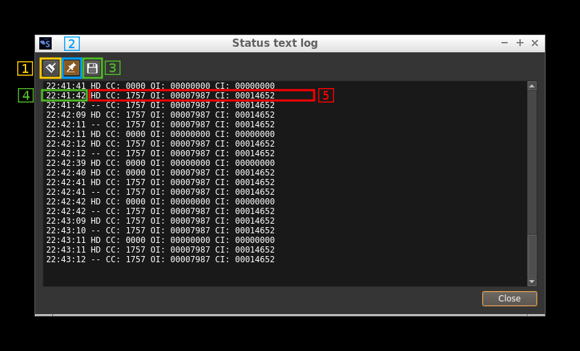
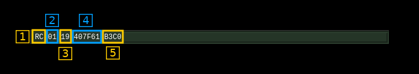
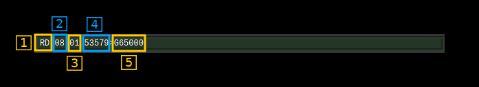
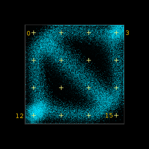
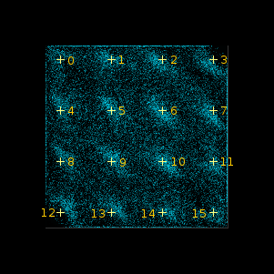
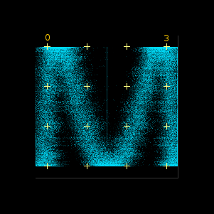
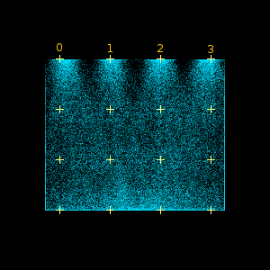

<h1>DSD (Digital Speech Decoder) demodulator and decoder plugin</h1>

<h2>Introduction</h2>

This plugin uses the [DSDcc](https://github.com/f4exb/dsdcc) library that has been rewritten from the original [DSD](https://github.com/szechyjs/dsd) program to decode several digital speech formats. At present it covers the following:

  - DMR/MOTOTRBO: ETSI two slot TDMA standard. MOTOTRBO is a popular implementation of this standard.
  - dPMR: Another ETSI standard at slower rate (2400 Baud / 6.25 kHz) and FDMA
  - D-Star: developed and promoted by Icom for Amateur Radio customers.
  - Yaesu System Fusion (YSF): developed and promoted by Yaesu for Amateur Radio customers. Voice full rate with DV serial devices is not supported
  - NXDN: A joint Icom (IDAS) and Kenwood (Nexedge) standard with 2400 and 4800 Baud versions.

The modulation and standard is automatically detected and switched depending on the Baud rate chosen.

To enable this plugin at compile time you will need to have DSDcc installed in your system. Please follow instructions in [DSDcc readme](https://github.com/f4exb/dsdcc/blob/master/Readme.md) to build and install DSDcc. If you install it in a custom location say `/opt/install/dsdcc` you will need to add these defines to the cmake command: `-DLIBDSDCC_INCLUDE_DIR=/opt/install/dsdcc/include/dsdcc -DLIBDSDCC_LIBRARIES=/opt/install/dsdcc/lib/libdsdcc.so`

<h2>DV serial device support</h2>

You can use a serial device connected to your system that implements and exposes the packet interface of the AMBE3000 chip. This can be for example a ThumbDV USB dongle. In order to support DV serial devices in your system you will need two things:

  - Compile with [SerialDV](https://github.com/f4exb/serialDV) support Please refer to this project Readme.md to compile and install SerialDV. If you install it in a custom location say `/opt/install/serialdv` you will need to add these defines to the cmake command: `-DLIBSERIALDV_INCLUDE_DIR=/opt/install/serialdv/include/serialdv -DLIBSERIALDV_LIBRARY=/opt/install/serialdv/lib/libserialdv.so`
  - Enable DV serial devices in your system by checking the option in the Preferences menu. You will need to enable the DV serial devices each time you start SDRangel.
  
Although such serial devices work with a serial interface at 400 kb in practice maybe for other reasons they are capable of handling only one conversation at a time. The software will allocate the device dynamically to a conversation with an inactivity timeout of 1 second so that conversations do not get interrupted constantly making the audio output too choppy. In practice you will have to have as many devices connected to your system as the number of conversations you would like to be handled in parallel. 

Note also that this is not supported in Windows because of trouble with COM port support (contributors welcome!).

Alternatively you can use software decoding with Mbelib. Possible copyright issues apart (see next) the audio quality with the DVSI AMBE chip is much better.

---
&#9888; With kernel 4.4.52 and maybe other 4.4 versions the default for FTDI devices (that is in the ftdi_sio kernel module) is not to set it as low latency. This results in the ThumbDV dongle not working anymore because its response is too slow to sustain the normal AMBE packets flow. The solution is to force low latency by changing the variable for your device (ex: /dev/ttyUSB0) as follows:

`echo 1 | sudo tee /sys/bus/usb-serial/devices/ttyUSB0/latency_timer` or `sudo setserial /dev/ttyUSB0 low_latency`

Newer kernels do not seem to have this issue.

---

<h2>Mbelib support</h2>

DSDcc itself can use [mbelib](https://github.com/szechyjs/mbelib) to decode AMBE frames. While DSDcc is intended to be patent-free, `mbelib` that it uses describes functions that may be covered by one or more U.S. patents owned by DVSI Inc. The source code itself should not be infringing as it merely describes possible methods of implementation. Compiling or using `mbelib` may infringe on patents rights in your jurisdiction and/or require licensing. It is unknown if DVSI will sell licenses for software that uses `mbelib`.

If you are not comfortable with this just do not install DSDcc and/or mbelib and the plugin will not be compiled and added to SDRangel. For packaged distributions just remove:

  - For Linux distributions: `plugins/channel/libdemoddsd.so`
  - For Windows distributions: `dsdcc.dll`, `mbelib.dll`, `plugins\channel\demoddsd.dll`

For software built from source if you choose to have `mbelib` support you will need to have DSDcc compiled with `mbelib` support. You will also need to have defines for it on the cmake command. If you have mbelib installed in a custom location, say `/opt/install/mbelib` you will need to add these defines to the cmake command: `-DLIBMBE_INCLUDE_DIR=/opt/install/mbelib/include -DLIBMBE_LIBRARY=/opt/install/mbelib/lib/libmbe.so`

<h2>Interface</h2>

<h3>A section: settings</h3>

<h4>A.1: Frequency shift from center frequency of reception</h4>

Use the wheels to adjust the frequency shift in Hz from the center frequency of reception. Left click on a digit sets the cursor position at this digit. Right click on a digit sets all digits on the right to zero. This effectively floors value at the digit position. Wheels are moved with the mousewheel while pointing at the wheel or by selecting the wheel with the left mouse click and using the keyboard arrows.Pressing shift simultaneously moves digit by 5 and pressing control moves it by 2.

<h4>A.2: Channel bandwidth before discriminator</h4>

This is the bandwidth of the pre-discriminator filter

<h4>A.3: Channel power</h4>

Total power in dB relative to a +/- 1.0 amplitude signal received in the pass band.

<h4>A.4: Channel power bar graph</h4>

<h4>A.5: Activate status text log</h4>

Check to send the status text lines (A.12) to the log. Uncheck to dismiss sending.

<h4>A.6 View status text log</h4>

Click to open a dialog to view the status text lines log:

<h5>A.6.1 Clear log</h5>

Push this button to clear the log

<h5>A.6.2 Pin to last line</h5>

Use this toggle to pin or unpin the log to the last line

<h5>A.6.3 Save log to file</h5>

Save the present log content to a file

<h5>A.6.4 Timestamp</h5>

Each line in the log starts with the timestamp when the status line was fetched from the decoder

<h5>A.6.5 Status text</h5>

One line per status text

<h4>A.7: Audio volume</h4>

When working with mbelib this is a linear multiplication factor. A value of zero triggers the auto gain feature. 

With the DV serial device(s) amplification factor in dB is given by `(value - 3.0)*5.0`. In most practical cases the middle value of 5.0 (+10 dB) is a comfortable level.

<h4>A.8: Squelch level</h4>

The level corresponds to the channel power above which the squelch gate opens.

<h4>A.9: Squelch time gate</h4>

Number of milliseconds following squelch gate opening after which the signal is declared open. There is a delay line for the samples so samples applied to the decoder actually start at the beginning of the gate period not loosing any samples. 0 means squelch is declared open with no delay.

<h4>A.10: High-pass filter for audio</h4>

Use this switch to toggle high-pass filter on the audio

<h4>A.11: Audio mute, squelch indicator and select audio output device</h4>

Left click to mute/unmute audio. This button lights in green when the squelch opens.

If you right click on it it will open a dialog to select the audio output device. See [audio management documentation](../../../sdrgui/audio.md) for details.

<h3>A.12: Format specific status display</h3>

When the display is active the background turns from the surrounding gray color to dark green. It shows informational or status messages that are particular to each format.

<h4>A11.1: D-Star status display</h4>

<h5>A11.1.1: Origin (my) and destination (your) callsign</h5>

  - at the left of the `>` sign is the origin callsign ` MY` with the 4 character informative suffix nest to the slash `/`
  - at the right of the `>` sign is the destination callsign `YOUR`. As per Icom standard this is `CQCQCQ` when a call is made to all stations
  - this information is retrieved from the header or the slow data if it can be decoded

<h5>A11.1.2: Repeater callsign</h5>

  - at the left of the `>` sign is the origin repeater or `RPT1`
  - at the right of the `>` sign is the destination repeater or `RPT2`
  - this information is retrieved from the header or the slow data if it can be decoded

<h5>A11.1.3: Informative text</h5>

When slow data can be decoded this is the 20 character string that is sent in the text frames 

<h5>A11.1.4: Geopositional data</h5>

When a `$$CRC` frame that carries geographical position can be successfully decoded from the slow data the geopositional information is displayed:  

   - at the left of the colon `:` is the QTH 6 character locator a.k.a. Maidenhead locator
   - at the right of the colon `:` is the bearing in degrees and distance in kilometers from the location entered in the main window `Preferences\My Position` dialog. The bearing and distance are separated by a slash `/`. 

<h4>A11.2: DMR status display</h4>

  - Note 1: statuses are polled at ~1s rate and therefore do not reflect values instantaneously. As a consequence some block types that occur during the conversation may not appear.
  - Note 2: status values remain unchanged until a new value is available for the channel or the transmissions stops then all values of both channels are cleared 

<h5>A11.2.1: Station role</h5>

  - `BS`: base station
  - `MS`: mobile station
  - `NA`: not applicable or could not be determined (you should not see this normally)

<h5>A11.2.2: TDMA slot #0 status</h5>

For mobile stations on an inbound channel there is no channel identification (no CACH) so information goes there by default.

<h5>A11.2.3: TDMA slot #1 status</h5>

<h5>A11.2.4: Channel status and color code</h5>

This applies to base stations and mobile stations in continuous mode that is transmissions including the CACH sequences.

  - The first character is either:
  
    - `*`: Busy. That is the AT bit on the opposite channel is on
    - `.`: Clear. That is the AT bit on the opposite channel is off
    - `/`: The CACH could not be decoded and information is missing
    
  - The two next characters are either:
  
    - The color code from 0 to 15 (4 bits)
    - `--`: The color code could not be decoded and information is missing
  
<h5>A11.2.5: Slot type</h5>

This is either:

   - `VOX`: voice block
   - `IDL`: data idle block
   - `VLC`: voice Link Control data block
   - `TLC`: terminator with Link Control information data block
   - `CSB`: CSBK (Control Signaling BlocK) data block
   - `MBH`: Multi Block Control block header data block
   - `MBC`: Multi Block Control block continuation data block
   - `DAH`: Data header block
   - `D12`: 1/2 rate data block
   - `D34`: 3/4 rate data block
   - `DB1`: full rate data block
   - `RES`: reserved data block 
   - `UNK`: unknown data type or could not be decoded

<h5>A11.2.6: Addressing information</h5>

String is in the form: `02223297>G00000222`

  - At the left of the `>` sign this is the source address (24 bits) as defined in the DMR ETSI standard
  - The first character at the right of the `>` sign is the address type indicator:
    - `G`: group address
    - `U`: unit (individual) address
  - Next on the right is the target address (24 bits) as defined in the DMR ETSI standard

<h4>A11.3: dPMR status display</h4>

<h5>A11.3.1: dPMR frame tyoe</h5>

  - `--`: undetermined
  - `HD`: Header of FS1 type
  - `PY`: Payload frame of a still undetermined type
  - `VO`: Voice frame
  - `VD`: Voice and data frame
  - `D1`: Data without FEC frame
  - `D2`: Data with FEC frame
  - `XS`: Extended search: looking for a new payload frame when out of sequence
  - `EN`: End frame
  
<h5>A11.3.2: Colour code</h5>

Colour code in decimal (12 bits)

<h5>A11.3.3: Own ID</h5>

Sender's identification code in decimal (24 bits)

<h5>A11.3.4: Called ID</h5>

Called party's identification code in decimal (24 bits)

<h4>A11.4: Yaesu System Fusion (YSF) status display</h4>

<h5>A11.4.1: FICH data</h5>

This displays a summary of FICH (Frame Identification CHannel) block data. From left to right:

  - Frame type:
    - `H`: header
    - `C`: channel (as in the example)
    - `T`: terminator
    - `S`: test
    
  - Channel type:
    - `V1`: voice/data mode 1
    - `V2`: voice/data mode 2 (as in the example)
    - `VF`: voice full rate
    - `DF`: data full rate
     
  - Call mode:
    - `GC`: group call (as in the example)
    - `RI`: radio ID
    - `RE`: reserved
    - `IN`: individual call
    
  - Number of total blocks and number of total frames separated by a colon `:`
  
  - Miscellaneous information in a single string
    - first character is the bandwidth mode:
      - `N`: narrow band mode
      - `W`: wide band mode (as in the example)
    - second character is the path type:
      - `I`: Internet path
      - `L`: local path (as in the example)
    - last three characters are the YSF squelch code (0..127) or dashes `---` if the YSF squelch is not active
    
<h5>A11.4.2: Origin and destination callsigns</h5>

  - at the left of the `>` sign is the origin callsign
  - at the right of the `>` sign is the destination callsign. It is filled with stars `*` when call is made to all stations (similar to the CQCQCQ in D-Star)

<h5>A11.4.3: Origin and destination repeaters callsigns</h5>

  - at the left of the `>` sign is the origin repeater callsign
  - at the right of the `>` sign is the destination repeater callsign. 

<h5>A11.4.4: Originator radio ID</h5>

This is the unique character string assigned to the device by the manufacturer.

<h4>A11.5: NXDN status display</h4>

There are 3 display formats depending on the kind of transmission called RF channel in the NXDN system.

<h5>A11.5.1: RCCH RF channel display</h5>

This is the control channel used in trunked systems and is usually sent continuously.

<h6>A11.5.1.1: RF channel indicator</h5>

This is `RC` for RCCH

<h6>A11.5.2.2: Half/full rate</h5>

Indicator of transmission rate:

  - `H`: half rate (2400 or 4800 S/s). Uses EHR vocoder (AMBE 3600/2450)
  - `F`: full rate (4800 S/s only). Uses EFR vocoder (AMBE 7200/4400)

<h6>A11.5.1.3: RAN number</h5>

This is the RAN number (0 to 63) associated to the transmission. RAN stands for "Radio Access Number" and for trunked systems this is the site identifier (Site Id) modulo 64.

<h6>A11.5.1.4: Last message type code</h5>

This is the type code of the last message (6 bits) displayed in hexadecimal. The complete list is found in the NXDN documentation `NXDN TS 1-A Version 1.3` section 6.

<h6>A11.5.1.5: Location Id</h5>

This is the 3 byte location Id associated to the site displayed in hexadecimal

<h6>A11.5.1.6: Services available flags</h5>

This is a 16 bit collection of flags to indicate which services are available displayed in hexadecimal. The breakdown is listed in the NXDN documentation `NXDN TS 1-A Version 1.3` section 6.5.33. From MSB to LSB:

  - first nibble (here `B`):
    - `b15`: Multi-site service 
    - `b14`: Multi-system service 
    - `b13`: Location Registration service 
    - `b12`: Group Registration Service
  - second nibble (here `3`):
    - `b11`: Authentication Service 
    - `b10`: Composite Control Channel Service 
    - `b9`: Voice Call Service 
    - `b8`: Data Call Service
  - third nibble (here `C`):
    - `b7`: Short Data Call Service 
    - `b6`: Status Call & Remote Control Service
    - `b5`: PSTN Network Connection Service
    - `b4`: IP Network Connection Service
  - fourth nibble (here `0`) is spare

<h5>A11.5.2: RTCH or RDCH RF channel display</h5>

This is the transmission channel either in a trunked system (RTCH) or conventional system (RDCH).

<h6>A11.5.2.1: RF channel indicator</h5>

It can be either `RT` for RTCH or `RD` for a RDCH channel

<h6>A11.5.2.2: Half/full rate</h5>

Indicator of transmission rate:

  - `H`: half rate (2400 or 4800 S/s). Uses EHR vocoder (AMBE 3600/2450)
  - `F`: full rate (4800 S/s only). Uses EFR vocoder (AMBE 7200/4400)

<h6>A11.5.2.3: RAN number</h5>

This is the RAN number (0 to 63) associated to the transmission. RAN stands for "Radio Access Number" and has a different usage in conventional or trunked systems:

  - Conventional (RDCH): this is used as a selective squelch. Code `0` means always unmute.
  - Trunked (RTCH): this is the site identifier (Site Id) modulo 64.

<h6>A11.5.2.4: Last message type code</h5>

This is the type code of the last message (6 bits) displayed in hexadecimal. The complete list is found in the NXDN documentation `NXDN TS 1-A Version 1.3` section 6.

<h6>A11.5.2.5: Source Id</h5>

This is the source of transmission identification code on two bytes (0 to 65353) displayed in decimal.

<h6>A11.5.2.6: Destination Id</h5>

This is the destination of transmission identification code on two bytes (0 to 65353) displayed in decimal. It is prefixed by a group call indicator:

  - `G`: this is a group call
  - `I`: this is an individual call

<h5>A11.5.3: Unknown or erroneous data display</h5>

In this case the display is simply "RU" for "unknown"

<h3>B section: digital</h3>

<h4>B.1: FM signal scope</h4>

This display shows the sampled points of the demodulated FM signal in a XY plane with either:

  - X as the signal at time t and Y the signal at time t minus symbol time if "transitions constellation" is selected by button (B.13)
  - X as the signal and Y as the synchronization signal if "symbol synchronization" is selected by button (B.13) 

The display shows 16 points as yellow crosses that can be used to tune the center frequency (A.1) and FM deviation (B.17) so that symbol recovery can be done with the best conditions. In the rest of the documentation they will be referenced with numbers from 0 to 15 starting at the top left corner and going from left to right and top to bottom.

<h5>Transition constellation display</h5>

This is selected by the transition constellation or symbol synchronization signal toggle (B.13)

The discriminator signal at 48 kS/s is routed to the scope display with the following connections:

  - X input: the discriminator samples
  - Y input: the discriminator samples delayed by the baud rate i.e. one symbol delay:
    - 2400 baud: 20 samples
    - 4800 baud: 10 samples

Depending on the type of modulation the figure will have different characteristic forms:

<h6>2-FSK or 2-GFSK</h6>

This concerns the following standards:

  - D-Star
  
There are 4 possible points corresponding to the 4 possible transitions. x represents the current symbol and y the previous symbol. The 4 points given by their (y,x) coordinates correspond to the following:

  - (1, 1): upper right corner. The pointer can stay there or move to (1, -1). Ideally this should be placed at point 3.
  - (1, -1): upper left corner. The pointer can move to (-1, -1) or (-1, 1). Ideally this should be placed at point 0.
  - (-1, 1): lower right corner. The pointer can move to (1, -1) or (1, 1). Ideally this should be placed at point 15.
  - (-1, -1): lower left corner. The pointer can stay there or move to (-1, 1). Ideally this should be placed at point 12.
 
As you can see the pointer can make all moves except between (-1, -1) and (1,1) hence all vertices between the 4 points can appear except the one between the lower left corner and the upper right corner.

<h6>4-FSK or 4-GFSK</h6>

This concerns the following standards:

  - DMR
  - YSF
  - dPMR
  - NXDN

There are 16 possible points corresponding to the 16 possible transitions between the 4 dibits. The 4 dibits are equally spaced at relative positions of -3, -1, 1, 3 hence the 16 points are also equally spaced between each other on the IQ or (x,y) plane.

Ideally the figure should show a cloud of persistent points at the locations marked by the yellow crosses (0 to 15).

<h5>Symbol synchronization display</h5>

2-FSK

4-FSK

This is selected by the transition constellation or symbol synchronization signal toggle (B.13)

The X input is the discriminator signal and the Y input is the symbol synchronization signal that goes to the estimated maximum discriminator signal level when a zero crossing in the symbol synchronization control signal is detected and goes to mid position ((max - min) / 2) of the discriminator signal when a symbol period starts.

The symbol synchronization control signal is obtained by squaring the discriminator signal and passing it through a narrow second order bandpass filter centered on the symbol rate. Its zero crossing should occur close to the first fourth of a symbol period therefore when synchronization is ideal the Y input should go down to mid position in the first fourth of the symbol period.

Ideally the figure should show a cloud of persistent points at the locations marked by points 0 to 3. Each one of these points represent an ideally decoded symbol.

<h4>B.2: Symbol (Baud) rate</h4>

Here you can specify which symbol rate or Baud rate is expected. Choices are:

  - `2.4k`: 2400 S/s used for dPMR and 4800 b/s NXDN
  - `4.8k`: 4800 S/s used for 9600 b/s NXDN, DMR, D-Star and YSF.

<h4>B.3: Type of frame detected</h4>

This can be one of the following:

  - `+DMRd`: non-inverted DMR data frame
  - `+DMRv`: non-inverted DMR voice frame
  - `-DMRd`: inverted DMR data frame
  - `-DMRv`: inverted DMR voice frame
  - `+D-STAR`: non-inverted D-Star frame
  - `-D-STAR`: inverted D-Star frame
  - `+D-STAR_HD`: non-inverted D-Star header frame encountered
  - `-D-STAR_HD`: inverted D-Star header frame encountered
  - `+dPMR`: non-inverted dPMR non-packet frame
  - `+NXDN`: non-inverted NXDN frame
  - `-NXDN`: inverted NXDN frame (not likely)
  - `+YSF`: non-inverted Yaesu System Fusion frame

<h4>B.4: Matched filter toggle</h4>
 
Normally you would always want to have a matched filter however on some strong D-Star signals more synchronization points could be obtained without. When engaged the background of the button is lit in orange.

<h4>B.5: Symbol PLL lock indicator</h4>

Since dsdcc version 1.7.1 the symbol synchronization can be done with a PLL fed by a ringing filter (narrow passband) tuned at the symbol rate and itself fed with the squared magnitude of the discriminator signal. For signals strong enough to lock the PLL this works significantly better than with the ringing filter alone that was the only option in versions <= 1.6.0. Version 1.7.0 had the PLL enabled permanently.

However with marginal signals the ringing filter alone and a few heuristics work better. This is why since DSDcc version 1.7.1 the PLL became optional.

You can use this button to toggle between the two options:

  - with the locker icon in locked position: PLL is engaged
  - with the locker icon in unlocked position: PLL is bypassed

When in lock position the button lights itself in green when the PLL lock is acquired. Occasional drops may occur without noticeable impact on decoding.

<h4>B.6: Symbol synchronization zero crossing hits in %</h4>

This is the percentage per symbols for which a valid zero crossing has been detected. The more the better the symbol synchronization is tracked however the zero crossing shifts much not deviate too much from 0 (see next).

With the PLL engaged the figure should be 100% all the time in presence of a locked signal. Occasional small drops may occur without noticeable impact on decoding.

<h4>B.7: Zero crossing shift</h4>
 
This is the current (at display polling time) zero crossing shift. It should be the closest to 0 as possible. However some jitter is acceptable for good symbol synchronization:

  - `2400 S/s`: +/- 5 inclusive
  - `4800 S/s`: +/- 2 inclusive
 
<h4>B.8: Discriminator input signal median level in %</h4>

This is the estimated median level (center) of the discriminator input signal in percentage of half the total range. When the signal is correctly aligned in the input range it should be 0

<h4>B.9: Discriminator input signal level range in %</h4>

This is the estimated discriminator input signal level range (max - min) in percentage of half the total range. For optimal decoding it should be maintained close to 100.

<h4>B.10 to B.12: Two slot TDMA handling</h4>

This is useful for two slot TDMA modes that is only DMR at present. FDMA modes are treated as using slot #1 only.

<h5>B.10 (1): Slot #1 voice select</h5>

Toggle button to select slot #1 voice output. When on waves appear on the icon. The icon turns green when voice frames are processed for this slot. For FDMA modes you may want to leave only this toggle on.

<h5>B.11 (2): Slot #2 voice select</h5>

Toggle button to select slot #2 voice output. When on waves appear on the icon. The icon turns green when voice frames are processed for this slot. For FDMA modes you may want to leave this toggle off.

<h5>B.12 (3): TDMA stereo mode toggle</h5>

  - When off the icon shows a single loudspeaker. It mixes slot #1 and slot #2 voice as a mono audio signal
  - When on the icon shows a pair of loudspeakers. It sends slot #1 voice to the left stereo audio channel and slot #2 to the right one
  
For FDMA standards you may want to leave this as mono mode.
 
<h4>B.13: Transition constellation or symbol synchronization signal toggle</h4>

Using this button you can either:

  - show the transitions constellation
  - show a indicative signal about symbol synchronization
    - when a zero crossing is detected the signal is set to estimated input discriminator signal maximum value
    - when the symbol clock is 0 (start of symbol period) the signal is set to the estimated median point of the input discriminator signal

<h4>B.14: Trace length</h4>

This button tunes the length of the trace displayed on B.1. Units are milliseconds. Default value is 300.

<h4>B.15: Trace stroke</h4>

This button tunes the stroke of the points displayer on B.1. The trace has limited persistence based on alpha blending. This is the 8 bit unsigned integer value of the trace alpha blending. Default value is 100.

<h4>B.16: Trace decay</h4>

This button tunes the persistence decay of the points displayer on B.1. The trace has limited persistence based on alpha blending. This controls the alpha value of the black screen printed at the end of each trace and thus the trace points decay time. The value is 255 minus he displayed value using 8 bit unsigned integers.

  - A value of 0 yields no persistence
  - A value of 255 yields infinite persistence
  - Default value is 200s

<h4>B.17: Maximum expected FM deviation</h4>

This is the one side deviation in kHz (&#177;) leading to maximum (100%) deviation at the discriminator output. The correct value depends on the maximum deviation imposed by the modulation scheme with some guard margin. In practice you should adjust this value to make the figure on the signal scope fill the entire screen as shown in the screenshots above. The typical deviations by mode for a unit gain (1.0 at B.18) are:
  
  - DMR: &#177;5.4k
  - dPMR: &#177;2.7k
  - D-Star: &#177;3.5k
  - YSF: &#177;7.0k
  - NXDN: &#177;2.7k

<h4>B.18: Gain after discriminator</h4>

This is the gain applied to the output of the discriminator before the decoder. Normally this would be set at unit gain 1.0 while the FM deviation is adjusted. However this can be used to extend the range of FM adjustment.
