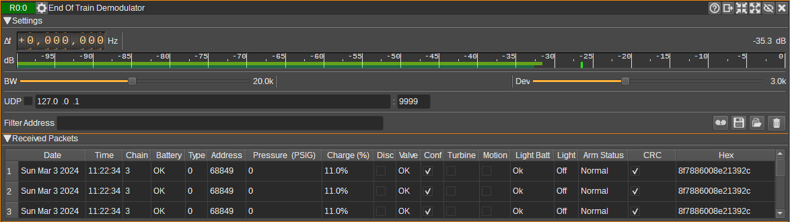

<h1>End-of-Train Demodulator Plugin</h1>

<h2>Introduction</h2>

This plugin can be used to demodulate End-of-Train packets. These are packets transmitted by an [End-of-Train Device](https://en.wikipedia.org/wiki/End-of-train_device),
that can be found on some trains.
It transmits information about whether motion is detected, brake pressure, whether the marker light is on and battery information.

* Frequency: 457.9375 MHz (North America, India), 477.7 MHz (Australia) and 450.2625 MHz (New Zealand).
* Modulation: FSK, 1800Hz space, 1200 mark, +-3kHz deviation.
* Baud rate: 1200 baud.

The End-of-train packet specification is defined in:
AAR Manual of Standards and Recommended Practices - S-9152 End of Train Communication - Section K Part II Locomotive Electronics and Train Consist System Architecture.
If anyone has a copy, please get in touch.

<h2>Interface</h2>

The top and bottom bars of the channel window are described [here](../../../sdrgui/channel/readme.md)

<h3>1: Frequency shift from center frequency of reception</h3>

Use the wheels to adjust the frequency shift in Hz from the center frequency of reception. Left click on a digit sets the cursor position at this digit. Right click on a digit sets all digits on the right to zero. This effectively floors value at the digit position. Wheels are moved with the mousewheel while pointing at the wheel or by selecting the wheel with the left mouse click and using the keyboard arrows. Pressing shift simultaneously moves digit by 5 and pressing control moves it by 2.

<h3>2: Channel power</h3>

Average total power in dB relative to a +/- 1.0 amplitude signal received in the pass band.

<h3>3: Level meter in dB</h3>

  - top bar (green): average value
  - bottom bar (blue green): instantaneous peak value
  - tip vertical bar (bright green): peak hold value

<h3>4: RF Bandwidth</h3>

This specifies the bandwidth of a LPF that is applied to the input signal to limit the RF bandwidth.

<h3>5: Frequency deviation</h3>

Adjusts the expected frequency deviation in 0.1 kHz steps from 1 to 6 kHz. Typical value is 3 kHz.

<h3>6: Filter Address</h3>

Entering a regular expression in the field displays only packets where the unit address matches the regular expression.

<h3>7: UDP</h3>

When checked, received packets are forwarded to the specified UDP address (8) and port (9).

<h3>8: UDP address</h3>

IP address of the host to forward received packets to via UDP.

<h3>9: UDP port</h3>

UDP port number to forward received packets to.

<h3>10: Use Date and Time from File</h3>

When checked, if the source device is a File Input device, the date and time used for
packet reception time is taken from the file playback time. Otherwise, the current system clock time is used.

<h3>11: Start/stop Logging Packets to .csv File</h3>

When checked, writes all received packets to a .csv file. The filename is specified by (12).

<h3>12: .csv Log Filename</h3>

Click to specify the name of the .csv file which received packets are logged to.

<h3>13: Read Data from .csv File</h3>

Click to specify a previously written .csv log file, which is read and used to update the table.

<h3>14: Clear table</h3>

Pressing this button clears all packets from the table.

<h3>Received Packets Table</h3>

The received packets table displays the contents of the packets that have been received. Only packets with valid CRCs are displayed.

* Date - Date the packet was received.
* Time - Time the packet was received.
* Battery condition - Whether the battery charge is OK, low, very low or not monitored (N/A).
* Type - Message type identifier.
* Address - Unit address, which uniquely identifies the end-of-train unit.
* Pressure - Brake pipe pressure in Pounds per Square Inch Gauge (PSIG).
* Charge - Battery charge in percent.
* Disc - Discretionary bit that is used for varying data by different vendors.
* Valve - Valve circuit status (Ok or Fail).
* Conf - Confirmation indicator.
* Turbine - Air turbine equipped.
* Motion - Whether motion is detected (i.e. is the rear of the train is moving).
* Light Batt - Marker light battery condition (Ok or Low).
* Light - Marker light status (On or off).
* CRC - Whether the calculated CRC matches the received CRC.
* Hex - The packet data displayed as hexadecimal.

<h2>Attribution</h2>

Based on code and reverse engineering by Eric Reuter

Clock icons created by Pixel perfect from Flaticon https:://www.flaticon.com
