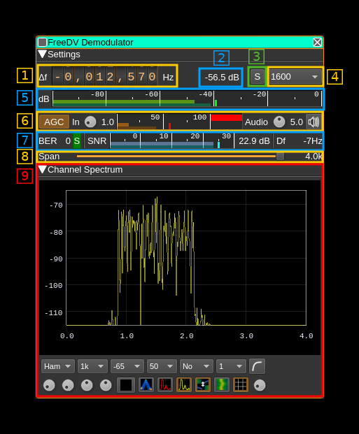
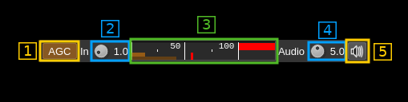
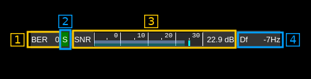

<h1>FreeDV demodulator plugin</h1>

<h2>Introduction</h2>

This plugin can be used to demodulate a signal following the [FreeDV digital voice protocol](https://freedv.org/).

&#9888; A minimum of 48 kS/s I/Q sample rate in the baseband is required in 2400A mode for the demodulator/decoder to work correctly. Other modes only require 8 kS/s.

<h2>Interface</h2>

The top and bottom bars of the channel window are described [here](../../../sdrgui/channel/readme.md)

<h3>1: Frequency shift from center frequency of reception</h3>

Use the wheels to adjust the frequency shift in Hz from the center frequency of reception. Left click on a digit sets the cursor position at this digit. Right click on a digit sets all digits on the right to zero. This effectively floors value at the digit position. Wheels are moved with the mousewheel while pointing at the wheel or by selecting the wheel with the left mouse click and using the keyboard arrows. Pressing shift simultaneously moves digit by 5 and pressing control moves it by 2.

<h3>2: Channel power</h3>

Average total power in dB relative to a +/- 1.0 amplitude signal received in the pass band.

<h3>3: Manual re-synchronization</h3>

This works only for the presently disabled 700D mode. Use this push button to force losing and re-acquiring synchronisation.

<h3>4: FreeDV mode</h3>

Use this combo box to select which FreeDV standard is used. The following are supported:

  - `2400A`: FSK-4 wideband (6 kHz) modulation with 1300 b/s compressed voice to be used at 29 MHz and above similarly to FM analog usage. [Details here](https://www.rowetel.com/?p=5119)
  - `1600`: OFDM (16 QPSK carriers) narrowband (1.4 kHz) with 700 b/s compressed voice
  - `800XA`: FSK-4 narrowband (2 kHz) with 700 b/s compressed voice
  - `700C`: Another OFDM (14 QPSK carriers) narrowband (1.5 kHz) mode with 700 b/s compressed voice

<h3>5: Level meter in dB</h3>

  - top bar (green): average value
  - bottom bar (blue green): instantaneous peak value
  - tip vertical bar (bright green): peak hold value

<h3>6: AGC and volume controls</h3>

<h4>6.1: AGC toggle</h4>

Use this checkbox to toggle AGC on and off.

<h4>6.2: Modem input volume</h4>

This is the volume of the signal entering the modem  from 0.0 (mute) to 9.9 (maximum). It can be varied continuously in 0.1 steps using the dial button. Use this control to make sure the peaks do not exceed 100% on the VU meter.

<h4>6.3: Modem input VU meter</h4>

This shows the level of the signal entering the modem and peaks (shown by the tiny red vertical bar) should never exceed 100%. In fact there is a 10% guard so 100% is actually 90% of the signal volume.

<h4>6.4: Audio output volume</h4>

This is the volume of the audio signal from 0.0 (mute) to 9.9 (maximum). It can be varied continuously in 0.1 steps using the dial button. The mid position (5.0) corresponds to the normal level of comfort.

<h3>7: Digital signal quality indicators</h3>

<h4>7.1: Bit Error Rate (BER)</h4>

This shows the number of bit errors per second and is derived from the bit error counter updated at each frame and the frames per second depending on the FreeDV mode.

<h4>7.2: Synchronization indicator</h4>

This indicator lights in green when synchronization is locked. Note that this does not work for FM modes (2400A, 800XA).

<h4>7.3: Digital Signal to Noise Ratio</h4>

This should be derived more or less from the calculated Eb/N0. Note that in 700C mode it takes big jumps and does not seem very reliable.

<h4>7.4: Frequency shift estimation</h4>

This is an estimation of the frequency shift from optimal position. Use the frequency delta dial (1) to make it as close to 0 as possible.

<h3>8: Spectrum display frequency span</h3>

The transmitted signal is further decimated by a power of two before being applied to the channel spectrum display and used to set the in channel filter limits. This effectively sets the total available bandwidth depending on the decimation:

  - 1 (no decimation): 24 kHz (2400A) or 4 kHz (other modes)
  - 2: 12 kHz (2400A) or 2 kHz (other modes)
  - 4: 6 kHz (2400A) or 1 kHz (other modes)
  - 8: 3 kHz (2400A) or 0.5 kHz (other modes)
  - 16: 1.5 kHz (2400A) or 0.25 kHz (other modes)

<h3>9: Spectrum display</h3>

This is the spectrum display of the analog signal that enters the modem before AGC and volume control. Controls on the bottom of the panel are identical to the ones of the main spectrum display. It should be optimally centered using the frequency offset control (1) depending on the expected FreeDV mode:

  - `2400A`: 3 kHz (filtered from 0 to 6 kHz)
  - `1600`: 1.5 kHz (filtered from 0.6 to 2.4 kHz)
  - `800XA`: 1.4 kHz (filtered from 0.4 to 2.4 kHz)
  - `700C`: 1.5 kHz (filtered from 0.6 to 2.4 kHz)
