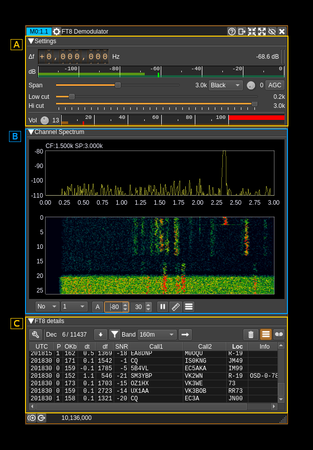
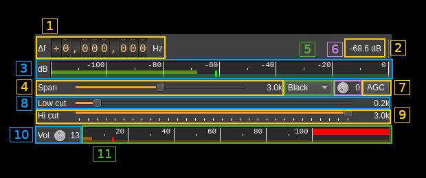
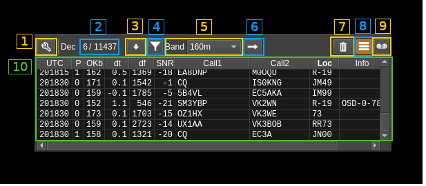
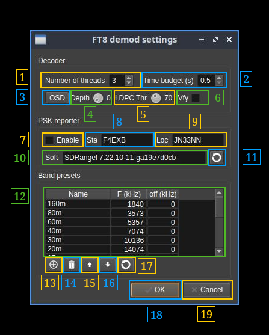

<h1>FT8 demodulator plugin</h1>

<h2>Introduction</h2>

This plugin can be used to demodulate and decode FT8 signals. FT8 is used by amateur radio to perform contacts (QSOs) with very weak signals. It is used mostly but not limited to HF bands. The protocol and modulation details are described in [QEX July/August 2020 article](https://www.iz3mez.it/wp-content/library/appunti/Protocols%20FT4%20FT8%20QEX.pdf)

The decoder code is based on [ft8mon](https://github.com/rtmrtmrtmrtm/ft8mon) code written by Robert Morris, AB1HL. The core of the decoder is stored in a separate `libft8` library in the `ft8` folder of this repository and is placed under the `FT8` namespace.

The excellent work of Robert Morris makes the decoder on par or even slightly better than the original [WSJT-X](https://wsjt.sourceforge.io/wsjtx.html) code.

<h2>Interface</h2>

The top and bottom bars of the channel window are described [here](../../../sdrgui/channel/readme.md)

This interface is divided in 3 collapsible sections:

  - A: RF and AF settings
  - B: Demodulator baseband spectrum
  - C: FT8 settings

<h2>A: RF and AF settings</h2>

<h3>A.1: Frequency shift from center frequency of reception</h3>

Use the wheels to adjust the frequency shift in Hz from the center frequency of reception. Left click on a digit sets the cursor position at this digit. Right click on a digit sets all digits on the right to zero. This effectively floors value at the digit position. Wheels are moved with the mouse wheel while pointing at the wheel or by selecting the wheel with the left mouse click and using the keyboard arrows. Pressing shift simultaneously moves digit by 5 and pressing control moves it by 2.

<h3>A.2: Channel power</h3>

Average total power in dB relative to a +/- 1.0 amplitude signal received in the pass band.

<h3>A.3: Level meter in dB</h3>

  - top bar (green): average value
  - bottom bar (blue green): instantaneous peak value
  - tip vertical bar (bright green): peak hold value

&#9758; The channel marker in the main spectrum display shows the actual band received taking in channel filtering into account.

<h3>A.4: Spectrum display frequency span</h3>

The FT8 decoding sample rate of 12 kS/s is further decimated by powers of two for the spectrum display (B) and in RF filter limits. This effectively sets the total available bandwidth depending on the decimation:

  - 1: 6 kHz
  - 2: 3 kHz. This shows the full range of a standard FT8 baseband and is the default position
  - 4: 1.5 kHz

<h3>A.5: FFT filter window</h3>

The band pass filter is a FFT filter. This controls the FFT window type:

  - **Bart**: Bartlett
  - **B-H**: 4 term Blackman-Harris
  - **FT**: Flat top
  - **Ham**: Hamming
  - **Han**: Hanning
  - **Rec**: Rectangular (no window)
  - **Kai**: Kaiser with alpha = 2.15 (beta = 6.76) gives sidelobes &lt; -70dB
  - **Blackman**: Blackman (3 term - default)
  - **B-H7**: 7 term Blackman-Harris

<h3>A.6: Select filter in filter bank</h3>

There are 10 filters in the filter bank with indexes 0 to 9. This selects the current filter in the bank the filter index is displayed at the right of the button. The following controls are covered by the filter settings:

  - Span (8)
  - FFT window (9)
  - BW (11)
  - Low cut (12)

<h3>A.7: AGC toggle</h3>

Use this checkbox to toggle AGC on and off.

This AGC is based on the calculated magnitude (square root of power of the filtered signal as I² + Q²) and will try to adjust audio volume as if a -20dB power signal was received.

As AGC compresses the signals you have to experiment whether AGC or no AGC give the best result in decoding signals. With AGC on it is easier to adjust the volume (A.10) as the audio signal will be more stable.

<h3>A.8: RF filter low cutoff</h3>

Values are expressed in kHz and step is 100 Hz.

<h3>A.9: RF filter high cutoff</h3>

Values are expressed in kHz and step is 100 Hz.

<h3>A.10: Volume</h3>

This is the volume of the audio signal in dB from -10 (0.1) to 40 (10000). It can be varied continuously in 1 dB steps using the dial button. When AGC is engaged it is recommended to set a low value in dB not exceeding 3 db (gain 2). When AGC is not engaged the volume entirely depends on the RF power and can vary in large proportions. Hence setting the value in dB is more convenient to accommodate large differences.

<h3>A.11: Volume meter</h3>

This shows the level of the signal entering the FT8 demodulator and decoder and peaks (shown by the tiny red vertical bar) should never exceed 100&percnt;. In fact there is a 10&percnt; guard so 100&percnt; is actually 90&percnt; of the signal volume. Note that the decoder will work well even with a few &percnt; volume however you should try to set the volume (A.10) so that big signals reach at least ~20&percnt; to have the best dynamic range.

Because this volume is based on he RF signal strength it can vary in large proportions and will be more stable if AGC (A.7) is engaged.

<h2>B: Demodulator baseband spectrum</h2>

This is the spectrum display of the demodulated signal (SSB) or translated signal (DSB). Controls on the bottom of the panel are identical to the ones of the main spectrum display. Details on the spectrum view and controls can be found [here](../../../sdrgui/gui/spectrum.md)

<h2>C: FT8 settings</h2>

The wrench (tool) button (C.1) is detailed at the bottom of the section.

<h3>C.2: Number of decodes</h3>

Shows the number of decodes for the last 15s sequence (left of slash) and the total since the decoder was started (right of slash)

<h3>C.3: Move to bottom of messages table</h3>

Use this button to scroll down to the bottom of the message table. In this position newer messages will automatically trigger moving to the bottom.

<h3>C.4: Filter messages</h3>

Toggles the filtering of messages. Messages are filtered based on the selected cell in the table. Only certain cells will be taken into consideration

  - **UTC**: will filter messages based on the message time slot
  - **df**: will filter messages based on the carrier frequency shift. A &plusmn;4 Hz tolerance is supplied which just exceeds a FT8 symbol width
  - **Call1**: will filter messages matching the call1 area value either in the call1 or call2 areas
  - **Call2**: same as above but taking the call2 value
  - **Loc**: will filter messages matching the value in the locator (loc) area
  - **Info**: will filter values starting with "OSD" or not starting with "OSD" thus filter messages decoded via OSD or not

<h3>C.5: Band preset selection</h3>

Selects which band preset can be applied with the (C.6) button

<h3>C.6: Apply band preset</h3>

Applies the band preset selected in (C.5)

<h3>C.7: Clear messages table</h3>

Empties the message table (C.10)

<h3>C.8: Log messages</h3>

Toggles the logging of messages. Messages will be logged in the same format as the original WSJT-X format.

Example:

<code><pre>
230128_003030    10.136 Rx FT8    -22  0.1 2049 KE0DKZ W2ZI EL99
---- 1 ------    --2---           -3-  -4- --5- --6--- --7- --8-
</pre></code>

  - **1**: Date and time of decoder slot in YYMMDD_HHmmss fomat
  - **2**: Base frequency in MHz
  - **3**: SNR in 2.5 kHz bandwidth
  - **4**: Message start delay in seconds from standard sequence start
  - **5**: Message carrier shift from base frequency in Hz
  - **6**: First callsign area. May contain spaces (ex: "CQ DX"). Note that for messages types 0.1 and 5 it is slighlty different from the standard (See C.10)
  - **7**: Second callsign area and is always a callsign. This might be slighlty different from the standard (see above)
  - **8**: Locator area maybe a 4 or 6 digit locator, a report, acknowledgement (RRR) or a greetings (RR73, 73)

The splitting and naming of files is different from WSJT-X scheme.

The file name is constructed as follows where date is the day date in YYYYMMDD format:

&lt;date&gt;_d&lt;device index&gt;c&lt;channel index&gt;.txt

Files will be stored in the system application data location in the `ft8/logs` folder. The application dat location depends on the O/S:

  - Linux: ~/.local/share/f4exb/SDRangel
  - Windows: C:&bsol;Users&bsol;&lt;your user&gt;&bsol;AppData&bsol;Local&bsol;f4exb&bsol;SDRangel

<h3>C.9: Record baseband</h3>

The baseband (audio) may be recorded as a 12 kHz mono PCM .wav file similarly to what can be done with the original WSJT-X program. Each record is the 15s FT8 period (180000 16 bit signed samples or 360000 data bytes). Files are stored in the system application data location (see above for details) in the `ft8/save` folder and have the following file name format:

&lt;date&gt;_&lt;time&gt;.wav

Where date is the slot date in YYYYMMDD format (in WSJT-X this is YYMMDD) and time is the slot time in HHmmss format.

<h3>C.10: Messages table</h3>

Displays the received messages in a table which columns are the following:

  - **UTC**: UTC time in HHmmss format of the FT8 slot
  - **Typ**: Message type according to the i3.n3 format described in the protocol (see reference at the top):
    - **0.0**: Free text. The first call area is populated with the free text. second call and locator areas are left blank.
    - **0.1**: DXpedition. Message carries two compacted messages (one for RR73 and one for report to two different callees). They will be de-compacted in two separate messages for display. This is different from the standard that yields a single message.
    - **0.3**: ARRL field day
    - **0.4**: ARRL field day
    - **0.5**: Telemetry
    - **1**: Standard message (the most common)
    - **2**: European VHF (4 char locator) minor change to standard message above
    - **3**: Russian RTTY
    - **4**: Non standard call
    - **5**: European VHF (6 char locator). The report + QSO number is appended to first call area not to pollute the second call area which contains only a callsign, This is slightly diffrent from the standard.
  - **P**: LDPC decoder pass index that was successful (0 to 2) as there are 3 passes
  - **OKb**: Number of correct bits in the message before FEC correction. Maximum is 174 in which case no FEC would be needed.
  - **dt**: Message start time shift in seconds from standard FT8 time slot
  - **df**: Message frequency shift in Hz from base frequency. This is the shift of the lowest frequency symbol
  - **SNR**: Signal to noise ratio in dB transposed in a 2.5 kHz bandwidth (WSJT-X standard). The actual SNR is this value plus 26 dB.
  - **Call1**: This is the first call area and may contain the caller callsign, a CQ or a custom 13 character message in which case the second call and locator areas are empty. It may be slightly different from the standard for message type 5 (see above).
  - **Call2**: This is the second call area and will contain the callsign of the responding station. This is always a callsign and this may differ slightly from the standard for messages type 5 (see above).
  - **Loc**: Locator area which contains the 4 character Maidenhead locator, a report, an acknowledgement (RRR) or a greetings (73 or RR73)
  - **Info**: FT8 decoder information if any. If OSD is active (see C.1.3) and OSD was activated it reports the OSD decoder status as `OSD-N-MM` where N is the OSD depth reached and MM is the number of correct LDPC bits.

<h3>C.1: More FT8 decoder settings</h2>

This button will open a dialog for more settings

<h4>C.1.1: Number of decoder threads</h4>

When processing the audio baseband several instances of the core decoder will be spawned in separate threads. This adjusts the number of threads. You have to experiment with it to find which is the best number for you. The default of 3 will normally yield good results comparable if no better to what is obtained with the original WSJT-X software.

<h4>C.1.2: Decoder time budget</h4>

This is the time in seconds after which the decoder threads will be prompted to stop. It can be varied from 0.1 to 5 seconds. You can imagine that the longer the decoder runs the more messages it will harvest however the default of 0.5s will be enough in most cases. You can still experiment with it to find what value is the best in your own case.

<h4>C.1.3: Toggle Ordered Statistics Decoding</h4>

This toggles the Ordered Statistics Decoding (OSD). OSD is used if the CRC check fails after LDPC processing. Be careful with OSD as it will try to find solutions that validate the CRC but these solutions can be wrong and thus yield false messages. To mitigate this you may engage the callsign verification function (C.1.6). Ultimately you may post process the results (logs) through a list of valid country prefixes and correlate country and locator.

<h4>C.1.4: Ordered Statistics Decoding depth</h4>

Sets the maximum depth of OSD search.

<h4>C.1.5: LDPC correct bits threshold</h4>

Sets the minimum number of correct LDPC bits (out of 83) necessary to trigger OSD.

<h4>C.1.6. Verify callsigns</h4>

OSD search may find invalid solutions as mentioned above. When checking this option the callsigns in messages not passed through OSD (thus very certainly valid) are stored for the life of the plugin. When OSD is engaged the second callsign field which is always a callsign is checked against this list and if the callsign is not found the message is rejected. This is quite efficient in removing false messages when OSD is engaged although some valid messages may be removed.

<h4>C.1.7: Band presets table</h4>

This table shows the band presets values that will appear in (C.5)

  - **Name**: name of the preset (by default the band wavelength denomination) that will be shown in (C.5)
  - **F (kHz)**: Base frequency in kHz. This is the RF zero frequency of the FT8 baseband
  - **df (kHz)**: Channel offset in kHz from device center frequency.

You can edit these values by clicking on the cell in the table.

<h4>C.1.8: Add preset</h4>

Use this button to create a new preset. It will take the values from the row of the selected cell in the table (if selected) and put the new preset at the bottom of the table

<h4>C.1.9: Delete preset</h4>

Delete the preset designated by the selected cell in the table.

<h4>C.1.10: Move up preset</h4>

Move up the preset designated by the selected cell in the table.

<h4>C.1.11: Move down preset</h4>

Move down the preset designated by the selected cell in the table.

<h4>C.1.12: Restore defaults</h4>

This restores the default band preset values:

  - **160m**: 1840 kHz
  - **80m**: 3573 kHz
  - **60m**: 5357 kHz
  - **40m**: 7074 kHz
  - **30m**: 10136 kHz
  - **20m**: 14074 kHz
  - **17m**: 18100 kHz
  - **15m**: 21074 kHz
  - **12m**: 24915 kHz
  - **10m**: 28074 kHZ
  - **6m**: 50313 kHz
  - **4m**: 70100 kHz
  - **2m**: 144120 kHz
  - **1.25m**: 222065 kHz
  - **70cm**: 432065 kHz

Channel offsets are all set to 0 kHz.

<h4>C.1.13 Commit changes</h4>

Click on the "OK" button to commit changes and close dialog.

<h4>C.1.14 Cancel changes</h4>

Click on the "Cancel" button to close dialog without making changes.
