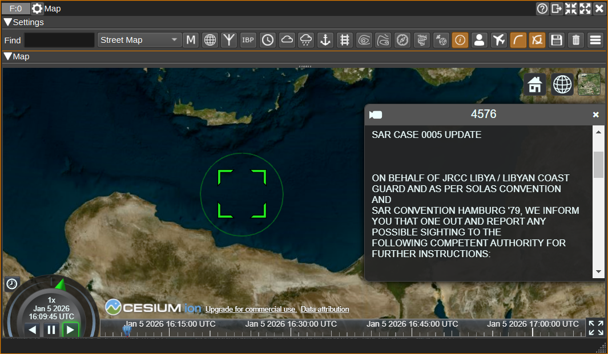
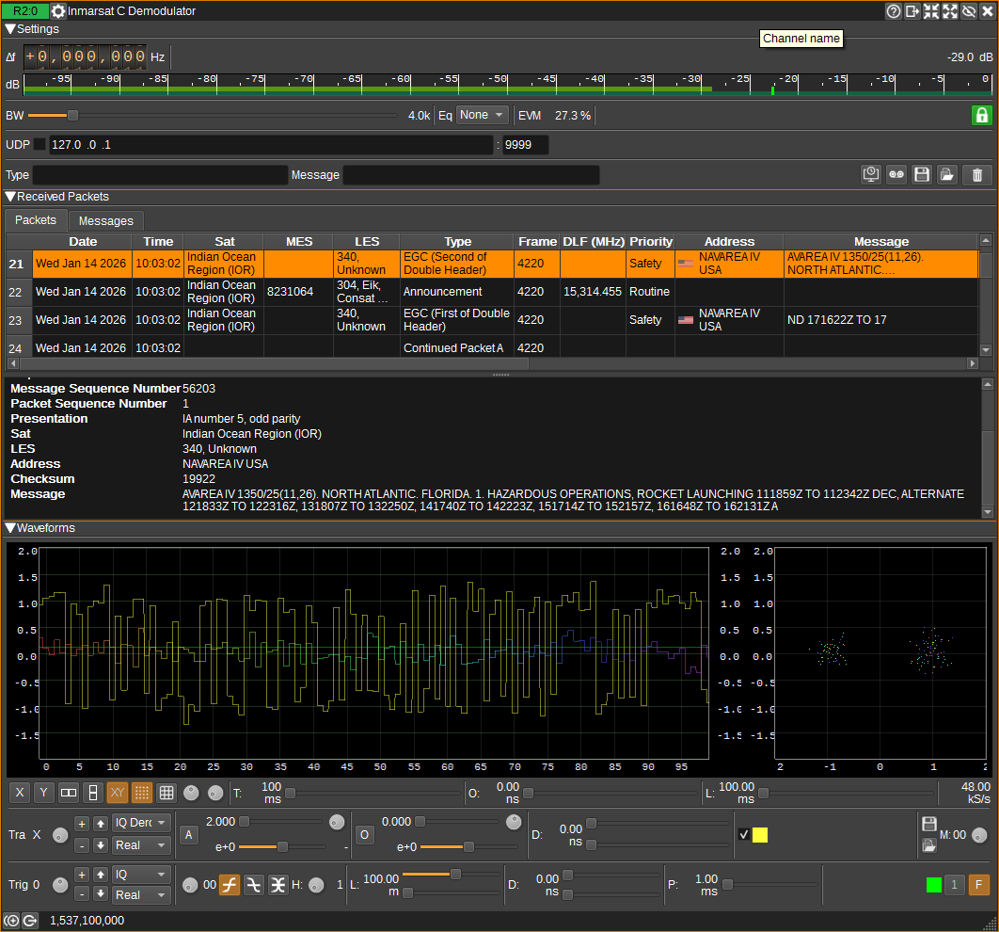

<h1>Inmarsat C Demodulator Plugin</h1>

<h2>Introduction</h2>

This plugin can be used to demodulate Inmarsat C data packets. They are transmitted by four geostationary satellites.

The packets are BPSK modulated with a symbol rate of 1,200 symbols/s and a data rate of 600 bit/s. 
The packets are decoded from within frames of 639 bytes that take 8.64 seconds to receive.

Satellites and corresponding frequencies are:

| Region              | Id    | Satellite				  | Longitude | Frequency    |
|---------------------|-------|---------------------------|-----------|--------------|
| Atlantic Ocean West | AOR-W | Inmarsat 4-F3             | 98W       | 1,537.70 MHz |
| Atlantic Ocean East | AOR-E | Inmarsat 3-F5             | 54W       | 1,541.45 MHz |
| Pacific Ocean       | POR   | Inmarsat 4-F1             | 178E      | 1,541.45 MHz |
| Indian Ocean        | IOR   | Inmarsat 4A-F4 / Alphasat | 25E       | 1,537.10 MHz |

The direction from your anntenna to the satellites can be determined in the [Satellite Tracker Feature](../../feature/satellitetracker/readme.md):

Messages containing coordinates in the address or message fields can be displayed on the [Map Feature](../../feature/map/readme.md):

More information about the encoding of EGC (Enhanced Group Call) messages can be found in:
[Safety NET Manual](https://www.navcen.uscg.gov/sites/default/files/pdf/gmdss/Safety_NET_Manual.pdf)

<h2>Interface</h2>

The top and bottom bars of the channel window are described [here](../../../sdrgui/channel/readme.md)

<h3>1: Frequency shift from center frequency of reception</h3>

Use the wheels to adjust the frequency shift in Hz from the center frequency of reception. Left click on a digit sets the cursor position at this digit. Right click on a digit sets all digits on the right to zero. This effectively floors value at the digit position. Wheels are moved with the mousewheel while pointing at the wheel or by selecting the wheel with the left mouse click and using the keyboard arrows. Pressing shift simultaneously moves digit by 5 and pressing control moves it by 2.

<h3>2: Channel power</h3>

Average total power in dB relative to a +/- 1.0 amplitude signal received in the pass band.

<h3>3: Level meter in dB</h3>

  - top bar (green): average value
  - bottom bar (blue green): instantaneous peak value
  - tip vertical bar (bright green): peak hold value

<h3>4: RF Bandwidth</h3>

This specifies the bandwidth of a LPF that is applied to the input signal to limit the RF bandwidth. This should be at least 3 kHz.

<h3>5: PLL Status</h3>

The PLL status icon shows whether the Costas Loop in the demodulator is locked. When unlocked, the padlock icon will appear unlocked. When locked, the padlock icon will appear locked and the background will be green.

Checking the icon will diplay additional PLL status and parameters, but these typically shouldn't require modification.

<h3>6: UDP</h3>

When checked, received packets are forwarded to the specified UDP address (7) and port (8).

<h3>7: UDP address</h3>

IP address of the host to forward received packets to via UDP.

<h3>8: UDP port</h3>

UDP port number to forward received packets to.

<h3>9: Filter Packets by Type</h3>

Entering a regular expression in the Type field displays only packets where the type, displayed in the Type column, matches the regular expression.

<h3>10: Filter Packets by Message</h3>

Entering a regular expression in the Message field displays only packets where the message, displayed in the Message column, matches the regular expression.

<h3>11: Use Date and Time from File</h3>

When checked, if the source device is a File Input device, the date and time used for
packet reception time is taken from the file playback time. Otherwise, the current system clock time is used.

<h3>12: Start/stop Logging Packets to .csv File</h3>

When checked, writes all received packets to a .csv file.

<h3>13: .csv Log Filename</h3>

Click to specify the name of the .csv file which received packets are logged to.

<h3>14: Read Data from .csv File</h3>

Click to specify a previously written .csv log file, which is read and used to update the table.

<h3>15: Clear Packets from table</h3>

Pressing this button clears all packets from the tables.

<h3>Received Packets</h3>

The received packets area has two tabs, which each contain a table. The Packets table displays the contents of all packets that have been received. The Messages table displays only packets that contain messages.
Left clicking a row in the table will highlight it. The highlighted packet will be decoded in the area below the tables.

Right click on the table headers to select which columns are visible. Columns can be resized and reordered by dragging.

Right clicking on a cell in the table will show a context menu, allowing the contents to be copied.
If the message contains coordinates, an option to find that location on the [Map Feature](../../feature/map/readme.md) will be shown.
