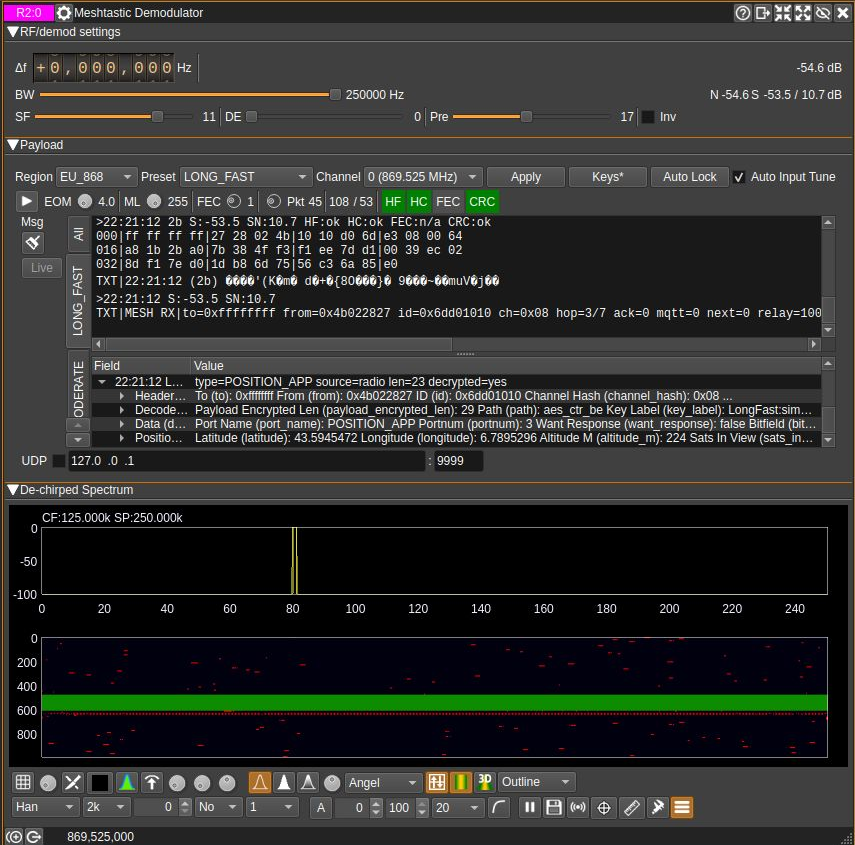
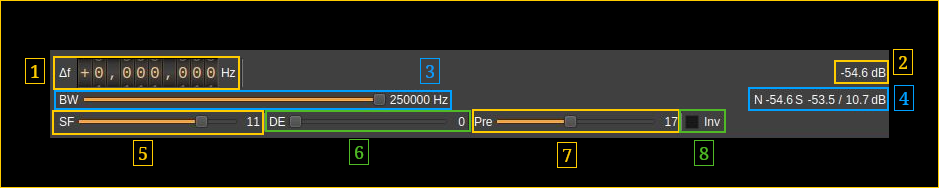
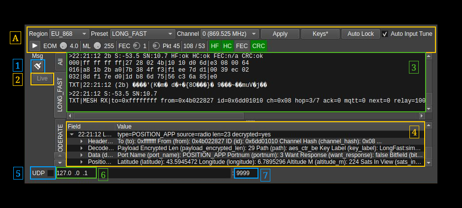
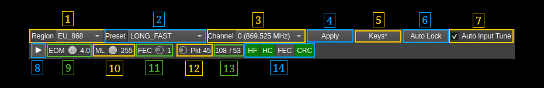
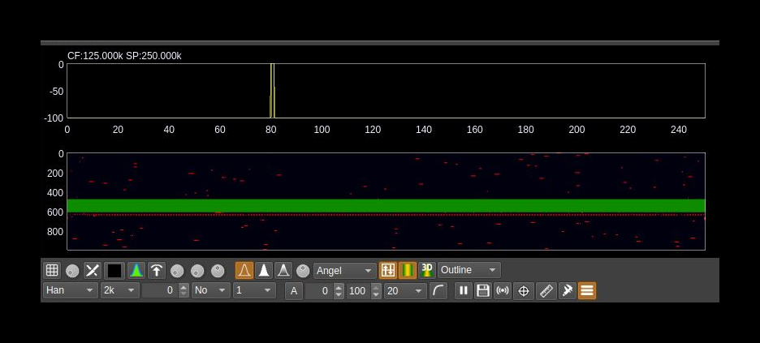

<h1>Meshtastic demodulator plugin</h1>

<h2>Introduction</h2>

This plugin can be used to demodulate and decode transmissions based on Chirp Spread Spectrum (CSS). The basic idea is to transform each symbol of a MFSK modulation to an ascending frequency ramp shifted in time. It could equally be a descending ramp but this one is reserved to detect a break in the preamble sequence (synchronization). This plugin may be used in conjunction with the Meshtastic modulator plugin on the transmission side.

LoRa is a property of Semtech and the details of the protocol are not made public. However a LoRa compatible protocol has been implemented based on the reverse engineering performed by the community. It is mainly based on the work done in https://github.com/myriadrf/LoRa-SDR. You can find more information about LoRa and chirp modulation here:

  - To get an idea of what is LoRa: [here](https://www.link-labs.com/blog/what-is-lora)
  - A detailed inspection of LoRa modulation and protocol: [here](https://static1.squarespace.com/static/54cecce7e4b054df1848b5f9/t/57489e6e07eaa0105215dc6c/1464376943218/Reversing-Lora-Knight.pdf)

This LoRa Meshtastic decoder is designed for experimentation. For production grade applications it is recommended to use dedicated hardware instead.

Modulation characteristics from LoRa have been augmented with more bandwidths and FFT bin collations (DE factor).

<h2>Meshtastic decode mode</h2>

In LoRa coding mode, decoded payload bytes are automatically tested as Meshtastic over-the-air frames (16-byte radio header + protobuf `Data` payload). When a frame is decoded successfully, an additional text line is appended in the message window with a `MESH RX|...` summary.

Key handling for decryption supports:

  - `none` / plaintext
  - Meshtastic shorthand keys (`default`, `simple0..10`)
  - Explicit `hex:` and `base64:` keys
  - Multiple keys from environment

Environment variables:

  - `SDRANGEL_MESHTASTIC_KEYS`: comma-separated key specs. You can optionally bind a channel name using `ChannelName=KeySpec`.
  - `SDRANGEL_MESHTASTIC_CHANNEL_NAME`: default channel name used when `SDRANGEL_MESHTASTIC_KEYS` is not set (default: `LongFast`).
  - `SDRANGEL_MESHTASTIC_KEY`: default key used when `SDRANGEL_MESHTASTIC_KEYS` is not set (default: `default`).

UI key manager:

  - Use the **Keys...** button next to `Region/Preset/Channel` to set a per-channel key list.
  - Entries accept the same formats as environment variables and support `channelName=keySpec`.
  - When a custom list is saved, it is persisted in the channel settings and takes precedence over environment variables for this demodulator instance.

Examples:

  - `SDRANGEL_MESHTASTIC_KEYS=\"LongFast=default,Ops=hex:00112233445566778899aabbccddeeff,none\"`
  - `SDRANGEL_MESHTASTIC_KEYS=\"base64:2PG7OiApB1nwvP+rz05pAQ==\"`

<h2>Meshtastic quick profile</h2>

The demodulator includes Meshtastic profile controls in the RF settings section:

  - **Region**: Meshtastic region code (`US`, `EU_868`, ...)
  - **Preset**: Meshtastic modem preset (`LONG_FAST`, ...)
  - **Channel**: Meshtastic channel number, shown as Meshtastic-style zero-based index and auto-populated for selected region/preset
  - **Auto Input Tune**: when enabled, tries to set source sample-rate/decimation automatically for the selected LoRa bandwidth
  - **Auto Lock**: arms first and waits for on-air activity, then scans `Inv` + frequency offset candidates. For SF11/SF12 it also probes `DE=0` and `DE=2` as compatibility candidates. It scores using decode quality plus source-side intensity (demod activity + power/noise), but only auto-applies candidates with decode evidence (header/payload CRC backed); otherwise it restores baseline settings.

When either selection changes, the demodulator auto-applies LoRa decode parameters for the selected profile:

  - bandwidth
  - spread factor
  - DE bits
  - preamble length (16 on sub-GHz presets, 12 on 2.4 GHz)
  - FEC parity bits
  - header/CRC expectations

If the device center frequency is known, the channel offset is also auto-centered to the selected region/preset default channel.
The demodulator also attempts to auto-tune the device sample rate/decimation (when supported by the device) so effective baseband rate is suitable for the selected LoRa bandwidth.

<h2>Interface</h2>

The top and bottom bars of the channel window are described [here](../../../sdrgui/channel/readme.md)

The interface is divided in 3 sections:

- RF/demod settings
- Payload
- De-chirped spectrum

<h2>RF/demod settings section</h2>

<h3>1: Frequency shift from center frequency of reception</h3>

Use the wheels to adjust the frequency shift in Hz from the center frequency of reception. Left click on a digit sets the cursor position at this digit. Right click on a digit sets all digits on the right to zero. This effectively floors value at the digit position. Wheels are moved with the mousewheel while pointing at the wheel or by selecting the wheel with the left mouse click and using the keyboard arrows. Pressing shift simultaneously moves digit by 5 and pressing control moves it by 2.

<h3>2: De-chirped channel power</h3>

This is the total power in the FFT of the de-chirped signal in dB. When no Meshtastic signal is detected this corresponds to the power received in the bandwidth (3). It will show a significant increase in presence of a Meshtastic signal that can be detected.

<h3>3: Bandwidth</h3>

This is the bandwidth of the Meshtastic signal. The signal sweeps between the lower and the upper frequency of this bandwidth. The sample rate of the Meshtastic signal in seconds is exactly one over this bandwidth in Hertz.

In the LoRa standard there are 2 base bandwidths: 500 and 333.333 kHz. A 400 kHz base has been added. Possible bandwidths are obtained by a division of these base bandwidths by a power of two from 1 to 64. Extra divisor of 128 is provided to achieve smaller bandwidths that can fit in a SSB channel. Finally special divisors from a 384 kHz base are provided to allow even more narrow bandwidths.

Thus available bandwidths are:

  - **500000** (500000 / 1) Hz
  - **400000** (400000 / 1) Hz not in LoRa standard
  - **333333** (333333 / 1) Hz
  - **250000** (500000 / 2) Hz
  - **200000** (400000 / 2) Hz not in LoRa standard
  - **166667** (333333 / 2) Hz
  - **125000** (500000 / 4) Hz
  - **100000** (400000 / 4) Hz not in LoRa standard
  - **83333** (333333 / 4) Hz
  - **62500** (500000 / 8) Hz
  - **50000** (400000 / 8) Hz not in LoRa standard
  - **41667** (333333 / 8) Hz
  - **31250** (500000 / 16) Hz
  - **25000** (400000 / 16) Hz not in LoRa standard
  - **20833** (333333 / 16) Hz
  - **15625** (500000 / 32) Hz
  - **12500** (400000 / 32) Hz not in LoRa standard
  - **10417** (333333 / 32) Hz
  - **7813** (500000 / 64) Hz
  - **6250** (400000 / 64) Hz not in LoRa standard
  - **5208** (333333 / 64) Hz
  - **3906** (500000 / 128) Hz not in LoRa standard
  - **3125** (400000 / 128) Hz not in LoRa standard
  - **2604** (333333 / 128) Hz not in LoRa standard
  - **1500** (384000 / 256) Hz not in LoRa standard
  - **750** (384000 / 512) Hz not in LoRa standard
  - **488** (500000 / 1024) Hz not in LoRa standard
  - **375** (384000 / 1024) Hz not in LoRa standard

The Meshtastic signal is oversampled by two therefore it needs a baseband of at least twice the bandwidth. This drives the maximum value on the slider automatically.

<h3>4:Noise and signal power</h3>

The first number prefixed by `N` is the maximum power received in one FFT bin (the argmax bin) in dB when no signal is detected. It is averaged over 10 values.

The second number prefixed by `S` is the maximum power received in one FFT bin (the argmax bin) in dB when a signal is detected. It is averaged over 10 values.

The last number after the slash is the de-chirped signal over noise ratio.
The noise level reference is the noise maximum power just before the detected signal starts and the signal level the signal maximum power just before the detected signal stops. Decode errors are very likely to happen when this value falls below 4 dB.

<h3>5: Spread Factor</h3>

This is the Spread Factor parameter of the Meshtastic signal. This is the log2 of the FFT size used over the bandwidth (3). The number of symbols is 2SF-DE where SF is the spread factor and DE the  Distance Enhancement factor (8)

<h3>6: Distance Enhancement factor</h3>

The LoRa standard specifies 0 (no DE) or 2 (DE active). The Meshtastic DE range is extended to all values between 0 and 4 bits.

The LoRa standard also specifies that the LowDataRateOptimizatio flag (thus DE=2 vs DE=0 here) should be set when the symbol time defined as BW / 2^SF exceeds 16 ms (See section 4.1.1.6 of the SX127x datasheet). In practice this happens for SF=11 and SF=12 and large enough bandwidths (you can do the maths).

Here this value is the log2 of the number of FFT bins used for one symbol. Extending the number of FFT bins per symbol decreases the probability to detect the wrong symbol as an adjacent bin. It can also overcome frequency or sampling time drift on long messages particularly for small bandwidths.

<h3>7: Number of expected preamble chirps</h3>

This is the number of chirps expected in the preamble and has to be agreed between the transmitter and receiver. For Meshtastic this is conventionally set to 17.

<h3>15: Invert chirp ramps (disabled)</h3>

The LoRa standard is up-chirps for the preamble, down-chirps for the SFD and up-chirps for the payload.

When you check this option it inverts the direction of the chirps thus becoming down-chirps for the preamble, up-chirps for the SFD and down-chirps for the payload.

<h2>Payload section</h2>

<h3>A: Control section</h3>

<h4>A.1: Meshtastic region code (frequencies)</h4>

- **US**: US 902 MHz band
- **EU_433**: European 433 MHz band
- **EU_868**: European 868 MHz band
- **ANZ**: Australia and New Zealand 915-928 MHz band
- **JP**: Japan 920-923 MHz band
- **CN**: China 470-510 MHz band
- **KR**: South Korea 920-922 MHz band
- **TW**: Taiwan 920-925 MHz band
- **IN**: India 865-866 MHz band
- **TH**: Thailand 920-925 MHz band
- **BR_902**: Brazil 902-907 MHz band
- **LORA_24**: LoRa 902.125 MHz

<h4>A.2: Meshtastic modem preset</h4>

- **LONG_FAST**: BW=250kHz SF=11, DE=0, FEC=4/5
- **LONG_SLOW**: BW=125kHz, SF=12, DE=2, FEC=4/8
- **LONG_MODERATE**: BW=125kHz, SF=11, DE=0, FEC=4/5
- **LONG_TURBO**: BW=500kHz, SF=11, DE=0, FEC=4/8 (a.k.a Long Range / Turbo)
- **MEDIUM_FAST**: BW=250kHz, SF=9, DE=0, FEC=4/5
- **MEDIUM_SLOW**: BW=250kHz, SF=10, DE=0, FEC=4/5
- **SHORT_FAST**: BW=250kHz, SF=7, DE=0, FEC=4/5
- **SHORT_SLOW**: BW=250kHz, SF=8, DE=0, FEC=4/5
- **SHORT_TURBO**: BW=500kHz, SF=7, DE=0, FEC=4/5 (a.k.a Short Range / Turbo)

<h4>A.3: Channel selection</h4>

Select channel within regional band. This is the Meshtastic channel number, shown as Meshtastic-style zero-based index and auto-populated for selected region/preset

<h4>A.4: Apply settings</h4>

Apply or reapply the preceding settings. Normally when either selection changes, the demodulator auto-applies LoRa decode parameters for the selected profile:

- bandwidth
- spread factor
- DE bits
- preamble length (17 on sub-GHz presets, 12 on 2.4 GHz)
- FEC parity bits
- header/CRC expectations

If the device center frequency is known, the channel offset is also auto-centered to the selected region/preset default channel. The demodulator also attempts to auto-tune the device sample rate/decimation (when supported by the device) so effective baseband rate is suitable for the selected LoRa bandwidth.

<h4>A.5: Encryption keys</h4>

Opens a window to declare encryption keys. Key handling for decryption supports:

- none / plaintext
- Meshtastic shorthand keys (`default`, `simple0`..`simple10`)
- Explicit `hex:`  and `base64:` keys (has to be 16 or 32 bits)
- Multiple keys from environment

In the opened window a "Validate" button checks the above syntax. For classical LONG_FAST channels use just hex 1 specified as `default` or `simple1` (`hex:1` or `base64:AQ==` do not apply since they expect 16 or 32 bits)

<h4>A.6: Auto lock</h4>

Arms first and waits for on-air activity, then scans Inv + frequency offset candidates. For SF11/SF12 it also probes DE=0 and DE=2 as compatibility candidates. It scores using decode quality plus source-side intensity (demod activity + power/noise), but only auto-applies candidates with decode evidence (header/payload CRC backed); otherwise it restores baseline settings.

<h4>A.7: Auto input tune</h4>

when enabled, tries to set source sample-rate/decimation automatically for the selected LoRa bandwidth

<h4>A.8: Start/Stop decoder</h4>

You can suspend and resume decoding activity using this button. This is useful if you want to freeze the payload content display.

<h4>A.9: End Of Message squelch</h4>

This is used to determine the end of message automatically. It can be de-activated by turning the button completely to the right (as shown on the picture). In this case it relies on the message length set with (A.10).

During payload detection the maximum power value in the FFT (at argmax) Pmax is stored and compared to the current argmax power value Pi if SEOM is this squelch value the end of message is detected if SEOM &times; Si &lt; Smax

<h4>A.10: Expected message length in symbols</h4>

This is the expected number of symbols in a message. When a header is present in the payload it should match the size given in the header.

<h4>A.11: Number of FEC parity bits</h4>

This is the number of parity bits in the Hamming code used in the FEC and is set in the header therefore this control is disabled. The standard values are 1 to 4 for H(4,5) to H(4,8) encoding.

<h4>A.12: Packet length</h4>

This is the expected packet length in bytes without header and CRC. This control is disabled because the value used is the one found in the header.

<h4>A.13: Number of symbols and codewords</h4>

This is the number of symbols (left of slash) and codewords (right of slash) used for the payload including header and CRC.

<h4>A.14: Indicators</h4>

- Header FEC indicator. The color of the indicator gives the status of header parity checks:
  - **Grey**: undefined
  - **Red**: unrecoverable error
  - **Blue**: recovered error
  - **Green**: no errors

- Header CRC indicator. The header has a one byte CRC. The color of this indicator gives the CRC status:

  - **Green**: CRC OK
  - **Red**: CRC error

- Payload FEC indicator. The color of the indicator gives the status of payload parity checks:

  - **Grey**: undefined
  - **Red**: unrecoverable error. H(4,7) cannot distinguish between recoverable and unrecoverable error. Therefore this is never displayed for H(4,7). For FT it means that LDPC decoding failed.
  - **Blue**: recovered error
  - **Green**: no errors

- Payload CRC indicator. The payload can have a two byte CRC. The color of this indicator gives the CRC status:

  - **Grey**: No CRC
  - **Green**: CRC OK
  - **Red**: CRC error

<h3>1: Clear message window</h3>

Use this push button to clear the message window (3) and (4)

<h3>2: Live button</h3>

Returns to live mode from message replay in spectrum mode

<h3>3: Raw message window</h3>

This is where the message and status data are displayed. The display is text/binary mixed. The text vs binary consideration concerns the content of the message not the way it is transmitted on air that is by itself binary.

Header section:

  - Timestamp in HH:NN:SS format
  - Sync word. This is the sync word (byte) displayed in hex.
  - De-chirped signal level. This is the de-chirped signal level in dB.
  - De-chirped signal to noise ratio. This is the de-chirped signal to noise ratio in dB.
  - Header FEC status:
    - **n/a**: unknown or not applicable
    - **err**: unrecoverable error
    - **fix**: corrected error
    - **ok**: OK
  - Header CRC status:
    - **ok**: CRC OK
    - **err**: CRC error
    - **n/a**: not applicable
  - Payload FEC status. If the end of message is reached before expectation then `ERR: too early` is displayed instead and no payload CRC status (next) is displayed.
    - **n/a**: unknown or not applicable
    - **err**: unrecoverable error
    - **fix**: corrected error
    - **ok**: OK
  - Payload CRC status:
    - **ok**: CRC OK
    - **err**: CRC error
    - **n/a**: not applicable

Binary section:

  - Displacement at start of line. 16 bytes in 4 groups of 4 bytes are displayed per line starting with the displacement in decimal.
  - Bytes group. This is a group of 4 bytes displayed as hexadecimal values. The payload is displayed with its possible CRC and without the header.
  - Message as text with "TXT" as prefix indicating it is the translation of the message to character representation

Meshtastic section:

If the message is a valid Meshtastic message a summary of content is displayed following the `TXT|MESH RX` header showing the main Meshtastic data items

<h3>4: Meshtastic structured message</h3>

This is a tree view with expandable sections of the Mehstastic message.

In case of a simple LoRa message without Meshtastic formatting it shows `LORA_FRAME` for the type and generic LoRa information with the message content as a hexadecimal string

A Meshtastic message will show the message type (or port), then expandable sections:

  - header section
  - decode section with the encoding details
  - data section with generic data
  - section specific to the type of message

For now the following message types (ports) are decoded in this last section:

  - position
  - node info
  - traceroute
  - telemetry
  - plain text

<h3>5: Send message via UDP</h3>

Select to send the decoded message via UDP.

<h3>6,7: UDP address and port</h3>

This is the UDP address and port to where the decoded message is sent when (12) is selected.

<h2>De-chirped spectrum section</h2>

This is the spectrum of the de-chirped signal when a Meshtastic signal can be decoded. Details on the spectrum view and controls can be found [here](../../../sdrgui/gui/spectrum.md)

The frequency span corresponds to the bandwidth of the Meshtastic signal. Default FFT size is 2SF where SF is the spread factor.

Sequences of successful Meshtastic signal demodulation are separated by blank lines (generated with a string of high value bins).

Controls are the usual controls of spectrum displays with the following restrictions:

  - The window type is always rectangular
  - The FFT size can be changed however it is set to 2SF where SF is the spread factor and thus displays correctly

<h2>Common LoRa settings</h2>

CR is the code rate and translates to FEC according to the following table

| CR  | FEC |
| --- | --- |
| 4/5 | 1   |
| 4/6 | 2   |
| 4/7 | 3   |
| 4/8 | 4   |

When DE is on set DE to 2 else 0

<h3>Generic</h3>

| Use Case              | SF        | CR      | BW (kHz) | DE Enabled? | Notes                                                       |
| --------------------- | --------- | ------- | -------- | ----------- | ----------------------------------------------------------- |
| High rate/short range | SF7       | 4/5     | 500      | Off         | Fastest, urban/close devices             |
| Balanced/general IoT  | SF7–SF9   | 4/5–4/6 | 125–250  | Off         | TTN default, good for gateways           |
| Long range/rural      | SF10–SF12 | 4/6–4/8 | 125      | On          | Max sensitivity (-137 dBm), slow airtime |
| Extreme range         | SF12      | 4/8     | 125      | On          | Best for weak signals, long packets     |

<h3>Meshtastic</h3>

<h4>Quick facts</h4>

  - Uses 0x2B sync byte
  - In Europe the default channel is centered on 869.525 MHz

<h4>Presets table</h4>

| Preset              | SF | CR   | BW (kHz) | DE? | Use Case                                             |
| ------------------- | -- | ---- | -------- | --- | ---------------------------------------------------- |
| LONG_FAST (default) | 11 | 4/8  | 250      | On  | Long range, moderate speed                |
| MEDIUM_SLOW         | 10 | 4/7  | 250      | On  | Balanced range/reliability​                 |
| SHORT_FAST          | 9  | 4/7  | 250      | Off | Urban/short hops, faster​                   |
| SHORT_TURBO         | 7  | 4/5  | 500      | Off | Max speed, shortest range (region-limited)​ |
| LONG_SLOW           | 12 | 4/8  | 125      | On  | Extreme range, slowest meshtastic​                   |
