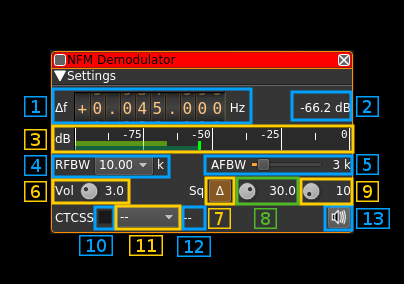

<h1>NFM demodulator plugin</h1>

<h2>Introduction</h2>

This plugin can be used to listen to a narrowband FM modulated signal. "Narrowband" means that the bandwidth can vary from 5 to 40 kHz.

<h2>Interface</h2>

<h3>1: Frequency shift from center frequency of reception value</h3>

Use the wheels to adjust the frequency shift in Hz from the center frequency of reception. Right click on a digit sets all digits on the right to zero. This effectively floors value at the digit position. Wheels are moved with the mousewheel while pointing at the wheel or by selecting the wheel with the left mouse click and using the keyboard arroews. Pressing shift simultanoeusly moves digit by 5 and pressing control moves it by 2. Left click on a digit sets the cursor position at this digit. 

<h3>2: Channel power</h3>

Average total power in dB relative to a +/- 1.0 amplitude signal received in the pass band.

<h3>3: Level meter in dB</h3>

  - top bar (green): average value
  - bottom bar (blue green): instantaneous peak value
  - tip vertical bar (bright green): peak hold value

<h3>4: RF bandwidth</h3>

This is the bandwidth in kHz of the channel signal before demodulation. It can be set in steps as 5, 6.25, 8.33, 10, 12.5, 15, 20, 25 and 40 kHz.

<h3>5: AF bandwidth</h3>

This is the bandwidth of the audio signal in kHz (i.e. after demodulation). It can be set in continuous kHz steps from 1 to 20 kHz.

<h3>6: Volume</h3>

This is the volume of the audio signal from 0.0 (mute) to 10.0 (maximum). It can be varied continuously in 0.1 steps using the dial button.

<h3>7: Delta/Level squelch</h3>

Use this button to toggle between AF (on) and RF power (off) based squelch.

<h3>8: Squelch threshold</h3>

This is the squelch threshold in dB. The average total power received in the signal bandwidth before demodulation is compared to this value and the squelch input is open above this value. It can be varied continuously in 0.1 dB steps from 0.0 to -100.0 dB using the dial button.

<h3>9: Squelch gate</h3>

This is the squelch gate in milliseconds. The squelch input must be open for this amount of time before the squelch actually opens. This prevents the opening of the squelch by parasitic transients. It can be varied continuously in 10ms steps from 10 to 500ms using the dial button.

<h3>10: CTCSS on/off</h3>

Use the checkbox to toggle CTCSS activation. When activated it will look for a tone squelch in the demodulated signal and display its frequency (see 10). 

<h3>11: CTCSS tone</h3>

This is the tone squelch in Hz. It can be selected using the toolbox among the usual CTCSS values and `--` for none. When a value is given and the CTCSS is activated the squelch will open only for signals with this tone squelch.

<h3>12: CTCSS tone value</h3>

This is the value of the tone squelch received when the CTCSS is activated. It displays `--` if the CTCSS system is de-activated.

<h3>13: Audio mute</h3>

Use this button to toggle audio mute for this channel. The button will light up in green if the squelch is open. This helps identifying which channels are active in a multi-channel configuration.

<h3>14: UDP output</h3>

Copies audio output to UDP. Audio is set at fixed level and is muted by the mute button (13) and squelch is also applied. Output is mono S16LE samples. Note that fixed volume apart this is the exact same audio that is sent to the audio device in particular it is highpass filtered at 300 Hz and thus is not suitable for digital communications. For this purpose you have to use the UDP source plugin instead.

UDP address and send port are specified in the basic channel settings. See: [here](https://github.com/f4exb/sdrangel/blob/master/sdrgui/readme.md#6-channels)