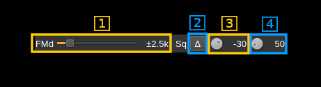
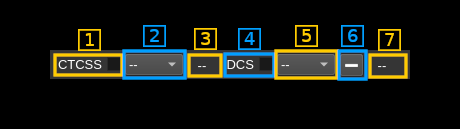

<h1>NFM demodulator plugin</h1>

<h2>Introduction</h2>

This plugin can be used to listen to a narrowband FM modulated signal. "Narrowband" means that the bandwidth can vary from 5 to 40 kHz.

<h2>Interface</h2>

The top and bottom bars of the channel window are described [here](../../../sdrgui/channel/readme.md)

<h3>1: Frequency shift from center frequency of reception value</h3>

Use the wheels to adjust the frequency shift in Hz from the center frequency of reception. Right click on a digit sets all digits on the right to zero. This effectively floors value at the digit position. Wheels are moved with the mousewheel while pointing at the wheel or by selecting the wheel with the left mouse click and using the keyboard arrows. Pressing shift simultaneously moves digit by 5 and pressing control moves it by 2. Left click on a digit sets the cursor position at this digit.

<h3>2: Channel power</h3>

Average total power in dB relative to a +/- 1.0 amplitude signal received in the pass band.

<h3>3: Level meter in dB</h3>

  - top bar (green): average value
  - bottom bar (blue green): instantaneous peak value
  - tip vertical bar (bright green): peak hold value

<h3>4: Volume</h3>

This is the volume of the audio signal from 0% (mute) to 200% (maximum) of volume at nominal frequency deviation. It can be varied continuously 1% steps using the dial button.

<h3>5: Audio high pass filter</h3>

Toggle a 300 Hz cutoff high pass filter on audio to cut-off CTCSS frequencies. It is on by default for normal audio channels usage. You can switch it off to pipe the audio in programs requiring DC like DSD+ or Multimon.

<h3>6: Audio mute and audio output select</h3>

Left click on this button to toggle audio mute for this channel. The button will light up in green if the squelch is open. This helps identifying which channels are active in a multi-channel configuration.

If you right click on it, it will open a dialog to select the audio output device. See [audio management documentation](../../../sdrgui/audio.md) for details.

<h3>A: RF parameters</h3>

<h3>A.1: Apply channel spacing preset</h3>

Use this push button to apply the channel spacing preset selected next (A.2) It will apply RF bandwidth, AF bandwidth and FM deviation settings according to the channel spacing scheme.

<h3>A.2: Select channel spacing preset</h3>

Select the RF bandwidth, AF bandwidth and FM deviation settings according to the channel spacing scheme specified as follows:

<table>
    <tr>
        <th>CS (kHz)</th>
        <th>RFBW (kHz)</th>
        <th>AFBW (kHz)</th>
        <th>FM &Delta; (&plusmn;kHz)</th>
        <th>&beta;</th>
    </tr>
    <tr>
        <td>5</td>
        <td>4.8</td>
        <td>1.7</td>
        <td>0.7</td>
        <td>0.43</td>
    </tr>
    <tr>
        <td>6.25</td>
        <td>6</td>
        <td>2.1</td>
        <td>0.9</td>
        <td>0.43</td>
    </tr>
    <tr>
        <td>7.5</td>
        <td>7.2</td>
        <td>2.5</td>
        <td>1.1</td>
        <td>0.43</td>
    </tr>
    <tr>
        <td>8.33</td>
        <td>8</td>
        <td>2.8</td>
        <td>1.2</td>
        <td>0.43</td>
    </tr>
    <tr>
        <td>12.5</td>
        <td>11</td>
        <td>3</td>
        <td>2.5</td>
        <td>0.83</td>
    </tr>
    <tr>
        <td>25</td>
        <td>16</td>
        <td>3</td>
        <td>5</td>
        <td>1.67</td>
    </tr>
    <tr>
        <td>40</td>
        <td>36</td>
        <td>9</td>
        <td>9</td>
        <td>1</td>
    </tr>
</table>

  - All these settings apply the Carson's rule: RFBW = 2 &times; (FM&Delta; + AFBW)
  - The 12.5 and 25 kHz channel spacings correspond to standard 11F3 and 16F3 settings respectively and are widely accepted and mostly used
  - For spacings lower than 12.5 kHz values are empirically built using Carson's rule from &beta;=0.43 which is the only standard provided
  - For spacing higher than 25 kHz values are derived from an old 36F9 standard.

When you are lost with the RF, AF bandwidths and FM deviation settings you can always come back to these standards and generally get good results.

When changing the RF bandwidth the channel spacing selection in the combo box is adjusted to fit within this bandwidth.

&#9758; The demodulation is done at the channel sample rate which is guaranteed not to be lower than the requested audio sample rate but can possibly be equal to it. This means that for correct operation in any case you must ensure that the sample rate of the audio device is not lower than the Nyquist rate required to process this channel bandwidth.

&#9758; The channel sample rate is always the baseband signal rate divided by an integer power of two so depending on the baseband sample rate obtained from the sampling device you could also guarantee a minimal channel bandwidth. For example with a 125 kS/s baseband sample rate and a 8 kS/s audio sample rate the channel sample rate cannot be lower than 125/8 = 15.625 kS/s (125/16 = 7.8125 kS/s is too small) which is still OK for 5 or 6.25 kHz channel bandwidths.

<h3>A.3: RF bandwidth</h3>

This is the bandwidth in kHz of the filter applied before the discriminator and therefore called "RF" bandwidth but is applied in the device pass band in fact.

<h3>A.4: AF bandwidth</h3>

This is the bandwidth of the audio signal in kHz (i.e. after demodulation).

<h3>B: Modulation parameters and squelch</h3>

<h3>B.1: Expected FM peak deviation</h3>

This is the peak FM deviation in &plusmn;kHz expected in the received signal and corresponds to 100% audio volume

<h3>B.2: Delta/Level squelch</h3>

Use this button to toggle between AF (on) and RF power (off) based squelch.

<h3>B.3: Squelch threshold</h3>

<h4>Power threshold mode</h4>

Case when the delta/Level squelch control (8) is off (power). This is the squelch threshold in dB. The average total power received in the signal bandwidth before demodulation is compared to this value and the squelch input is open above this value. It can be varied continuously in 1 dB steps from 0 to -100 dB using the dial button.

<h4>Audio frequency delta mode</h4>

Case when the delta/Level squelch control (8) is on (delta). In this mode the squelch compares the power of the demodulated audio signal in a low frequency band and a high frequency band. In the absence of signal the discriminator response is nearly flat and the power in the two bands is more or less balanced. In the presence of a signal the lower band will receive more power than the higher band. The squelch does the ratio of both powers and the squelch is opened if this ratio is lower than the threshold given in percent.

A ratio of 1 (100%) will always open the squelch and a ratio of 0 will always close it. The value can be varied to detect more distorted and thus weak signals towards the higher values. The button rotation runs from higher to lower as you turn it clockwise thus giving the same feel as in power mode. The best ratio for a standard NFM transmission is ~40%.

The distinct advantage of this type of squelch is that it guarantees the quality level of the audio signal (optimized for voice) thus remaining closed for too noisy signals received on marginal conditions or bursts of noise independently of the signal power.

&#9758; The signal used is the one before AF filtering and the bands are centered around 1000 Hz for the lower band and 6000 Hz for the higher band. This means that it will not work if your audio device runs at 8000 or 11025 Hz. You will need at least a 16000 Hz sample rate. Choose power squelch for lower audio rates.

&#9758; The chosen bands around 1000 and 6000 Hz are optimized for standard voice signals in the 300-3000 Hz range.

<h3>B.4: Squelch gate</h3>

This is the squelch gate in milliseconds. The squelch input must be open for this amount of time before the squelch actually opens. This prevents the opening of the squelch by parasitic transients. It can be varied continuously in 10ms steps from 10 to 500ms using the dial button.

<h3>C: CTCSS/DCS</h3>

<h3>C.1: CTCSS on/off</h3>

Use the checkbox to toggle CTCSS activation. When activated it will look for a tone squelch in the demodulated signal and display its frequency (see 10).

<h3>C.2: CTCSS tone</h3>

This is the tone squelch in Hz. It can be selected using the toolbox among [these CTCSS values](https://en.wikipedia.org/wiki/Continuous_Tone-Coded_Squelch_System) and `--` for none. When a value is given and the CTCSS is activated the squelch will open only for signals with this tone squelch.

<h3>C.3: CTCSS tone value</h3>

This is the value of the tone squelch received when the CTCSS is activated. It displays `--` if the CTCSS system is de-activated.

<h3>C.4: DCS on/off</h3>

Use the checkbox to toggle DCS activation. When activated it will look for a squelch code in the demodulated signal and display its octal value in C.7.

<h3>C.5: DCS code</h3>

This is the DCS code to be selected among the normalized values. The value is in octal format suffixed by "P" for positive or normal codes and "N" for negative or inverted codes. The values are those listed [here](http://onfreq.com/syntorx/dcs.html). The special value `--` deactivates the squelch but the DCS code is still searched.

<h3>C.6: Show positive or negative code</h3>

The DCS code is searched with a positive modulation (i.e. positive shift for bit "1" else negative). When `+` is selected the code is displayed directly in C.7 and when `-` is selected the corresponding negative code is displayed in C.7

<h3>C.7: DCS code detected</h3>

This is the value of the code detected when the DCS is activated. It displays `--` if the DCS system is de-activated or no code can be detected.
