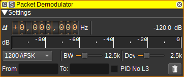

<h1>Packet radio demodulator plugin</h1>

<h2>Introduction</h2>

This plugin can be used to demodulate packet radio (APRS/AX.25) data packets. Received packets can be sent to the APRS Feature for decoding and display.

<h2>Interface</h2>

The top and bottom bars of the channel window are described [here](../../../sdrgui/channel/readme.md)

<h3>1: Frequency shift from center frequency of reception</h3>

Use the wheels to adjust the frequency shift in Hz from the center frequency of reception. Left click on a digit sets the cursor position at this digit. Right click on a digit sets all digits on the right to zero. This effectively floors value at the digit position. Wheels are moved with the mousewheel while pointing at the wheel or by selecting the wheel with the left mouse click and using the keyboard arrows. Pressing shift simultaneously moves digit by 5 and pressing control moves it by 2.

<h3>2: Channel power</h3>

Average total power in dB relative to a +/- 1.0 amplitude signal received in the pass band.

<h3>3: Level meter in dB</h3>

  - top bar (green): average value
  - bottom bar (blue green): instantaneous peak value
  - tip vertical bar (bright green): peak hold value

<h3>4: Modulation</h3>

This specifies the baud rate and modulation that is used for the packet transmission. Currently 1200 baud AFSK is supported.

<h3>5: RF Bandwidth</h3>

This specifies the bandwidth of a LPF that is applied to the input signal to limit the RF bandwidth.

<h3>6: Frequency deviation</h3>

Adjusts the expected frequency deviation in 0.1 kHz steps from 1 to 6 kHz. Typical values are 2.5 kHz and 5 kHz.

<h3>7: Filter Packets From</h3>

Entering a regular expression in the From field displays only packets where the source address, displayed in the From column, matches the regular expression.

<h3>8: Filter Packets To</h3>

Entering a regular expression in the To field displays only packets where the destination address, displayed in the To column, matches the regular expression.

<h3>9: Filter PID No L3</h3>

Checking this option displays only packets where the PID (Protocol ID) field is 0xf0 (no L3). This value is used by APRS and BBS data packets, and helps to filter out control packets.

<h3>10: Clear Packets from table</h3>

Pressing this button clears all packets from the table.

<h3>11: UDP</h3>

When checked, received packets are forwarded to the specified UDP address (12) and port (13).

<h3>12: UDP address</h3>

IP address of the host to forward received packets to via UDP.

<h3>11: UDP port</h3>

UDP port number to forward received packets to.

<h3>12: Start/stop Logging Packets to .csv File</h3>

When checked, writes all received packets to a .csv file.

<h3>13: .csv Log Filename</h3>

Click to specify the name of the .csv file which received packets are logged to.

<h3>14: Read Data from .csv File</h3>

Click to specify a previously written .csv log file, which is read and used to update the table.

<h3>Received Packets Table</h3>

The received packets table displays the contents of the packets that have been received. Only packets with valid CRCs are displayed.

* From - The source address / callsign of the sender of the packet.
* To - The destination address.
* Via - List of addresses of repeaters the packet has passed through or directed via.
* Type - The AX.25 frame type.
* PID - Protocol Identifier.
* Data (ASCII) - The AX.25 information field displayed as ASCII.
* Data (Hex) - The AX.25 information field displayed as hexadecimal.
