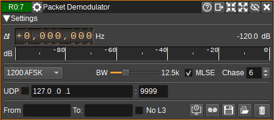

<h1>Packet Radio Demodulator Plugin</h1>

<h2>Introduction</h2>

This plugin can be used to demodulate packet radio (APRS/AX.25) data packets. Received packets can be sent to the [APRS Feature](../../feature/aprs/readme.md) for decoding and display.

<h2>Interface</h2>

The top and bottom bars of the channel window are described [here](../../../sdrgui/channel/readme.md)

<h3>1: Frequency shift from center frequency of reception</h3>

Use the wheels to adjust the frequency shift in Hz from the center frequency of reception. Left click on a digit sets the cursor position at this digit. Right click on a digit sets all digits on the right to zero. This effectively floors value at the digit position. Wheels are moved with the mousewheel while pointing at the wheel or by selecting the wheel with the left mouse click and using the keyboard arrows. Pressing shift simultaneously moves digit by 5 and pressing control moves it by 2.

<h3>2: Channel power</h3>

Average total power in dB relative to a +/- 1.0 amplitude signal received in the pass band.

<h3>3: Level meter in dB</h3>

  - top bar (green): average value
  - bottom bar (blue green): instantaneous peak value
  - tip vertical bar (bright green): peak hold value

<h3>4: Modulation</h3>

This specifies the baud rate and modulation that is used for the packet transmission. Currently 1200 baud AFSK is supported.

<h3>5: RF Bandwidth</h3>

This specifies the bandwidth of a LPF that is applied to the input signal to limit the RF bandwidth.

<h3>6: MLSE - Maximum likelihood sequence estimation</h3>

Detects on the complex baseband instead of running the tone correlators on the output of an FM discriminator. Worth about 9 dB of sensitivity. Enabled by default; unchecking it reverts to the standard demodulator.

A discriminator takes the argument of every sample, and below roughly 8 dB carrier to noise in the channel it starts producing phase slips, at which point its output degrades far faster than its input does - the FM threshold effect. Nothing downstream can recover what has already been destroyed, which is why the standard demodulator falls off a cliff rather than degrading gracefully.

Bell 202 is phase continuous, and the audio phase advances by exactly one cycle per mark bit and 11/6 per space, so at bit boundaries it takes only six values. That makes the signal a six state machine with one exact waveform per state transition, and a sequence detector can correlate against those waveforms directly. Nothing takes the argument of a sample, so there is no threshold to fall off.

Measured against generated packets in AWGN, out of 20 transmitted:

| Carrier to noise | MLSE | Standard demodulator |
|-----------------:|-----:|---------------------:|
| 8 dB             | 19   | 17 |
| 6 dB             | 19   | 1  |
| 4 dB             | 19   | 0  |
| 0 dB             | 16   | 0  |
| -2 dB            | 8    | 0  |

Real signals behave the same way. Taking a recording whose strong packets both demodulators decode and burying it in measured noise, this still recovers packets at 1.5 to 3 dB carrier to noise, where the standard demodulator recovers none at any point on that scale.

Symbol timing and carrier offset are searched rather than tracked, because a timing loop driven by a discriminator is exactly what stops working at the sensitivity this is here to reach. 16 timing hypotheses and 5 carrier hypotheses spanning +/-600 Hz run in parallel, and only while a signal is actually present. Because many of those detectors decode the same transmission, frames are deduplicated over a one second window, and because a 16-bit CRC is not enough on its own at that rate, frames are additionally required to have valid callsigns.

<h4>Adapting to the transmitter</h4>

Real transmitters are not on their nominal settings, and a sequence detector correlating against exact waveforms is sensitive to that in a way a discriminator is not. Each burst is therefore measured - symbol rate, carrier offset, deviation, tone frequencies and the shape of the tone transitions - and the detectors are retuned onto what was measured.

A burst the live detectors fail on is replayed from a buffer using the tuning measured from that same burst, which is not known until the burst has ended. The replay also tries both branch metrics and, where the symbol rate could not be measured confidently, a spread of rates.

Bell 202 tones (mark 1200, space 2200) and V.23 tones (mark 1300, space 2100) are both handled without configuration. A misconfigured or mis-fitted modem transmitting AX.25 on V.23 tones is perfectly readable but decodes as nothing at all under the Bell 202 assumption, and the 100 Hz difference is invisible on a spectrum display. Which pair a station is using is learned from frames that pass their CRC, so the detectors move onto the right pair after the first couple of packets and stay there.

Fading remains hard for it, as it is for any coherent detector. The branch metric is chosen from how much the signal faded during the burst, and the replay tries both regardless, so a fading burst is not lost simply because the choice was made wrongly in advance.

<h3>7: Chase - Chase decoding depth</h3>

When a frame reaches a closing flag but fails its CRC, it is usually only a few marginal symbol decisions away from being correct. The demodulator keeps how confident each decision was, and on a CRC failure retries the frame with the least confident symbols inverted, accepting the result if the CRC then passes.

Because AX.25 has no forward error correction and a 16-bit CRC lets roughly 1 in 65536 wrong frames through, recovered frames are additionally required to have valid callsigns - 1 to 6 uppercase alphanumeric characters - which random data essentially never satisfies. This check is applied only to frames recovered this way, never to frames that decode normally.

Higher values recover more packets and cost more CPU, both roughly in proportion to 2^n. The default of 6 recovers essentially everything that is recoverable; 0 disables the feature.

<h3>8: Filter Packets From</h3>

Entering a regular expression in the From field displays only packets where the source address, displayed in the From column, matches the regular expression.

<h3>9: Filter Packets To</h3>

Entering a regular expression in the To field displays only packets where the destination address, displayed in the To column, matches the regular expression.

<h3>10: Filter PID No L3</h3>

Checking this option displays only packets where the PID (Protocol ID) field is 0xf0 (no L3). This value is used by APRS and BBS data packets, and helps to filter out control packets.

<h3>11: Clear Packets from table</h3>

Pressing this button clears all packets from the table.

<h3>12: UDP</h3>

When checked, received packets are forwarded to the specified UDP address (13) and port (14).

<h3>13: UDP address</h3>

IP address of the host to forward received packets to via UDP.

<h3>14: UDP port</h3>

UDP port number to forward received packets to.

<h3>15: Use Date and Time from File</h3>

When checked, if the source device is a File Input device, the date and time used for
packet reception time is taken from the file playback time. Otherwise, the current system clock time is used.

<h3>16: Start/stop Logging Packets to .csv File</h3>

When checked, writes all received packets to a .csv file.

<h3>17: .csv Log Filename</h3>

Click to specify the name of the .csv file which received packets are logged to.

<h3>18: Read Data from .csv File</h3>

Click to specify a previously written .csv log file, which is read and used to update the table.

<h3>Received Packets Table</h3>

The received packets table displays the contents of the packets that have been received. Only packets with valid CRCs are displayed.

* Date - The date the packet was received.
* Time - The time the packet was received.
* From - The source address / callsign of the sender of the packet.
* To - The destination address.
* Via - List of addresses of repeaters the packet has passed through or directed via.
* Type - The AX.25 frame type.
* PID - Protocol Identifier.
* Data - The AX.25 information field displayed as UTF-8 character string.
* Data (Hex) - The AX.25 information field displayed as hexadecimal.

Right clicking on the table header allows you to select which columns to show. The columns can be reordered by left clicking and dragging the column header. Right clicking on an item in the table allows you to copy the value to the clipboard.
