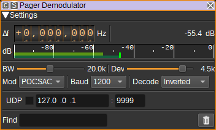
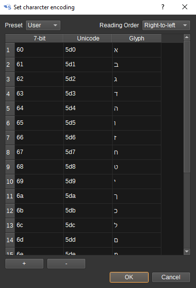
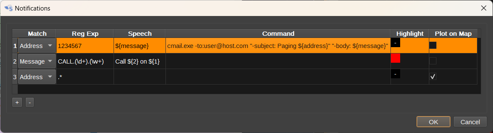
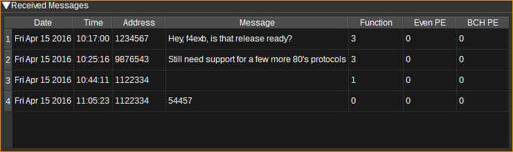

<h1>Pager demodulator plugin</h1>

<h2>Introduction</h2>

This plugin can be used to demodulate POCSAG pager messages.

<h2>Interface</h2>

The top and bottom bars of the channel window are described [here](../../../sdrgui/channel/readme.md)

<h3>1: Frequency shift from center frequency of reception</h3>

Use the wheels to adjust the frequency shift in Hz from the center frequency of reception. Left click on a digit sets the cursor position at this digit. Right click on a digit sets all digits on the right to zero. This effectively floors value at the digit position. Wheels are moved with the mousewheel while pointing at the wheel or by selecting the wheel with the left mouse click and using the keyboard arrows. Pressing shift simultaneously moves digit by 5 and pressing control moves it by 2.

<h3>2: Channel power</h3>

Average total power in dB relative to a +/- 1.0 amplitude signal received in the pass band.

<h3>3: Level meter in dB</h3>

  - top bar (green): average value
  - bottom bar (blue green): instantaneous peak value
  - tip vertical bar (bright green): peak hold value

<h3>4: BW - RF Bandwidth</h3>

This specifies the bandwidth of a LPF that is applied to the input signal to limit the RF bandwidth.

<h3>5: Dev - Frequency deviation</h3>

Adjusts the expected frequency deviation in 0.1 kHz steps from 1 to 6 kHz. POCSAG uses FSK with a +/- 4.5 kHz shift.

<h3>6: Mod - Modulation</h3>

Specifies the pager modulation. Currently only POCSAG is supported.

POCSAG uses FSK with 4.5kHz frequency shift, at 512, 1200 or 2400 baud.
High frequency is typically 0, with low 1, but occasionally this appears to be reversed, so the demodulator supports either.
Data is framed as specified in [ITU-R M.584-2](https://www.itu.int/dms_pubrec/itu-r/rec/m/R-REC-M.584-2-199711-I!!PDF-E.pdf)

<h3>7: Baud</h3>

Specifies the baud rate. For POCSAG, this can be 512, 1200 or 2400.

<h3>8: Decode</h3>

Specifies how messages are decoded in the Message column in the table:

* Standard - As per ITU-R M.584-2 - Function 0 = numeric, function 1-3 = alphanumeric.
* Inverted - Function 3 = numeric, function 0-2 = alphanumeric.
* Numeric - Always decode as numeric.
* Alphanumeric - Always decode as alphanumeric.
* Heuristic - The plugin will try to guess based on the content of the message.

The table has Numeric and Alphanumeric columns which always display the corresponding decode.

<h3>9: Character encoding</h3>

Click to open the character encoding dialog, which allows a mapping from the received 7-bit alphanumeric characters to Unicode.

Each row contains a mapping from a 7-bit value to a Unicode code point. Values should be entered in hexadecimal

<h3>10: Find</h3>

Entering a regular expression in the Find field displays only messages where the address matches the given regular expression.

<h3>11: Clear Messages from table</h3>

Pressing this button clears all messages from the table.

<h3>12: UDP</h3>

When checked, received messages are forwarded to the specified UDP address (12) and port (13).

The messages are forwarded as null terminated ASCII strings, in the format: data time address function alpha numeric

<h3>13: UDP address</h3>

IP address of the host to forward received messages to via UDP.

<h3>14: UDP port</h3>

UDP port number to forward received messages to.

<h3>15: Filter Duplicates</h3>

Check to filter (discard) duplicate messages. Right click to show the Duplicate Filter options dialog:

- Match message only: When unchecked, compare address and message. When checked, compare only message, ignoring the address.
- Match last message only: When unchecked the message is compared against all messages in the table. When checked, the message is compared against the last received message only.

<h3>16: Open Notifications Dialog</h3>

When clicked, opens the Notifications Dialog, which allows speech notifications or programs/scripts to be run when messages matching user-defined rules are received.

By running a program such as [cmail](https://www.inveigle.net/cmail/download) on Windows or sendmail on Linux, e-mail notifications can be sent containing the received message.

Messages can be highlighted in a user-defined colour, selected in the Highlight column.

By checking Plot on Map, if a message contains a position specified as latitude and longitude, the message can be displayed on the [Map](../../feature/map/readme.md) feature.
The format of the coordinates should follow [ISO 6709](https://en.wikipedia.org/wiki/ISO_6709), E.g: 50°40′46″N 95°48′26″W or -23.342,5.234

Here are a few examples:

In the Speech and Command strings, variables can be used to substitute data from the received message:

* ${address},
* ${message},
* ${1}, ${2}... are replaced with the string from the corresponding capture group in the regular expression.

To experiment with regular expressions, try [https://regexr.com/](https://regexr.com/).

<h3>17: Start/stop Logging Messages to .csv File</h3>

When checked, writes all received messages to a .csv file.

<h3>18: .csv Log Filename</h3>

Click to specify the name of the .csv file which received messages are logged to.

<h3>19: Read Data from .csv File</h3>

Click to specify a previously written .csv log file, which is read and used to update the table.

<h3>Received Messages Table</h3>

The received messages table displays each pager message received.

* Date - The date the message was received.
* Time - The time the message was received.
* Address - The 21-bit pager address the message is for.
* Message - The decoded message, as per Decode setting (8). This will be empty for "tone only" messages (i.e. when the pager beeps without a message).
* Function - Function bits. In some instances this is used to specify the encoding of the message (Numeric/alphanumeric). In others, it is the pager source address.
* Alpha - Message decoded as alphanumeric text, regardless of Decode setting (8)
* Numeric - Message decoded as numeric, regardless of Decode setting (8).
* Even PE - Number of even parity errors detected in the code words of the message.
* BCH PE - Number of uncorrectable BCH parity errors detected in the code words of the message.

Right clicking on the table header allows you to select which columns to show. The columns can be reordered by left clicking and dragging the column header. Right clicking on an item in the table allows you to copy the value to the clipboard.
