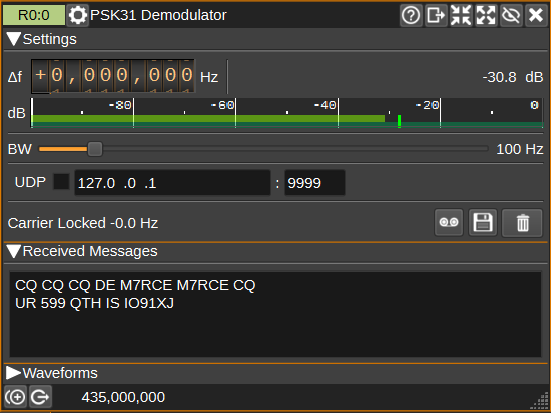

<h1>PSK31 Demodulator Plugin</h1>

<h2>Introduction</h2>

This channel receives PSK31 text at the standard 31.25 baud rate. It searches the
RF bandwidth for the signal's carrier, centers it in a narrow tracking filter,
recovers carrier phase and symbol timing, and makes differential BPSK decisions
from a filter matched to the PSK31 pulse shape. The decoder supports the same
extended Latin-1 Varicode table as the [PSK31 modulator](../../channeltx/modpsk31/readme.md).

<h2>Interface</h2>

The top and bottom bars of the channel window are described [here](../../../sdrgui/channel/readme.md).



<h3>1: Frequency offset</h3>

Tune the channel marker to the PSK31 signal. The demodulator finds the carrier
within the RF bandwidth (3) and tracks it from there, so the marker does not need
to be exactly on frequency: with the default 100 Hz bandwidth, signals within
about 30 Hz of the marker are acquired. The carrier status (7) shows the
carrier's offset from the marker once locked.

<h3>2: Channel power and level meter</h3>

Power within the RF bandwidth (3), in dB relative to a full-scale signal. The
level meter shows average power, instantaneous peak power, and peak hold.

<h3>3: RF bandwidth</h3>

This sets the bandwidth searched for a signal. Signals up to 15 Hz inside either
edge are acquired. Once acquired, the signal is kept centered in a fixed 70 Hz
tracking filter (or the RF bandwidth, if that is narrower) followed by the
matched filter, so the RF bandwidth has little effect on adjacent-channel
rejection after lock. The default 100 Hz bandwidth suits most use. Reduce it if a
stronger signal nearby is acquired instead of the one wanted; increase it to
allow a larger tuning error.

<h3>4: UDP</h3>

When checked, received characters are forwarded to the specified UDP address (5) and port (6).

<h3>5: UDP address</h3>

IP address of the host to forward received characters to via UDP.

<h3>6: UDP port</h3>

UDP port number to forward received characters to.

<h3>7: Carrier status</h3>

Shows whether the demodulator is locked to a PSK31 signal. Once locked, it also
shows the carrier's frequency offset from the channel marker and the estimated
SNR. The SNR is measured from the carrier-corrected signal each second and
averaged over a few seconds. Its noise power is normalized to a 100 Hz reference
bandwidth, so it does not depend on the RF bandwidth setting. The first SNR value
is displayed after one complete second of lock; samples collected before
acquisition are excluded.

Lock is confirmed over 20 symbols, which keeps noise from being decoded as text.
Symbols received while confirming are decoded once lock is confirmed, so text
that follows a short idle preamble is not lost. Characters are output after an
8 symbol delay. If the signal level drops more than about 4.6 dB in that time,
output is paused, so noise received as a transmission ends is not displayed.
During a fade of up to about half a second, lock is held and output paused; if
the signal returns, decoding continues without having to reacquire.

<h3>8: Start/stop Logging Messages to .txt File</h3>

When checked, writes all received characters to the .txt file specified by (9).

<h3>9: .txt Log Filename</h3>

Click to specify the name of the .txt file which received characters are logged to.

<h3>10: Clear</h3>

Clear the received text view (11) of received characters.

<h3>11: Received text</h3>

Decoded text is appended to the text view. CR, LF and CR LF line endings each
start a new line. Other control characters are not displayed.

<h2>Measured performance</h2>

The sample-level benchmark sends a raised-cosine PSK31 waveform, as generated by
the PSK31 modulator, with 256 idle symbols followed by the 30-character test frame
`CQ CQ DE SDRANGEL 0123456789\r\n`. Some tests instead use the classic PSK31
cosine envelope, or a short idle preamble. A frame passes only when every
character is correct. Run it with:

```
sdrangelbench -t psk31 -a perf
```

Measurements with the default 100 Hz RF bandwidth gave these results:

| Test | Result |
|---|---|
| AWGN, acquired carrier | 26% exact frames at 3 dB SNR; 66% at 4 dB; 90% at 5 dB; 94% at 6 dB; 98% at 7 and 8 dB; 100% from 9 dB. The classic cosine envelope gives the same results within a frame or two |
| Frequency offset, random starting phase | At 10 dB SNR, 10/10 exact frames at every offset from -33 Hz through +30 Hz. At 5 dB SNR, 7/10 to 10/10 from -30 Hz through +30 Hz |
| Short preamble, random phase and offset within +/-15 Hz, 10 dB SNR | 20/20 exact frames with 32 or more idle symbols; 19/20 with 24; 13/20 with 16 |
| Sample-clock error | 5/5 exact frames with zero character errors at every tested point from -5000 through +5000 ppm |
| Noiseless input level | 8/8 timing phases at every tested level from -10 through -100 dBFS |
| Noise only at -40 dBFS | Zero lock acquisitions and zero decoded characters in one simulated hour |
| Transmission ending without a carrier tail, followed by noise | No characters decoded after the end in 100/100 trials at 20 dB and 10 dB SNR; 94/100 at 5 dB, with a single character in the others |
| Fade to -40 dB in the middle of text, 15 dB SNR | Average character errors: 0.2 for 50 ms; 0.8 for 100 ms; 2.2 for 200 ms; 2.7 for 300 ms; 3.8 for 500 ms |
| CW interferer, 15 dB SNR | 5/5 exact frames with the interferer 10 dB weaker at 25 Hz separation, equal power at 50 Hz, and 40 dB stronger at 75, 100 or 150 Hz |
| PSK31 interferer, 15 dB SNR | 5/5 exact frames with the interferer 10 dB weaker at 25 Hz separation, equal power at 50 Hz, 30 dB stronger at 75 Hz, and 40 dB stronger at 100 or 150 Hz |
| Full channel path at 1536 samples/s, 10 dB SNR | 5/5 exact frames with PSK31 interferers 20 dB stronger at both +/-75 Hz, 30 dB stronger at 100 Hz, or a CW carrier 40 dB stronger at 300 Hz or at -600 Hz, which aliases when resampled |
| Core demodulator CPU throughput | 4.45-4.49 million internal samples/s, or about 4500 times real time at 1000 samples/s |

SNR is average wanted-signal power divided by complex AWGN power in a 100 Hz
reference bandwidth. At 31.25 baud, 3 dB in 100 Hz corresponds to about 8 dB
Eb/N0. In the regression test, a 20 dB input is reported as about 21.5 dB with
either a 100 Hz or a 200 Hz RF bandwidth. Input level alone is not a sensitivity
figure because the usable floor depends on noise and receiver dynamic range.

The CPU result is the range from three one-second runs of the RelWithDebInfo
Windows build on an Intel Core i9-14900K. It repeatedly feeds representative
BPSK samples to the demodulator at its internal rate. At 1000 samples/s, this
corresponds to roughly 0.02% of one CPU core. It measures filtering, carrier
acquisition and tracking, symbol timing, and decoding; device input,
channelization, scope rendering, and other application overhead are not
included. Run this focused measurement with:

```
sdrangelbench -t psk31 -a cpu
```

Run the standalone noise test with:

```
sdrangelbench -t psk31 -a noise
```
