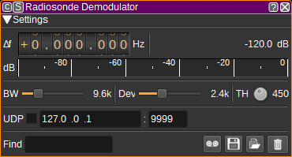
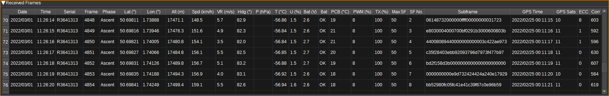

<h1>Radiosonde demodulator plugin</h1>

<h2>Introduction</h2>

This plugin can be used to demodulate RS41 radiosonde weather balloon signals. Radiosondes typically transmit on 400-406MHz and are in the sky around the world for around 1 hour around 00:00 UTC.

RS41 radiosondes transmit data frames every second, containing position, velocity and PTU (Pressure, Temperature and Humidity) readings. The radios use GFSK modulation, with �2.4kHz deviation at 4,800 baud. Reed Solomon encoding is used for ECC (Error Checking and Correction).

The Radiosonde demodulator can forward received data to the [Radiosonde feature](../../feature/radiosonde/readme.md), which can plot charts showing how altitude and PTU vary over time, and also plot the position of the radiosonde on the 2D and 3D maps.

<h2>Interface</h2>

The top and bottom bars of the channel window are described [here](../../../sdrgui/channel/readme.md)

<h3>1: Frequency shift from center frequency of reception</h3>

Use the wheels to adjust the frequency shift in Hz from the center frequency of reception. Left click on a digit sets the cursor position at this digit. Right click on a digit sets all digits on the right to zero. This effectively floors value at the digit position. Wheels are moved with the mousewheel while pointing at the wheel or by selecting the wheel with the left mouse click and using the keyboard arrows. Pressing shift simultaneously moves digit by 5 and pressing control moves it by 2.

<h3>2: Channel power</h3>

Average total power in dB relative to a +/- 1.0 amplitude signal received in the pass band.

<h3>3: Level meter in dB</h3>

  - top bar (green): average value
  - bottom bar (blue green): instantaneous peak value
  - tip vertical bar (bright green): peak hold value

<h3>4: BW - RF Bandwidth</h3>

This specifies the bandwidth of a LPF that is applied to the input signal to limit the RF bandwidth. For RS41 radiosondes, this can be 9.6kHz.

<h3>5: Dev - Frequency deviation</h3>

Adjusts the expected frequency deviation in 0.1 kHz steps from 1 to 5 kHz. Typical value to RS41 is 2.4kHz.

<h3>6: TH - Correlation Threshold</h3>

The correlation threshold between the received signal and the preamble (training sequence). A lower value may be able to demodulate weaker signals, but increases processor usage. The default value is 450.

<h3>7: UDP</h3>

When checked, received receives are forwarded to the specified UDP address (12) and port (13).

<h3>8: UDP address</h3>

IP address of the host to forward received frames to via UDP.

<h3>9: UDP port</h3>

UDP port number to forward received frames to.

<h3>10: Find</h3>

Entering a regular expression in the Find field displays only frames where the radiosonde serial number matches the given regular expression.

<h3>11: Start/stop Logging Frames to .csv File</h3>

When checked, writes all received frames to a .csv file.

<h3>14: .csv Log Filename</h3>

Click to specify the name of the .csv file which received frames are logged to.

<h3>15: Read Data from .csv File</h3>

Click to specify a previously written radiosonde .csv log file, which is read and used to update the table.

<h3>11: Clear Data from table</h3>

Pressing this button clears all data from the table.

<h3>Received Data Table</h3>

The received frames table displays information about each radiosonde frame received.

* Date - The date the frame was received.
* Time - The time the frame was received.
* Serial - The serial number of the radiosonde. Double clicking on this column will search for the radiosonde on https://sondehub.org/
* Frame - Frame number
* Phase - Flight phase: On ground, Ascent and Descent.
* Lat (�) - Latitude in degrees, North positive. Double clicking on this column will search for the radiosonde on the Map.
* Lon (�) - Longitude in degrees, East positive. Double clicking on this column will search for the radiosonde on the Map.
* Alt (m) - Altitude in metres.
* Spd (km/h)  - Speed over ground in kilometres per hour.
* VR (m/s) - Vertical climb rate in metres per second.
* Hdg (�) - Heading in degrees.
* P (hPA) - Air pressure in hectopascals. Not all RS41s include a pressure sensor. A value ending with 'U' indicates a uncalibrated estimate and may be inaccurate.
* T (�C) - Air temperature in degrees Celsius.  A value ending with 'U' indicates a uncalibrated estimate and may be inaccurate.
* U (%) - Relative humidity in percent.  A value ending with 'U' indicates a uncalibrated estimate and may be inaccurate.
* Bat (V) - Battery voltage in Volts.
* Bat - Battery status: OK or low.
* PCB (�C) - Temperature of PCB.
* PWM (%) - Humidity sensor heater PWM (Pulse Width Modulation) setting, in percent.
* TX (%) - Transmit power in percent.
* Max SF - Maximum subframe number.
* SF No. - Subframe number of subframe data in this frame.
* Subframe - Subframe data.
* GPS Time - GPS date and time on board radiosonde. GPS time is offset 18 seconds from UTC.
* GPS Sats - Number of GPS satellites used in position estimate.
* ECC - Number of symbol errors corrected by Reed Solomon ECC.
* Corr - Preamble correlation value calculated for the frame. This can be used to choose a value for TH (6).

Right clicking on the table header allows you to select which columns to show. The columns can be reordered by left clicking and dragging the column header. Right clicking on an item in the table allows you to copy the value to the clipboard.
