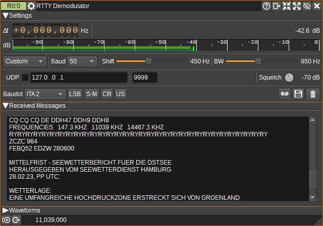

<h1>RTTY Demodulator Plugin</h1>

<h2>Introduction</h2>

This plugin can be used to demodulate RTTY (Radioteletype) transmissions.
RTTY uses BFSK (Binary Frequency Shift Keying), where transmission of data alternates between two frequencies,
the mark frequency and the space frequency. The RTTY Demodulator should be centered in between these frequencies.
The baud rate, frequency shift (difference between mark and space frequencies), bandwidth and baudot character set are configurable.

<h2>Interface</h2>

The top and bottom bars of the channel window are described [here](../../../sdrgui/channel/readme.md)

<h3>1: Frequency shift from center frequency of reception</h3>

Use the wheels to adjust the frequency shift in Hz from the center frequency of reception. Left click on a digit sets the cursor position at this digit. Right click on a digit sets all digits on the right to zero. This effectively floors value at the digit position. Wheels are moved with the mousewheel while pointing at the wheel or by selecting the wheel with the left mouse click and using the keyboard arrows. Pressing shift simultaneously moves digit by 5 and pressing control moves it by 2.

<h3>2: Channel power</h3>

Average total power in dB relative to a +/- 1.0 amplitude signal received in the pass band.

<h3>3: Level meter in dB</h3>

  - top bar (green): average value
  - bottom bar (blue green): instantaneous peak value
  - tip vertical bar (bright green): peak hold value

<h3>4: RTTY Presets</h3>

From the presets dropdown, you can select common baud rate and frequency shift settings, or choose Custom to set these individually.

<h3>5: Baud rate</h3>

Specifies the baud rate, in symbols per second.
The tooltip will display an estimate of the received baud rate (Which will be accurate to around 5 baud), providing that the frequency shift has been set correctly.

<h3>6: Frequency shift</h3>

Specifies the frequency shift in Hertz between the mark frequency and the space frequency.
The tooltip will display an estimate of the frequency shift (Which will be accurate to around 10-20Hz), assuming that the bandwidth has been set wide enough to contain the signal.

<h3>7: RF Bandwidth</h3>

This specifies the bandwidth of a filter that is applied to the input signal to limit the RF bandwidth. This should be set wide enough to contain the mark and space frequencies and sidebands,
but not so wide to accept noise or adjacent signals.

<h3>8: UDP</h3>

When checked, received characters are forwarded to the specified UDP address (9) and port (10).

<h3>9: UDP address</h3>

IP address of the host to forward received characters to via UDP.

<h3>10: UDP port</h3>

UDP port number to forward received characters to.

<h3>11: Squelch</h3>

Sets the squelch power level in dB. Characters received with average power lower than this setting will be discarded.

<h3>12: Baudot Character Set</h3>

The baudot character set dropdown determines how the received Baudot encodings will be mapped to Unicode characters. The following character sets are supported:

* ITA 2
* UK
* European
* US
* Russian
* Murray

<h3>13: Bit ordering</h3>

Specifies whether bits are transmitted least-significant-bit first (LSB) or most-significant-bit first (MSB).

<h3>14: Mark/Space Frequency</h3>

When unchecked, the mark frequency is the higher frequency, when checked the space frequency is higher.

<h3>15: Suppress CR LF</h3>

When checked the CR CR LF sequence is just displayed as CR. This can help make more received text visible in (19). 

<h3>16: Unshift on Space</h3>

When checked, the Baudot character set will shift to letters when a space character (' ') is received.

<h3>17: Start/stop Logging Messages to .txt File</h3>

When checked, writes all received characters to the .txt file specified by (16).

<h3>18: .txt Log Filename</h3>

Click to specify the name of the .txt file which received characters are logged to.

<h3>19: Received Text</h3>

The received text area shows characters as they are received.

