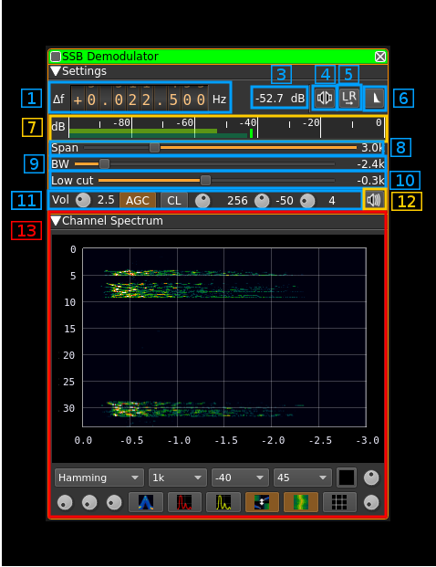
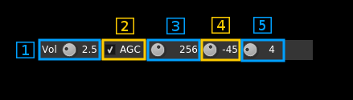
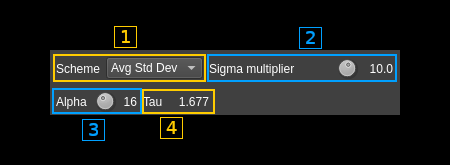

<h1>SSB/DSB demodulator plugin</h1>

<h2>Introduction</h2>

This plugin can be used to listen to a single sideband or double sidebands modulated signal. This includes CW (Morse code) signals.

<h2>Interface</h2>

The top and bottom bars of the channel window are described [here](../../../sdrgui/channel/readme.md)

&#9758; In order to toggle USB or LSB mode in SSB mode you have to set the "BW" in channel filter cutoff control (9) to a positive (USB) or negative (LSB) value. The above screenshot shows a LSB setup. See the (8) to (10) paragraphs below for details.

&#9758; The channel marker in the main spectrum display shows the actual band received taking in channel filtering into account.

<h3>1: Frequency shift from center frequency of reception</h3>

Use the wheels to adjust the frequency shift in Hz from the center frequency of reception. Left click on a digit sets the cursor position at this digit. Right click on a digit sets all digits on the right to zero. This effectively floors value at the digit position. Wheels are moved with the mousewheel while pointing at the wheel or by selecting the wheel with the left mouse click and using the keyboard arrows. Pressing shift simultaneously moves digit by 5 and pressing control moves it by 2.

<h3>2: Channel power</h3>

Average total power in dB relative to a +/- 1.0 amplitude signal received in the pass band.

<h3>3: Monaural/binaural toggle</h3>

  - Monaural: the scalar signal is routed to both left and right audio channels
  - Binaural: the complex signal is fed with the real part on the left audio channel and the imaginary part to the right audio channel

<h3>4: Invert left and right channels</h3>

Inverts left and right audio channels. Useful in binaural mode only.

<h3>5: Sideband flip</h3>

Flip LSB/USB. Mirror filter bandwidth around zero frequency and change from LSB to USB or vice versa. Works in SSB mode only.

<h3>6: SSB/DSB demodulation</h3>

Toggles between SSB (icon with one sideband signal) and DSB (icon with double sidebands signal). In SSB mode the shape of the icon represents LSB or USB operation.

<h3>7: Level meter in dB</h3>

  - top bar (green): average value
  - bottom bar (blue green): instantaneous peak value
  - tip vertical bar (bright green): peak hold value

<h3>8: Spectrum display frequency span</h3>

The audio sample rate SR is further decimated by powers of two for the spectrum display and in channel filter limits. This effectively sets the total available bandwidth depending on the decimation:

  - 1 (no decimation): SR/2 (SSB) or SR (DSB)
  - 2: SR/4 (SSB) or SR/2 (DSB)
  - 4: SR/8 (SSB) or SR/4 (DSB)
  - 8: SR/16 (SSB) or SR/8 (DSB)
  - 16: SR/32 (SSB) or SR/16 (DSB)

The span value display is set as follows depending on the SSB or DSB mode:

  - In SSB mode: the span goes from zero to the upper (USB: positive frequencies) or lower (LSB: negative frequencies) limit and the absolute value of the limit is displayed.
  - In DSB mode: the span goes from the lower to the upper limit of same absolute value and &#177; the absolute value of the limit is displayed.

This is how the Span (8) and bandpass (9, 10) filter controls look like in the 3 possible modes:

**DSB**:

  - Decimation factor is 4 hence span is 6 kHz from -3 to +3 kHz and &#177;3.0k is displayed
  - In channel filter bandwidth is 5.2 kHz from -2.6 to +2.6 kHz and &#177;2.6k is displayed
  - In channel filter "low cut" is disabled and set to 0

**USB**:

  - Decimation factor is 4 hence span is 3 kHz from 0 to 3 kHz and 3.0k is displayed
  - In channel filter upper cutoff is 2.6 kHz and 2.6k is displayed
  - In channel filter lower cutoff is 0.3 kHz and 0.3k is displayed
  - Hence in channel filter bandwidth is 2.3 kHz

**LSB**:

  - Decimation factor is 4 hence span is 3 kHz from 0 to -3 kHz and 3.0k is displayed
  - In channel filter lower cutoff is -2.6 kHz and -2.6k is displayed
  - In channel filter upper cutoff is -0.3 kHz and -0.3k is displayed
  - Hence in channel filter bandwidth is 2.3 kHz

<h3>9: FFT filter window</h3>

The bandpass filter is a FFT filter. This controls the FFT window type:

  - **Bart**: Bartlett
  - **B-H**: 4 term Blackman-Harris
  - **FT**: Flat top
  - **Ham**: Hamming
  - **Han**: Hanning
  - **Rec**: Rectangular (no window)
  - **Kai**: Kaiser with alpha = 2.15 (beta = 6.76) gives sidelobes &lt; -70dB
  - **Blackman**: Blackman (3 term - default)
  - **B-H7**: 7 term Blackman-Harris

<h3>10: Select filter in filter bank</h3>

There are 10 filters in the filter bank with indexes 0 to 9. This selects the current filter in the bank the filter index is displayed at the right of the button. The following controls are covered by the filter settings:

  - Span (8)
  - FFT window (9)
  - BW (11)
  - Low cut (12)

<h3>11: "BW": In channel bandpass filter cutoff frequency farthest from zero</h3>

Values are expressed in kHz and step is 100 Hz.

  - In SSB mode this is the upper (USB: positive frequencies) or lower (LSB: negative frequencies) cutoff of the in channel single side band bandpass filter. The value triggers LSB mode when negative and USB when positive
  - In DSB mode this is half the bandwidth of the double side band in channel bandpass filter therefore the value is prefixed with the &#177; sign.

<h3>12: "Low cut": In channel bandpass filter cutoff frequency closest to zero</h3>

Values are expressed in kHz and step is 100 Hz.

  - In SSB mode this is the lower cutoff (USB: positive frequencies) or higher cutoff (LSB: negative frequencies) of the in channel single side band bandpass filter.
  - In DSB mode it is inactive and set to zero (double side band filter).

<h3>13: Volume AGC Noise Reduction</h3>

<h4>13.1: Volume</h4>

This is the volume of the audio signal in dB from 0 (no gain) to 40 (10000). It can be varied continuously in 1 dB steps using the dial button. When AGC is engaged it is recommended to set a low value in dB not exceeding 3 db (gain 2). When AGC is not engaged the volume entirely depends on the RF power and can vary in large proportions. Hence setting the value in dB is more convenient to accommodate large differences.

<h4>13.2: AGC toggle</h4>

Use this checkbox to toggle AGC on and off.

If you are into digging weak signals out of the noise you probably will not turn the AGC on. AGC is intended for medium and large signals and help accommodate the signal power variations from a station to another or due to QSB.

This AGC is based on the calculated magnitude (square root of power of the filtered signal as I² + Q²) and will try to adjust audio volume as if a -20dB power signal was received.

<h4>13.3: AGC clamping</h4>

When on this clamps signal at the maximum amplitude. Normally this is not needed for most signals as the AGC amplitude order is quite conservative at 10% of the maximum. You may switch it on if you notice a loud click when a transmission starts.

<h4>13.4: Noise Reduction</h4>

This is a FFT based noise reduction and is engaged only in SSB mode (USB, LSB).

Usually this will not work great on weak signals and should not be used in this case. This feature is mostly intended at reducing ear fatigue when some background noise is present on a fairly strong signal. You can combine it with the squelch (13.7) to suppress the waterfall noise when there is no signal.

The spectrum display (15) is that of the filtered signal. The AGC when engaged (13.2) is also working with the filtered signal.

Use this button to toggle noise reduction on/off. Right click on this button to open a dialog controlling noise reduction filter characteristics:

<h4>13.4.1: Noise reduction scheme</h4>

Use this combo box to choose the noise reduction scheme among the follwing:

  - **Average**: calculates the average of magnitudes of the FFT (PSD) and sets the magnitude threshold to this average multiplied by a factor that can be set with the control next (13.4.2).

  - **Avg Std Dev**: calculates the average and standard deviation (sigma) of magnitudes of the FFT and sets the threshold at average plus half sigma multiplied by a factor that can be set with the control next (13.4.2). This is optimal for voice signals (SSB).

  - **Peaks**: selects the bins of the FFT with highest magnitudes. You can select the number of these peaks with the control next (13.4.2). This can be used for CW signals with a small number of peaks or even just one effectively realizing a peak filter.

<h4>13.4.2: Noise reduction parameter</h4>

This parameter depends on the noise reduction scheme

  - With average this is the multiplier of the average
  - With average and standard deviation this is the standard deviation (sigma) multiplier.
  - With FFT peaks this is the number of peaks.

<h4>13.4.3: Smoothing filter constant (alpha)</h4>

With average based schemes this controls the characteristic of the exponential filter used to smoothen the average or the threshold in case of the average plus standard deviation scheme.

Smoothing prevents the return of noise during short pauses in the signal like voice signals. For voice signals (SSB) a time constant of 1 or 2 seconds gives good results (as shown in screenshot).

The exponential filter is governed by this equation:

$y(k) = \alpha y(k-1) + (1-\alpha)x(k)$

where:

  - $x(k)$ is the input at time step k
  - $y(k)$ is the filtered output at time step k
  - $\alpha$ is a constant between 0 and 1 and is the smoothing factor. The larger the value the more smoothing occurs

The smoothing filter constant $\alpha$ is entered as minus the value in dB of $(1-\alpha)$ i.e. $-dB(1-\alpha)$. Thus a larger number corresponds to a longer time constant showed in 13.4.4. Using a logarithmic input (dB) allows a finer control of the filter time constant. The actual value of alpha will appear in the tooltip.

<h4>13.4.4: Smoothing filter time constant</h4>

The time constant of an exponential filter $\tau$ with constant time steps $T$ is expressed as $\tau = -T/ln(\alpha)$. Here the time step is the time of one FFT which is the FFT length divided by the sample rate.

The resulting time constant $\tau$ is displayed here in seconds.

<h4>13.5: AGC time constant</h4>

This is the time window in milliseconds of the moving average used to calculate the signal power average. It can be varied in powers of two from 16 to 2048 ms that is: 16, 32, 64, 128, 256, 512, 1024 and 2048 ms. The most practical values are between 128 and 512 ms.

<h4>13.6: Signal power threshold (squelch)</h4>

Active only in AGC mode.

This threshold acts as a squelch and will mute the sound below this average signal power. To prevent short transient drop outs the squelch gets active only if the power has been below the threshold for a period equal to the AGC time constant (11.3)

This feature is mostly useful when more than one SSB channel is active. When there is no transmission the level of noise rises at the level of a normal signal due to the AGC and adds to the noise of other channels. Therefore it is desirable to shut down the audio when there is no signal in the channel.

To turn off the squelch completely move the knob all the way down (left). Then "---" will display as the value and the squelch will be disabled.

The signal power is calculated as the moving average over the AGC time constant (11.3) of the power  of the filtered signal as I² + Q².

<h4>13.7: Signal power threshold (squelch) gate</h4>

Active only in AGC mode with squelch enabled.

To avoid unwanted squelch opening on short transient bursts only signals with power above threshold during this period in milliseconds will open the squelch.It can be varied from 0 to 20 ms in 1 ms steps then from 30 to 500 ms in 10 ms steps.

When the power threshold is close to the noise floor a few milliseconds help in preventing noise power wiggle to open the squelch.

<h3>14: Audio mute and audio output select</h3>

Left click on this button to toggle audio mute for this channel.

If you right click on it a dialog will open to select the audio output device. See [audio management documentation](../../../sdrgui/audio.md) for details.

<h3>15: Spectrum display</h3>

This is the spectrum display of the demodulated signal (SSB) or translated signal (DSB). Controls on the bottom of the panel are identical to the ones of the main spectrum display. Details on the spectrum view and controls can be found [here](../../../sdrgui/gui/spectrum.md)
