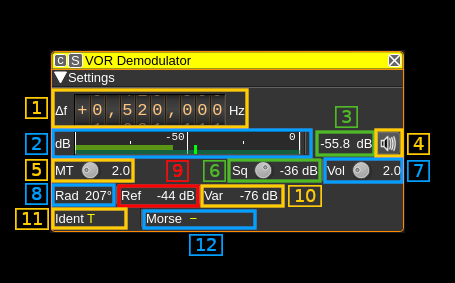

<h1>VOR demodulator plugin</h1>

<h2>Introduction</h2>

This plugin can be used to demodulate VOR (VHF omnidirectional range) navaids (navigation aids). VORs are radio navigation aids in the VHF 108 - 117.975MHz band commonly used for aircraft navigation.

VORs transmit two 30Hz signals, one AM at the VOR center frequency and one FM on a 9960Hz sub-carrier. The FM reference signal's phase is set so 0 degrees corresponds to magnetic north from the VOR (Some VORs at high latitudes use true North). The phase of the AM variable signal is such that the phase difference to the reference signal corresponds to the bearing from the VOR to the receiver. For example, if a receiver is North from the VOR, the AM and FM 30Hz signals will be received in phase. If a receiver is East from the VOR, the phase difference will be 90 degrees.

VORs also transmit a Morse code ident signal at a 1020Hz offset. This is a 2 or 3 character identifier used to identify the VOR, as multiple VORs can be transmitted on the same frequency. For example, the VOR at London Heathrow transmits .-.. --- -. for LON. The Morse code ident is typically transmitted at 10 seconds intervals at between 7 and 10 wpm. VORs that are under maintenance may transmit TST.

Some VORs also transmit an AM voice identification or information signal (ATIS) between 300-3kHz.

Note that for aircraft, there is typically a direct line-of-sight to the VOR. This is unlikely to be the case when using an SDR on the ground. To get good results, ideally you want to be on a nice high hill or close to the VOR.

<h2>Using it for localization</h2>

Several instances of this plugin can be created to monitor multiple VORs and collate information in the VOR Localizer feature plugin. The VOR Localizer can also perform a round robin on multiple VORs with just one VOR demodulator. Please refer to [VOR Localizer](../../feature/vorlocalizer/readme.md) for more information about this feature plugin.

<h2>Interface</h2>

The top and bottom bars of the channel window are described [here](../../../sdrgui/channel/readme.md)

<h3>1: Frequency shift from center frequency of reception value</h3>

Use the wheels to adjust the frequency shift in Hz from the center frequency of reception. Right click on a digit sets all digits on the right to zero. This effectively floors value at the digit position. Wheels are moved with the mousewheel while pointing at the wheel or by selecting the wheel with the left mouse click and using the keyboard arrows. Pressing shift simultaneously moves digit by 5 and pressing control moves it by 2. Left click on a digit sets the cursor position at this digit.

<h3>2: Level meter in dB</h3>

  - top bar (green): average value
  - bottom bar (blue green): instantaneous peak value
  - tip vertical bar (bright green): peak hold value

<h3>3: Channel power</h3>

Average total power in dB relative to a +/- 1.0 amplitude signal received in the pass band.

<h3>4: Audio mute and audio output select</h3>

Left click on this button to toggle audio mute for this channel. The button will light up in green if the squelch is open. This helps identifying which channels are active in a multi-channel configuration.

If you right click on it, it will open a dialog to select the audio output device. See [audio management documentation](../../../sdrgui/audio.md) for details.

<h3>5: Morse ident threshold</h3>

This is the Morse code ident threshold, expressed as a linear signal to noise (SNR) ratio. This is effectively the signal level required for the Morse demodulator to detect a dot or dash. Setting this to low values will allow the Morse demodulator to detect weak signals, but it also increases the likelihood that noise will incorrectly be interpreted as a signal, resulting in invalid idents being reported.

<h3>Ident bandpass filter</h3>

Click to toggle a narrow bandpass filter around the Morse ident signal. This can be used to filter out the voice signal from the audio output, to make the Morse ident signal clearer.

<h3>6: Squelch threshold</h3>

This is the squelch threshold in dB. The average total power received in the signal bandwidth before demodulation is compared to this value and the squelch input is open above this value. It can be varied continuously in 0.1 dB steps from 0.0 to -100.0 dB using the dial button.

<h3>7: Volume</h3>

This is the volume of the audio signal from 0.0 (mute) to 10.0 (maximum). It can be varied continuously in 0.1 steps using the dial button.

<h3>8: Radial direction</h3>

Demodulated radial direction in degrees (unadjusted for magnetic declination). If there is a low confidence the value is correct (due to a weak signal), it will be displayed in red.

<h3>9: Reference signal power in dB</h3>

Magnitude of the received 30Hz FM reference signal in dB.

<h3>10. Variable signal power in dB</h3>

Magnitude of the received 30Hz AM variable signal in dB.

<h3>11. VOR identifier code (decoded)</h3>

Demodulated identifier. If an identifier is received that is not 2 or 3 characters, it will be displayed in yellow else in white.

<h3>12. VOR identifier code (Morse)</h3>

Demodulated Morse code identifier. Colour coding is the same as for the decoded identifier.
