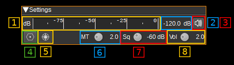
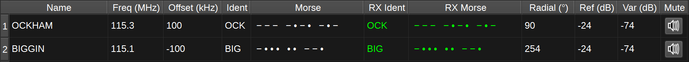
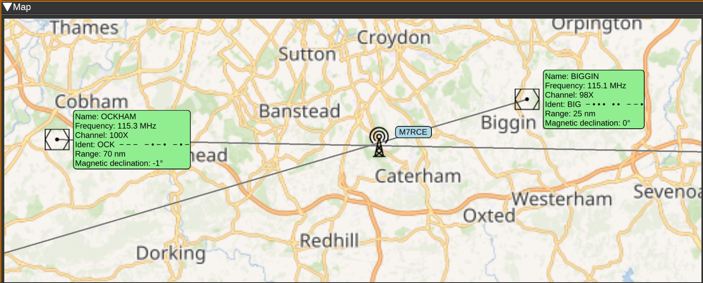

<h1>VOR demodulator plugin</h1>

<h2>Introduction</h2>

This plugin can be used to demodulate VOR (VHF omnidirectional range) navaids (navigation aids). VORs are radio navigation aids in the VHF 108 - 117.975MHz band commonly used for aircraft navigation.

VORs transmit two 30Hz signals, one AM at the VOR center frequency and one FM on a 9960Hz sub-carrier. The FM reference signal's phase is set so 0 degrees corresponds to magnetic north from the VOR (Some VORs at high latitudes use true North). The phase of the AM variable signal is such that the phase difference to the reference signal corresponds to the bearing from the VOR to the receiver. For example, if a receiver is North from the VOR, the AM and FM 30Hz signals will be received in phase. If a receiver is East from the VOR, the phase difference will be 90 degrees.

VORs also transmit a Morse code ident signal at a 1020Hz offset. This is a 2 or 3 character identifier used to identify the VOR, as multiple VORs can be transmitted on the same frequency. For example, the VOR at London Heathrow transmits .-.. --- -. for LON. The Morse code ident is typically transmitted at 10 seconds intervals at between 7 and 10 wpm. VORs that are under maintenance may transmit TST.

Some VORs also transmit an AM voice identification or information signal between 300-3kHz.

This plugin can demodulate all four signals from multiple VORs simultaneously, allowing your position to be determined and plotted on a map. It can also demodulate the Morse code ident signal and check they are correct for each VOR. The Morse code ident and any voice signal will also be heard as audio.

Note that for aircraft, there is typically a direct line-of-sight to the VOR. This is unlikely to be the case when using an SDR on the ground. To get good results, ideally you want to be on a nice high hill or close to the VOR.

<h2>Interface</h2>

The top and bottom bars of the channel window are described [here](../../../sdrgui/channel/readme.md)

<h3>1: Level meter in dB</h3>

  - top bar (green): average value
  - bottom bar (blue green): instantaneous peak value
  - tip vertical bar (bright green): peak hold value

<h3>2: Channel power</h3>

Average total power in dB relative to a +/- 1.0 amplitude signal received in the pass band.

<h3>3: Audio mute and audio output select</h3>

Left click on this button to toggle audio mute for this channel. The button will light up in green if the squelch is open. This helps identifying which channels are active in a multi-channel configuration.

If you right click on it, it will open a dialog to select the audio output device. See [audio management documentation](../../../sdrgui/audio.md) for details.

<h3>4: Download VOR Database</h3>

Pressing this button downloads the OpenAIP.net Navaid database, which contains the details (position, frequencies, name and ident) for each VOR. This needs to be performed at least once.

<h3>5: Draw Radials Adjusted for Magnetic Declination</h3>

When checked, radials on the map will drawn adjusted for magnetic declination. For example, if a VOR has a magnetic declination of 5 degrees, and the radial is calculated at 0 degrees, the radial will be drawn to magnetic North, i.e. -5 degrees from true North. If not checked, the same radial would be drawn to true North (i.e 0 degrees), which may result in a less accurate position estimate.

<h3>6: Morse ident threshold</h3>

This is the Morse code ident threshold, expressed as a linear signal to noise (SNR) ratio. This is effectively the signal level required for the Morse demodulator to detect a dot or dash. Setting this to low values will allow the Morse demodulator to detect weak signals, but it also increases the likelihood that noise will incorrectly be interpreted as a signal, resulting in invalid idents being reported.

<h3>7: Squelch threshold</h3>

This is the squelch threshold in dB. The average total power received in the signal bandwidth before demodulation is compared to this value and the squelch input is open above this value. It can be varied continuously in 0.1 dB steps from 0.0 to -100.0 dB using the dial button.

<h3>8: Volume</h3>

This is the volume of the audio signal from 0.0 (mute) to 10.0 (maximum). It can be varied continuously in 0.1 steps using the dial button.

<h3>VOR Table</h3>

The VOR table displays information about selected VORs. To select or deselect a VOR, double click it on the map. The information displayed includes:

* Name - The name of the VOR. For example: 'LONDON'.
* Freq (MHz) - The center frequency the VOR transmits on in MHz.
* Offset (kHz) - This is the current difference between the VOR's center frequency and SDRangel's device center frequency. If displayed in red, the VOR is out of range and its signal will not be able to be received.
* Ident - A 2 or 3 character identifier for the VOR. For example: 'LON'.
* Morse - The Morse code identifier for the VOR. For example: '.-.. --- -.'
* RX Ident - This contains the demodulated ident. If it matches the expected ident, it will be displayed in green, if not, it will be displayed in red. If an ident is received that is not 2 or 3 characters, it will not be displayed, but the last received ident will be displayed in yellow.
* RX Morse - This contains the demodulated Morse code ident. Colour coding is as for RX Ident.
* Radial - This contains the demodulated radial direction in degrees (unadjusted for magnetic declination). If there is a low confidence the value is correct (due to a weak signal), it will be displayed in red.
* Ref (dB) - This displays the magnitude of the received 30Hz FM reference signal in dB.
* Var (dB) - This displays the magnitude of the received 30Hz AM variable signal in dB.
* Mute - This button allows you to mute or unmute the audio from the corresponding VOR.

<h3>Map</h3>

The map displays the locations of each VOR, with an information box containing the information about the VOR, such as its name, frequency, ident (in text and Morse), range and magnetic declination.

To initialise the VORs on the map, first set your position using the Preferences > My position menu, then open the VOR Demodulator channel (close and reopen it, if already open). Then press the Download VOR Database button (This only needs to be performed once). The map should then display VORs in your vicinity.

Double clicking on a VOR will select and add it to the list of VORs to demodulate. It will be added to the VOR table and will be highlighted green. Double clicking a selected VOR, will remove it from the list of VORs to demodulate and it will be removed from the VOR table.

When a signal from a VOR is correctly being demodulated, a radial line will be drawn on the map, at the angle corresponding to the phase difference between the AM and FM 30Hz signals. Your receiver should be somewhere along this radial line. The length of the radial line is set according to the range of the VOR as recorded in the database, which is valid for aircraft at altitude. Range on the ground will be considerably less. An approximate position for the receiver is where the radial lines from two or more VORs intersect.

<h2>Attribution</h2>

Icons by Denelson83 and mamayer, via Wikimedia Commons and RULI from the Noun Project https://thenounproject.com/
