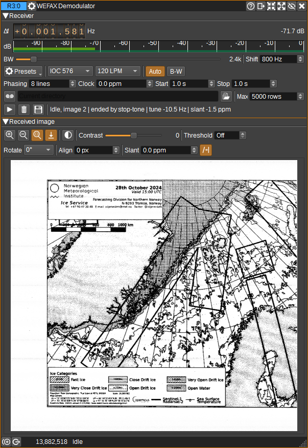

<h1>WEFAX Demodulator Plugin</h1>

<h2>Introduction</h2>

This plugin receives monochrome HF weather facsimile.

The demodulator supports IOC (Index of Cooperation) 576 and IOC 288 at 60, 90, 100, 120, 180 and 240 lines per minute (LPM). It provides automatic start, IOC, LPM, phasing and stop detection, as well as manual reception. The receive chain includes channel filtering and resampling, FM discrimination, residual tuning correction, fractional line timing and phasing-derived clock correction.

Native raster widths are 1809 pixels for IOC 576 and 904 pixels for IOC 288.

See [Weatherfax](https://weatherfax.com/) for a list of stations, frequencies and transmission times.

<h2>Interface</h2>

The top and bottom bars of the channel window are described [here](../../../sdrgui/channel/readme.md).

<h3>1: Frequency shift from centre frequency of reception</h3>

Use the wheels to adjust the channel frequency offset from the device centre frequency in Hz. Tune this to the published WEFAX carrier frequency; no additional 1900 Hz audio offset is required. The offset can be fine-tuned during reception without ending the current image.

Left click a digit to select it. Right click a digit to set all digits to its right to zero. Turn the mouse wheel while pointing at a digit, or select it and use the keyboard arrow keys. Holding Shift changes the digit by 5 and holding Control changes it by 2.

<h3>2: Channel power</h3>

Displays the average power in dB relative to a +/-1.0 amplitude signal within the selected receive passband.

<h3>3: Channel power meter</h3>

The level meter displays:

  - top green bar: average power
  - lower blue-green bar: instantaneous peak power
  - bright green vertical bar: held peak power

<h3>4: RF bandwidth</h3>

Sets the bandwidth of the channel filter. This is a steep filter (about 330 Hz transition band), so a signal just outside the bandwidth is rejected rather than merely attenuated. The default and the normal 120/576 presets use 2.4 kHz. The weak-signal preset uses 1.6 kHz, IOC 288 uses 1.6 kHz and the high-speed 240/576 preset uses 3.6 kHz.

The bandwidth is the main noise versus sharpness control. The video filter follows it (half the RF bandwidth, limited to between a quarter and half of the pixel rate), so a narrower setting removes more noise and adjacent-channel interference at the cost of fine detail, while a wider setting on a strong signal gives full resolution. Use the narrowest setting that keeps text legible: on a weak 120/576 signal, 1.4 to 1.6 kHz gives a much cleaner image than 2.4 kHz, and text remains legible down to about 1.4 kHz.

The status text warns when the selected bandwidth is below roughly the FM shift plus a sixth of the pixel rate (1.4 kHz at 120/576), or when the source sample rate is insufficient. Control-tone and phasing detection follow the channel filter, so a filter that excludes adjacent signals also makes automatic reception more reliable.

<h3>5: FM shift</h3>

Sets the black-to-white FM shift in Hz. Standard WMO transmissions normally use 800 Hz, while DWD transmissions use 850 Hz. This is the image modulation shift and does not change the tuned carrier frequency.

<h3>6: Index of cooperation</h3>

Selects IOC 576 or IOC 288. IOC determines the native raster width: 1809 pixels for IOC 576 and 904 pixels for IOC 288. In automatic mode, a sustained 300 Hz start tone selects IOC 576 and a sustained 675 Hz start tone selects IOC 288.

<h3>7: Lines per minute</h3>

Selects 60, 90, 100, 120, 180 or 240 LPM. Automatic mode replaces this selection when it obtains a consistent rate from the phasing pulses. It chooses the lowest rate that fits the last few pulse intervals, so occasional missed pulses do not select a lower rate.

IOC 576 uses a 24 ksample/s internal rate at 180 and 240 LPM and 12 ksample/s at the other rates. IOC 288 uses 12 ksample/s. Automatic acquisition remains at 24 ksample/s until the mode is known, so detection of a high line rate during phasing does not reset the resampler.

<h3>8: Automatic reception</h3>

The Auto button enables automatic start, IOC, LPM, phasing and stop detection. The decoder detects the start tone, measures the spacing and boundary of the phasing pulses, starts the raster at the transition out of phasing, and finishes it after a sustained 450 Hz stop tone.

Start-tone detection remains active while the decoder is waiting for phasing. You can therefore press Start before the start tone arrives; the detected tone will still select the correct IOC for the first image. A new confirmed start while receiving finalizes the current page and begins a new phasing acquisition. Signal loss also finalizes the page and rearms the receiver: this is channel power more than 10 dB below the capture's running level, or no input at all, sustained for ten seconds.

During phasing, which in automatic mode begins during the start tone, automatic frequency control (AFC) measures the black and white tone frequencies and removes any tuning error from the image, so grey levels are correct even when the channel is slightly mistuned. The tones are found as spectral peaks in an averaged power spectrum rather than from the FM discriminator, which on a weak signal is pulled by noise and by weak carriers during fades. The black and white peaks must be one FM shift (5) apart, within 8%, so the start tone's comb of lines is not mistaken for them. Corrections of up to a quarter of the shift (200 Hz for 800 Hz) are applied. The correction is held for the whole image and is shown in the status text as the tuning error. It is cleared on retuning, when the device frequency, sample rate or stream changes, at the next transmission, and when reception is started manually without phasing.

On weak signals, short deep fades let noise or a weak carrier in the passband capture the FM discriminator, which draws short black or white streaks across the image. Pixels received while the channel power was below a quarter of its recent level are replaced with the pixel directly above, since charts change little from one line to the next. A line that has mostly faded is a genuine dropout and is left as received.

If phasing ends without accepted timing (too few consistent lines, low confidence or an estimate outside +/-1000 ppm), reception starts with nominal timing plus the manual clock correction (11), and the status text reports the timing source as nominal/manual.

When this option is cleared, select IOC and LPM manually. Play starts reception immediately using the nominal line period plus the manual clock correction (11); it does not wait for start tones or phasing pulses. Stop the capture manually with the same button.

<h3>9: Invert receive polarity</h3>

Shows the receive polarity as the tone order, low then high: B-W is normal, with black the low tone and white the high tone. Select it to show W-B, which reverses black and white in the received modulation. This setting is used by control-tone and phasing detection as well as image decoding. It is separate from the display-only inversion control (28).

<h3>10: Minimum phasing lines</h3>

Sets the number of consistent phasing lines required before measured line timing is accepted. The default is 8. Increasing it requires more evidence and can improve rejection of noise; reducing it allows a shorter phasing sequence to be used.

Each phasing pulse is timed by its centre, the mean of its two edges, after light smoothing with hysteresis. The raster is still aligned to the pulse's leading edge. On a weak signal a phasing sequence of about 40 lines still limits accuracy to a few tens of ppm, which can leave a slight slant; automatic slant correction (33) removes it.

<h3>11: Manual clock correction</h3>

Sets a manual line-clock correction in parts per million (ppm). It is used when reception starts without enough accepted phasing evidence. A positive value means that a received line contains more input samples than the nominal sample rate and LPM predict.

Accepted phasing timing takes precedence over this value. The measured correction accounts for source-rate rounding and the relative receiver and transmitter clock error. Estimates outside +/-1000 ppm, or below the confidence threshold, remain visible in the status text but are not applied.

<h3>12: Start confirmation time</h3>

Sets how long an automatic start tone must remain present before it is accepted. The default is 1.0 second. Increase this value if noise causes false starts; reduce it if short start tones are being missed.

<h3>13: Stop confirmation time</h3>

Sets how long the 450 Hz stop tone must remain present before it is accepted. The default is 1.0 second. Confirmed stop-tone rows are withheld from the image.

<h3>14: Reception presets</h3>

Opens a menu containing these starting configurations:

  - Standard WMO: IOC 576, 120 LPM, 800 Hz shift and 2.4 kHz bandwidth
  - DWD: IOC 576, 120 LPM, 850 Hz shift and 2.4 kHz bandwidth
  - Weak signal: IOC 576, 120 LPM, 800 Hz shift and 1.6 kHz bandwidth
  - IOC 288: IOC 288, 120 LPM, 800 Hz shift and 1.6 kHz bandwidth
  - High speed: IOC 576, 240 LPM, 800 Hz shift and 3.6 kHz bandwidth

Selecting a preset enables automatic phasing. It does not change the saving or image-display settings.

<h3>15: Automatic saving</h3>

When the automatic save button (record icon) is selected, a PNG is written whenever a capture ends. This includes normal stop, a new start, signal loss, the maximum row limit, a relevant settings change and channel shutdown. Changing the frequency offset or RF bandwidth does not end a capture.

PNG filenames contain the processing UTC time, RF frequency, image ID, IOC and LPM. Capture details are also stored as PNG text fields.

<h3>16: Automatic save folder</h3>

Specifies the folder used for automatically saved images. Leave it blank to use the current working directory.

<h3>17: Select automatic save folder</h3>

Opens a folder chooser and places the selected path in the automatic save folder field (16).

<h3>18: Maximum rows</h3>

Limits the height of a captured image. Reaching this number finalizes the page and, when automatic saving is enabled, saves it. This prevents an unattended receiver from growing a raster indefinitely.

<h3>19: Start or stop reception</h3>

With Auto (8) enabled, select the Play icon to begin phasing acquisition. Reception starts automatically when the phasing sequence ends. With Auto disabled, Play begins receiving immediately using the selected IOC/LPM and manual clock correction.

The button changes to a Stop icon while the decoder is phasing or receiving; select it again to finalize the capture and return the decoder to idle. In automatic mode, start-tone detection remains active after Play is selected, so Play can be selected before the transmitter starts.

<h3>20: Clear image</h3>

Discards the current raster and clears the received-image display.

<h3>21: Save image</h3>

Opens a file chooser and saves the image as a PNG, as shown: automatic slant correction and alignment (33), rotation (27), inversion (28), contrast (30), threshold (31), horizontal alignment (32) and manual slant correction (33) are all applied. Zoom is display only. Automatic saving (15) produces the same image, and adjustments in use are recorded in the PNG's text fields.

<h3>22: Zoom in</h3>

The zoom buttons are at the start of the received image toolbar. Zoom in selects the next larger image scale and turns off Fit mode.

<h3>23: Zoom out</h3>

Selects the next smaller image scale and turns off Fit mode.

<h3>24: Zoom image to fit</h3>

Scales the complete image to the available viewport while preserving its aspect ratio. The button remains selected while Fit mode is active. Resizing the channel window recalculates the scale.

The mouse wheel also zooms in or out over the image. The point beneath the mouse pointer is kept near the same viewport position and wheel zooming turns off Fit mode.

<h3>25: Decoder status</h3>

Shows a short summary for the current stage: the state and image ID, then the phasing-line count while phasing, or the IOC, LPM and applied clock correction (from phasing or manual) while receiving, or what ended the last capture when idle. A tuning error, automatic slant correction and alignment are added when present, as are warnings for insufficient bandwidth and PNG save errors.

Hover over the status for every detail: effective LPM, accepted phasing lines, samples per line, measured and applied clock correction, timing source and acceptance status, confidence, tuning error, slant correction, alignment and completion reason.

<h3>26: Image zoom</h3>

Zoom is set with the zoom buttons (22-24) and the mouse wheel, which step through 5%, 10%, 25%, 50%, 100%, 200% and 400%, or fit the image to the window. The selected zoom is saved with the channel settings.

<h3>27: Image rotation</h3>

Rotates the image by 0, 90, 180 or 270 degrees, in the display and in saved images.

<h3>28: Invert image</h3>

When the invert button is selected, the grayscale values are inverted in the display and in saved images. The decoded raster is kept, so the button can be turned off again at any time. It is independent of receive-polarity inversion (9).

<h3>29: Follow received rows</h3>

When the follow button (an arrow down to a line) is selected, the view stays positioned at the latest rows as the image grows.

<h3>30: Contrast</h3>

Adjusts the contrast of the displayed and saved image without modifying the decoded raster. The value is shown beside the slider.

<h3>31: Threshold</h3>

Selects a grayscale threshold from 0 to 255, showing and saving the image as black and white. Select Off for continuous grayscale. The decoded raster is kept, so the threshold can be changed or turned off again at any time.

<h3>32: Horizontal alignment</h3>

Moves the start of every line by the selected number of pixels, in the display and in saved images. Pixels moved past one edge continue on the adjacent line, as they would with a correctly timed line start. Use it to correct an otherwise synchronized image whose right edge is wrapped around to the left. The decoded raster is kept, so the alignment can be changed at any time.

<h3>33: Slant correction</h3>

Applies a retrospective line-clock correction in ppm to the displayed and saved image, keeping the first row in place. It re-cuts the image in the same way as automatic slant correction, so content leaving one side of a row continues on the next. Use it to straighten a completed image when the receive-time timing correction and automatic slant correction were absent or slightly inaccurate. The decoded raster is kept, so the correction can be changed at any time.

The automatic slant button (a slanted line, an arrow and a straight line) enables automatic slant correction and alignment, which is on by default. A line-clock error makes vertical lines lean by a constant number of pixels per row. Automatic correction measures this from the chart itself: it finds the shear that makes the strongest pair of parallel, near-vertical lines straight, such as the chart frame or the meridians of a Mercator chart. It then re-rasters the image with the corrected line length, so content leaving one side of a row correctly enters the next. Both the displayed image and the saved PNG are corrected, and the PNG records the correction in its "Slant correction ppm" text field. The manual slant correction is applied on top.

The measurement starts once 150 rows have been received, is repeated as the image grows, and is repeated on the complete image. It searches +/-200 ppm. A correction is applied only when the chosen line covers at least 40% of the rows in both the top and bottom halves of the image. Images without such lines, such as satellite pictures, and mostly dark images are left unchanged. The status text and Web API report show the applied correction.

When reception started without phasing (timing source nominal/manual), the start of each line is unknown and the chart may be wrapped horizontally. Some stations transmit a blank (white) band at the start of every line. Automatic alignment looks for such a band, between 1.5% and 15% of the line wide and almost free of ink, and moves the line start to its beginning. The PNG records the shift in its "Alignment offset pixels" field and the status text shows it. Images aligned by phasing are not changed, and a chart without a clearly blank band, including one where noise inks the margin, is left as received. The horizontal alignment control (32) can then be used manually.

<h3>34: Received image</h3>

Displays the growing image in a scrollable area. When the image is larger than the viewport, the pointer changes to an open hand. Hold the left mouse button and drag the image to pan horizontally or vertically.

Zoom and follow (29) affect this view only. The other image controls (27, 28 and 30-33) also apply to saved images.

Changing the source sample rate, stream, tuned frequency, IOC, LPM or FM shift while a page is active finalizes that page as incomplete before starting a new image. Channel shutdown does the same, with automatic saving when enabled.

<h2>REST API</h2>

The standard channel settings, report and actions endpoints support `WefaxDemod`. Settings expose tuning and filtering, IOC and LPM, automatic mode, phasing evidence and confirmation durations, manual clock correction, display corrections, row limit, automatic saving and reverse API fields.

The report returns power, decoder state, accepted phasing lines, measured samples per line, clock correction and confidence, selected IOC and LPM, and native image dimensions. It also reports effective LPM, timing source, residual tuning error, measured and applied clock correction, timing acceptance, required bandwidth and whether the current source and filter can supply it, image ID, completion and capture provenance, the last PNG save error, and `imageQueueOverflows`. The overflow counter increments when image processing cannot keep up and a row batch is rejected.

Available actions are `startPhasing`, `finishPhasing`, `startReceiving`, `stop`, `clear` and `save`. The channel settings dialog configures reverse API PATCH propagation; endpoint fields are not relayed to the peer.

<h2>Testing</h2>

The deterministic test suite is available through `sdrangelbench -t wefax`. Pass an SDRangel FileRecord IQ path with `-f`.
