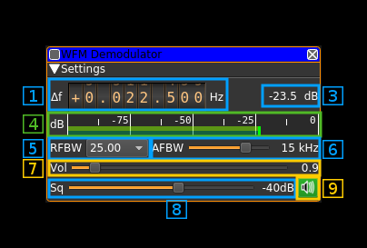

<h1>WFM demodulator plugin</h1>

<h2>Introduction</h2>

This plugin can be used to listen to a wideband or narrowband FM modulated signal. "Wideband" means that the bandwidth can vary from 40 to 250 kHz. It can also demodulate narrowband signals with bandwidths of 25 or 12.5 kHz.

<h2>Interface</h2>

<h3>1: Frequency shift from center frequency of reception</h3>

Use the wheels to adjust the frequency shift in Hz from the center frequency of reception. Left click on a digit sets the cursor position at this digit. Right click on a digit sets all digits on the right to zero. This effectively floors value at the digit position. Wheels are moved with the mousewheel while pointing at the wheel or by selecting the wheel with the left mouse click and using the keyboard arrows. Pressing shift simultaneously moves digit by 5 and pressing control moves it by 2.

<h3>3: Channel power</h3>

Average total power in dB relative to a +/- 1.0 amplitude signal received in the pass band.

<h3>4: Level meter in dB</h3>

  - top bar (green): average value
  - bottom bar (blue green): instantaneous peak value
  - tip vertical bar (bright green): peak hold value

<h3>5: RF bandwidth</h3>

This is the bandwidth in kHz of the channel signal before demodulation. It can be set in steps as 12.5, 25, 40, 60, 75, 80, 100, 125, 140, 160, 180, 200, 220 and 250 kHz.

<h3>6: AF bandwidth</h3>

This is the bandwidth of the audio signal in kHz (i.e. after demodulation). It can be set in continuous kHz steps from 1 to 20 kHz.

<h3>7: Volume</h3>

This is the volume of the audio signal from 0.0 (mute) to 10.0 (maximum). It can be varied continuously in 0.1 steps using the dial button.

<h3>8: Squelch threshold</h3>

This is the squelch threshold in dB. The average total power received in the signal bandwidth before demodulation is compared to this value and the squelch input is open above this value. It can be varied continuously in 0.1 dB steps from 0.0 to -100.0 dB using the dial button.

<h3>9: Audio mute and select audio output</h3>

Left click on this button to toggle audio mute for this channel. The button will light up in green if the squelch is open. This helps identifying which channels are active in a multi-channel configuration.

If you right click on this button this will open a dialog to select the audio output device.
