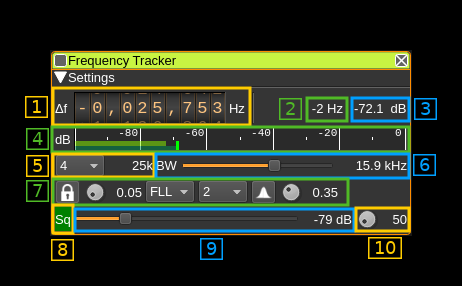
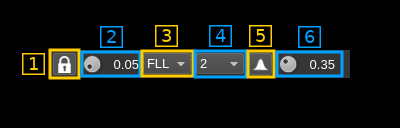

<h1>Frequency tracker plugin</h1>

<h2>Introduction</h2>

This plugin can be used to track the center frequency of a carrier. It will try to adjust its center frequency on the carrier center frequency. It is normally used in conjunction with a utility program that monitors the plugin center frequency via reverse API. This utility can then make use of this information to control other plugins or any other purpose.

&#9758; You will find the `freqtracking.py` (Python script) utility program that can be used to manage frequency tracking in the `scriptsapi` folder of this repository. More  details can be found in the `Readme.md` file in the same folder.

<h2>Interface</h2>

The top and bottom bars of the channel window are described [here](../../../sdrgui/channel/readme.md)

<h3>1: Frequency shift from center frequency of reception</h3>

When the tracking is active (7.1) with a FLL or PLL tracker (7.3) and the squelch is open (8) the tracking system will change the frequency shift automatically to try lock on the carrier center frequency.

Both manual and automatic controls are active at the same time and the user can force the center frequency at any one time but the tracker will try to lock it to the carrier again.

To change the frequency manually use the wheels to adjust the frequency shift in Hz from the center frequency of reception. Left click on a digit sets the cursor position at this digit. Right click on a digit sets all digits on the right to zero. This effectively floors value at the digit position. Wheels are moved with the mousewheel while pointing at the wheel or by selecting the wheel with the left mouse click and using the keyboard arrows. Pressing shift simultaneously moves digit by 5 and pressing control moves it by 2.

<h3>2: Instantaneous tracker error</h2>

This is the instantaneous frequency error in Hz. It is activated as soon as the FLL or PLL tracker is selected (7.3) regardless of the tracking activation (7.1)

&#9758; Note that the correction is limited to +/- 1/1000th of the channel sample rate in Hz. In the screenshot example the channel sample rate is 25 kS/s and thus the correction is effective only if the tracker error is larger that +/- 25 Hz.

<h3>3: Channel power</h3>

Average total power in dB relative to a +/- 1.0 amplitude signal received in the pass band.

<h3>4: Level meter in dB</h3>

  - top bar (green): average value
  - bottom bar (blue green): instantaneous peak value
  - tip vertical bar (bright green): peak hold value

<h3>5: Decimation factor</h3>

The baseband sample rate can be decimated by a power of 2 between 1 (no decimation) and 64 the resulting sample rate in kS/s is displayed on the right. The FLL and PLL will run at this sample rate.

<h3>8: RF bandwidth</h3>

This is the bandwidth in kHz of the channel signal before demodulation. Steps are in 0.1 kHz between 1 kHz and the limit set by the sample rate (equal in kHz to the sample rate in kS/s)

<h3>7: Tracker controls</h3>

<h4>7.1 Tracking toggle</h4>

Use this button to enable or disable tracking. When enable the locker is closed and when disabled it is opened.

It is also used to signal PLL lock with a green background. Note that the lock status cannot be determined for FLL.

<h4>7.2 Alpha factor of frequency error EMA</h4>

The frequency error is passed through an Exponential Moving Average (EMA) stage to smooth it out. This is the decrease factor or alpha in the formula:

Si = &alpha; xi + Si-1

Alpha can be set between 0.01 and 1.0

&#9758; The lower alpha the lesser new values influence the average and thus the smoother the variations but also the slower the system reacts and the longer the acquisition. So you may want to start with values from 0.5 to 1.0 and reduce the value as the tracking achieves the correct frequency to reduce jitter. You may also let the system take the time to reach the correct value progressively with alpha values from 0.01 to 0.1.

<h4>7.3 Tracker type selection</h4>

You may select the type of tracker with this combo box:

  - **No**: No tracking
  - **FLL**: Frequency Locked Loop suitable for CW and FM type signals covering also any kind of digital m-ary FSK modulation. &#9758; Note that for FM digital modulations the PLL may work also and sometimes with better stability.
  - **PLL**: Phase Locked Loop suitable for digital phase modulations i.e. m-ary PSK in power of two orders. The order can be selected with the combo on the right (7.4)

<h3>7.4 Order of PSK modulation</h3>

This is the order of m-ary PSK modulation for the PLL. It can be selected in powers of 2:

  - **1**: Continuous Wave (no modulation)
  - **2**: BPSK
  - **4**: QPSK
  - **8**: 8-PSK
  - **16**: 16-PSK
  - **32**: 32-PSK

<h3>7.5 Toggle root raised cosine filter</h3>

Use this toggle button to activate or de-activate the root raised cosine (RRC) filter. When active the bandpass boxcar filter is replaced by a RRC filter. This takes effect only in normal (DSB) mode (see control 14).

<h3>7.6 Tune RRC filter rolloff factor</h3>

This button tunes the rolloff factor (a.k.a alpha) of the RRC filter in 0.01 steps between 0.1 and 0.7. Default is 0.35.
<h3>8: Squelch open indicator</h3>

This indicator lights in green when the squelch is open. When the squelch is closed the tracking (if active) is suspended.

<h3>9: Squelch threshold</h3>

This is the squelch threshold in dB. The average total power received in the signal bandwidth before demodulation is compared to this value and the squelch input is open above this value. It can be varied continuously in 0.1 dB steps from 0.0 to -100.0 dB using the dial button.

<h3>10: Squelch time gate</h3>

Number of milliseconds following squelch gate opening after which the signal is declared open. 0 means squelch is declared open with no delay and is suitable for burst signals. The value can be varied in steps of 10 ms from 0 to 990 ms.

<h3>11: Spectrum display frequency span</h3>

The channel signal is decimated by a power of two before being applied to the channel spectrum display. It is a kind of zoom on the center of the spectrum.

<h3>12: Channel spectrum</h3>

This is the spectrum display of the tracker channel. When the tracker is locked to the signal the center of the channel should fall almost in the middle of the signal spectrum (ideally in the middle when the tracker error is zero). Thus the locking can be followed dynamically and it can be more reliable than the lock indicator. A channel marker shows the tracker offset from the channel center frequency (tracker error). Its width is the tracker error tolerance and is &plusmn;1/1000th of the channel width.  Details on the spectrum view and controls can be found [here](../../../sdrgui/gui/spectrum.md)
