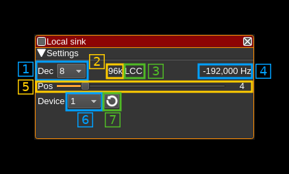
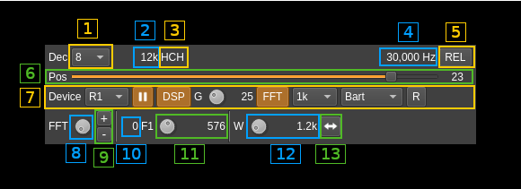
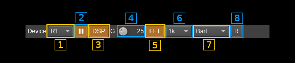

<h1>Local sink channel plugin</h1>

<h2>Introduction</h2>

This plugin sends I/Q samples from the baseband to a Local Input plugin source in another device set. It is basically the same as the Remote Sink channel plugin but pipes the samples internally instead of sending them over the network.

It may be used when you want to "zoom in" a particular area of the baseband. For example you would like to receive both the SSB section and the repeater section of the amateur 2m band (Region 1) using a single Rx device for example the RTL-SDR. You would then run the RTL-SDR at 2.4 MS/s without decimation. This provides a 2.4 MHz bandwidth that when centered on 145 MHz spans more than the entire 2m band (Region 1).

You can then use a Local Sink decimating by 8 and centered on 144.250 MHz (Position code 2, filter chain code LLH) thus spanning 300 kHz from 144.150 to 144.400 MHz. You can use another Local Sink decimating by 4 and centered on 145.600 MHz (Position code 7, filter chain code HC) thus spanning 600 kHz from 145.300 to 145.900 MHz and including the entire repeater band.

These Local Sinks can then be coupled with two Local Input device source plugins in two different device sets. In these device sets you will get a better view of the respective sub bands.

Note that because it uses only the channelizer half band filter chain to achieve decimation and center frequency shift you have a limited choice on the center frequencies that may be used (similarly to the Remote Sink). The available center frequencies depend on the baseband sample rate, the channel decimation and the filter chain that is used so you have to play with these parameters to obtain a suitable center frequency and pass band.

In addition it has some DSP stages that apply some transformations before sending the samples to the Local Input device that can be toggled vua (A.7.3):
  - A gain stage which gain in dB is controlled by (A.7.4)
  - A FFT multiband filter controlled by (A.7.6) to (A.13)

<b>&#9888; Important warning</b> When closing the application or before closing the local input device the local sink is connected it is recommended to stop processing on the local sink (7). Depending on the sequence by which the devices have been created closing the local input while the local sink runs may crash the program.

<h2>Interface</h2>

The top and bottom bars of the channel window are described [here](../../../sdrgui/channel/readme.md)

  - A: settings section
  - B: channel spectrum display (not detailed here)

<h3>A.1: Decimation factor</h3>

The device baseband can be decimated in the channel and its center can be selected with (5). The resulting sample rate of the I/Q stream sent over the network is the baseband sample rate divided by this value. The value is displayed in (2).

<h3>A.2: I/Q stream sample rate</h3>

This is the sample rate in kS/s of the I/Q stream sent to the Local Input source instance.

<h3>A.3: Half-band filters chain sequence</h3>

This string represents the sequence of half-band filters used in the decimation from device baseband to resulting I/Q stream. Each character represents a filter type:

  - **L**: lower half-band
  - **H**: higher half-band
  - **C**: centered

<h3>A.4: Center frequency shift</h3>

This is the shift of the channel center frequency from the device center frequency. Its value is driven by the device sample rate , the decimation (1) and the filter chain sequence (5).

<h3>A.5: Absolute or relative frequency scale display</h3>

Toggles channel spectrum (B) absolute or relative (to the center) frequency scale display

<h3>A.6: Half-band filter chain sequence</h3>

The slider moves the channel center frequency roughly from the lower to the higher frequency in the device baseband. The number on the right represents the filter sequence as the decimal value of a base 3 number. Each base 3 digit represents the filter type and its sequence from MSB to LSB in the filter chain:

  - **0**: lower half-band
  - **1**: centered
  - **2**: higher half-band

<h3>A.7: Global settings</h3>

<h4>A.7.1: Local Input source index</h4>

This selects the index of the Local Input source where to send the I/Q samples. The list can be refreshed with the next button (7)

<h4>A.7.2: Start/stop processing</h4>

Use this button to start or stop processing.

<h4>A.7.3: DSP functions</h4>

Togles DSP functions (gain and FFT filter)

<h4>A.7.4: Gain</h4>

This is the gain in dB applied to the channel

<h4>A.7.5: FFT filter</h4>

Toggles FFT multiband filter

<h4>A.7.6: FFT filter size</h4>

This is the FFT size of the multiband FFT filter

<h4>A.7.7: FFT filter window</h4>

This is the window type applied to the FFT filter

<h4>A.7.8: Reverse filter bands</h4>

When engaged the FFT filter bands are defined as reject bands instead of pass bands

<h3>A.8: FFT band index</h3>

FFT band selection. Index is displayed in (A.10)

<h3>A.9: FFT band add/delete</h3>

Add (`+`) new band or remove (`-`) selected band

<h3>A.10: Current FFT band index</h3>

Displays the index of the selected FFT band. Displays "0" if no FFT bands are available.

<h3>A.11: FFT band lower frequency relative position</h3>

This is the relative position to the center of the passband of the lower bound of the FFT band. The actual frequency shift from center is displayed on the right.

<h3>A.12: FFT band relative bandwidth or higher boumd</h3>

This is the relative badnwidth of the FFT band. The value displayed on the right is either the bandwidth or the higher frequency band depending on the (A.13) button setting.

<h3>A.13: Toggle bandwidth or higher frequency bound</h3>

Toggles display on (A.12)
