<h1>Radio Astronomy plugin</h1>

<h2>Introduction</h2>

The Radio Astronomy plugin provides a number of tools to help make radio astronomy measurements. It supports:

- A spectrometer for displaying time averaged spectra.
- A radiometer for displaying time averaged and optionally filtered continuum measurements (total power).
- Calibration to enable measurements to be displayed as noise temperatures (K), power (dBm/Watts) and spectral flux density (Jy).
- Utilities are included for estimation and calculation of noise temperature components (Tsys, Trx, Tgal, Tatm, Tsky, Tsp) and sensitivity (sigma Tsys and sigma Sv).
- Spectra can be displayed against frequency and velocity (with a configurable reference spectral line), with the velocity adjusted to topocentric, Solar System barycentric or the Local Standard of Rest (LSR) reference frames.
- Calculation and plotting of radial and Galactocentric distance to HI clouds, based on spectral peaks.
- Position of HI clouds can be sent to Star Tracker plugin for visualisation on the Galactic line-of-sight image and created in to an animation mapping out the Milky Way's spiral arms.
- A Gaussian fitting tool in the spectrometer for HI cloud kinetic temperature and column density estimation.
- A Gaussian fitting tool in the radiometer to enable antenna HPBW measurement from Solar drift-scans.
- Ability to record and plot real-time surface air temperature and other sensor measurements (component voltages / temperatures) alongside radiometer measurements.
- Ability to export charts to animated .png files and static image files.
- Reference spectra from the LAB (Leiden/Argentine/Bonn) Galactic HI survey can be automatically downloaded and plotted for comparison against user measurements.
- 2D sweeps can be made and plotted in different coordinate systems (Az/El, Galactic, offsets around a target and drift scans).
- All spectra are held in memory and can be scrolled through.
- Data can be saved and loaded from .csv files.
- Hardware for calibration (E.g. RF switches) can be automatically controlled.

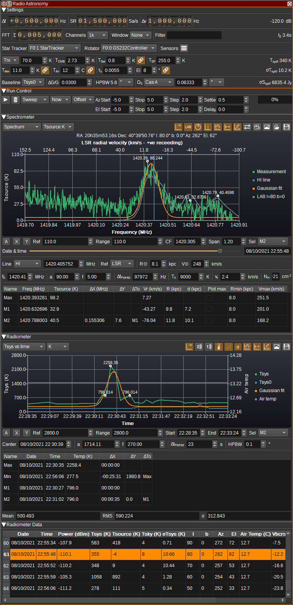

Several of the features in this plugin are tailored towards measurements of neutral hydrogen (HI) that is dispersed throughout the Milky Way's interstellar medium (ISM).
The HI in the ISM is a particularly interesting astronomical radiation source for SDR users, as the ground-state hyperfine transition of HI has a rest frequency of 1420.405MHz,
which is both quite powerful (due to the vast amount of HI spread throughout the Milky Way) and at a frequency that is easy to detect with relatively small dishes and low-cost LNAs and SDRs.
The HI spectrum can be used to determine some of the Milky Way's spiral structure and calculate rotation curves for the inner Milky Way, which suggest the presence of dark matter.

In radio astronomy it is common to use noise temperatures rather than power, via the relation:

    T=P/(k*B)

Where:

- T is the noise temperature in Kelvin
- P is power in Watts
- k is Boltzmann's constant
- B is bandwidth in Hertz

Similarly, for low frequencies (where the Rayleigh-Jeans approximation is valid), brightness temperatures are used rather than intensity:

    Tb=e*Iv*c^2/(2k*v^2)

Where:

- Tb is the brightness temperature in Kelvin
- e is the emissivity of the source
- Iv is the intensity of the source (power per unit solid angle at the frequency v)
- c is the speed of light
- v is the frequency in Hertz

This can be convenient, as if a large astronomical source completely fills the antenna beam with a uniform brightness temperature,
there will be an equal increase in the noise temperature measured by the receiver.
For thermal sources of radiation, the brightness temperature can also correspond directly to the physical temperature of the source.
This isn't true for non-thermal sources, however, such as synchrotron radiation.

In this plugin, the following notation is used for the different temperature sources and combinations:

- Trx - Receiver noise temperature. This is the combined noise temperature due to the LNA, feed line and SDR.
- Tcmb - Cosmic Microwave Background temperature (2.73K).
- Tgal - Galactic background temperature. An estimate of the frequency dependent background that is assumed to be the same in all directions.
- Tsky - Combined CMB, Galactic background and foreground as calculated in Star Tracker plugin using all-sky survey data.
- Tatm - Atmospheric emission, dependent upon frequency, opacity (which is dependent on temperature, pressure and water vapour) and elevation.
- Tsp - Spillover temperature due to thermal ground noise and other thermal noise sources such as trees and buildings around the antenna.
- Tair - Surface air temperature (In C, unlike all other temperatures which are in K).
- Tsource - Contribution from astronomical source (What we are typically trying to measure).
- Tsys0 - Total of all unwanted noise (Trx+Tcmb+Tgal+Tatm+Tsp).
- Tsys - System noise temperature. Sum of all received noise (Tsys0+Tsource).
- Tb - Brightness temperature of the source.
- Ta - Antenna temperature (which is typically Tcmb+Tgal+Tatm+Tsp+Tsource).

Care should be taken when comparing to definitions in the literature, as these vary significantly. In particular, Tsys can be defined to include or
exclude the astronomical source contribution and Ta can be just the source or all antenna noise.

For most astronomical observations, Tsource<<Tsys and so we need to integrate many measurements, such that Tsource is typically five times larger
than the random variations in the total noise (sigma_Tsys). The length of time and bandwidth required for this can be calculated from the
[practical radiometer equation](https://www.cv.nrao.edu/~sransom/web/Ch3.html#E158):

    sigma_Tsys = Tsys * sqrt(1/(B*tau) + (deltaG/G)^2)

Where:

- sigma_Tsys = Standard deviation / RMS of system noise temperature.
- Tsys is system noise temperature.
- B is bandwidth in Hertz.
- tau is the integration time in seconds.
- deltaG/G is the receiver gain variation.

<h2>1: Settings</h2>

The top and bottom bars of the channel window are described [here](../../../sdrgui/channel/readme.md)

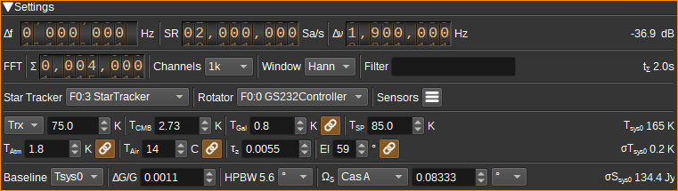

<h3>1.1: Frequency shift from center frequency of reception</h3>

Use the wheels to adjust the frequency shift in Hz from the center frequency of reception. Left click on a digit sets the cursor position at this digit.
Right click on a digit sets all digits on the right to zero. This effectively floors value at the digit position.
Wheels are moved with the mousewheel while pointing at the wheel or by selecting the wheel with the left mouse click and using the keyboard arrows.
Pressing shift simultaneously moves digit by 5 and pressing control moves it by 2.

<h3>1.2: SR - Sample Rate</h3>

Sample rate in millions of samples per second. This determines the maximum bandwidth for the radiometer and spectrometer and thus the maximum Doppler shift range.
Typically this should be set to match SDRangel's baseband sample rate.

<h3>1.3: BW - RF Bandwidth</h3>

This specifies the bandwidth of a LPF that is applied to the input signal to limit the RF bandwidth. This can be used to eliminate RFI.

<h3>1.4: Channel power</h3>

Average total power in dB relative to a +/- 1.0 amplitude signal received in the pass band.

<h3>1.5: Integration Count</h3>

Specifies the number of FFTs that are summed in each average. Higher integration counts increase measurement time, but also increase sensitivity (up to the limit imposed by receiver gain variation).

<h3>1.6: Channels</h3>

Specifies the number of channels (FFT bins). A larger number means an increased resolution in the spectrometer,
however, the sensitivity per bin is decreased for a fixed measurement time.

<h3>1.7: Window function</h3>

A windowing function to be applied before the FFT, to compensate for spectral leakage. This can be either:

- Rec: Rectangular or no windowing function. Use for broadband / continuum sources.
- Han: Hanning window. Use for narrowband / spectral line sources for better frequency resolution.

<h3>1.8: Filter</h3>

Specifies a list of FFT bins that will have their values replaced with the minimum of other FFTs bins. This can be used to filter inband RFI.

<h3>1.9: Integration Time</h3>

Displays in seconds or minutes how long it will take to make a single measurement. This is dependent on the sample rate (2), Integration Count (5) and number of channels (6).

<h3>1.10: Star Tracker</h3>

Specifies the Star Tracker feature that determines the observation target.
A corresponding Star Tracker feature is required to calculate and display numerous values within the Radio Astronomy plugin and also for performing sweeps.

<h3>1.11: Rotator</h3>

Specifies the rotator controller feature that is controlling the antenna used for measurements by the Radio Astronomy plugin.
This setting is used when sweeps are performed, to determine when rotation is complete and the antenna is pointing at the target.
If no rotator is used (and only drift scans are performed), this can be set to None.

<h3>1.12: Sensors</h3>

Opens the Sensors dialog.

The Sensors dialog allows two measurements such as voltage and temperature to be recorded and plotted along with radiometer data.
The sensor measurements are made using the VISA (Virtual Instruments Software Architecture) API, which is implemented in many
benchtop multimeters, oscilloscopes and spectrum analyzers.

Sensor measurements can be used to monitor temperatures and voltages that might have an impact on measurements. For example, the gain
on the LNA will be dependent upon both, and gain variations limit the benefit of increased integration counts on sensitivity.

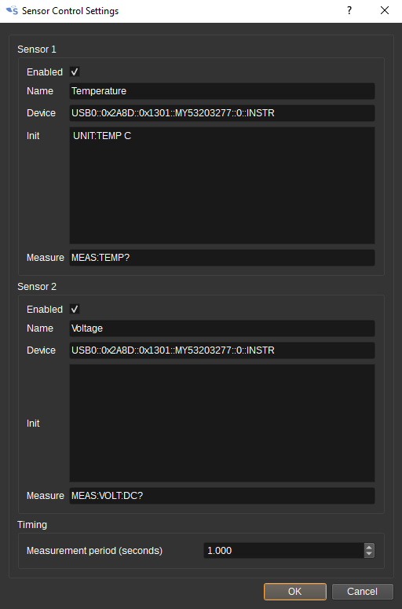

<h3>1.13: Trx/NF</h3>

Sets the receiver noise temperature in Kelvin or noise figure (NF) in dB. This is the noise temperature / figure for the combination of the LNA, feed line and SDR (at a specific gain setting).
The value set here can be measured using SDRangel's [Noise Figure plugin](https://github.com/f4exb/sdrangel/blob/master/plugins/channelrx/noisefigure/readme.md)
or estimated from datasheet values for the individual components using the [Friis formula](https://en.wikipedia.org/wiki/Friis_formulas_for_noise).

<h3>1.14: Tcmb</h3>

Sets the contribution to noise temperature from the Cosmic Microwave Background (CMB). This is 2.73K when an antenna is pointed at the Sky, but may be set to 0K if measurements are made
where there is no CMB contribution (E.g. if the feedhorn is covered with absorbing foam or a 50Ohm terminator or other noise source is used for calibration).

<h3>1.15: Tgal</h3>

Sets the contribution to the noise temperature from the Galactic background. This is frequency dependent and varies with direction. It does not include
the Galactic foreground (i.e. the increased noise temperature when looking in the Galactic plane).
If the link button to the right is unchecked, a value can be entered manually.
If the link button is checked, Tgal is calculated using:

    Tgal = 25.2 * (f/f0)^-2.75

Where:

- 25.2 is the 50th percentile of the all-sky distribution temperature.
- f is the center frequency.
- f0 is 408MHz.

Tgal is used in calibration to estimate Tsp.

<h3>1.16: Tsp</h3>

Sets spillover noise temperature. This is unwanted noise due to thermal ground radiation or other thermal radiation sources such as buildings and trees that can be picked
up via an antenna's side and back lobes.
It can be very dependent on azimuth and elevation in urban environments.
An estimate for Tsp can be made via the hot/cold calibration process.

<h3>1.17: Tatm</h3>

Contribution to noise temperature due to atmospheric emission. Atmospheric emission is dependent upon frequency, opacity (which is dependent on air temperature, pressure and water vapour) and antenna elevation.
If the link button to the right is unchecked, a value can be entered manually.
If the link button is checked, Tatm is calculated using:

   Tatm = Tair * (1 - exp(-tau_z*sec(el)))

Where:

- Tair is the surface air temperature from (18).
- tau_z is the zenith opacity from (19).
- el is the elevation of the antenna from (20)

<h3>1.18: Tair</h3>

Tair specifies the surface air temperature at the antenna location in degrees Celsius.
If the link button to the right is unchecked, a value can be entered manually.
If the link button is checked, Tair is set to the air temperature value received from the Star Tracker plugin, which itself is periodically downloaded from openweathermap.org for the antenna's location.

<h3>1.19: tau_z - Zenith Opacity</h3>

tau_z specifies the Zenith opacity. This value determines atmospheric absorption and emission. It is dependent upon air temperature, pressure and water vapour.

The default value of 0.0055 roughly corresponds to clear air as per ITU-R P.372-14 figure 5 at 1.4GHz.

<h3>1.20: El - Antenna Elevation</h3>

This specifies the antenna elevation in degrees. It is used for calculating atmospheric emission and absorption.
If the link button to the right is unchecked, a value can be entered manually.
If the link button is checked, El is automatically set to the elevation received from the Star Tracker plugin.

<h3>1.21: Tsys0</h3>

This displays the value of Tsys0, the system noise temperature without an astronomical source, which is calculated as:

    Tsys0=Trx+Tcmb+Tgal+Tsp+Tatm.

<h3>1.22: sigma Tsys0</h3>

This displays the value of sigma Tsys0, which is the standard deviation / RMS of Tsys0, and gives an indication of the sensitivity. It is calculated as:

    sigma_Tsys0 = Tsys0 * sqrt(1/(B*tau) + (deltaG/G)^2)

<h3>1.24: Baseline</h3>

Specifies the baseline used for calculating Tsource from Tsys. This can be:

- Tsys0 - Tsource = Tsys-Tsys0.
- Tmin - Tsource = Tsys-Tmin - where Tmin is the minimum in-band temperature.
- Tcold - Tsource = Tsys-Tcold - where Tcold is the cold calibration spectrum. This can be used for on/off source observations.

<h3>1.25: delta G / G - Gain Variation</h3>

delta G / G specifies the gain variation of the LNA / receiver. Gain variation places a limit on the sensitvity improvement available by increased integration counts.
This value is only used for the estimation of sigma_Tsys0 and sigma_Ssys0, it does not affect any measurements.

<h3>1.26: HPBW / Omega A</h3>

This displays the antenna half-power (-3dB) beamwidth (HPBW) in degrees or beam solid angle in steradians, as set in the Star Tracker plugins set by (10).

<h3>1.27: Omega S Type</h3>

This sets the type of astronomical source, with respect to its and the antenna beam's angular size:

- Unknown - Used for when the source is unknown. Brightness temperature (Tb) will not be able to be calculated.
- Compact - The source is smaller than the antenna beam. The source angle can be entered in (28).
- Extended - The source is larger than the antenna beam.
- Sun - The source is the Sun and the source angle is set to 0.53 degrees.
- CasA - The source is Cassiopeia A and the source is set to 0.08333 degrees.

<h3>1.28: Omega S</h3>

Enter the angle subtended by the astronomical source. This can be a diameter entered in degrees or solid angle in steradians.
Values for many astronomical sources are available in the [SIMBAD Astronomical Database](http://simbad.u-strasbg.fr/simbad/).

<h3>1.29: Omega S Units</h3>

Select whether Omega S is calculated from a diameter in degrees or solid angle in steradians.

<h3>2: Run Control</h3>

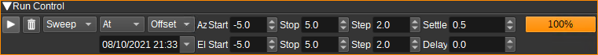

<h3>2.1: Start / Stop</h3>

Starts or stops measurements.

The Radio Astronomy plugin has this button in addition to SDRangel's device acquisition Start/stop button, so that the
SDR continues to run when measurements are not being taken. This can help to reduce small gain & frequency variations that may occur in a SDR
when it is turned on from cold.

<h3>2.2: Clear Measurements</h3>

Clears all measurements from memory. Calibration data is kept.

<h3>2.3: Run Mode</h3>

The run mode field determines the number of measurements that are made then the Start button is pressed.

- Single: A single measurement is made.
- Continuous: Measurements are continuously made until the Stop button is pressed.
- Sweep: Measurements are made at each of the coordinates specified by the sweep fields.

<h3>2.4: Start Time</h3>

The start time field determines when the measurements start after the Start button is pressed:

- Now: Measurements start immediately.
- At: Measurements start at the date and time specified in the date/time editor immediately below.

Delaying the start of the measurements can be used to ensure that the target has risen to its maximum elevation.

<h3>2.5: Sweep Parameters</h3>

The Sweep Type field determines the coordinates that are swept:

- Az/El - Coordinates are swept in azimuth then elevation.
- l/b - Coordinates are swept in Galactic longitude then latitude.
- Offset - Sweep values are azimuth and elevation offsets from the center of the target set in Star Tracker.

Here are some examples:

    Sweep Type: Az/El
    Az Start: 100
    Az Stop: 120
    Az Step: 10
    El Start: 80
    El Stop: 85
    El Step: 5
    Will measure at (Az,El): 100,80 110,80, 120,80 100,85 110,85, 120,85

    Sweep Type: Az/El
    Az Start: 15
    Az Stop: 345
    Az Step: -15
    El Start: 85
    El Stop: 85
    El Step: 0
    Will measure at (Az,El): 15,85 0,85, 345,85

    Sweep Type: l/b
    l Start: -60
    l Stop: 60
    l Step: 20
    b Start: 0
    b Stop: 0
    b Step: 0
    Will measure at (l,b): 300,0 320,0 340,0 0,0 20,0 40,0, 60,0

    Sweep Type: Offset
    Az Start: -5
    Az Stop: 5
    Az Step: 5
    El Start: -5
    El Stop: 5
    El Step: 5
    Target in Star Tracker: Sun
    Will measure at (Az,El): Sun-5,Sun-5 Sun,Sun-5 Sun+5,Sun-5 Sun-5,Sun Sun,Sun Sun+5,Sun Sun-5,Sun+5 Sun,Sun+5 Sun+5,Sun+5

The Settle field specifies a delay in seconds after antenna rotation has completed, before the measurement starts.

The Delay field specifies a delay in seconds after a measurement has completed, before the antenna is rotated for the next measurement.

<h3>2.6: Status</h3>

The measurement status bar shows how complete a measurement is in percent.

<h2>3: Spectrometer</h2>

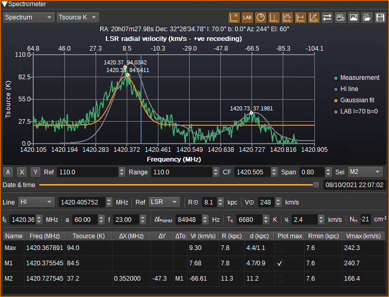

<h3>3.1: Spectrum Selection</h3>

This combo box selects between the display of measurement spectra and calibration spectra.

<h3>3.2: Y Axis Units</h3>

Selects the units for the Y-axis:

- dBFS displays received power in dB relative to fullscale.
- SNR displays the signal to noise ratio (where the noise is the cold calibration spectrum).
- dBm displays the received power in dBm (requires hot calibration).
- TSys K displays the system noise temperature in Kelvin (requires hot calibration).
- TSource K displays the astronomical source temperature in Kelvin (requires hot calibration).

<h3>3.3: Display Legend</h3>

Displays a legend at the side of the chart with the colour and name of each series.

<h3>3.4: Display LAB Reference Spectrum</h3>

When checked, a reference spectrum from the Leiden/Argentine/Bonn (LAB) Galactic HI survey corresponding to the current Galactic coordinates
and antenna HPBW will be downloaded and displayed along side the measured spectrum.
This allows a comparison between your HI measurements and that from a professional survey.

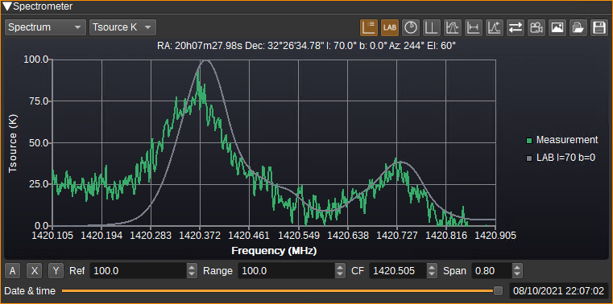

In order to reduce bandwidth to the server supplying this data, it is recommended to use this option sparingly.

If the series does not appear on Windows (and you see "SSL handshake failed" in the log file), you may need to open https://www.astro.uni-bonn.de/hisurvey/euhou/index.php in your Web browser first, so that the certificate for the website is downloaded.

<h3>3.5: Calculate and plot distance to HI gas clouds</h3>

When checked, the marker table will have six additional columns that display estimates of the distance to a HI cloud corresponding to the marker and the tangent point
along the line of sight.

- Vr is radial velocity of the cloud in km/s, relative to the selected reference frame.
- R is the distance from the cloud to the Galactic centre in kiloparsecs (kpc).
- d is the line-of-sight distance to the cloud in kpc. In some instances there can be two possible solutions.
- Plot max determines whether the smaller or larger solution to d is sent to the Star Tracker plugin for display.
- Rmin is the minimum distance to the Galactic centre in kiloparsecs (kpc) along the line of sight (i.e. at the tangent point).
- Vmax is the orbital velocity at the tangent point.

Vmax can be plotted against Rmin to determine the rotation curve of the Milky Way.
d can be plotted against Galactic longitude in Star Tracker to map out the Milky Way's spiral arms.

The spectrometer GUI will also display two additional fields, R0 and V0,
which allow you to enter the distance from the Sun to the Galactic centre and the Sun's orbital velocity
around the Galactic centre, which are used in the above calculations.

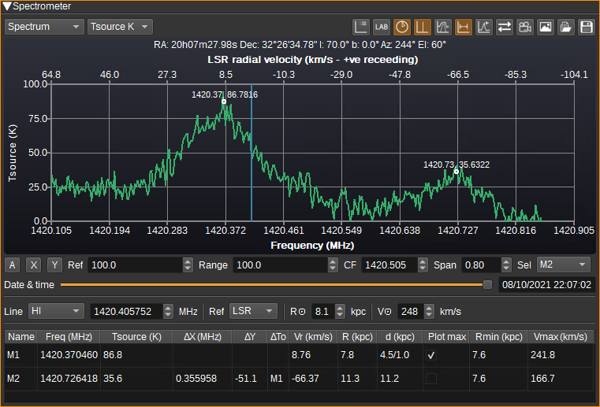

<h3>3.6: Display Reference Spectral Line</h3>

When checked, a horizontal axis showing Doppler shift in km/s is added to the top of the spectrometer chart and a vertical reference spectral line is plotted at 0km/s.
The rest frequency of the spectral line can be set via the reference spectral line field or manually entered.
The relationship between the frequency and velocity axes is determined by the selected reference frame.

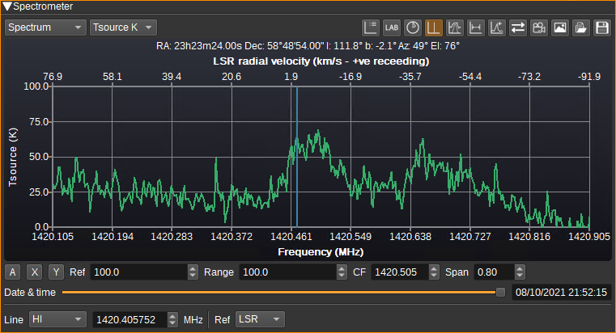

<h3>3.7: Display Gaussian Fitting Tools</h3>

When checked, the Gaussian fitting tools are displayed. These allow a Gaussian to be fitted to a spectral peak for kinetic temperature and column density estimation.

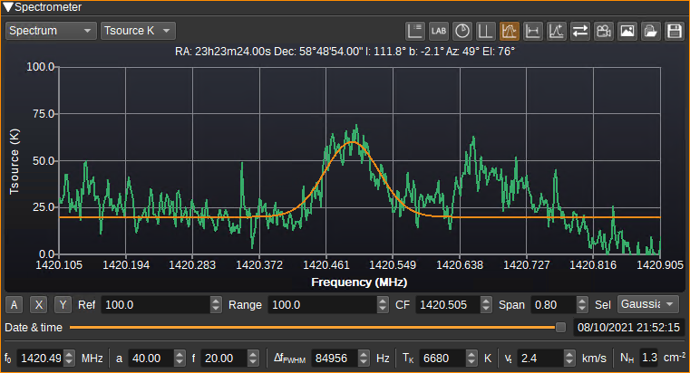

<h3>3.8: Display Markers</h3>

When checked, the marker table is displayed and the user may place two markers (M1 and M2) on the chart for accurate display of the corresponding values.

<h3>3.9: Display Peaks</h3>

When checked, the peak table is displayed and the peak Max marker is displayed at the maximum value in the spectrum.

<h3>3.10: Reverse X axis</h3>

When checked, the X axis is reversed. This allows switching between an axis that increases with frequency (which is most common in engineering) or increases with velocity (which is most common in radio astronomy).

<h3>3.11: Save Charts to an Animation File</h3>

Click to export all of the spectral measurements to a animated .png file.

<h3>3.12: Save Chart to an Image File</h3>

Click to save the current chart to an image file.

<h3>3.13: Load Data from a .csv File</h3>

Click to restore data that had been saved to a .csv file. All existing data will be cleared.

<h3>3.14: Save Data from a .csv File</h3>

Click to save all data to a .csv file.

<h3>3.15: Autoscale</h3>

When checked, continuously automatically scales both X and Y axis so all data is visible. When unchecked, the axis scales can be set manually.

<h3>3.16: Autoscale X</h3>

When clicked, automatically scales the X axis so all data is visible.

<h3>3.17: Autoscale Y</h3>

When clicked, automatically scales the Y axis so all data is visible.

<h3>3.18: Ref</h3>

Sets the reference level (maximum value) of the Y axis.

<h3>3.19: Range</h3>

Sets the range of the Y axis.

<h3>3.20: CF</h3>

Sets the centre frequency of the X axis.

<h3>3.21: Span</h3>

Sets the span (range) of the X axis.

<h3>3.22: Sel</h3>

Selects what is selected when clicking on the chart:

- M1 sets position of marker 1
- M2 sets position of marker 2
- Gaussian sets peak of Gaussian

<h3>3.23: Date & Time</h3>

Allows the user to scroll through and select the recorded spectra, showing the date and time they were measured at.

<h3>3.24: Line</h3>

Specifies the rest frequency of the reference spectral line:

- HI neutral hydrogen at 1420.405760MHz.
- OH hydroxyl at 1612.231040Mhz.
- DI neutral deuterium at 327.384MHz.
- Custom allows a user-defined frequency in MHz to be entered.

<h3>3.25: Reference Frame</h3>

Determines the reference frame used for calculating velocities from frequency.

- Topo is a topocentric reference frame (i.e. relative to the observation location).
- BCRS is the barycentric celestial reference system (i.e. relative to the Solar System's barycenter (centre of mass)).
- LSR is the local standard of rest (i.e. relative to the local standard of rest, which accounts for the Sun's movements relative to other nearby stars).

Professional astronomers tend to plot spectra using the LSR, so any observed Doppler shift can assumed to be due to the source moving.

<h3>3.26: R0</h3>

Specifies the distance of the Sun from the Galactic centre in kpc.

<h3>2.27: V0</h3>

Specifies the orbital velocity of the Sun around the Galactic centre in km/s.

<h3>3.28: f0</h3>

Specifies the frequency of the centre of the Gaussian in MHz.

<h3>3.29: a</h3>

Specifies the amplitude of the Gaussian. Units correspond to the Y axis units.

<h3>3.30: f</h3>

Specifies the floor (minimum value of the Gaussian). Units correspond to the Y axis units.

<h3>3.31: Delta f FHWM</h3>

Specifies the full-width at half maximum of the Gaussian in Hertz.

<h3>3.32: Tk</h3>

An estimate of kinetic temperature in Kelvin of a HI cloud whose spectral profile matches the Gaussian.

Note that it's not possible to determine how much spectral broadening is due to kinetic temperature and
how much is due to turbulent velocity, as from a single measurement, there is no way
to distinguish between the two.

<h3>3.33: Vt</h3>

An estimate of the turbulent velocity within a HI cloud whose spectral profile matches the Gaussian.

<h3>3.24: NH</h3>

Estimated column density of an optically thin HI cloud whose spectral profile matches the Gaussian,
measured in HI atoms per square centimetre.

<h3>3.25: Marker Table</h3>

The marker table displays corresponding values for markers that are placed on the chart.

<h2>4: Radiometer</h2>

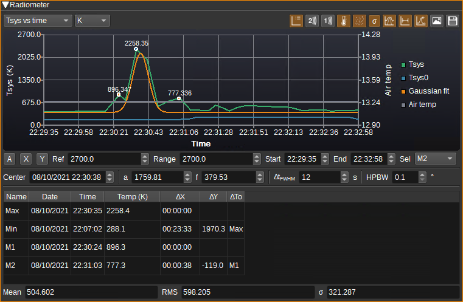

<h3>4.1: Chart Selection</h3>

This field selects between the display of power, temperature and flux in one or two dimensions.

<h3>4.2: Y Axis Units</h3>

Selects the units for the Y-axis:

- dBFS displays received power in dB relative to fullscale.
- dBm displays the received power in dBm (requires hot calibration).
- dBm displays the received power in Watts (requires hot calibration).
- K displays the temperature in Kelvin (requires hot calibration).
- SFU displays the flux in Solar Flux units (requires hot calibration).
- Jy displays the flux in Jansky (requires hot calibration).

<h3>4.3: Display Legend</h3>

Displays a legend at the side of the chart with the colour and name of each series.

<h3>4.4: Plot Sensor 2</h3>

Plot the data recorded for sensor 2 on the chart.

<h3>4.5: Plot Sensor 1</h3>

Plot the data recorded for sensor 1 on the chart.

<h3>4.6: Plot Air Temperature</h3>

Plot the surface air temperature data received from Star Tracker on the chart.

<h3>4.7: Plot Tsys0</h3>

Plot Tsys0 on the chart.

<h3>4.8: Plot Filtered Measurement</h3>

Plot a filtered version of the measurement. The filter can either be a moving average or a median filter, with a configurable window size.

<h3>4.9: Plot Measurement</h3>

Plot measured data on the chart.

<h3>4.10: Display Statistics</h3>

Displays statistics calculated across all measurements (not just those visible on the chart), including the mean, RMS and standard deviation.

<h3>4.11: Display Gaussian Fitting Tools</h3>

When checked, the Gaussian fitting tools are displayed. These allow a Gaussian to be fitted to the data, allowing measurement of the HPBW of the antenna.

<h3>4.12: Display Markers</h3>

When checked, the marker table is displayed and the user may place two markers (M1 and M2) on the chart for accurate display of the corresponding values from the measurement series.

<h3>4.13: Display Peaks</h3>

When checked, the marker table is displayed and the peak Max and Min markers are displayed at the maximum and minimum values on the measurement series.

<h3>4.14: Save Chart to an Image File</h3>

Click to save the current chart to an image file.

<h3>4.15: Save Data to a .csv File</h3>

Click to save data from the Radiometer Data table to a .csv file.

<h3>4.16: Autoscale</h3>

When checked, continuously automatically scales both X and Y axis so all data is visible. When unchecked, the axis scales can be set manually.

<h3>4.17: Autoscale X</h3>

When clicked, automatically scales the X axis so all data is visible.

<h3>4.18: Autoscale Y</h3>

When clicked, automatically scales the Y axis so all data is visible.

<h3>4.19: Ref</h3>

Sets the reference level (maximum value) of the Y axis.

<h3>4.20: Range</h3>

Sets the range of the Y axis.

<h3>4.21: Start</h3>

Sets the start time of the X axis.

<h3>4.22: End</h3>

Sets the end time of the X axis.

<h3>4.23: Sel</h3>

Selects what is selected when clicking on the chart:

- Row highlights the corresponding row in the Radiometer Data table to the point clicked.
- M1 sets position of marker 1
- M2 sets position of marker 2
- Gaussian sets peak of Gaussian

<h3>4.24: Center</h3>

Specifies the date and time of the center of the Gaussian.

<h3>4.25: a</h3>

Specifies the amplitude of the Gaussian. Units correspond to the Y axis units.

<h3>4.26: f</h3>

Specifies the floor (minimum value of the Gaussian). Units correspond to the Y axis units.

<h3>4.27: Delta t FHWM</h3>

Specifies the full-width at half maximum of the Gaussian in seconds.

<h3>4.28: HPBW</h3>

An estimate of the HPBW in degrees of an antenna whose main lobe corresponds to the Gaussian profile of a drift scan of the Sun, using a linear scale (E.g. Y axis must not be in not dB).

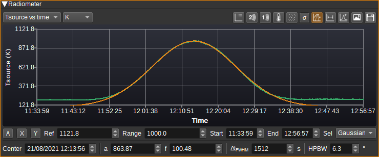

<h3>4.29: Filter</h3>

Specifies the type of filter to use for the filtered measurement series. This can either be a moving average or a median filter.

<h3>4.30: Filter Window Size</h3>

Specifies the window size for the filter.

<h3>4.31: Marker Table</h3>

The marker table displays corresponding values for markers that are placed on the chart.

<h2>5: Radiometer 2D Map</h2>

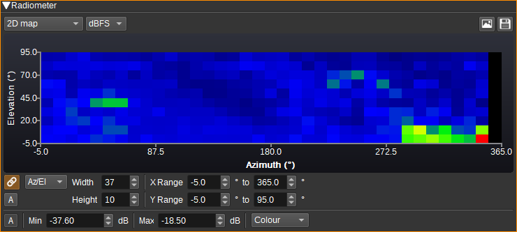

<h3>5.1: Link Sweep</h3>

When checked, the parameters for the 2D Map will be automatically updated based on the Run Control sweep parameters.

<h3>5.2: Sweep Type</h3>

Sets the coordinates used for the axes of the map.

<h3>5.3: Width</h3>

Width in pixels of the map. Typically there should be one pixel per measurement.

<h3>5.4: Height</h3>

Height in pixels of the map.

<h3>5.5: X Range</h3>

Specifies the range of the 2D map's horizontal axis. This determines how measurements map to pixels.

<h3>5.6: Y Range</h3>

Specifies the range of the 2D map's vertical axis.

<h3>5.7: Autoscale</h3>

Automatically scales the X and Y axes to fit the Radiometer data in the table.

<h3>5.8: Colour Autoscale</h3>

Automatically scales the colour palette to the range of existing values in the Radiometer data table.

<h3>5.9: Min</h3>

Specifies the value that maps to the first colour in the palette. All values lower than this will be clipped to the first colour.

<h3>5.10: Max</h3>

Specifies the value that maps to the last colour in the palette. All values higher than this will be clipped to the last colour.

<h3>5.11: Palette</h3>

Specifies the palette / gradient used to plot the 2D map. This can either be colour or greyscale. The gradient is applied linearly between the Min and Max values.

<h2>6: Radiometer Data</h2>

The Radiometer Data table shows measurement results and settings at the time of measurement in tabular form.

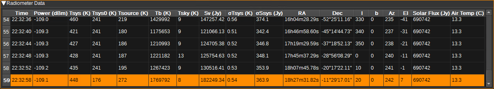

The columns in the table include:

- Date - Local date at the end of the measurement.
- Time - Local time at the end of the measurement.
- Power (FFT) - Power relative to fullscale (sum of FFT absolute magnitude).
- Power (dBFS) - Power in dBFS.
- Power (dBm) - Power in dBm.
- Tsys (K) - System noise temperature in Kelvin.
- Tsys0 (K) - System noise temperature (excluding Tsource) in Kelvin.
- Tsource (K) - Source noise temperature in Kelvin.
- Tb (K) - Source brightness temperature in Kelvin.
- Tsky (K) - Sky temperature in Kelvin towards the target from Star Tracker.
- Sv (Jy) - Spectral flux density in Jansky.
- sigmaTsys (K) - Standard deviation of Tsys in Kelvin.
- sigmaSsys (Jy) - Standard deviation of Sv in Jansky.
- omegaA (sr) - Antenna beam solid angle.
- omegaS (sr) - Source solid angle.
- RA - Right ascension of target from Star Tracker.
- Dec - Declination of target from Star Tracker.
- l - Galactic longitude of target from Star Tracker.
- b - Galactic latitude of target from Star Tracker.
- Az - Azimuth of target from Star Tracker.
- El - Elevation of target from Star Tracker.
- Vbcrs - Observer velocity relative to barycentric celestial reference system (BCRS).
- Vlsr - Observer velocity relative to local standard of rest (LSR).
- Solar Flux (jy) - Solar flux from Star Tracker.
- Air Temp (C) - Surface air temperature at observation point in Celsius from Star Tracker.
- Sensor 1 - Data recorded for Sensor 1.
- Sensor 2 - Data recorded for Sensor 2.
- UTC - UTC date and time at the end of the measurement.

Right clicking on the table shows a popup menu that supports:

- Copying the value in the cell to the clipboard
- Deleting the selected rows
- Applying the current values of Tsys0, baseline and omega S to recalculate Tsource, Tb and Sv.

<h2>7: Calibration</h2>

Power measurements in SDRs are typically relative (E.g. dBFS) rather than absolute (E.g. dBm). In order to produce absolute power measurements,
and thus noise temperature measurements, we need to perform a calibration process that calculates a mapping from the relative power value to an absolute value.
Also, there are multiple unwanted noise sources that contribute to the measured power (LNA and receiver noise, for example),
that we wish to subtract from our power measurement, to get a measurement of the power of the radiation received from the astronomical object we are observing.

The first step is to measure the noise of the receiver, Trx. This is the combined noise of the LNA, feed line and SDR, for a particular gain setting.
This can be measured with a calibrated noise source connected to the LNA input using SDRangel's [Noise Figure plugin](https://github.com/f4exb/sdrangel/blob/master/plugins/channelrx/noisefigure/readme.md),
or estimated from datasheet values for the individual components using the [Friis formula](https://en.wikipedia.org/wiki/Friis_formulas_for_noise).
It is also possible to calculate this within the Radio Astronomy plugin by running a hot and cold calibration. The plugin will then use the Y factor method
to estimate Trx, and this will be displayed in the Trx field, below the chart. Whatever method is used, the value should be entered in to the Trx field in the Settings area.

In order to map relative powers to absolute powers (and temperatures), a hot calibration should be run. To run a hot calibration, the noise
temperature of the calibration source is entered in to the Thot field (or power into Phot) and then press the "Start hot calibration" button. (The process
is likewise to run a cold calibration). The main consideration for a user, is what can be used as a calibration source and how is it connected to the antenna/receiver.
There are two ways, with and without an antenna:

For parabolic dishes or horn antennas, an object at a known temperature can be used, so long as it completely covers the feed horn aperture.
The object needs to be as close to an ideal blackbody as possible, with high emissivity at the frequencies of interest, so that the temperature
of the object results in an identical increase in noise temperature in the antenna. If the dish is steerable to point towards the ground, the temperature
of the ground may be used.

It is also possible to calibrate by directly connecting a noise source to the LNA input. This could be as simple as 50Ohm termination resistor,
which should result in a noise temperature corresponding to the physical temperature of the resistor, assuming good impedance matching and very low insertion loss.

One large unknown can be the spillover temperature, Tsp. This is the noise contribution due to ground or building thermal radiation leaking in
to the feed horn from the back or side lobes. Once Trx is known, is possible to estimate Tsp by performing a hot and cold calibration,
where the hot calibration uses an object blocking the feed, but the cold calibration has the feed unblocked pointing to a cold part of the sky.
The temperature of the cold sky can be estimated from an all-sky survey in Star Tracker, and this is displayed under the calibration chart as Tsky.
If Thot is measured with Tsp=0, Tcold is Tsky, and Trx is known, then the plugin can estimate Tsp for the cold measurement. Note that Tsp is typically strongly
dependent on the antenna's elevation and azimuth, as this changes the amount of ground thermal radiation that gets in to the antenna.

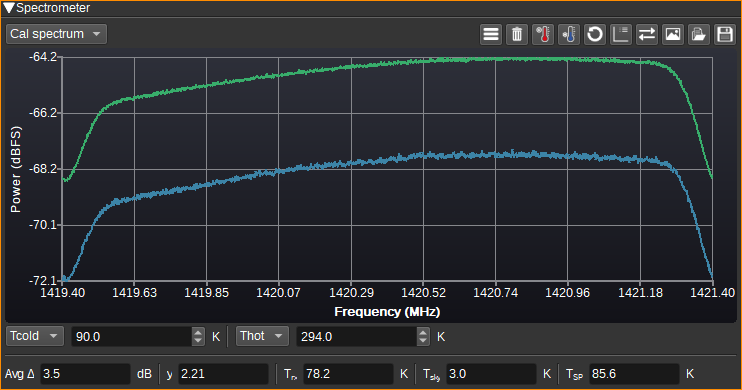

<h3>7.1: Show Calibration Settings Dialog</h3>

When clicked, shows the Calibration Settings dialog.

The Calibration Settings dialog allows a user to control hardware used for calibration. It supports two methods: GPIO pins in a SDR can be toggled during calibration and/or
commands/scripts can be run before and after calibration. The pre-calibration delay setting specifies a delay in seconds between the GPIO being toggled or start command
being executed, before the calibration routine in the plugin starts.

An example of its use would be to electronically switch in a 50Ohm resistor to the LNA input when calibration is run, using one of the SDR's GPIO pins to control the RF switch.

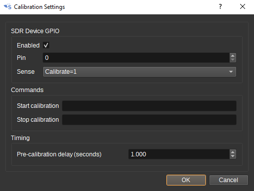

<h3>7.2: Clear Calibration Data</h3>

Clears all calibration data.

<h3>7.3: Start Hot Calibration</h3>

Starts a measurement that will be used as the hot calibration data.

<h3>7.4: Start Cold Calibration</h3>

Starts a measurement that will be used as the cold calibration data.

<h3>7.5: Recalibrate All Measurements</h3>

When checked, results of a new calibration will be applied to all existing measurements. When unchecked, the calibration will only apply to new measurements.

<h2>Frequency Accuracy</h2>

When measuring Doppler shifts in order to estimate velocity, it is important to use an accurate clock source for the SDR.
For example, a 5ppm XO at 1420MHz could have a frequency error of 7.1kHz, resulting in an velocity error of 1.5km/s.
A GPSDO can be 1000x more accurate, at less than 1ppb.

<h2>API</h2>

Full details of the API can be found in the Swagger documentation. Here is a quick example of how to start a measurement from the command line:

    curl -X POST "http://127.0.0.1:8091/sdrangel/deviceset/0/channel/0/actions" -d '{"channelType": "RadioAstronomy",  "direction": 0, "RadioAstronomyActions": { "start": {"sampleRate": 2000000} }}'

Or to set the sample rate:

    curl -X PATCH "http://127.0.0.1:8091/sdrangel/deviceset/0/channel/0/settings" -d '{"channelType": "RadioAstronomy", "direction": 0, "RadioAstronomySettings": {"sampleRate": 2000000}}'

<h2>Attribution</h2>

Many equations are from Essential Radio Astronomy by James Condon and Scott Ransom: https://www.cv.nrao.edu/~sransom/web/xxx.html

The Leiden/Argentine/Bonn (LAB) Survey of Galactic HI: https://arxiv.org/abs/astro-ph/0504140 and EU-HOU project: https://www.astro.uni-bonn.de/hisurvey/euhou/index.php

Thermometer icons are by Freepik from https://www.flaticon.com/

Reverse icon by Creaticca Creative Agency from https://www.flaticon.com/
