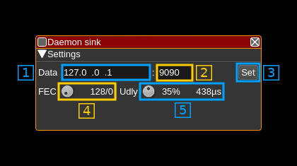

<h1>Remote sink channel plugin</h1>

<h2>Introduction</h2>

This plugin sends I/Q samples from the baseband via UDP to a distant network end point. It can use FEC protection to prevent possible data loss inherent to UDP protocol.

<h2>Build</h2>

The plugin will be built only if the [CM256cc library](https://github.com/f4exb/cm256cc) is installed in your system. For CM256cc library you will have to specify the include and library paths on the cmake command line. Say if you install cm256cc in `/opt/install/cm256cc` you will have to add `-DCM256CC_DIR=/opt/install/cm256cc` to the cmake commands.

<h2>Interface</h2>

The top and bottom bars of the channel window are described [here](../../../sdrgui/channel/readme.md)

<h3>1: Decimation factor</h3>

The device baseband can be decimated in the channel and its center can be selected with (5). The resulting sample rate of the I/Q stream sent over the network is the baseband sample rate divided by this value. The value is displayed in (2).

<h3>2: Network I/Q stream sample rate</h3>

This is the sample rate in kS/s of the I/Q stream sent over the network.

<h3>3: Half-band filters chain sequence</h3>

This string represents the sequence of half-band filters used in the decimation from device baseband to resulting I/Q stream. Each character represents a filter type:

  - **L**: lower half-band
  - **H**: higher half-band
  - **C**: centered

<h3>4: Center frequency shift</h3>

This is the shift of the channel center frequency from the device center frequency. Its value is driven by the device sample rate , the decimation (1) and the filter chain sequence (5).

<h3>5: Half-band filter chain sequence</h3>

The slider moves the channel center frequency roughly from the lower to the higher frequency in the device baseband. The number on the right represents the filter sequence as the decimal value of a base 3 number. Each base 3 digit represents the filter type and its sequence from MSB to LSB in the filter chain:

  - **0**: lower half-band
  - **1**: centered
  - **2**: higher half-band

<h3>6: Distant address</h2>

IP address of the distant network interface from where the I/Q samples are sent via UDP

<h3>7: Data distant port</h2>

Distant port to which the I/Q samples are sent via UDP

<h3>8: Validation button</h3>

When the return key is hit within the address (1) or port (2) the changes are effective immediately. You can also use this button to set again these values.

<h3>9: Desired number of FEC blocks per frame</h3>

This sets the number of FEC blocks per frame. A frame consists of 128 data blocks (1 meta data block followed by 127 I/Q data blocks) and a variable number of FEC blocks used to protect the UDP transmission with a Cauchy MDS block erasure correction. The two numbers next are the total number of blocks and the number of FEC blocks separated by a slash (/).

<h3>10: Transmission sample size</h3>

Number of bytes per I or Q sample in transmission.
