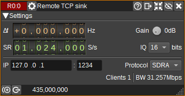
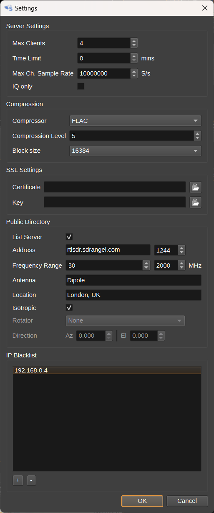

<h1>Remote TCP Sink Channel Plugin</h1>

<h2>Introduction</h2>

The Remote TCP Sink Channel plugin sends I/Q samples from the baseband via TCP/IP or a Secure WebSocket across a network to a client application.
The client application could be SDRangel using the [Remote TCP Input](../../samplesource/remotetcpinput/readme.md) plugin or an rtl_tcp compatible application.
This means that applications using rtl_tcp protocol can connect to the wide variety of SDRs supported by SDRangel.

While the plugin supports rtl_tcp's RTL0 protocol for compatibility with older applications, the newer SDRA protocol supports the following additional features:

- Different bit depths (8, 16, 24 or 32),
- Additional settings, such as decimation, frequency offset and channel gain,
- Device settings can be sent to the client for display,
- IQ compression, using FLAC or zlib, to reduce network bandwidth,
- IQ squelch, to reduce network bandwidth when no signal is being received,
- Real-time forwarding of device/antenna position and direction to client,
- Text messaging between clients and server,
- Use of either TCP or WSS (WebSocket Secure Protocol).

The Remote TCP Sink can support multiple clients connected simultaneously, with a user-defined maximum client limit. Clients can also have a time limit applied.

Connection details can optionally be sent to a public database at https://sdrangel.org to allow operation as a WebSDR. Public servers are viewable on the [Map Feature](../../feature/map/readme.md).

<h2>Interface</h2>

<h3>1: Frequency shift from center frequency of reception</h3>

This is the shift of the channel center frequency from the device center frequency.
This is used to select the desired part of the signal when the channel sample rate is lower than the baseband sample rate.

<h3>2: Gain</h3>

Sets a gain figure in dB that is applied to I/Q samples before transmission via TCP/IP.
This option may be useful for amplifying very small signals from SDRs with high-dynamic range (E.g. 24-bits), when the network sample bit-depth is 8-bits.

<h3>3: Channel power</h3>

Average total power in dB relative to a +/- 1.0 amplitude signal received in the pass band.

<h3>4: Level meter in dB</h3>

  - top bar (green): average value
  - bottom bar (blue green): instantaneous peak value
  - tip vertical bar (bright green): peak hold value

<h3>5: IQ Squelch</h3>

Check to enable IQ squelch. When IQ squelch is enabled, if the channel power falls below the specified power level (6), 
the plugin will squelch (suppress) all the signal and noise in the channel,
so that it can be transmitted at a very high compression ratio, reducing network bandwidth. 

This option is particularly suitable for packetised data, where the client doesn't need to receive the noise between packets.

<h3>6: IQ Squelch power level</h3>

Sets the power level in dB, below which, IQ data will be squelched.

<h3>7: IQ Squelch gate time</h3>

Sets the IQ squelch gate time. The units can be us (microseconds), ms (milliseconds) or s (seconds).

<h3>8: IQ Squelch indicator</h3>

When IQ squelch is enabled, the icon will have a green background when a signal above the power level (6) is being transmitted and a grey background when the signal is squelched.

<h3>9: Sample rate</h3>

Specifies the channel and network sample rate in samples per second. If this is different from the baseband sample rate, the baseband signal will be decimated to the specified rate.

<h3>10: Sample bit depth</h3>

Specifies number of bits per I/Q sample transmitted via TCP/IP.

<h3>11: IP address</h3>

IP address of the local network interface on which the server will listen for TCP/IP connections from network clients. Use 0.0.0.0 for any interface.

<h3>12: Port</h3>

TCP port on which the server will listen for connections.

<h3>13: Protocol</h3>

Specifies the protocol used for sending IQ samples and metadata to clients:

- RTL0: Compatible with rtl_tcp - limited to 8-bit IQ data.
- SDRangel: Enhanced version of protocol via TCP Socket.
- SDRangel wss: SDRangel protocol via a WebSocket Secure instead of a TCP Socket. You should use this if you wish to allow connections from the WebAssembly version of SDRangel.

<h3>14: Display Settings</h3>

Click to open the Settings Dialog.

<h4>Max Clients</h4>

Specify the maximum number of clients than can connect simultaneously.
If additional clients attempt to connect, they will be held in a queue.

<h4>Time Limit</h4>

Specify a time limit in minutes for each client connection. Use 0 for no limit.
After the time limit expires, a client will be disconnected. 
They will be allowed to reconnect if the maximum number of clients is not reached.

<h4>Max Channel Sample Rate</h4>

Specify the maximum channel sample rate that can be set. This allows a limit to be set on network bandwidth.

<h4>IQ only</h4>

When checked, only uncompressed IQ samples will be transmitted. This is for compatibilty with client software expecting the RTL0 protcol.
Checking this option will disable support for compression, messaging, device location and direction.

<h4>Compressor</h4>

Specify the compressor to use. This can be FLAC or zlib.

<h4>Compression Level</h4>

Specifies the compression effort level. Higher settings can improve compression, but require more CPU time.

<h4>Block size</h4>

Specify the block size the compressor uses. Larger block sizes improve compression, but add latency.
Generally it should be fine to use the largest setting, unless the sample rate is very low.

<h4>SSL Certificate</h4>

Specify an SSL certificate .pem file. This is required to use SDRangel wss protocol.
This file can be generated in the same way as for a web server.

<h4>SSL Key</h4>

Specify an SSL key .pem file. This is required to use SDRangel wss protocol.
This file can be generated in the same way as for a web server.

<h4>List Server</h4>

Check to list the server in a public directory on https://sdrangel.com.
This will allow other users to find and connect to the server via the [Map Feature](../../feature/map/readme.md).

<h4>Address</h4>

Public IP address or hostname and port number to access the server.
The port number specified here may differ from (12) if your router's
port forwarding maps the port numbers.

<h4>Frequency Range</h4>

Specify minimum and maximum frequencies that users can expect to receive on.
This will typically depend on the SDR and antenna.
For information only and will be displayed on the [Map](../../feature/map/readme.md).

<h4>Antenna</h4>

Optionally enter details of the antenna. 
For information only and will be displayed on the [Map](../../feature/map/readme.md).

<h4>Location</h4>

Optionaly enter the location (Town and Country) of the antenna.
For information only and will be displayed on the [Map](../../feature/map/readme.md).
The position the SDRangel icon will be plotted on the Map will be
taken from the device itself, which for most devices, will default
to the position in Preferences > My Position.

<h4>Isotropic</h4>

Check to indicate the antenna is isotropic (non-directional).
When unchecked, the direction the antenna points in can be specified below.

<h4>Rotator</h4>

Specify a Rotator feature that is controlling the direction of the antenna.
Set to None to manually set the direction the antenna points.

<h4>Direction</h4>

Specify the direction the antenna is pointing, as Azimuth in degrees and Elevation in degrees.

<h4>IP Blacklist</h4>

Specify a list of IP addresses that will be prevented from connecting to the server.

<h3>15: Remote Control</h3>

When checked, remote clients will be able to change device settings. When unchecked, client requests to change settings will be ignored.

<h3>16: TX</h3>

When pressed, the text message (18) will be transmitted to the clients specified by (17).

<h3>17: TX Address</h3>

Specifies the TCP/IP address and port of the client that the message should be transmitted to, or ALL, if it should be transmitted to all clients.

<h3>18: TX Message</h3>

Specifies a text message to transmit to clients, when the TX button (16) is pressed.

<h3>19: RX Messages</h3>

Displays text messages received from clients.

<h3>20: Connection Log</h3>

Displays the IP addresses and TCP port numbers of clients that have connected, along with when they connected and disconnected
and how long they were connected for.
