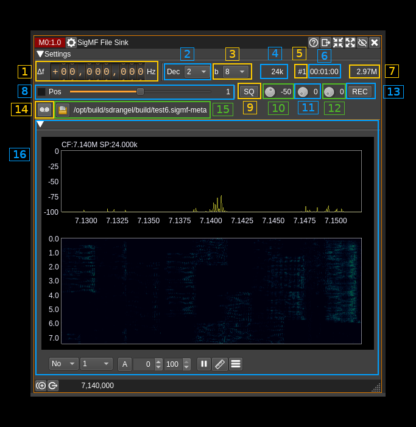

<h1>SigMF File Recorder</h1>

<h2>Introduction</h2>

Use this plugin to record its channel IQ data in [SigMF](https://github.com/gnuradio/SigMF/blob/master/sigmf-spec.md) format. The baseband sample rate can be decimated by a factor of two and its center shifted to accommodate different requirements than recording the full baseband. More than one such plugin can be used in the same baseband to record different parts of the baseband spectrum. Of course in this case file output collision should be avoided.

Such files can be read in SDRangel using the [SigMF file input plugin](../../samplesource/sigmffileinput/readme.md). This plugin will use extensions to the basic SigMF specification that are specific to SDRangel. However any other software if correctly implemented should ignore these extensions and still be able to read the file possibly with a loss in functionality.

As per SigMF specifications two files are created in fact.
  - One with `.sigmf-meta` extension contains meta data and details to find the different captures in the data file blob. It is written in JSON format and is human readable. You can refer to SigMF documentation in the link at top to read about the details.
  - Another with `.sigmf-data` contains the IQ data as a blob indexed by structures in the `.sigmf-meta` file. Thus to the SigMF file reader data appears as a sequence of captures having independent start time and length, center frequency and with SDRangel specific extensions independent sample rates.

If a filename is given without `.sigmf-meta` extension then the `.sigmf-meta` extension is appended automatically.
If a filename is given with an extension different of `.sigmf-meta` then the extension is replaced by `.sigmf-meta` automatically.

If the couple `.sigmf-meta`, `.sigmf-data` exists for a file set and it was recorded by SDRangel then new data will be appended as new captures.

It adds a dependency to the [libsigmf library](https://github.com/f4exb/libsigmf) more specifically the `f4exb` fork that supports `multirecordings` and `sdrangel` extensions.

<h2>Interface</h2>

The top and bottom bars of the channel window are described [here](../../../sdrgui/channel/readme.md)

<h3>1: Frequency shift from center frequency of reception</h3>

Use the wheels to adjust the frequency shift in Hz from the center frequency of reception. Left click on a digit sets the cursor position at this digit. Right click on a digit sets all digits on the right to zero. This effectively floors value at the digit position. Wheels are moved with the mousewheel while pointing at the wheel or by selecting the wheel with the left mouse click and using the keyboard arrows. Pressing shift simultaneously moves digit by 5 and pressing control moves it by 2.

If the fixed position slider is engaged (7) this control is disabled.

<h3>2: Decimation factor</h3>

Use this control to decimate the baseband samples by a power of two. Consequently the baseband sample rate is reduced by this factor in the channel.

<h3>3: Channel (sink) sample rate</h3>

Shows the channel sink sample rate in kS/s. The record capture is effectively recorded at this rate.

<h3>4: Number of record captures</h3>

SigMF can collate many sequences or captures in the same data file (it uses an index in its meta data). This is the number of captures already recorded (not counting the current one if recording).

<h3>5: Recording time</h3>

This is the current recording time of the whole file (all captures)

<h3>6: Record size</h3>

This is the total number of bytes including all captures. This corresponds to the size of the `.sigmf-data` file. The number is possibly suffixed by a multiplier character:
  - **k**: _kilo_ for kilobytes
  - **M**: _mega_ for megabytes
  - **G**: _giga_ for gigabytes

<h3>7: Fixed frequency shift positions</h3>

Use the checkbox to move the shift frequency at definite positions where the chain of half band decimation filters match an exact bandwidth and shift. The effect is to bypass the last interpolator and NCO and thus can save CPU cycles. This may be useful at high sample rates at the expense of not getting exactly on the desired spot.

Use the slider to move position from lower to higher frequency. The position index appears on the right. The higher the decimation factor the more positions are available as the decimated bandwidth gets smaller.

When this is engaged the frequency control (1) is disabled.

This is a GUI only feature when using API it is up to the API client to calculate the desired position. Starting from the center any position lower or higher at the bandwidth divided by two times the decimation factor yields the desired property.

<h3>8: Spectrum squelch</h3>

Recording can be triggered by specifying a power level. If any peak in the spectrum exceeds this level then recording is triggered. This button only activates the detection system. When squelch is open the level button (9) lits up in green (as on the screenshot). To activate triggered recording you have to use (12).

You can try to see for which squelch level you obtain the desired triggering before actually applying it to control the record process with button (12).

Note that spectrum polling is done every 200 ms. If the signal of interest is shorter you may want to tweak the spectrum controls using the "Maximum" averaging type and a number of averaging samples making the averaging period (appearing in the tooltip) larger than 200 ms. Please refer to spectrum controls documentation in the main window readme (link in 15) for more details.

<h3>9: Squelch level</h3>

This is the squelch level as discussed above. To try to find the correct value you can use the spectrum display (15).

<h3>10: Pre recording period<h3>

This is the number of seconds of data that will be prepended before the start of recording point. Thus you can make sure that the signal of interest will be fully recorded. Works in both spectrum squelch triggered and manual mode.

<h3>11: Post recording period</h3>

This applies to spectrum squelch triggered recording only. This is the number of seconds recorded after the squelch closes. If the squelch opens again during this period then the counter is reset and recording will stop only after this period of time is elapsed without the squelch re-opening.

This is useful if you want to record a bunch of transient bursts or just make sure that the recording does not stop too abruptly.

<h3>12: Enable/disable spectrum squelch triggered recording</h3>

Use this button to effectively apply spectrum squelch to recording. In this mode recording on and off will be under the control of the squelch system. Thus when active the normal record button (13) is disabled. However its color changes to reflect the recording status as described next.

<h3>13: Record button</h3>

Use this button to start/stop recording. Note that with SigMF start/stop recording is starting/stopping a new capture in the same file. Until the file is changed with (14) the same file will be used until the device is stopped or channel plugin is dismissed.

The button turns red if recording is active.

<h3>14: Select output file</h3>

Use this button to open a file dialog that lets you specify the location and name of the output files. SigMF creates two files actually one meta file with extension `.sigmf-meta` and one data file with extension `.sigmf-data` that contains the actual IQ data. There you specify the name of the meta file (`.sigmf-meta` extension) and a data file with `.sigmf-data` extension will be created using the same root name as the meta file.

The path of the selected meta file appears at the right of the button. If it is empty or invalid recording will not be effective.

<h3>15: Channel spectrum</h3>

This is the spectrum display of the IQ stream seen by the channel. Details on the spectrum view and controls can be found [here](../../../sdrgui/gui/spectrum.md)
