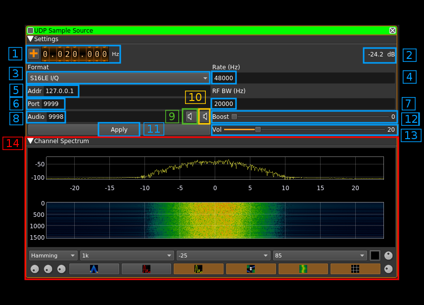
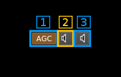

<h1>UDP source plugin</h1>

<h2>Introduction</h2>

By "source" one should undetstand a source of samples for the outside of SDRangel application. An UDP connection is established from the plugin to the given address and port and samples are directed to it.

The UDP block size or UDP payload size is fixed at 512 bytes.

The receiving application must make sure it acknowledges this block size. UDP may fragment the block but there will be a point when the last UDP block will fill up a complete block of this amount of bytes. In particular in GNUradio the UDP source block must be configured with a 512 bytes payload size.

This plugin is available for Linux and Mac O/S only.

<h2>Interface</h2>

<h3>1: Frequency shift from center frequency of reception</h3>

Use the wheels to adjust the frequency shift in Hz from the center frequency of reception. Left click on a digit sets the cursor position at this digit. Right click on a digit sets all digits on the right to zero. This effectively floors value at the digit position. Wheels are moved with the mousewheel while pointing at the wheel or by selecting the wheel with the left mouse click and using the keyboard arroews. Pressing shift simultanoeusly moves digit by 5 and pressing control moves it by 2.

<h3>2: Input channel power</h3>

Total power in dB relative to a +/- 1.0 amplitude signal received in the pass band.

<h3>3: Output channel power</h3>

Total power in dB relative to a +/- 1.0 amplitude signal sent over UDP.

<h3>4: UDP address and ports</h3>

These parameters are set with the basic channel settings dialog. See: [here](https://github.com/f4exb/sdrangel/blob/master/sdrgui/readme.md#6-channels)

The display is in the format `address:audio port/data port` 

<h3>5: Signal sample rate</h3>

Sample rate in samples per second of the signal that is sent over UDP. The actual byte rate depends on the type of sample which corresponds to a number of bytes per sample.

<h3>6: Type of samples</h3>

Combo box to specify the type of samples that are sent over UDP.

  - `S16LE I/Q`: Raw I/Q samples on signed 16 bits integers with Little Endian layout. Use it with software that accepts I/Q data as input like GNUradio with the `UDP source` block. The output is interleaved I and Q samples
  - `S16LE NFM`: AF of FM demodulated signal as 16 bits signed integers with Little Endian layout. Use it with software that takes the FM demodulated audio or the discriminator output of a radio as input. Make sure you specify the appropriate signal bandwidth (see 7) according to the AF bandwidth needs. The output is a repetition of NFM samples on real part and on imaginary part this facilitates integration wtih software expecting a stereo type of input with the same samples on L and R channels. With GNURadio just use a complex to real block.
  - `S16LE NFM Mono`: This is the same as above but only one sample is output for one NFM sample. This can be used with software that accept a mono type of input like `dsd` or `multimon`.
  - `S16LE USB`: AF of USB demodulated signal as 16 bits signed integers with Little Endian layout. Use it with software that uses a SSB demodulated signal as input i.e. software that is based on the audio output of a SSB radio. The output is the I/Q binaural output of the demodulator.
  - `S16LE LSB`: AF of LSB demodulated signal as 16 bits signed integers with Little Endian layout. Use it with software that uses a SSB demodulated signal as input i.e. software that is based on the audio output of a SSB radio. The output is the I/Q binaural output of the demodulator.
  - `S16LE LSB Mono`: AF of the LSB part of a SSB demodulated signal as "mono" (I+Q)*0.7 samples that is one sample per demodulator output sample. This can be used with software that accepts mono type of input.
  - `S16LE USB Mono`: AF of the USB part of a SSB demodulated signal as "mono" (I+Q)*0.7 samples that is one sample per demodulator output sample. This can be used with software that accepts mono type of input.
  - `S16LE AM Mono`: AF of the enveloppe demodulated signal i.e. channel magnitude or sqrt(I² + Q²) as "mono" samples that is one sample per demodulator output sample. This can be used with software that accepts mono type of input.
  - `S16LE AM !DC Mono`: Same as above but with a DC block based on magnitude average over a 5 ms period     
  - `S16LE AM BPF Mono`: Same as AM Mono but raw magnitude signal is passed through a bandpass filter with lower cutoff at 300 Hz and higher cutoff at RF bandwidth frequency     
  
<h3>7: Signal bandwidth</h3>

The signal is bandpass filtered to this bandwidth (zero frequency centered) before being sent out as raw I/Q samples or before being demodulated for SSB and FM outputs. Thus a 20000 Hz bandwidth for example means +/-10000 Hz around center channel frequency.

When SSB formats are used only the lower half (LSB) or upper half (USB) of the bandwidth is used. Thus to pass SSB over 3000 Hz bandwidth one should set this signal bandwidth to 6000 Hz.

<h3>8: FM deviation</h3>

This is the maximum expected FM deviation in Hz for NFM demodulated samples. Therefore it is active only for `NFM` types of sample formats. A positive deviation of this amount from the central carrier will result in a sample output value of 32767 (0x7FFF) corresponding to a +1.0 real value. A negative deviation of this amount from the central carrier will result in a sample output value of -32768 (0x8000) corresponding to a -1.0 real value.  

<h3>9: AGC and audio feedback control</h3>

<h4>9.1: Toggle AGC</h4>

It is effective only for AM and SSB. Signal is normalized to +/- 0.5 times the maximum amplitude with a time constant (averaging) of 200 ms. When engaged the squelch gate is fixed at 50 ms. The release time controlled by (15.3) can be increased from the 50 ms default for SSB signals to prevent accidental signal drops due to drops in the voice.  

<h4>9.2: Toggle audio feedback</h4>

This turns on or off the audio samples feedback

<h4>9.3: Mono/Stereo toggle for audio feedback</h4>

This toggles between mono or stereo audio feedback

<h3>10: Apply (validation) button</h3>

The changes in the following items only become effective when this button is pressed:

  - Samples format (4)
  - Output sample rate (5)
  - Address (6)
  - RF bandwidth (7)
  - Data port (8)
  - Audio port (9)
  - FM deviation (11)

When any item of these items is changed the button is lit in green until it is pressed. 

<h3>11: Audio volume</h3>

Volume of the audio feedback (when se with button 12.2).

<h3>12: Gain</h3>

This gain is applied to the samples just before they are sent via UDP. The gain value appears at the right of the slider.

<h3>13: Squelch</h3>

<h4>13.1: Squelch indicator</h4>

The background of the "Sq" text is lit in green when the squelch is open

<h4>13.2: Squelch level</h4>

Use the slider to set the squelch power threshold based on channel input power (2). At the right of the slider the value in dB is displayed

<h4>13.2: Squelch gate</h4>

Sets the delay after which a signal constantly above the squelch threshold effectively opens the squelch. The same delay is used for squelch release except for SSB where the gate is fixed at 50 ms and this controls the release time only.

The delay in milliseconds is displayed at the right of the button. 

<h3>14: Spectrum display</h3>

This is the spectrum display of the channel signal after bandpass filtering. Please refer to the Spectrum display description for details. 

This spectrum is centered on the center frequency of the channel (center frequency of reception + channel shift) and is that of a complex signal i.e. there are positive and negative frequencies. The width of the spectrum is proportional of the sample rate. That is for a sample rate of S samples per seconds the spectrum spans from -S/2 to +S/2 Hz. 

