<h1>WDSP receiver plugin</h1>

<h2>Introduction</h2>

This plugin implements a modified "RXA unit" of the [WDSP library](https://github.com/TAPR/OpenHPSDR-wdsp) by Warren Pratt, NR0V. This library has been extensively modified to be productively included in SDRangel and can be found in the "wdsp" subdirectory of this repository. However the original DSP algorithms have been preserved and I want to address my thanks to the original author for making it available to the community. Only the code structure was modified to meet Qt and C++ standards. The original version written in C could not benefit of modern C++ features. Also the multithreading support was entirely removed as this is already handled at the upper level in SDRangel. This greatly simplifies the code. Although the details of implementation have been changed the explanation of DSP algorithms found in the [documentation](https://github.com/TAPR/OpenHPSDR-wdsp/blob/master/wdsp%201.24/WDSP%20Guide%2C%20Rev%201.24.pdf) is still valid.

The WDSP library is at the heart of OpenHPSDR and Pi-HPSDR projects and both implement excellent communication receivers. Experience with Pi-HPSDR was the main motivation to create this plugin.

As explained in the documentation the WDSP engine is organized in channels comprising a single unit itself composed of several blocks. In the implementation here only units and blocks were retained and more specifically this plugin makes use of the "RXA" unit. The channel is somehow represented by the channel plugin itself.

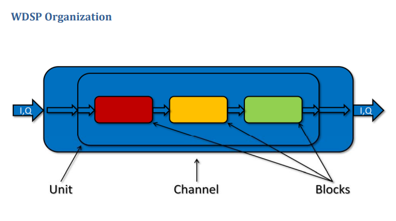

This "RXA" unit is originally composed of these blocks:

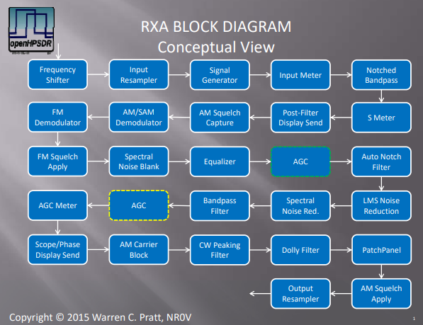

  - Frequency Shifter: used to implement the RIT functionality
  - Input Resampler: is not used. The channel interpolator/decimator is used to give a fixed rate of 48 kS/s which is the internal DSP rate of the RXA unit
  - Signal Generator: was removed in this implementation
  - Input Meter: not used
  - Notched Bandpass: this is the main input filter and is permanently active but the notch feature is not used
  - S Meter: permanently active this is used for channel power displays
  - Post filter display send: permanently active this is the tap providing the spectrum view (B)
  - AM Squelch capture: used in AM squelch functionality
  - AM/SAM Demodulator: used for AM/SAM modes
  - FM Demodulator: used for FM mode
  - FM Squelch apply: used in FM squelch functionality
  - Spectral Noise blanker: not used
  - Equalizer: used in equalizer functionality
  - AGC: used in AGC functionality
  - Auto Notch Filter: used in ANF functionality
  - LMS Noise Reduction: used in noise reduction ¨NR" mode
  - Spectral Noise Reduction: used in noise reduction ¨NR2" mode
  - Bandpass Filter: participates in the global channel filtering
  - AGC Meter: not used
  - Scope/Phase display send: not used
  - AM Carrier Block: not used
  - CW peaking filter: used in CW functionality
  - Dolly Filter: not used
  - Syllabic Squelch: not displayed in the diagram above. Implements the voice squelch mode mostly useful and efficient in SSB.
  - Patch Panel: used for volume and pan controls
  - AM Squelch Apply: participates in AM squeclh functionality
  - Output resampler: used if the audio sample rate is not 48 kS/s

In addition the noise blanker apply to the complete I/Q stream before it enters the RXA chain described above thus on the full 48 kHz stream. There are two available:

  - Preemptive Wideband Noise Blanker described at p.122 of the documentation implements the "NB" noise blanker mode
  - Interpolating Wideband Noise Blanker described at p.129 of the documentation implements the "NB2" noise blanker mode

Using this RXA unit this plugin provides something similar to the VFO concept found in other SDR software and hardware radios. It implements the classical amateur radio and SWL audio modes: SSB, AM, FM. CW is not considered a mode apart here. To work CW signals one selects the SSB mode (then USB or LSB) and one may use the CW peaking filter to isolate even more the pitch of interest. The trick to move the displayed frequency on the expected pitch is explained in the RIT section (A.13).

While the advantage over AM and NFM demodulator plugins is debatable this plugin is much more advanced than the SSB demodulator plugin for working SSB and CW signals and generally should be preferred over the SSB demodulator plugin. It retains the SSB demodulator plugin GUI presentation but with better and extended capabilities.

<h2>Interface</h2>

The top and bottom bars of the channel window are described [here](../../../sdrgui/channel/readme.md)

Similarly to the SSB demodulator plugin the center of the GUI is divided into the settings (A) and spectrum (B) areas (sections).

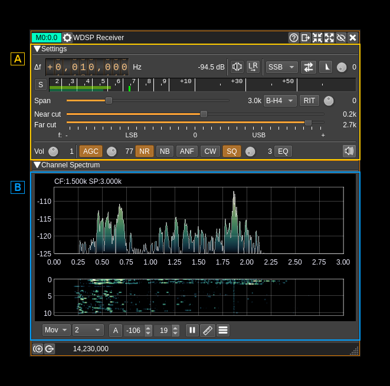

<h2>B: Spectrum</h2>

The spectrum view and controls is similar to other spectrum views. Controls on the bottom of the panel are identical to the ones of the main spectrum display. Details on the spectrum view and controls can be found [here](../../../sdrgui/gui/spectrum.md).

This is the spectrum seen after the bandpass filter. The span can be controlled via the span setting (A.11). In LSB mode the frequencies displayed are negative to take into account the spectrum reversal.

<h2>A: Settings</h2>

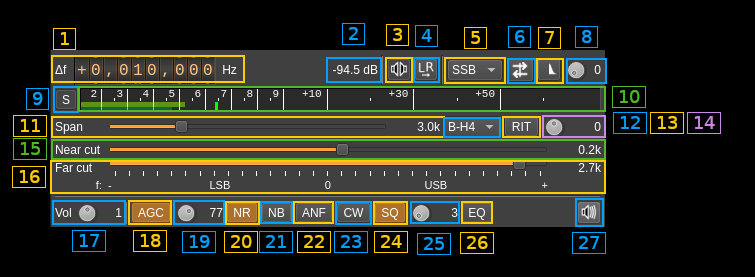

<h3>A.1: Frequency shift from center frequency of reception</h3>

Use the wheels to adjust the frequency shift in Hz from the center frequency of reception. Left click on a digit sets the cursor position at this digit. Right click on a digit sets all digits on the right to zero. This effectively floors value at the digit position. Wheels are moved with the mouse wheel while pointing at the wheel or by selecting the wheel with the left mouse click and using the keyboard arrows. Pressing shift simultaneously moves digit by 5 and pressing control moves it by 2.

<h3>A.2: Channel power</h3>

Average total power in dB relative to a +/- 1.0 amplitude signal received in the pass band.

<h3>A.3: Monaural/binaural toggle</h3>

  - Monaural: the scalar signal is routed to both left and right audio channels. Note that you should set this mode for the CW decoder feature to work.
  - Binaural: the complex signal is fed with the real part on the left audio channel and the imaginary part to the right audio channel.

Right clicking on this button opens a dialog to control audio pan:

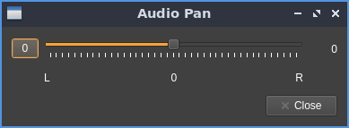

The "0" button resets the balance to the center. Use the slider to pan the audio more left or more right.

<h3>A.4: Invert left and right channels</h3>

Inverts left and right audio channels. Useful in binaural mode only.

<h3>A.5: Demodulation mode</h3>

Sets the demodulation mode between:

  - SSB: for DSB, USB, LSB, CW
  - AM: for AM in classical detection mode
  - SAM: for AM in synchronous mode
  - FM: for narrowband FM

Right clicking on this button opens a dialog to control settings pertaining to the current mode:

**SSB**: no dialog

**AM/SAM**:

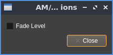

There is only one control. This "fade level" when checked substitutes the received carrier with a constant magnitude carrier overcoming possible carrier fades.

**FM**:

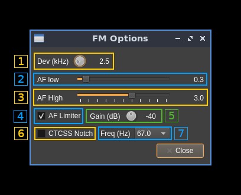

<h4>1: Expected FM deviation</h4>

Expected FM deviation in kHz. The value appears on the right of the control.

<h4>2: Audio filter low frequency cutoff</h4>

Audio filter low frequency cutoff in kHz. The value appears on the right of the control.

<h4>3: Audio filter high frequency cutoff</h4>

Audio filter high frequency cutoff in kHz. The value appears on the right of the control.

<h4>4: AF limiter</h4>

This is an AGC on the audio signal.

<h4>5: AF limiter gain</h4>

This is the top gain of the audio AGC.

<h4>6: CTCSS notch filter</h4>

This filter can be used to notch out the CTCSS tones. Of course this is useful only if the low frequency cutoff of the audio filter (2) is lower than the tone frequency.

<h4>7: CTCSS notch frequency</h4>

Select the CTCSS frequency to be notched out.

<h3>A.6: Sideband flip</h3>

Flip LSB/USB. Mirror filter bandwidth around zero frequency and change from LSB to USB or vice versa. Works in SSB mode only. This is similar to the same control of the SSB demodulator.

<h3>A.7: SSB/DSB demodulation</h3>

Toggles between SSB (icon with one sideband signal) and DSB (icon with double sidebands signal). In SSB mode the shape of the icon represents LSB or USB operation. This is similar to the same control of the SSB demodulator.

<h3>A.8: Profile selection</h3>

Selects the current profile. A profile keeps track of most of the settings. This allows to rapidly toggle between demodulation modes or between different preferences for the same modulation mode. Up to 10 profiles (0 to 9) can be stored. The current profile number is displayed at the right of the dial button.

<h3>A.9: S points / dB</h3>

Toggles between S points and dB units display for the level meter (A.10)

<h3>A.10: Level meter</h3>

  - top bar (green): average value
  - bottom bar (blue green): instantaneous peak value
  - tip vertical bar (bright green): peak hold value

<h3>A.11: Spectrum display frequency span</h3>

The DSP sample rate of 48 kS/s is further decimated by powers of two for the spectrum display and bandpass filter limits. This effectively sets the total available bandwidth depending on the decimation:

  - **1** (no decimation): 24 kHz (SSB) or 48 kHz (DSB)
  - **2**: 12 kHz (SSB) or 24 kHz (DSB)
  - **4**: 6 kHz (SSB) or 12 kHz (DSB)
  - **8**: 3 kHz (SSB) or 6 kHz (DSB)
  - **16**: 1.5 kHz (SSB) or 3 kHz (DSB)

<h3>A.12: Bandpass FIR filter window</h3>

Controls the window applied to the impulse response of the bandpass filter. According to WDSP documentation you may leave it to "B-H4" which is the 4 term Blackman-Harris window. "B-H7" is the 7 term Blackman-Harris window and is generally an overkill. You have the choice still.

<h3>A.13: Toggles RIT</h3>

Toggles the RIT feature. Internally it uses the "shift" block of the "RXA" unit and hence applies an extra shift over the main frequency shift (A.1) effectively implementing a RIT feature.

You may want to take advantage of the RIT when listening to CW signals. By setting the RIT frequency value (A.14) to the opposite of the desired pitch from the center frequency the displayed frequency and channel marker on the spectrum will fall right on the signal when the proper pitch is obtained. This can greatly facilitate tuning the CW signal at the right pitch which is important if you are using the CW peaking filter (A.23)

For example if the desired pitch is 600 Hz and you are set in USB mode then you would set the RIT frequency to -600 Hz. Conversely if you are set in LSB mode the RIT frequency would be +600 Hz.

When the RIT is engaged the bandwidth display on the spectrum channel marker moves accordingly while the center frequency stays fixed.

<h3>A.14: RIT frequency</h3>

Sets the RIT frequency shift in Hz. The value is displayed at the right of the button.

<h3>A.15: Bandpass filter near frequency cutoff</h3>

Controls the filter cutoff frequency closest to zero with a positive value in USB mode and a negative value in LSB mode. The value is limited by the far frequency cutoff so that it is always lower to the far frequency cutoff in absolute value.

This is effective only for SSB. The value is automatically set to 0 in DSB, AM or FM and control is disabled.

This is similar to the same control in the SSB demodulator.

<h3>A.16: Bandpass filter far frequency cutoff</h3>

Controls the filter cutoff frequency farthest to zero with a positive value in USB mode and a negative value in LSB mode. Moving the slider in the positive range effectively sets the USB mode while moving it in the negative range sets the LSB mode.

One may also use the sideband flip (A.6) to quickly change between USB and LSB keeping the same filter limits.

In DSB, AM and FM it just controls the filter half bandwidth.

This is similar to the same control in the SSB demodulator.

<h3>A.17: Volume control</h3>

Controls the audio volume in dB. The value is displayed at the right of the button.

<h3>A.18: AGC</h3>

Toggles AGC. You would usually leave it always on. You will find details on the AGC algorithm starting p.41 of the WDSP documentation. By right clicking on the button the AGC controls dialog is opened:

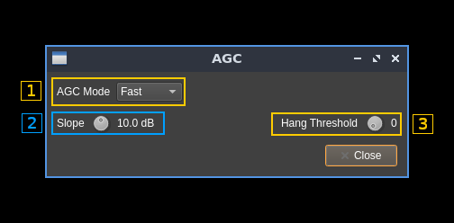

<h4>1: AGC mode</h4>

  - **Long**: Hang time = 2000 ms.  Decay_time_constant = 2000 ms
  - **Slow**: Hang time = 1000 ms.  Decay_time_constant = 500 ms
  - **Medium**: Hang is turned OFF.  Decay_time_constant = 250 ms
  - **Fast**: Hang is turned OFF.  Decay_time_constant = 50 ms

<h4>2: AGC slope</h4>

Adjust the slope in dB. See the diagram next paragraph for details.

<h4>3: Hang threshold</h4>

<H3>A.19: AGC top value</h3>

This is the top value in dB of the gain applied to the signal. You may want to adjust it depending on the conditions to avoid audio signal saturation.

In the following diagram extracted from WDSP documentation the top value is the red line, It is set at 0 dB on the diagram. The actual value is controlled by this button:

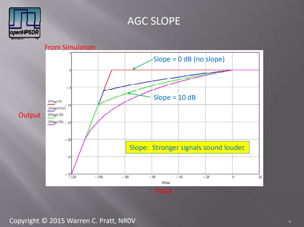

The diagram also shows the effect of the "slope" setting found in the AGC control dialog (A.18)

<h3>A.20: Noise Reduction</h3>

Toggles the noise reduction feature. Details in the WDSP documentation start at p.51 There are 2 possible noise reduction schemes.

Principle of LMS Noise reduction extracted from WDSP documentation:

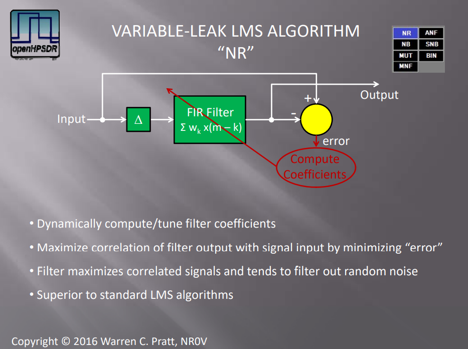

Principe of spectral noise reduction extracted from WDSP documentation:

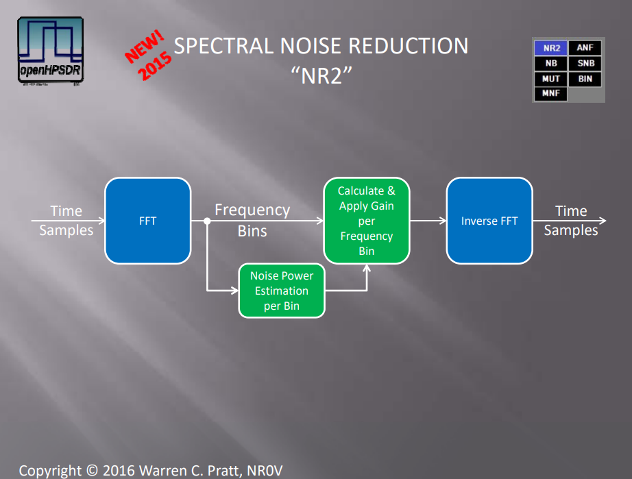

Right clicking on this button opens a dialog to control noise reduction settings:

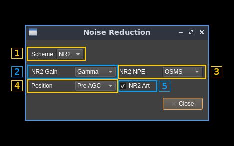

<h4>1: Noise reduction scheme</h4>

Choice is between "NR" for LMS Noise Reduction and "NR2" for Spectral Noise Reduction.

NR usually works better for CW possibly FM while NR2 works better for SSB and AM/SAM.

<h4>2: NR2 gain per frequency bin calculation</h4>

Applies to spectral noise reduction (NR2). Choice between:

  - **Linear**: Gaussian speech distribution, linear amplitude scale
  - **Log**: Gaussian speech distribution, log amplitude scale
  - **Gamma**: (default) Gamma speech distribution

According to WDSP documentation *"All three choices will produce
somewhat similar results with the default Gamma speech distribution being somewhat preferred."*

<h4>3: NR2 Noise Power Estimation method</h4>

Applies to spectral noise reduction (NR2). Choice between:

  - **OSMS**: (default) Optimal Smoothing Minimum Statistics
  - **MMSE**: Minimum Mean‐Square Error

According to WDSP documentation *"Both choices will produce somewhat similar results.  For general operation, the default is preferred.  In situation involving sudden changes in signal/noise amplitude, e.g., with "static crashes" caused by lightning, the MMSE method may be preferred due to its ability to more rapidly adjust to the changes."*

<h4>4: Noise reduction position</h4>

Applies to both NR and NR2. Locates the noise reduction block either before or after the AGC is applied.

<h4>5: NR2 artifacts reduction</h4>

Applies to spectral noise reduction (NR2). Turns off/on an artifact‐elimination post‐filter. It is recommended to leave it always on.

<h3>A.21: Noise Blanking</h3>

Toggles the noise blanking feature. Details in the WDSP documentation start at p.122. Choice is between Preemptive Wideband Noise Blanker (NB) and Interpolating Wideband Noise Blanker (NB2)

Principe of the Preemptive Wideband Noise Blanker extracted from WDSP documentation:

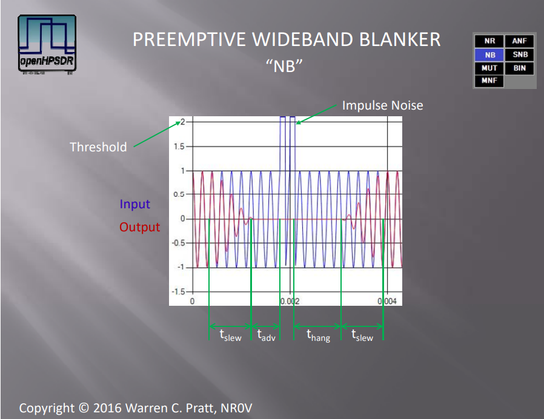

Principle of the Interpolating Wideband Noise Blanker extracted from WDSP documentation:

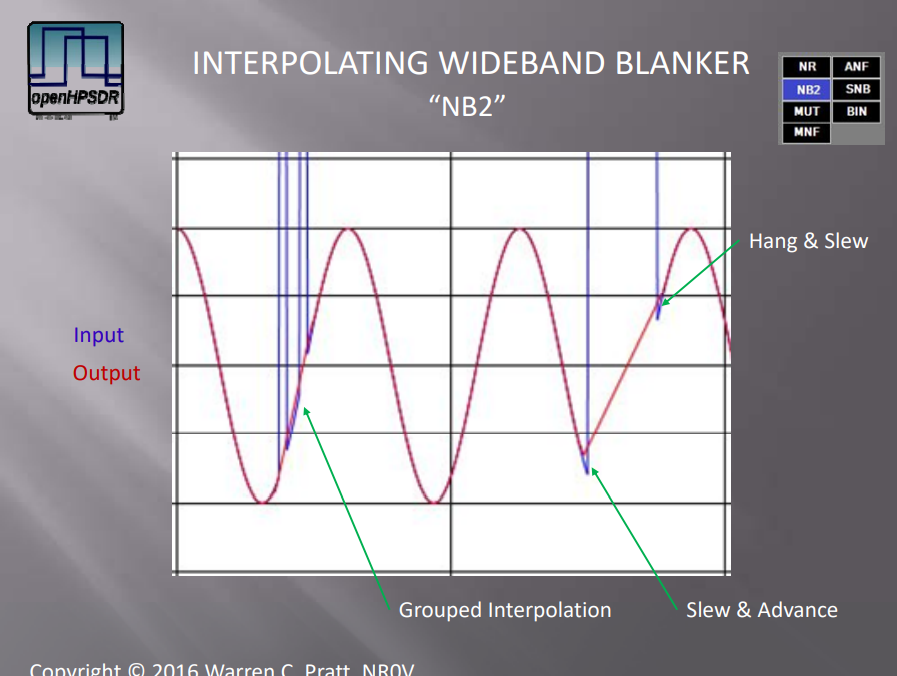

Right clicking on this button opens a dialog to control noise blanking settings:

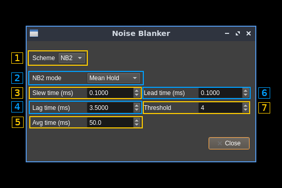

<h4>1: Noise blanker scheme</h4>

Choice between "NB" or Preemptive Wideband Noise Blanker and "NB2" or Interpolating Wideband Noise Blanker.

<h4>2: NB2 mode</h4>

Determines what estimate values are used for the sequence of corrupt samples to be replaced. Choice between:

  - **Zero**: zero mode: estimate as zero
  - **Sample&Hold**: take the value of non‐corrupt signal at the beginning of the impulse and hold that throughout the corrupt sequence
  - **Mean Hold**: average the non‐corrupt values at the beginning and end of the corrupt sequence and use that as the estimate during the corrupt sequence
  - **Hold Sample**: take the value of non‐corrupt signal at the end of the impulse and hold that throughout the corrupt sequence
  - **Interpolate**: linearly interpolate across the corrupt sequence

<h4>3: Slew time</h4>

This is the duration of the raised‐cosine transitions between normal signal levels and the zero estimate during an impulse (tau)

<h4>4: Lag time</h4>

This is the hang time after the impulse

<h4>5: Averaging time</h4>

This is the time‐constant for averaging power across the wide bandwidth (back tau)

<h4>6: Lead time</h4>

This is the advance time before the impulse

<h4>7: Threshold</h4>

A sample is judged to be part of an impulse if its magnitude is greater than threshold*average_power. If threshold is too low, normal signals may be wrongly identified as impulse noise. If it is too high, successful detection will not occur.

<h3>A.22: Automatic Notch Filter</h3>

Toggles the Automatic Notch Filter. This is useful to eliminate a single tone signal. Of course this is not to be used for CW since it would automatically cancel the CW signal.

<h3>A.23: CW peaking filter</h3>

Toggles the CW peaking filter. The CW Peaking Filter is an audio IIR filter intended to peak a single frequency, the frequency of a
desired CW signal.

This is the diagram extracted from WDSP documentation showing the response of the filter for different bandwidths:

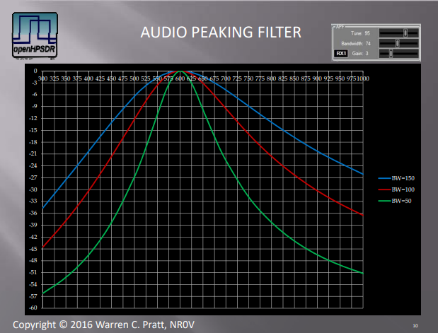

Right clicking on this button opens a dialog controlling the details of this filter:

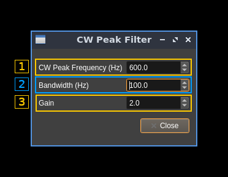

<h4>1: Peak frequency</h4>

Adjust the center frequency (Hz) of the filter. This should correspond to the desired pitch. To center the CW signal on this pitch frequency see RIT (A.13) for a practical method.

<h4>2: Bandwidth</h4>

Bandwidth (at -3 dB) of the filter in Hz.

<h4>4: Gain</h4>

Gain of the filter in linear terms (not dB)

<h3>A.24: Squelch</h3>

Toggles the squelch feature. Right clicking on this button opens a dialog to control squelch details:

<h4>1: Squelch type</h4>

These checkboxes let you choose the type of squelch that is applied. It enables the options corresponding to the selected type of squelch (Voice: options 2 and 3, AM option 4).

  - **Voice**: This type of squelch is based on identifying voice artifacts to open the squelch. It best applies to SSB.
  - **AM**: This is the classical magnitude based squelch. It best applies to AM and CW
  - **FM**: This squelch is based on measuring the noise level after the discriminator and opens the squelch if it falls below a certain level. It only applies to FM (of course).

<h4>2: Mute time constant</h4>

For voice squelch this is the time to progressively mute the signal when the squelch closes.

<h4>3: Un-mute time constant</h4>

For voice squelch this is the time to progressively un-mute the signal when the squelch opens.

<h4>4: Maximum tail time</h4>

For AM squelch this is the maximum grace period after the squelch closes to effectively mute the audio.

<h3>A.25: Squelch threshold</h3>

Controls the squelch threshold. The value is a percentage and its effect depends on the type of squelch used (selected by A.23 dialog). Generally the greater the value the higher the threshold. Given &theta; is the factor value from 0.0 (0%) to 1.0 (100%):

  - Voice squelch: see `ssql.cpp` WDSP code: $0,75\times\theta$
  - AM squelch: magnitude threshold in dB: $160\times\theta - 160$
  - FM squelch: squelch opens if noise magnitude falls below this value: $0.9\times10^{-2\theta}$

<h3>A.26: Equalizer</h3>

Toggles a 10 frequency points with continuous response equalizer. This diagram extracted from the WDSP documentation explains the difference with a classical band equalizer:

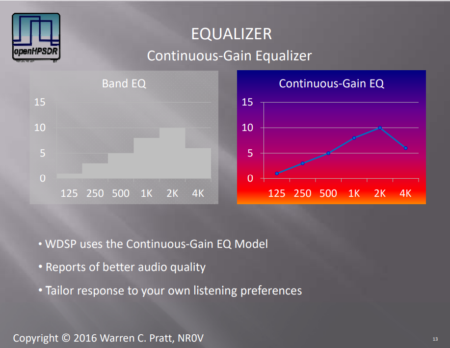

Right clicking on this opens a dialog to control equalizer details:

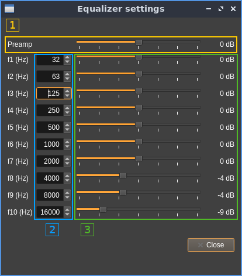

<h4>1: Preamplifier gain</h4>

This is in fact the global gain in dB. The value appears at the right of the slider.

<h4>2: Frequencies</h4>

Specify the frequency (Hz) of each of the 10 points. Defaults are at the center of the possible ranges:

  - **f1**: from 0 to 48 Hz
  - **f2**: from 49 to 94 Hz
  - **f3**: from 95 to 187 Hz
  - **f4**: from 188 to 375 Hz
  - **f5**: from 376 to 750 Hz
  - **f6**: from 751 to 1500 Hz
  - **f7**: from 1501 to 3000 Hz
  - **f8**: from 3001 to 6000 Hz
  - **f9**: from 6001 to 12000 Hz
  - **f10**: from 12001 to 20000 Hz

<h4>3: Gains</h4>

Specify the gain (dB) at each of the 10 frequency points. The value appears at the right of the slider.
