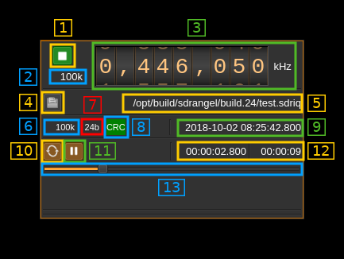

<h1>File source channel plugin</h1>

<h2>Introduction</h2>

This plugin reads a file of I/Q samples that have been previously saved with the file record button of other sampling source devices. File formats supported include SDRangel's `.sdriq` and signed 16-bit PCM `.wav` files.

`.sqriq` files start with a 32 byte header of all unsigned integer of various sizes containing meta data:

<table>
  <tr>
    <th>Displ.</th>
    <th>Bytes</th>
    <th>Description</th>
  </tr>
  <tr>
    <td>0</td>
    <td>4</td>
    <td>Sample rate in S/s</td>
  </tr>
  <tr>
    <td>4</td>
    <td>8</td>
    <td>Center frequency in Hz</td>
  </tr>
  <tr>
    <td>12</td>
    <td>8</td>
    <td>Unix epoch (timestamp) of start</td>
  </tr>
  <tr>
    <td>20</td>
    <td>4</td>
    <td>Sample size (16 or 24 bits)</td>
  </tr>
  <tr>
    <td>24</td>
    <td>4</td>
    <td>Filler with zeroes</td>
  </tr>
  <tr>
    <td>28</td>
    <td>4</td>
    <td>CRC32 of the previous 28 bytes</td>
  </tr>
</table>

The header takes an integer number of 16 (4 bytes) or 24 (8 bytes) bits samples. To calculate CRC it is assumed that bytes are in little endian order.

The I/Q samples are copied to the baseband to be transmitted by the sink output device with possibly a chain of half-band interpolators for upsampling and shift of bandwidth.

<h2>Interface</h2>

The top and bottom bars of the channel window are described [here](../../../sdrgui/channel/readme.md)

<h3>1: Interpolation factor</h3>

The device baseband can be interpolated from the channel and its center can be selected with (5). The resulting sample rate of the I/Q stream pulled from the Local Output device sink is the baseband sample rate divided by this value. The value is displayed in (2).

<h3>2: I/Q stream sample rate</h3>

This is the sample rate in kS/s of the I/Q stream pulled from the Local Output device sink instance.

<h3>3: Half-band filters chain sequence</h3>

This string represents the sequence of half-band filters used in the interpolation. Each character represents a filter type:

  - **L**: lower half-band
  - **H**: higher half-band
  - **C**: centered

<h3>4: Center frequency shift</h3>

This is the shift of the channel center frequency from the device center frequency. Its value is driven by the device sample rate, the interpolation (1) and the filter chain sequence (5).

<h3>5: Half-band filter chain sequence</h3>

The slider moves the channel center frequency roughly from the lower to the higher frequency in the device baseband. The number on the right represents the filter sequence as the decimal value of a base 3 number. Each base 3 digit represents the filter type and its sequence from MSB to LSB in the filter chain:

  - **0**: lower half-band
  - **1**: centered
  - **2**: higher half-band

<h3>6: Level meter in dB</h3>

  - top bar (green): average value
  - bottom bar (blue green): instantaneous peak value
  - tip vertical bar (bright green): peak hold value

You must make sure that the peaks do not exceed 0 dB. In fact you should have 1 or 2 dB reserve when you tune the power level with the gain slider (7)

<h3>7: Gain</h3>

You may use this control to apply a gain to the input signal. You can control the resulting channel power with (6).

<h3>8: Open file</h3>

Opens a file dialog to select the input file. It expects a default extension of `.sdriq`. This button is disabled when the stream is running. You need to pause (button 11) to make it active and thus be able to select another file.

<h3>9: File path</h3>

Absolute path of the file being read

<h3>10: File recorded sample rate</h3>

Sample rate of the record in kS/s as written in the header. The reading process is based on this sample rate.

<h3>11: Sample size</h3>

This is the sample size in bits as written in the header. The reading process is based on this sample size.

<h3>12: CRC indicator</h3>

Indicates if the header block CRC check has succeeded (green) or failed (red) or undetermined yet (grey). If the header is corrupted you may try to reconstruct a valid header using the `rescuesdriq` utility in the folder with the same name. See the [readme](../../../rescuesdriq/readme.md) for details.

<h3>13: Loop</h3>

Use this button to read in a loop or read only once

<h3>14: Play/pause</h3>

This is the play/pause button

<h3>15: Current timestamp</h3>

This is the timestamp of the current pointer in the file based on the start time, number of samples read and sample rate.

<h3>16: Relative timestamp</h3>

Left is the relative timestamp of the current pointer from the start of the record.

<h3>17: Record length</h3>

This is the total record time.

<h3>18: Current pointer gauge</h3>

This represents the position of the current pointer position in the complete recording. It can be used it paused mode to position the current pointer by moving the slider.
