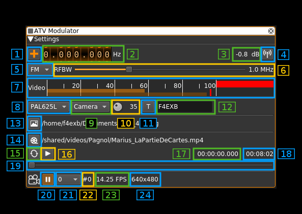
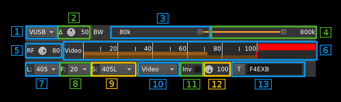

##ATV modulator plugin

<h1>Introduction</h1>

This plugin can be used to generate an analog TV signal mostly used in amateur radio. It is limited to black and white images as only the luminance (256 levels) is supported. 

There is no sound either. You coud imagine using any of the plugins supporting audio to create a mixed signal. This is not working well however for various reasons. It is better to use two physical transmitters and two physical receivers.

In practice 4 MS/s with about 300 points per line is the lowest sample rate that produces a standard image quality. Lower sample rates and line definition produce low quality images that may still be acceptable for experiments.

<h1>Interface</h1>

<h2>1: Frequency shift from center frequency of reception direction</h2>

The "+/-" button on the left side of the dial toggles between positive and negative shift.

<h2>2: Frequency shift from center frequency of reception value</h2>

Use the wheels to adjust the frequency shift in Hz from the center frequency of reception. Left click on a digit sets the cursor position at this digit. Right click on a digit sets all digits on the right to zero. This effectively floors value at the digit position.

<h2>3: Sample rate data</h2>

The left button can be used to force the rational decimator even when the source and channel samople rates agree. This allows to use the FIR filter of the decimator in any case.

The middle figure is the sample rate in kS/s used in the channel which may differ of the source plugin output sample rate if the rational decimator is engaged. This sample rate is calculated as the multiple of a base rate the closest lower to the source plugin output sample rate.

The right figure is the corresponding number of points and therefore also samples per full line including line synchronization pattern. 

The base sample rate is calculated based on the line frquency as the closest multiple of 1 kHz that represents an integer number of points per line greater or equal to 100.

Let's take an example with a 405 lines and 25 FPS video signal and a 2400 kS/s source output sample rate: 

  - the line frequency is 405 &#215; 25 = 10125 Hz
  - 100 points require a sample rate of at least 100 &#215; 10125 = 1012500 S/s to fit one point per sample. This is not a multiple of 1 kS/s so we look for the next number of points that will yield a multiple of 1 kS/s
  - 104 points yield a sample rate of 104 &#215; 10125 = 1053000 S/s which is a multiple of 1 kS/s and is the closest to 1012500 S/s. So we take 1053 kS/s as the base rate
  - the channel sample rate at the output of the rational decimator will be 1053 &#215; 2 = 2106 kS/s and will fit 104 &#215; 2 = 208 points per line which produces a fairly good image
  
The example taken in the screenshot is from a 405 lines &#215; 20 FPS video signal:

  - line frequency is 8100 Hz
  - 100 points fit exactly into a 810 kS/s sample rate
  - the nearest sample rate to 2400 kS/s is 1620 kS/s for 200 points per line 

<h2>4: Channel power</h2>

Average total power in dB relative to a &#177;1.0 amplitude signal generated in the pass band.

<h2>5: Channel mute</h2>

Use this button to toggle mute for this channel. The radio waves on the icon are toggled on (active) and off (muted) accordingly. Default is channel active.

<h2>A: Signal settings</h2>

<h3>A.1: Modulation type</h2>

The video signal can modulate the carrier in the following modes:

  - AM: Amplitude modulation. Modulation index is 90%.
  - FM: Frequency modulation. Excursion is a percentage of the bandwidth available given the channel sample rate. This percentage is controlled by button (2). e.g. at 50% for 4 MS/s sample rate this is &#177;1 MHz (2 MHz total) 
  - USB: SSB upper side band: video signal is transposed only in positive frequencies including DC component
  - LSB: SSB lower side band: video signal is transposed only in megative frequencies excluding DC component
  - VUSB: SSB upper sideband with vestigial lower sideband. The cutoff frequency of the lower sideband is controlled by slider (3)
  - VLSB: SSB lower sideband with vestigial upper sideband. The cutoff frequency of the upper sideband is controlled by slider (3)
  
<h3>A.2: FM deviation percentage of total bandwidth</h3>

Use this button to control FM deviation in FM modulation mode. This is a percentage of total available channel bandwidth. e.g for the sample rate of 1620 kS/s of the screenshot and a percentage of 40% this yields a full deviation of 1620 &#215; 0.4 = 648 kHz that is &#177;324 kHz
  
<h3>A.3: Opposite sideband FFT filter cutoff</h3>

This slider is effective only on SSB and vestigial modes (USB, LSB, VUSB, VLSB). This slider controls the cutoff frequency of the FFT filter in the opposite sideband to the main in band sideband. That is:

  - for LSB and VLSB: this is the upper sideband
  - for USB and VUSB: this is the lower sideband
  
The cutoff frequency in kHz is displayed on the left of the slider
  
<h3>A.4: In band filter cutoff</h3>

This slider acts on both the FFT filter in SSB modes and the rational decimator FIR filter in other modes.

  - AM, FM: this controls the cutoff frequency of the decimator FIR filter.
  - USB, LSB, VUSB, VLSB: this controls the cutoff frequency of the FIR filter on the in band side that is:
    - upper sideband for USB, VUSB
    - lower sideband for LSB, VLSB

The cutoff frequency in kHz is displayed on the right of the slider

<h3>A.5: Modulated signal level before filtering stages</h3>
  
This button controls the scaling from the +1/-1 modulated signal level to the -32768/+32768 2 bytes samples. This is useful to control the saturation of the FFT or FIR filters. Looking at the output spectrum you can precisely control the limit above which distorsion appears.

<h3>A.6: Video signal level meter</h3>

This is the level meter fed with the video signal. Units are the percentage of the 0.0 to 1.0 modulating video signal.

<h3>A.7: Nuber of lines</h3>

This controls the number of lines per full frame. Choice is between 625, 525 or 405 lines.

<h3>A.8: Number of frames per second</h3>

This controls the number of full frames per second. Choice is between 30, 25, 20 or 16 frames per second.

<h3>A.9: TV Standard</h2>

This controls the frame synchronization schem and number of black lines:

  - PAL625L: this is the PAL 625 lines standard with 25 FPS. Since only black and white (luminance) is supported this corresponds to any of the B,G,I or L PAL standards
  - PAL525L: this is the PAL 525 lines standard with 30 FPS. This corresponds to the PAL M standard.
  - 405L: this loosely corresponds to the British 405 lines system and is similar to PAL for synchronization. This mode has only 7 black lines.
  
<h2>A.10: Input source</h2>

This combo box lets you choose between various inputs for the video signal:

  - Uniform: the image has a uniform luminance level given by the luminance level adjusted with the button next (10)
  - H Bars: horizontal bars from black level on the left to white level on the right
  - V Bars: vertical bars from black level on the top to white level on the bottom
  - Chess: chessboard pattern alternating black squares and squares with the luminance level adjusted with button (10)
  - H Grad: horizontal gradient from black level on the left to white level on the right
  - V Grad: vertical gradient from black level on the top to white level on the bottom
  - Image: still image read from the file selected with button (13). If no image is selected an uniform image is sent with the luminance adjusted with button (10)
  - Video: video file read from the file selected with button (14). If no image is selected an uniform image is sent with the luminance adjusted with button (10).  Buttons (15) and (16) control the play.
  - Camera: video signal from a webcam or supported video source connected to the system. If no source is selected an uniform image is sent with the luminance adjusted with button (10). Button (21) selects the camera source. Button (20) plays or stops the camera on a still image.

<h2>A.11: Video inversion toggle</h2>

Use this checkbox to toggle video signal inversion before modulation. 
  
<h2>A.12. Luminance level</h2> 

This button lets you adjust the luminance level of the "blank" screens displays, the lighter squares on the chessboard and the overlay text.

<h2>A.13. Overlay text toggle</h2>

The button toggles the display of an overlay text on a still image, or a video signal from a file or a camera. Note that for still images you will have to toggle off/on this button to take any change of text or text brightness into account. The brightness level of the text is selected with the luminance adjust button (10). The number of characters is limited to 12.

The text area lers you type a text up to 12 characters.

<h2>6. Still picture file select</h2>

Clicking on this button will open a file dialog to let you choose an image file for still image display. When the dialog is closed and the choice is validated the name of the file will appear on the space at the right of the button. 

<h2>7. Video file select</h2>

Clicking on this button will open a file dialog to let you choose a video file for video play. When the dialog is closed and the choice is validated the name of the file will appear on the space at the right of the button. 

<h2>8. Play loop video</h2>

Use this button to toggle on/off playing the video file in a loop

<h2>9. Play/Pause video</h2>

Use this button to toggle on/off the video file play. When play stops the current image is displayed as a still image. When video is stopped the button is dark and a play (&#9658;) icon is displayed on the button. When video runs the button is lit and a pause (&#9611;&#9611;) icon is displayed on the button. 

<h2>10. Current video position</h2>

This is the current video file play position in time units relative to the start

<h2>11. Video file length</h2>

This is the video file play length in time units

<h2>12. Video file position slider</h2>

This slider can be used to randomly set the currennt position in the file when file play is in pause state (button 16). When video plays the slider moves according to the current position.

<h2>23. Play/Pause camera</h2>

Use this button to toggle on/off the camera play. When play stops the current image is displayed as a still image. When camera is stopped the button is dark and a play (&#9658;) icon is displayed on the button. When camera runs the button is lit and a pause (&#9611;&#9611;) icon is displayed on the button. 

On Linux systems when the play button is engaged for the first time the FPS of the camera is scanned which can take some time (100 frames are read). A message box appears while the operation is running.

<h2>14. Camera select</h2>

Use this combo to select the camera source when more than one is available. the number corresponds to the index of the camera during the camera scan at the startup of the plugin instance. A maximum of 4 cameras are scanned in whichever order presented by the system.  

<h2>15. Camera device number</h2>

This is the device number used by OpenCV which on Linux systems correspond to the /dev/video device number. i.e. "#0" for /dev/video0.

<h2>16. Camera FPS</h2>

This is the camera FPS. On Windows there is no dynamic FPS check and a fixed 5 FPS is set for each camera. On Linux 90% of the calculated FPS is divided by the number of scanned cameras to give the final FPS. This is an attempt to avoid congestion when multiple cameras are available however this was only tested with two cameras.

<h2>17. Camera image size</h2>

This is the width x height camera iamge size in pixels