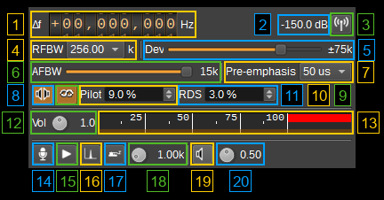
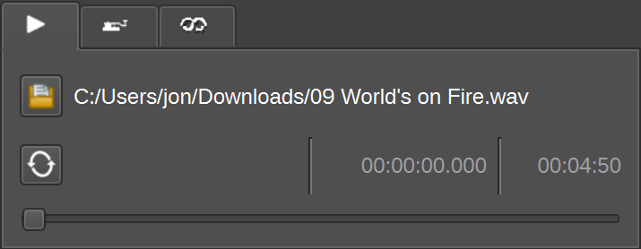
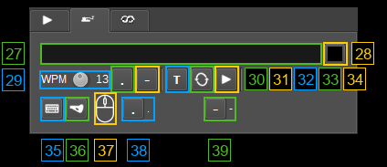
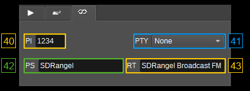

<h1>Broadcast FM modulator plugin</h1>

<h2>Introduction</h2>

This plugin generates a broadcast FM signal for use with [Broadcast FM Demodulator](../../channelrx/demodbfm/readme.md) or a conventional FM receiver.
It supports mono and stereo programme audio, 50 or 75 microsecond pre-emphasis, and RDS programme identification, programme service name and RadioText. 
Audio can come from a live audio device, a WAV or raw file, a tone generator, or the Morse keyer.

The default broadcast configuration is stereo, 50 microsecond pre-emphasis, RDS enabled, 75 kHz peak deviation and 256 kHz RF bandwidth.

<h2>Interface</h2>

The top and bottom bars of the channel window are described in the [channel window documentation](../../../sdrgui/channel/readme.md).

<h3>1: Frequency shift from center frequency of transmission</h3>

Sets the channel frequency offset in Hz from the device's center frequency. Use the mouse wheel over a digit, or select a digit and use the keyboard arrows. Holding Shift changes the digit by 5; holding Control changes it by 2. Right click a digit to set the digits to its right to zero. The channel marker in the spectrum can also be dragged to change the offset.

<h3>2: Channel power</h3>

Displays the average transmitted channel power in dB relative to a full-scale signal with an amplitude of &plusmn;1.0.

<h3>3: Channel mute</h3>

Toggles the channel's RF output on or off. Muting suppresses the complete signal, including the carrier, pilot and RDS.

<h3>4: RF bandwidth (RFBW)</h3>

Sets the bandwidth of the channel filter applied after FM modulation. Available values are 150, 180, 200, 220, 240, 256, 280 and 300 kHz. The default is 256 kHz. Narrower settings can truncate the FM sidebands and reduce stereo separation, particularly with stereo and RDS enabled. The device sample rate must be at least the RF bandwidth; when it is lower, a warning is shown in the status bar at the bottom of the channel window.

<h3>5: Frequency deviation (Dev)</h3>

Sets the peak frequency deviation from 0 to 100 kHz in 1 kHz steps. The default is 75 kHz. This applies to the complete multiplex, including programme audio, pilot and RDS. Match the receiver's deviation setting to the transmitted signal.

<h3>6: Audio frequency bandwidth (AFBW)</h3>

Sets the programme audio bandwidth from 1 to 15 kHz in 1 kHz steps. The default is 15 kHz. The upper limit keeps programme audio clear of the 19 kHz pilot and keeps the stereo difference sidebands clear of the RDS band.

<h3>7: Pre-emphasis</h3>

Selects Off, 50 microseconds or 75 microseconds. Pre-emphasis boosts higher audio frequencies before transmission; the receiver's matching de-emphasis restores the audio response. The default is 50 microseconds, commonly used in Europe. 75 microseconds is commonly used in North America.

<h3>8: Stereo</h3>

Toggles between mono and stereo; the icon shows the selected mode. Stereo enables stereo transmission using a 19 kHz pilot and a 38 kHz subcarrier carrying the left-minus-right signal. Live audio and stereo WAV files preserve their left and right channels. 
Mono files, the tone generator and the Morse keyer feed both channels equally.

When disabled, the left and right inputs are averaged for mono transmission. RDS can still be transmitted in mono mode and keeps the pilot enabled. Stereo is enabled by default.

<h3>9: RDS enable</h3>

Toggles Radio Data System information on a 57 kHz subcarrier. This includes the programme identification code, programme type, programme service name and RadioText configured below. RDS is enabled by default and also enables the 19 kHz reference pilot, including in mono mode.

The RDS signal is shaped to occupy &plusmn;2.4 kHz around 57 kHz. The station is flagged as music and not as a traffic programme. The stereo decoder identification flag follows the Stereo setting.

<h3>10: Pilot level (Pilot)</h3>

Sets the 19 kHz pilot level as a percentage of peak deviation, from 0% to 20% in 0.5 percentage-point steps. The default is 9%. This setting applies when Stereo or RDS is enabled. Setting it to zero removes the pilot even when either feature is enabled, preventing normal pilot-based stereo decoding.

<h3>11: RDS subcarrier level (RDS)</h3>

Sets the RDS subcarrier level as a percentage of peak deviation, from 0% to 10% in 0.5 percentage-point steps. The default is 3%. This setting applies when RDS is enabled. Increasing the pilot or RDS level reduces the modulation range available for programme audio.

<h3>12: Volume (Vol)</h3>

Sets the audio input gain from 0.0 to 2.0 in steps of 0.1. The default is 1.0. After pre-emphasis, a stereo-linked peak limiter reduces the gain when necessary to keep audio peaks within range. Lower the input gain if sustained limiting causes audible changes in volume.

<h3>13: Audio level meter</h3>

Shows the level of the mono sum of the processed left and right audio channels as a percentage of full scale:

* Top bar: average level.
* Bottom bar: instantaneous peak level.
* Tip marker: peak hold level.

Use this meter when adjusting the audio input gain.

<h2>14: Microphone input</h2>

Set input audio from a live microphone or line input device. Left click the microphone button to select live audio input. Right click it to choose the audio input device. 
The device's left and right channels are used for stereo transmission or averaged for mono transmission.

See the [audio management documentation](../../../sdrgui/audio.md) for device configuration.

<h2>15: Audio file input</h2>

Set input audio from a .raw or .wav file. Selecting the audio file source shows the audio file playback tab, as described below.

<h3>16: Tone input</h3>

Set input audio to a continuous audio tone at the frequency set by the tone frequency dial. The tone is sent equally to the left and right channels.

<h3>17: Morse keyer input</h3>

Selects the Morse keyer as the audio source, using the tone frequency dial for its audio pitch. Configure the text or manual keying controls described below.

<h3>18: Tone frequency</h3>

Sets the audio frequency used by both the continuous tone and Morse keyer from 0.10 to 10.00 kHz in 0.01 kHz steps. The default is 1.00 kHz. Keep the tone within the selected audio bandwidth to avoid attenuating it.

<h3>19: Audio feedback and output device</h3>

Left click the feedback button to enable or disable local monitoring of the processed programme audio. 
Right click it to select the audio output device. Feedback is disabled by default. 
Audio buffering introduces a delay, so feedback is best used to monitor the programme rather than to time manual Morse keying.

<h3>20: Audio feedback volume</h3>

Sets the local monitoring volume from 0.00 to 1.00 in steps of 0.01. The default is 0.50. This adjusts the feedback output independently of the transmitted audio input gain.

<h2>Audio file playback tab</h2>

Select the Audio file input (17) to transmit the output of these controls.

<h3>Select audio file</h3>

Opens a file dialog to select a `.wav` or `.raw` file. Supported formats are:

* Mono or stereo WAV with 8-, 16-, 24- or 32-bit PCM samples, or 32- or 64-bit floating-point samples. Playback uses the sample rate stored in the WAV file.
* Mono, 48 kHz, 32-bit little-endian floating-point raw audio (F32LE).

Mono files feed both audio channels equally. Stereo WAV files retain separate channels when Stereo is enabled.

<h3>Audio file path</h3>

Displays the path of the selected audio file, or dots when no file has been selected.

<h3>Loop audio file</h3>

Restarts playback from the beginning when the end of the file is reached.

<h3>Current file position</h3>

Displays the current playback time relative to the beginning of the file.

<h3>File length</h3>

Displays the total duration of the selected audio file.

<h3>File position slider</h3>

Shows the playback position as a percentage of the file length. Pause playback to enable the slider, move it to the desired position, then resume playback.

<h2>Morse keyer tab</h2>

Select the Morse keyer input (17) to transmit the output of these controls.

<h3>CW text</h3>

Enter the message to send in text mode. Press Enter or leave the field to apply the text.

<h3>Clear CW text</h3>

Clears the message in the CW text field.

<h3>CW speed</h3>

Sets the keying speed from 1 to 26 words per minute (WPM). The default is 13 WPM. Timing uses the standard word PARIS: a dot lasts 1.2 / WPM seconds, a dash lasts three dot lengths, and the gaps between elements, characters and words last one, three and seven dot lengths respectively.

<h3>Send dots</h3>

Sends dots continuously at the selected CW speed. Switch it off before selecting another keying mode.

<h3>Send dashes</h3>

Sends dashes continuously at the selected CW speed. Switch it off before selecting another keying mode.

<h3>Send text</h3>

Selects text mode and starts sending the message in the CW text field.

<h3>Repeat CW text</h3>

Repeats the message continuously while text mode is active.

<h3>CW text play/stop</h3>

Stops or starts text keying. Starting again restarts the message from its beginning.

<h3>Keyboard and mouse keying</h3>

Enables manual keying with the assigned keyboard keys or the mouse pad. This mode is mutually exclusive with text, continuous dots and continuous dashes. If the keyboard focus is lost, toggle this control off and on to restore the key bindings.

<h3>Keying style</h3>

Selects iambic or straight keying. In iambic mode the dot and dash controls act as separate paddles. In straight mode either control keys the tone while held down.

<h3>Mouse keying pad</h3>

With keyboard and mouse keying enabled, move the pointer over the pad and use the left mouse button for dots and the right button for dashes. In straight mode both buttons act as key down.

<h3>Dot key assignment</h3>

Select the dot key capture button, then press the key or key-and-modifier combination to assign to dots. The assigned key is displayed beside the button.

<h3>Dash key assignment</h3>

Select the dash key capture button, then press the key or key-and-modifier combination to assign to dashes. The assigned key is displayed beside the button.

<h2>RDS tab</h2>

Check RDS enable (9) to transmit these fields.

<h3>RDS programme identification (PI)</h3>

Sets the station's 16-bit programme identification code. 
Enter up to four hexadecimal digits; the display is normalized to four digits when editing finishes. 
The default is `1234`. An invalid entry leaves the previous value in place.

<h3>RDS programme type (PTY)</h3>

Selects the programme type. Receivers use this to describe or select the programme category. 
The names are those of the RDS programme type table, which the BFM demodulator also displays, and the position in the list is the code transmitted (0 to 31). 
The default is None (0). North American receivers use the RBDS table, which gives some codes different names.

<h3>RDS programme service name (PS)</h3>

Sets the station name displayed by RDS receivers, up to eight characters. 
Shorter names are padded with spaces for transmission. 
The default is `SDRangel`. Press Enter or leave the field to apply the change.

<h3>RDS RadioText (RT)</h3>

Sets a message of up to 64 characters, such as programme information or a track title. 
The default is `SDRangel Broadcast FM`. Press Enter or leave the field to apply the change. 
Receivers may take several RDS groups to display the complete message.
