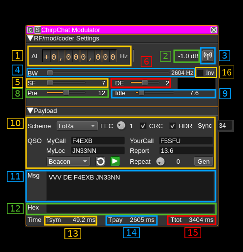
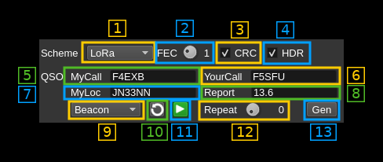

<h1>LoRa modulator plugin</h1>

<h2>Introduction</h2>

This plugin can be used to code and modulate a transmission signal based on Chirp Spread Spectrum (CSS). The basic idea is to transform each symbol of a MFSK modulation to an ascending frequency ramp shifted in time. It could equally be a descending ramp but this one is reserved to detect a break in the preamble sequence (synchronization). This plugin has been designed to work in conjunction with the ChirpChat demodulator plugin that should be used ideally on the reception side.

It has clearly been inspired by the LoRa technique but is designed for experimentation and extension to other protocols mostly inspired by amateur radio techniques using chirp modulation to transmit symbols. Thanks to the MFSK to chirp translation it is possible to adapt any MFSK based mode.

LoRa is a property of Semtech and the details of the protocol are not made public. However a LoRa compatible protocol has been implemented based on the reverse engineering performed by the community. It is mainly based on the work done in https://github.com/myriadrf/LoRa-SDR. You can find more information about LoRa and chirp modulation here:

  - To get an idea of what is LoRa: [here](https://www.link-labs.com/blog/what-is-lora)
  - A detailed inspection of LoRa modulation and protocol: [here](https://static1.squarespace.com/static/54cecce7e4b054df1848b5f9/t/57489e6e07eaa0105215dc6c/1464376943218/Reversing-Lora-Knight.pdf)

This LoRa encoder is designed for experimentation. For production grade applications it is recommended to use dedicated hardware instead.

Modulation characteristics from LoRa have been augmented with more bandwidths and FFT bin collations (DE factor). Plain TTY and ASCII have also been added and there are plans to add some more complex typically amateur radio MFSK based modes like JT65.

Note: this plugin is officially supported since version 6.

<h2>Interface</h2>

The top and bottom bars of the channel window are described [here](../../../sdrgui/channel/readme.md)

<h3>1: Frequency shift from center frequency of reception</h3>

Use the wheels to adjust the frequency shift in Hz from the center frequency of reception. Left click on a digit sets the cursor position at this digit. Right click on a digit sets all digits on the right to zero. This effectively floors value at the digit position. Wheels are moved with the mousewheel while pointing at the wheel or by selecting the wheel with the left mouse click and using the keyboard arrows. Pressing shift simultaneously moves digit by 5 and pressing control moves it by 2.

<h3>2: Channel power</h3>

The signal is frequency modulated with a constant envelope hence this value should be constant. To prevent possible overshoots the signal is reduced by 1 dB from the full scale. Thus this should always display `-1 dB`.

<h3>3: Channel mute</h3>

Use this button to mute/unmute transmission.

<h3>4: Bandwidth</h3>

This is the bandwidth of the ChirpChat signal. Similarly to LoRa the signal sweeps between the lower and the upper frequency of this bandwidth. The sample rate of the ChirpChat signal in seconds is exactly one over this bandwidth in Hertz.

In the LoRa standard there are 2 base bandwidths: 500 and 333.333 kHz. A 400 kHz base has been added. Possible bandwidths are obtained by a division of these base bandwidths by a power of two from 1 to 64.  Extra divisor of 128 is provided to achieve smaller bandwidths that can fit in a SSB channel. Finally special divisors from a 384 kHz base are provided to allow even more narrow bandwidths.

Thus available bandwidths are:

  - **500000** (500000 / 1) Hz
  - **400000** (400000 / 1) Hz not in LoRa standard
  - **333333** (333333 / 1) Hz
  - **250000** (500000 / 2) Hz
  - **200000** (400000 / 2) Hz not in LoRa standard
  - **166667** (333333 / 2) Hz
  - **125000** (500000 / 4) Hz
  - **100000** (400000 / 4) Hz not in LoRa standard
  - **83333** (333333 / 4) Hz
  - **62500** (500000 / 8) Hz
  - **50000** (400000 / 8) Hz not in LoRa standard
  - **41667** (333333 / 8) Hz
  - **31250** (500000 / 16) Hz
  - **25000** (400000 / 16) Hz not in LoRa standard
  - **20833** (333333 / 16) Hz
  - **15625** (500000 / 32) Hz
  - **12500** (400000 / 32) Hz not in LoRa standard
  - **10417** (333333 / 32) Hz
  - **7813** (500000 / 64) Hz
  - **6250** (400000 / 64) Hz not in LoRa standard
  - **5208** (333333 / 64) Hz
  - **3906** (500000 / 128) Hz not in LoRa standard
  - **3125** (400000 / 128) Hz not in LoRa standard
  - **2604** (333333 / 128) Hz not in LoRa standard
  - **1500** (384000 / 256) Hz not in LoRa standard
  - **750** (384000 / 512) Hz not in LoRa standard
  - **375** (384000 / 1024) Hz not in LoRa standard

The ChirpChat signal is oversampled by four therefore it needs a baseband of at least four times the bandwidth. This drives the maximum value on the slider automatically.

<h3>5: Spread Factor</h3>

This is the Spread Factor parameter of the ChirpChat signal. This is the log2 of the possible frequency shifts used over the bandwidth (3). The number of symbols is 2SF-DE where SF is the spread factor and DE the  Distance Enhancement factor (8). To

<h3>6: Distance Enhancement factor</h3>

The LoRa standard specifies 0 (no DE) or 2 (DE active). The ChirpChat range is extended to all values between 0 and 4 bits.

This is the log2 of the number of frequency shifts separating two consecutive shifts that represent a symbol. On the receiving side this decreases the probability to detect the wrong symbol as an adjacent FFT bin. It can also overcome frequency drift on long messages.

In practice it is difficult on the Rx side to make correct decodes if only one FFT bin is used to code one symbol (DE=0). It is therefore recommended to use a factor of 1 or more.

<h3>8: Number of preamble chirps</h3>

This is the number of preamble chirps to transmit that are used for the Rx to synchronize. The LoRa standard specifies it can be between 2 and 65535. Here it is limited to the 4 to 20 range that corresponds to realistic values. The RN2483 uses 6 preamble chirps. You may use 12 preamble chirps or more to facilitate signal acquisition with poor SNR on the Rx side.

<h3>9: Idle time between transmissions</h3>

When sending a message repeatedly this is the time between the end of one transmission and the start of the next transmission.

<h3>10: Message and encoding details</h3>

ChirpChat is primarily designed to make QSOs in the amateur radio sense. To be efficient the messages have to be kept short and minimal therefore the standard exchange follows WSJT scheme and is reflected in the sequence of messages you can follow with the message selection combo (10.9): CQ, Reply to CQ, Report to callee, Report to caller (R-Report), RRR and 73.

To populate messages you can specify your callsign (10.5), the other party callsign (10.6), your QRA locator (10.7) and a signal report (10.8)

<h4>10.1: Modulation scheme</h4>

  - **LoRa**: LoRa compatible
  - **ASCII**: 7 bit plain ASCII without FEC and CRC. Requires exactly 7 bit effective samples thus SF-DE = 7 where SF is the spreading factor (5) and DE the distance enhancement factor (6)
  - **TTY**: 5 bit Baudot (Teletype) without FEC and CRC. Requires exactly 5 bit effective samples thus SF-DE = 5 where SF is the spreading factor (5) and DE the distance enhancement factor (6)

<h4>10.2: Number of FEC parity bits (LoRa)</h4>

This is a LoRa specific feature. Each byte of the payload is split into two four bit nibbles and Hamming code of various "strength" in number of parity bits can be applied to these nibbles. The number of parity bits can vary from 1 to 4. 0 (no FEC) has been added but is not part of the LoRa original standard:

  - **0**: no FEC
  - **1**: 1 bit parity thus Hamming H(4,5) applies
  - **2**: 2 bit parity thus Hamming H(4,6) applies
  - **3**: 3 bit parity thus Hamming H(4,7) applies
  - **4**: 4 bit parity thus Hamming H(4,8) applies

<h4>10.3: Append two byte CRC to payload (LoRa)</h4>

This is a LoRa specific feature. A 2 bytes CRC can be appended to the payload.

<h4>10.4: Send a header at the start of the payload (LoRa)</h4>

This is a LoRa specific feature and is also known as explicit (with header) or implicit (without header) modes. In explicit mode a header with net payload length in bytes, presence of a CRC and number of parity bits is prepended to the actual payload. This header has a 1 byte CRC and is coded with H(4,8) FEC.

<h4>10.5: My callsign (QSO mode)</h4>

Enter your callsign so it can populate message placeholders (See next)

<h4>10.6: Your callsign (QSO mode)</h4>

Enter the other party callsign so it can populate message placeholders (See next)

<h4>10.7: My locator (QSO mode)</h4>

Enter your Maidenhead QRA locator so it can populate message placeholders (See next)

<h4>10.8: My report (QSO mode)</h4>

Enter the signal report you will send to the other party so it can populate message placeholders (See next)

<h4>10.9: Message selector</h4>

This lets you choose which pre-formatted message to send:

  - **None**: empty message. In fact this is used to make a transition to trigger sending of the same message again. It is used internally by the "play" button (11) and can be used with the REST API.
  - **Beacon**: a beacon message
  - **CQ**: (QSO mode) CQ general call message
  - **Reply**: (QSO mode) reply to a CQ call
  - **Report**: (QSO mode) signal report to the callee of a CQ call
  - **R-Report**: (QSO mode) signal report to the caller of a CQ call
  - **RRR**: (QSO mode) report received confirmation to the callee
  - **73**: (QSO mode) confirmation back to the caller and closing the QSO
  - **QSO text**: (QSO mode) free form message with callsigns
  - **Text**: plain text
  - **Bytes**: binary message in the form of a string of bytes. Use the hex window (12) to specify the message

<h4>10.10: Revert to standard messages</h4>

Reformat all predefined messages in standard messages with placeholders. The Generate button (13) replaces the placeholders with the given QSO elements (10.5 to 10.8)

  - **Beacon**: `VVV DE %1 %2`
  - **CQ**: `CQ DE %1 %2`
  - **Reply**: `%1 %2 %3`
  - **Report**: `%1 %2 %3`
  - **R-Reply**: `%1 %2 R%3`
  - **RRR**: `%1 %2 RRR`
  - **73**: `%1 %2 73`
  - **QSO text**: `%1 %2 %3`

<h4>10.11 Play current message immediately</h4>

This starts playing the current selected message immediately. It may be necessary to use this button after a change of modulation and/or coding parameters.

<h4>10.12: Number of message repetitions</h4>

The message is repeated this number of times (use 0 for infinite). The end of one message sequence and the start of the next is separated by the delay specified with the "Idle" slidebar (9)

<h4>10.13: Generate messages</h4>

This applies the QSO elements (10.5 to 10.8) to the placeholders in messages to generate the final messages:

  - **Beacon**: `VVV DE %1 %2`: `%1` is my call (10.5) and `%2` is my locator (10.7)
  - **CQ**: `CQ DE %1 %2`: `%1` is my call (10.5) and `%2` is my locator (10.7)
  - **Reply**: `%1 %2 %3`: `%1` is your call (10.6), `%2` is my call (10.5) and `%3` is my locator (10.7)
  - **Report**: `%1 %2 %3`: `%1` is your call (10.6), `%2` is my call (10.5) and `%3` is my report (10.8)
  - **R-Reply**: `%1 %2 R%3`: `%1` is your call (10.6), `%2` is my call (10.5) and `%3` is my report (10.8)
  - **RRR**: `%1 %2 RRR`: `%1` is your call (10.6) and `%2` is my call (10.5)
  - **73**: `%1 %2 73`: `%1` is your call (10.6) and `%2` is my call (10.5)
  - **QSO text**: `%1 %2 %3`: `%1` is your call (10.6), `%2` is my call (10.5) and `%3` is the text specified as the free form text message

<h4>10.14: Sync word</h4>

This is a LoRa specific feature and is the sync word (byte) to transmit entered as a 2 nibble hexadecimal number.

<h3>11: Message text</h3>

This window lets you edit the message selected in (10.9). You can use `%n` placeholders that depend on the type of message selected.

  - **Beacon**: `%1` is my callsign and `%2` is my locator
  - **CQ message**: `%1` is my callsign and `%2` is my locator
  - **Reply**: `%1` is the other callsign, `%2` is my callsign and `%3` is my locator
  - **Report**: `%1` is the other callsign, `%2` is my callsign and `%3` is my report
  - **R-Report**: `%1` is the other callsign, `%2` is my callsign and `%3` is my report
  - **RRR**: `%1` is the other callsign and `%2` is my callsign
  - **73**: `%1` is the other callsign and `%2` is my callsign
  - **QSO Text**: `%1` is the other callsign, `%2` is my callsign and `%3` is the free text message
  - **Text**: free text message no placeholders
  - **Bytes**: binary message no placeholders

<h3>12: Message bytes</h3>

Use this line editor to specify the hex string used as the bytes message.

<h3>13: Symbol time</h3>

This is the duration of a symbol or chirp in milliseconds

<h3>14: Payload time</h3>

This is the duration of the message payload in milliseconds. It excludes the preamble, the sync word and synchronization (SFD) sequence.

<h3>15: Total time</h3>

This is the duration of the full message in milliseconds.
