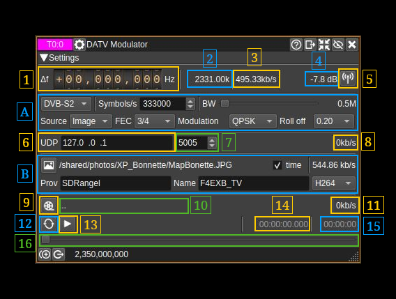

<h1>DATV modulator plugin</h1>

<h2>Introduction</h2>

This plugin can be used to transmit a digital amateur TV signal in the DVB-S or DVB-S2 standards. The plugin requires the video and audio to be transmitted to be in an MPEG transport stream.
The MPEG transport stream can either be read from a file or streamed via UDP.

The MPEG transport stream must (for now) be created outside of SDRangel, using software such as ffmpeg. The MPEG transport stream can contain video compressed using codecs such as MPEG-2, h264 or h265 (HEVC).
Similarly, audio can be MPEG-2, MP3 or Opus. Settings such as the video resolution are determined by the software used to create the MPEG transport stream.
The DATV modulator plugin just performs channel coding and modulation of the transport stream according to the DVB-S standard.

DVB-S includes: scrambling, Reed-Solomon RS(204,188,T=8) coding, convolutional interleaving (I=12), convolutional encoding (code rate=1/2, with optional puncturing to rates of 2/3, 3/4, 5/6 and 7/8) and BPSK or QPSK modulation.

DVB-S2 includes: scrambling, BCH encoder, LDPC encoder, bit interleaver and QPSK, 8PSK, 16APSK or 32APSK modulation.

<h2>Interface</h2>

The top and bottom bars of the channel window are described [here](../../../sdrgui/channel/readme.md)

<h3>1: Frequency shift from center frequency of transmission</h3>

Use the wheels to adjust the frequency shift in Hz from the center frequency of transmission. Left click on a digit sets the cursor position at this digit.
Right click on a digit sets all digits on the right to zero. This effectively floors value at the digit position.
Wheels are moved with the mousewheel while pointing at the wheel or by selecting the wheel with the left mouse click and using the keyboard arrows.
Pressing shift simultaneously moves digit by 5 and pressing control moves it by 2.

<h3>2: Sample rate</h3>

This figure is the sample rate in kS/s used by the modulator. The modulator requires a sample rate that is an integer multiple of the symbol rate.
If this rate differs from the baseband sample rate, a rational interpolator will be used to upsample.

<h3>3: Data rate</h3>

This figure is the data rate supported by the DVB-S channel, as determined by the settings below.
This is the maximum rate a transport stream can be transmitted at, so this value should be greater or equal to the bitrate required for the transport stream, if real-time decoding at the receiver is required.
If this rate is greater than the bitrate required for a transport stream file, the modulator will transmit null packets to try to transmit the stream at the required rate.
If the transport stream is via UDP, null packets will be transmitted when no data is available on the UDP port.

<h3>4: Channel power</h3>

Average total power in dB relative to a &#177;1.0 amplitude signal generated in the pass band.

<h3>5: Channel mute</h3>

Use this button to toggle mute for this channel. The radio waves on the icon are toggled on (active) and off (muted) accordingly. Default is channel active.

<h3>6: Standard</h3>

Select the DVB standard to use for channel coding and modulation. This can be either DVB-S or DVB-S2.

<h3>7: Symbol rate</h3>

Specifies the symbol rate in symbols per second. Higher symbol rates allow for higher bitrate transport streams to be transmitted, but require a greater bandwidth.

<h3>8: Bandwidth</h3>

Specifies the bandwidth of a filter applied to the modulated output signal when interpolation takes place (i.e. when the sample rate (2) is not equal to the baseband sample rate). Otherwise the full baseband bandwidth is used.

<h3>9: Transport Stream Source</h3>

This combo box lets you choose the source of the MPEG transport stream:

  - File: transport stream file read from the file selected with button (16).
  - UDP:  transport stream received via UDP port (14).

When using UDP, the packet size should be an integer multiple of the MPEG transport stream packet size, which is 188 bytes. 1316 bytes is a common value.

<h3>10: FEC</h3>

Forward error correction code rate. This controls the number of bits sent to help the receiver to correct errors.
A code rate of 1/2 has the highest overhead (corresponding to a lower data rate), but allows the most amount of errors to be correct.
7/8 (DVB-S) or 9/10 (DVB-S2) has the least overhead (corresponding to higher data rates), but will allow the fewest amount of errors to be corrected.

<h3>11: Modulation</h3>

Select the modulation to be used. For DVB-S, this can either be BPSK or QPSK. For DVB-S2, this can be QPSK, 8PSK, 16APSK or 32PSK.

BPSK transmits a single bit per symbol, whereas QPSK transmits two bits per symbol, so has twice the bitrate. Similar, 8PSK is 3 bits per symbol, 16APSK 4 and 32PSK 5. BPSK, QPSK and 8PSK only modulate phase. 16APSK and 32APKS modulate both phase and amplitude.

<h3>12: Roll off</h3>

Roll-off for the root raised cosine filter. For DVB-S, this should be 0.35. For DVB-S2 this can be 0.2, 0.25 or 0.35.

<h3>13: UDP IP address</h3>

Set the IP address of the network interface/adaptor to bind the UDP socket to.

<h3>14: UDP port</h3>

Set the UDP port number the UDP socket will be opened on. This is the port the transport stream will need to be sent to.

<h3>15: UDP bitrate</h3>

This displays the bitrate at which data is being received via the UDP port.

<h3>16: Transport stream file select</h3>

Clicking on this button will open a file dialog to let you choose an MPEG transport stream file to transmit. When the dialog is closed and the choice is validated the name of the file will appear on the space at the right of the button.

<h3>17: Play loop</h3>

Use this button to toggle on/off transmitting of the transport stream file in a loop.

<h3>18: Play/Pause</h3>

Use this button to play or pause the transport stream file.

<h3>19: Current transport stream file position</h3>

This is the current transport stream file position in time units relative to the start.

<h3>20: Transport stream file bitrate</h3>

This is the bitrate in kb/s of the transport stream file. This should be less or equal to the DVB data rate (3).

<h3>21: Transport stream file length</h3>

This is the length of the transport stream file in time units

<h3>22: Transport stream file position slider</h3>

This slider can be used to randomly set the current position in the file when file play is in pause state (button 18). When the transport stream is transmitted, the slider moves according to the current position.

<h2>Creating an MPEG transport stream</h2>

An MPEG transport stream file can be created from a video file using ffpmeg:

    ffmpeg -i input.avi -pix_fmt yuv420p -r 25 -s 720x576 -aspect 4:3 -c:v hevc -c:a libopus -b:v 500k -b:a 64k -maxrate 600k -bufsize 50k -f mpegts -mpegts_original_network_id 1 -mpegts_transport_stream_id 1 -mpegts_service_id 1  -mpegts_pmt_start_pid 4096 -streamid 0:289 -streamid 1:337 -metadata service_provider="SDRangel"  -metadata service_name="SDRangel TV" -y mpeg.ts

To stream from a video camera via UDP (on Windows):

    ffmpeg  -f dshow -i video="c922 Pro Stream Webcam":audio="Microphone (C922 Pro Stream Webcam)" -pix_fmt yuv420p -r 25 -s 720x576 -aspect 4:3 -c:v hevc -c:a libopus -b:v 500k -b:a 64k -maxrate 600k -bufsize 50k -f mpegts -mpegts_original_network_id 1 -mpegts_transport_stream_id 1 -mpegts_service_id 1  -mpegts_pmt_start_pid 4096 -streamid 0:289 -streamid 1:337 -metadata service_provider="SDRangel"  -metadata service_name="SDRangel TV" -flush_packets 0 "udp://127.0.0.1:5004?pkt_size=1316&bitrate=600000"

You can list camera devices with:

    ffmpeg -list_devices true -f dshow -i dummy
