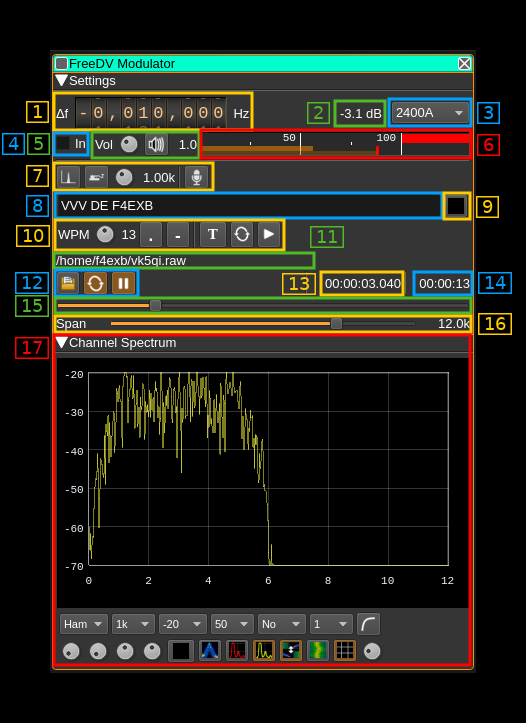

<h1>FreeDV modulator plugin</h1>

<h2>Introduction</h2>

This plugin can be used to generate a signal following the [FreeDV digital voice protocol](https://freedv.org/).

&#9888; A minimum of 48 kS/s I/Q sample rate in the baseband is required in 2400A mode for the coder/modulator to work correctly. Other modes only require 8 kS/s however such a low rate is not recommended and at least 48 kS/s should be used anyway.

<h2>Interface</h2>

The top and bottom bars of the channel window are described [here](../../../sdrgui/channel/readme.md)

<h3>1: Frequency shift from center frequency of transmission</h3>

Use the wheels to adjust the frequency shift in Hz from the center frequency of transmission. Left click on a digit sets the cursor position at this digit. Right click on a digit sets all digits on the right to zero. This effectively floors value at the digit position. Wheels are moved with the mousewheel while pointing at the wheel or by selecting the wheel with the left mouse click and using the keyboard arrows. Pressing shift simultaneously moves digit by 5 and pressing control moves it by 2.

<h3>2: Channel power</h3>

Average total power in dB relative to a +/- 1.0 amplitude signal generated in the pass band.

<h3>3: FreeDV mode</h3>

Use this combo box to select which FreeDV standard is used. The following are supported:

  - `2400A`: FSK-4 wideband (6 kHz) modulation with 1300 b/s compressed voice to be used at 29 MHz and above similarly to FM analog usage. [Details here](https://www.rowetel.com/?p=5119)
  - `1600`: OFDM (16 QPSK carriers) narrowband (1.4 kHz) with 700 b/s compressed voice
  - `800XA`: FSK-4 narrowband (2 kHz) with 700 b/s compressed voice
  - `700C`: Another OFDM (14 QPSK carriers) narrowband (1.5 kHz) mode with 700 b/s compressed voice

<h3>4: Reverse left and right channels in binaural mode</h3>

Effective only in binaural mode: reverses left and right audio channels so that the left is connected to Q and the right to the I complex signal channel.

<h3>4: VU meter selection</h3>

Check to select input audio to be displayed on the VU meter (6)

<h3>5: Volume</h3>

This is the volume of the modulating audio signal from 0.0 (mute) to 2.0 (maximum). It can be varied continuously in 0.1 steps using the dial button. The Loudspeaker button is the audio mute toggle.

<h3>6: Level meter in %</h3>

Use the checkbox (4) to select between input audio and modulator output display

  - top bar (beige): average value
  - bottom bar (brown): instantaneous peak value
  - tip vertical bar (bright red): peak hold value

You should aim at keeping the peak value below 100% using the volume control

<h3>7: Input source control</h3>

<h4>7.1: Tone input select</h4>

Switches to the tone input. You must switch it off to make other inputs available. Note that tone input has been kept from other modulators but does not make much sense for digital voice modes.

<h4>7.2: Morse keyer input select</h4>

Switches to the Morse keyer input. You must switch it off to make other inputs available. Note that the Morse keyer has been kept from other modulators but does not make much sense for digital voice modes.

<h4>7.3: Tone frequency (kHz)</h4>

Adjusts the tone frequency from 0.1 to 2.5 kHz in 0.01 kHz steps.

<h4>7.4: Audio input select and select audio input device</h4>

Left click to switch to the audio input. You must switch it off to make other inputs available.

Right click to select audio input device. See [audio management documentation](../../../sdrgui/audio.md) for details.

<h3>8: CW (Morse) text</h3>

Enter the text to be keyed when Morse input is active and in text mode.

<h3>9: Clear CW text</h3>

Clears the CW (Morse) text

<h3>10: Morse keyer controls</h3>

<h4>10.1: CW keying speed</h4>

Sets the CW speed in Words Per Minute (WPM). This is based on the word "PARIS" sent 5 times. For 5 WPM the dot length is 240 ms. In other terms the dot length is calculated as 1.2 / WPM seconds. The dot length is used as the base to compute other timings:

  - Element (dot or dash) silence separator: 1 dot length
  - Dash: 3 dot lengths
  - Character silence separator: 3 dot lengths
  - Word silence separator: 7 dot lengths

<h4>10.2: Dots keying</h4>

Switch this button to send dots continuously

<h4>10.3: Dashes keying</h4>

Switch this button to send dashes continuously

<h4>10.4: Text keying</h4>

Switch this button to send the text typed into the text box (13)

<h4>10.5: Text auto repeat</h4>

Switch this button to auto repeat the text keying

<h4>10.6: Text play/stop</h4>

Use this button to stop sending text. When resuming keying restarts at the start of text

&#9888; WARNING: what follows is not really useful if you do not use a proper Morse keyer with direct audio feedback. There is a significant audio delay either with the direct monitoring or by monitoring the transmitted signal so keying with this audio as feedback is not practical

10.7: Activate morse keys keyboard control

This disables text or continuous dots or dashes. Toggle input from keyboard. Occasionally the focus may get lost and you will have to deactivate and reactivate it to recover the key bindings.

10.8: Iambic or straight

Choose iambic or straight keying style. When straight is selected the dot or dash key may be used.

10.9: Register dot key

Click on the button and while selected type a character or character and modifier (Shift + key for example) to select which key is used for dots. The key or key sequence appears next (here dot `.`)

10.10: Register dash key

Click on the button and while selected type a character or character and modifier (Shift + key for example) to select which key is used for dashes. The key or key sequence appears next (here dot `.`)

<h3>11: Audio file path</h3>

The path to the selected audio file to be played or dots if unselected

<h3>12: Audio file play controls</h3>

<h4>12.1: Audio file select</h4>

Opens a file dialog to select the audio file to be played. It must be 8 kHz S16LE single (mono) channel raw format.
Using sox a .wav file can be converted with this command: `sox piano.wav -t raw -r 8k -c 1 -b 16 -L -e signed piano.raw`

<h4>12.2: Audio file loop</h4>

Audio replay file at the end

<h4>12.3: Play/pause file play</h4>

Toggle play/pause file play. When paused the slider below (20) can be used to randomly set the position in the file when re-starting.

<h3>13: Play file current position</h3>

This is the current audio file play position in time units relative to the start

<h3>14: Play file length</h3>

This is the audio file play length in time units

<h3>15: Play file position slider</h3>

This slider can be used to randomly set the current position in the file when file play is in pause state (button 17.3)

<h3>16: Spectrum display frequency span</h3>

The transmitted signal is further decimated by a power of two before being applied to the channel spectrum display and used to set the in channel filter limits. This effectively sets the total available bandwidth depending on the decimation:

  - 1 (no decimation): 24 kHz (2400A) or 4 kHz (other modes)
  - 2: 12 kHz (2400A) or 2 kHz (other modes)
  - 4: 6 kHz (2400A) or 1 kHz (other modes)
  - 8: 3 kHz (2400A) or 0.5 kHz (other modes)
  - 16: 1.5 kHz (2400A) or 0.25 kHz (other modes)

<h3>17: Channel spectrum display</h3>

This is the channel spectrum display. Details on the spectrum view and controls can be found [here](../../../sdrgui/gui/spectrum.md)
