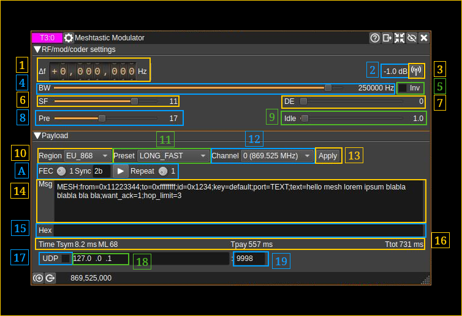
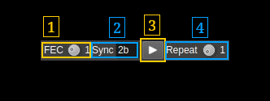

<h1>Meshtastic modulator plugin</h1>

<h2>Introduction</h2>

This plugin can be used to code and modulate a transmission signal based the LoRa Chirp Spread Spectrum (CSS) modulation scheme with a Meshtastic payload.

The basic idea of the CSS modulation is to transform each symbol of a MFSK modulation to an ascending frequency ramp shifted in time. It could equally be a descending ramp but this one is reserved to detect a break in the preamble sequence (synchronization). This plugin has been designed to work in conjunction with the Meshtastic demodulator plugin that should be used ideally on the reception side.

LoRa is a property of Semtech and the details of the protocol are not made public. However a LoRa compatible protocol has been implemented based on the reverse engineering performed by the community. It is mainly based on the work done in https://github.com/myriadrf/LoRa-SDR. You can find more information about LoRa and chirp modulation here:

  - To get an idea of what is LoRa: [here](https://www.link-labs.com/blog/what-is-lora)
  - A detailed inspection of LoRa modulation and protocol: [here](https://static1.squarespace.com/static/54cecce7e4b054df1848b5f9/t/57489e6e07eaa0105215dc6c/1464376943218/Reversing-Lora-Knight.pdf)

This LoRa/Meshtastic encoder is designed for experimentation. For production grade applications it is recommended to use dedicated hardware instead.

Modulation characteristics from LoRa have been augmented with more bandwidths and FFT bin collations (DE factor) outside the specifications of the Meshtastic standards that can be set with the presets.

<h2>Fixes done by Copilot (GPT 5.3 Codex) from first PR</h2>

- TX header explicit-header sizing (SF-2 first block)
- TX backend Meshtastic auto-radio-derive (sync word 0x2B, PHY params)
- RX robust header lock (offset 0..2 + delta -2..+2 scan with realignment)
  - This is on Rx side (MeshtasticDemodSink)
- Diagnostic loopback logs with token correlation (commented out)
- Type mismatches resolved

Now a full end to end test with a Meshtastic text message works:

- ✅ TX emits Meshtastic-compatible sync word (0x2B)
- ✅ RX header lock resumes with offset/delta scan recovery
- ✅ Payload CRC validation passes end-to-end
- ✅ Full decode chain: preamble → sync → header → payload → message text displayed

<h2>Interface</h2>

The top and bottom bars of the channel window are described [here](../../../sdrgui/channel/readme.md)

<h3>1: Frequency shift from center frequency of reception</h3>

Use the wheels to adjust the frequency shift in Hz from the center frequency of reception. Left click on a digit sets the cursor position at this digit. Right click on a digit sets all digits on the right to zero. This effectively floors value at the digit position. Wheels are moved with the mousewheel while pointing at the wheel or by selecting the wheel with the left mouse click and using the keyboard arrows. Pressing shift simultaneously moves digit by 5 and pressing control moves it by 2.

<h3>2: Channel power</h3>

The signal is frequency modulated with a constant envelope hence this value should be constant. To prevent possible overshoots the signal is reduced by 1 dB from the full scale. Thus this should always display `-1 dB`.

<h3>3: Channel mute</h3>

Use this button to mute/unmute transmission.

<h3>4: Bandwidth</h3>

This is the bandwidth of the CSS signal. The signal sweeps between the lower and the upper frequency of this bandwidth. The sample rate of the CSS signal in seconds is exactly one over this bandwidth in Hertz.

In the LoRa standard there are 2 base bandwidths: 500 and 333.333 kHz. A 400 kHz base has been added. Possible bandwidths are obtained by a division of these base bandwidths by a power of two from 1 to 64.  Extra divisor of 128 is provided to achieve smaller bandwidths that can fit in a SSB channel. Finally special divisors from a 384 kHz base are provided to allow even more narrow bandwidths.

Thus available bandwidths are:

  - **500000** (500000 / 1) Hz - **Meshtastic "turbo" modes**
  - **400000** (400000 / 1) Hz not in LoRa standard
  - **333333** (333333 / 1) Hz
  - **250000** (500000 / 2) Hz - **used by Meshtastic**
  - **200000** (400000 / 2) Hz not in LoRa standard
  - **166667** (333333 / 2) Hz
  - **125000** (500000 / 4) Hz - **used by Meshtastic**
  - **100000** (400000 / 4) Hz not in LoRa standard
  - **83333** (333333 / 4) Hz
  - **62500** (500000 / 8) Hz
  - **50000** (400000 / 8) Hz not in LoRa standard
  - **41667** (333333 / 8) Hz
  - **31250** (500000 / 16) Hz
  - **25000** (400000 / 16) Hz not in LoRa standard
  - **20833** (333333 / 16) Hz
  - **15625** (500000 / 32) Hz
  - **12500** (400000 / 32) Hz not in LoRa standard
  - **10417** (333333 / 32) Hz
  - **7813** (500000 / 64) Hz
  - **6250** (400000 / 64) Hz not in LoRa standard
  - **5208** (333333 / 64) Hz
  - **3906** (500000 / 128) Hz not in LoRa standard
  - **3125** (400000 / 128) Hz not in LoRa standard
  - **2604** (333333 / 128) Hz not in LoRa standard
  - **1500** (384000 / 256) Hz not in LoRa standard
  - **750** (384000 / 512) Hz not in LoRa standard
  - **488** (500000 / 1024) Hz not in LoRa standard
  - **375** (384000 / 1024) Hz not in LoRa standard

The CSS signal is oversampled by four therefore it needs a baseband of at least four times the bandwidth. This drives the maximum value on the slider automatically. When using Meshtastic presets you have to make sure this condition is set yourself.

<h3>5: Invert chirp ramps (disabled)</h3>

The LoRa standard is up-chirps for the preamble, down-chirps for the SFD and up-chirps for the payload.

When you check this option it inverts the direction of the chirps thus becoming down-chirps for the preamble, up-chirps for the SFD and down-chirps for the payload.

<h3>6: Spread Factor</h3>

This is the Spread Factor parameter of the CSS signal. This is the log2 of the possible frequency shifts used over the bandwidth (3). The number of symbols is 2SF-DE where SF is the spread factor and DE the  Distance Enhancement factor (6).

<h3>7: Distance Enhancement factor</h3>

The LoRa standard specifies 0 (no DE) or 2 (DE active). The CSS standard range is extended to all values between 0 and 4 bits.

The LoRa standard also specifies that the LowDataRateOptimization flag (thus DE=2 vs DE=0 here) should be set when the symbol time defined as BW / 2^SF exceeds 16 ms (See section 4.1.1.6 of the SX127x datasheet). In practice this happens for SF=11 and SF=12 and large enough bandwidths (you can do the maths).

Here this value is the log2 of the number of frequency shifts separating two consecutive shifts that represent a symbol. On the receiving side this decreases the probability to detect the wrong symbol as an adjacent FFT bin. It can also overcome frequency or sampling time drift on long messages particularly for small bandwidths.

In practice it is difficult on the Rx side to make correct decodes if only one FFT bin is used to code one symbol (DE=0). It is therefore recommended to use a factor of 1 or more.

<h3>8: Number of preamble chirps</h3>

This is the number of preamble chirps to transmit that are used for the Rx to synchronize. The LoRa standard specifies it can be between 2 and 65535. Here it is limited to the 4 to 20 range that corresponds to realistic values. The RN2483 uses 6 preamble chirps. You may use 12 preamble chirps or more to facilitate signal acquisition with poor SNR on the Rx side. Meshtastic imposes a number of 17 preamble chirps.

<h3>9: Idle time between transmissions</h3>

When sending a message repeatedly this is the time between the end of one transmission and the start of the next transmission.

<h3>10: Region preset</h3>

Region related preset

- **US**: US 902 MHz band
- **EU_433**: European 433 MHz band
- **EU_868**: European 868 MHz band
- **ANZ**: Australia and New Zealand 915-928 MHz band
- **JP**: Japan 920-923 MHz band
- **CN**: China 470-510 MHz band
- **KR**: South Korea 920-922 MHz band
- **TW**: Taiwan 920-925 MHz band
- **IN**: India 865-866 MHz band
- **TH**: Thailand 920-925 MHz band
- **BR_902**: Brazil 902-907 MHz band
- **LORA_24**: LoRa 902.125 MHz

<h3>11: Preset</h3>

- **LONG_FAST**: BW=250kHz SF=11, DE=0, FEC=4/5
- **LONG_SLOW**: BW=125kHz, SF=12, DE=2, FEC=4/8
- **LONG_MODERATE**: BW=125kHz, SF=11, DE=0, FEC=4/5
- **LONG_TURBO**: BW=500kHz, SF=11, DE=0, FEC=4/8 (a.k.a Long Range / Turbo)
- **MEDIUM_FAST**: BW=250kHz, SF=9, DE=0, FEC=4/5
- **MEDIUM_SLOW**: BW=250kHz, SF=10, DE=0, FEC=4/5
- **SHORT_FAST**: BW=250kHz, SF=7, DE=0, FEC=4/5
- **SHORT_SLOW**: BW=250kHz, SF=8, DE=0, FEC=4/5
- **SHORT_TURBO**: BW=500kHz, SF=7, DE=0, FEC=4/5 (a.k.a Short Range / Turbo)

<h3>12: Channel</h3>

Select channel within regional band

<h3>13: Apply settings</h3>

Apply or re-apply the region, preset and channel settings

<h3>A: Other settings</h3>

<h4>A.1: FEC ratio</h4>

- **1**: Hamming H(4,5)
- **2**: Hamming H(4,6)
- **3**: Hamming H(4,7)
- **4**: Hamming H(4,8)

<h4>A.2: Sync word</h4>

Standard Meshtastic sync word is 0x2B

<h4>A.3: Play message</h4>

<h4>A.4: Message repetition</h4>

Repeat message with an interval of n seconds set at (9). 0 is infinite repetion.

<h3>14: Message and encoding details</h3>

A simple string is sent as is with the LoRa protocol. To send a Meshtastic formatted message you have to prepend it with `MESH:`

The plugin will build a full Meshtastic over-the-air frame (16-byte header + protobuf `Data` payload) and encrypt it with AES-CTR when enabled.

Quick example:

`MESH:from=0x11223344;to=0xffffffff;id=0x1234;key=default;port=TEXT;text=hello mesh;want_ack=1;hop_limit=3`

Supported fields:

  - Header: `to`, `from`, `id`, `hop_limit`, `hop_start`, `want_ack`, `via_mqtt`, `next_hop`, `relay_node`
  - Data protobuf: `port`/`portnum`, `text`, `payload_hex`, `payload_base64`/`payload_b64`, `want_response`, `dest`, `source`, `request_id`, `reply_id`, `emoji`, `bitfield`
  - Crypto: `key`/`psk` (`default`, `none`, `simple0..10`, `hex:<...>`, `base64:<...>`), `encrypt` (`true|false|auto`)

Notes:

  - If `encrypt=true` then `key` must resolve to 16 or 32 bytes.
  - If a `MESH:` command is invalid it is rejected (no payload is emitted), and an error is logged.

<h3>15: Bytes message</h3>

Send bytes with the LoRa protocol

<h3>16: Symbol time and message length</h3>

- **Tsym**: Symbol time
- **ML**: Message length in number of symbols
- **Tpay**: Payload time
- **Ttot**: Total on-air time

<h3>17: UDP source</h3>

Take message from UDP

<h3>18: UDP address</h3>

<h3>19: UPD port</h3>
