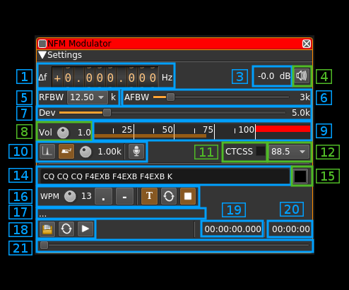
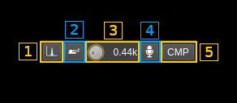

<h1>NFM modulator plugin</h1>

<h2>Introduction</h2>

This plugin can be used to generate a narrowband frequency modulated signal. "Narrowband" means that the bandwidth can vary from 1 to 40 kHz.

<h2>Interface</h2>

The top and bottom bars of the channel window are described [here](../../../sdrgui/channel/readme.md)

<h3>1: Frequency shift from center frequency of transmission</h3>

Use the wheels to adjust the frequency shift in Hz from the center frequency of transmission. Left click on a digit sets the cursor position at this digit. Right click on a digit sets all digits on the right to zero. This effectively floors value at the digit position. Wheels are moved with the mousewheel while pointing at the wheel or by selecting the wheel with the left mouse click and using the keyboard arrows. Pressing shift simultaneously moves digit by 5 and pressing control moves it by 2.

<h3>2: Channel power</h3>

Average total power in dB relative to a +/- 1.0 amplitude signal generated in the pass band.

<h3>3: Channel mute</h3>

Use this button to toggle mute for this channel.

<h3>4: Channel spacing presets</h3>

Clicking on the "CS" button will apply RF bandwidth, AF bandwidth and FM deviation settings according to the channel spacing scheme selected in the combo box as follows:

<table>
    <tr>
        <th>CS (kHz)</th>
        <th>RFBW (kHz)</th>
        <th>AFBW (kHz)</th>
        <th>FM &Delta; (&plusmn;kHz)</th>
        <th>&beta;</th>
    </tr>
    <tr>
        <td>5</td>
        <td>4.8</td>
        <td>1.7</td>
        <td>0.7</td>
        <td>0.43</td>
    </tr>
    <tr>
        <td>6.25</td>
        <td>6</td>
        <td>2.1</td>
        <td>0.9</td>
        <td>0.43</td>
    </tr>
    <tr>
        <td>7.5</td>
        <td>7.2</td>
        <td>2.5</td>
        <td>1.1</td>
        <td>0.43</td>
    </tr>
    <tr>
        <td>8.33</td>
        <td>8</td>
        <td>2.8</td>
        <td>1.2</td>
        <td>0.43</td>
    </tr>
    <tr>
        <td>12.5</td>
        <td>11</td>
        <td>3</td>
        <td>2.5</td>
        <td>0.83</td>
    </tr>
    <tr>
        <td>25</td>
        <td>16</td>
        <td>3</td>
        <td>5</td>
        <td>1.67</td>
    </tr>
    <tr>
        <td>40</td>
        <td>36</td>
        <td>9</td>
        <td>9</td>
        <td>1</td>
    </tr>
</table>

  - All these settings apply the Carson's rule: RFBW = 2 &times; (FM&Delta; + AFBW)
  - The 12.5 and 25 kHz channel spacings correspond to standard 11F3 and 16F3 settings respectively and are widely accepted and mostly used
  - For spacings lower than 12.5 kHz values are empirically built using Carson's rule from &beta;=0.43 which is the only standard provided
  - For spacing higher than 25 kHz values are derived from an old 36F9 standard.

When you are lost with the RF, AF bandwidths and FM deviation settings you can always come back to these standards and generally get good results.

When changing the RF bandwidth the channel spacing selection in the combo box is adjusted to fit within this bandwidth.

<h3>5: Audio Filters</h3>

  - The slider controls the bandwidth in kHz of the modulating signal filtered before modulation.
  - The "P" switch button next activates or de-activates pre-emphasis (fixed 120 &mu;s)
  - The rightmost button next activates or de-activates 300 Hz highpass filter when no CTCSS nor DCS is active

<h3>6: RF bandwidth</h3>

This is the bandwidth in kHz of the channel signal filtered after modulation.

<h3>7: Frequency deviation</h3>

This is the peak FM deviation in &plusmn;kHz that will be effective for nominal (1.0) audio volume

<h3>8: Volume</h3>

This is the volume of the audio signal from 0.0 (mute) to 2.0 (maximum). It can be varied continuously in 0.1 steps using the dial button.

<h3>9: Level meter in %</h3>

  - top bar (beige): average value
  - bottom bar (brown): instantaneous peak value
  - tip vertical bar (bright red): peak hold value

You should aim at keeping the peak value below 100% using the volume control

<h3>10: Input source control</h3>

<h4>10.1: Tone input select</h4>

Switches to the tone input. You must switch it off to make other inputs available.

<h4>10.2: Morse keyer input select</h4>

Switches to the Morse keyer input. You must switch it off to make other inputs available.

<h4>10.3: Tone frequency (kHz)</h4>

Adjusts the tone frequency from 0.1 to 2.5 kHz in 0.01 kHz steps

<h4>10.4: Audio input select and select audio input device</h4>

Left click to switch to the audio input. You must switch it off to make other inputs available.

Right click to select audio input device. See [audio management documentation](../../../sdrgui/audio.md) for details.

<h4>10.5: Audio input compression</h4>

Toggles the compressor for the audio input.

<h3>11: Audio feedback</h3>

Activate or de-activate the input source audio feedback

<h3>12: Audio feedback volume</h3>

Adjust audio feedback volume

<h3>13: CTCSS switch</h3>

Checkbox to switch on the CTCSS sub-audio tone

<h3>14: CTSS tone frequency</h3>

Select the CTCSS sub-audio tone in Hz among [these values](https://en.wikipedia.org/wiki/Continuous_Tone-Coded_Squelch_System)

<h3>15: CW (Morse) text</h3>

Enter the text to be keyed when Morse input is active and in text mode

<h3>16: Clear CW text</h3>

Clears the CW (Morse) text

<h3>17: Morse keyer controls</h3>

<h4>17.1: CW keying speed</h4>

Sets the CW speed in Words Per Minute (WPM). This is based on the word "PARIS" sent 5 times. For 5 WPM the dot length is 240 ms. In other terms the dot length is calculated as 1.2 / WPM seconds. The dot length is used as the base to compute other timings:

  - Element (dot or dash) silence separator: 1 dot length
  - Dash: 3 dot lengths
  - Character silence separator: 3 dot lengths
  - Word silence separator: 7 dot lengths

<h4>17.2: Dots keying</h4>

Switch this button to send dots continuously

<h4>17.3: Dashes keying</h4>

Switch this button to send dashes continuously

<h4>17.4: Text keying</h4>

Switch this button to send the text typed into the text box (14)

<h4>17.5: Text auto repeat</h4>

Switch this button to auto repeat the text keying

<h4>17.6: Text play/stop</h4>

Use this button to stop sending text. When resuming keying restarts at the start of text

<h3>18: Use keyboard for morse keying</h3>

&#9888; WARNING: this is not really useful if you do not use a proper Morse keyer with direct audio feedback. There is a significant audio delay either with the direct monitoring or by monitoring the transmitted signal so keying with this audio as feedback is not practical

18.7: Activate morse keys keyboard control

This disables text or continuous dots or dashes. Toggle input from keyboard. Occasionally the focus may get lost and you will have to deactivate and reactivate it to recover the key bindings.

18.8: Iambic or straight

Choose iambic or straight keying style. When straight is selected the dot or dash key may be used.

18.9: Register dot key

Click on the button and while selected type a character or character and modifier (Shift + key for example) to select which key is used for dots. The key or key sequence appears next (here dot `.`)

18.10: Register dash key

Click on the button and while selected type a character or character and modifier (Shift + key for example) to select which key is used for dashes. The key or key sequence appears next (here dot `.`)

<h3>19: Audio file path</h3>

The path to the selected audio file to be played or dots if unselected

<h3>20: Audio file play controls</h3>

<h4>20.1: Audio file select</h4>

Opens a file dialog to select the audio file to be played. It must be mono 48 kHz F32LE raw format. Using sox a .wav file can be converted with this command: `sox piano.wav -t raw -r 48k -c 1 -b 32 -L -e float piano.raw`

<h4>20.2: Audio file loop</h4>

Audio replay file at the end

<h4>20.3: Play/pause file play</h4>

Toggle play/pause file play. When paused the slider below (17) can be used to randomly set the position in the file when re-starting.

<h3>21: Play file current position</h3>

This is the current audio file play position in time units relative to the start

<h3>22: Play file length</h3>

This is the audio file play length in time units

<h3>23: Play file position slider</h3>

This slider can be used to randomly set the current position in the file when file play is in pause state (button 18.3)

<h3>24: DCS switch</h3>

Checkbox to switch on the DCS (Digital Code Squelch) sub-audio modulation.

<h3>25: DCS code</h3>

This is the DCS octal code (0..511 in decimal 0..777 in octal)

<h3>26: DCS positive modulation</h3>

When checked the "1" bits are represented with positive shift frequency and "0" with negative shift. When unchecked (negative modulation) this is the opposite.
