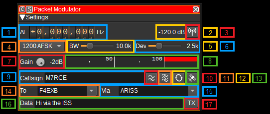

<h1>Packet radio modulator plugin</h1>

<h2>Introduction</h2>

This plugin can be used to modulate packet radio (APRS/AX.25) data packets.

<h2>Interface</h2>

<h3>1: Frequency shift from center frequency of transmission</h3>

Use the wheels to adjust the frequency shift in Hz from the center frequency of transmission. Left click on a digit sets the cursor position at this digit. Right click on a digit sets all digits on the right to zero. This effectively floors value at the digit position. Wheels are moved with the mousewheel while pointing at the wheel or by selecting the wheel with the left mouse click and using the keyboard arrows. Pressing shift simultaneously moves digit by 5 and pressing control moves it by 2.

<h3>2: Channel power</h3>

Average total power in dB relative to a +/- 1.0 amplitude signal generated in the pass band.

<h3>3: Channel mute</h3>

Use this button to toggle mute for this channel.

<h3>4: Modulation</h3>

This specifies the baud rate and modulation that is used for the packet transmission. Currently 1200 baud AFSK and 9600 baud FSK are supported.

<h3>5: RF Bandwidth</h3>

This specifies the bandwidth of a LPF that is applied to the output signal to limit the RF bandwidth.

<h3>6: Frequency deviation</h3>

Adjusts the frequency deviation in 0.1 kHz steps from 1 to 6 kHz. Typical values are 2.5 kHz and 5 kHz.

<h3>7: Gain</h3>

Adjusts the gain in dB from -60 to 0dB. The gain should be set to ensure the level meter remains below 100%.

<h3>8: Level meter in %</h3>

  - top bar (beige): average value
  - bottom bar (brown): instantaneous peak value
  - tip vertical bar (bright red): peak hold value

<h3>9: Callsign</h3>

Enter your amateur radio callsign and optionally a sub-station ID (SSID). E.g. M7RCE or M7RCE-1

<h3>10: Preemphaisis Filter</h3>

Check this button to enable a FM preemphasis filter, which amplifiers higher frequencies. Right click to open the dialog to adjust settings for the filter.

<h3>11: Bandpass Filter</h3>

Check this button to enable a baseband bandpass filter. Right click to open the dialog to adjust settings for the filter.

<h3>12: Repeat</h3>

Check this button to repeated transmit a packet. Right click to open the dialog to adjust the delay between retransmission and number of times the packet should be repeated.

<h3>13: Insertion position</h3>

Inserts position as APRS formatted latitude and longitude in to the current cursor position within the data field. Lattitude and longitude can be specified under Preferences > My position.

<h3>14: To</h3>

Enter the destination for the packet. To send the packet to the APRS network, use APRS or APZ.

<h3>15: Via</h3>

Enter the routing for the packet. To have the packet repeated by digipeaters, use WIDE2-2. To have the packet repeated by the International Space Station (ISS), use ARISS.

<h3>16: Data</h3>

The packet of data to send. To send an APRS status message, use the format <tt>>Status</tt>. The APRS specification can be found at: http://www.aprs.org/doc/APRS101.PDF. APRS messages can be tracked on https://aprs.fi

<h3>17: TX</h3>

Transmits a packet containing the current values in callsign, to, via and data fields.

<h2>API</h2>

Full details of the API can be found in the Swagger documentation. Here is a quick example of how to transmit a packet from the command line:

    curl -X POST "http://127.0.0.1:8091/sdrangel/deviceset/1/channel/0/actions" -d '{"channelType": "PacketMod",  "direction": 1, "PacketModActions": { "tx": { "callsign": "MYCALL", "to": "APRS", "via": "WIDE2-2", "data": ">Using SDRangel API to transmit" }}}'

Or to set the mode to 9600 FSK:

    curl -X PATCH "http://127.0.0.1:8091/sdrangel/deviceset/1/channel/0/settings" -d '{"channelType": "PacketMod", "direction": 1, "PacketModSettings": {"mode": "9600 FSK"}}'
