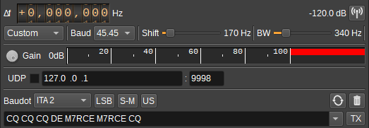

<h1>RTTY Modulator Plugin</h1>

<h2>Introduction</h2>

This plugin can be used to modulate RTTY (Radioteletype) encoded text.
RTTY uses BFSK (Binary Frequency Shift Keying), where transmission of data alternates between two frequencies,
the mark frequency and the space frequency. The RTTY Modulator should be centered in between these frequencies.
The baud rate, frequency shift (difference between mark and space frequencies), filter bandwidth and baudot character set are configurable.

<h2>Interface</h2>

The top and bottom bars of the channel window are described [here](../../../sdrgui/channel/readme.md)

<h3>1: Frequency shift from center frequency of transmission</h3>

Use the wheels to adjust the frequency shift in Hz from the center frequency of transmission. Left click on a digit sets the cursor position at this digit. Right click on a digit sets all digits on the right to zero. This effectively floors value at the digit position. Wheels are moved with the mousewheel while pointing at the wheel or by selecting the wheel with the left mouse click and using the keyboard arrows. Pressing shift simultaneously moves digit by 5 and pressing control moves it by 2.

<h3>2: Channel power</h3>

Average total power in dB relative to a +/- 1.0 amplitude signal generated in the pass band.

<h3>3: Channel mute</h3>

Use this button to toggle mute for this channel.

<h3>4: Mode</h3>

Contains a list of common baud rate and frequency shift settings. To specify your own, set this option to Custom.

45.45/170 is common for amateur RTTY.

<h3>5: Baud</h3>

Specifies the baud rate in symbols (bits) per second.

<h3>6: Frequency Shift</h3>

Adjusts the frequency shift (different between mark and space frequencies) in Hz.

<h3>7: RF Bandwidth</h3>

This specifies the bandwidth of a LPF that is applied to the output signal to limit the RF bandwidth.

<h3>8: Gain</h3>

Adjusts the gain in dB from -60 to 0dB.

<h3>9: Level meter in %</h3>

  - top bar (beige): average value
  - bottom bar (brown): instantaneous peak value
  - tip vertical bar (bright red): peak hold value

<h3>10: UDP</h3>

When checked, a UDP port is opened to receive text from other features or applications that will be transmitted.

<h3>11: UDP address</h3>

IP address of the interface to open the UDP port on, to receive text to be transmitted.

<h3>12: UDP port</h3>

UDP port number to receive text to be transmitted on.

<h3>13: Baudot Character Set</h3>

Specifies the Baudot character set used to encode the text to transmit. The following character sets are supported:

* ITA 2
* UK
* European
* US
* Russian
* Murray

<h3>14: Bit Ordering</h3>

Specifies whether bits are transmitted least-significant-bit first (LSB) or most-significant-bit first (MSB).

<h3>15: Mark/Space Frequency</h3>

When unchecked, the mark frequency is the higher RF frequency, when checked the space frequency is higher.

<h3>16: Unshift on Space</h3>

When checked, the Baudot character set will shift to letters when a space character (' ') is transmitted.

<h3>17: Repeat</h3>

Check this button to repeatedly transmit a packet. Right click to open the dialog to adjust the number of times the packet should be repeated.

<h3>18: Clear Transmitted Text</h3>

Press to clear the transmitted text.

<h3>19: Text to Transmit</h3>

Enter text to transmit. Pressing return will transmit the text and clear this field. Press the arrow to display and select a list of pre-defined text or previously transmitted text to enter in to the field.

The list of pre-defined text can be customised via the Transmit Settings dialog (20).

<h3>20: TX</h3>

Press to transmit the current text. The text field will not be cleared.

Right click to open a dialog to adjust additional Transmit Settings, including the list of pre-defined text.

Predefined text supports the following variable substitutions:

* ${callsign} - Gets replaced with the station name from Preferences > My Position
* ${location} = Gets replaced with the Maidenhead locator for the position specified under Preferences > My Position

The substitutions are applied when the Transmit Settings dialog is closed.

<h3>21: Transmitted Text</h3>

The trasnmitted text area shows characters as they are transmitted.

Holding the cursor over an acronym may show a tooltip with the decoded acronym.

<h2>API</h2>

Full details of the API can be found in the Swagger documentation. Below are a few examples.

To transmit the current text simply send a "tx" action:

    curl -X POST "http://127.0.0.1:8091/sdrangel/deviceset/0/channel/0/actions" -d '{"channelType": "RTTYMod",  "direction": 1, "RTTYModActions": { "tx": 1 }}'

To transmit text specified on the command line:

    curl -X POST "http://127.0.0.1:8091/sdrangel/deviceset/0/channel/0/actions" -d '{"channelType": "RTTYMod",  "direction": 1, "RTTYModActions": { "tx": 1, "payload": {"text": "CQ CQ CQ anyone using SDRangel CQ" }}}'

To set the baud rate and frequency shift:

    curl -X PATCH "http://127.0.0.1:8091/sdrangel/deviceset/0/channel/0/settings" -d '{"channelType": "RTTYMod", "direction": 1, "RTTYModSettings": {"baud": 45.45, "frequencyShift": 170 }}'
