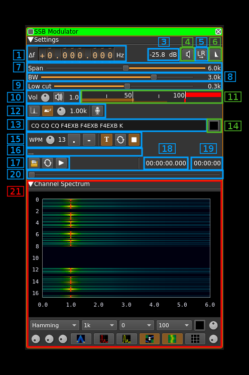
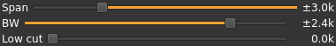
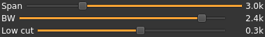
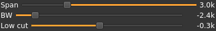
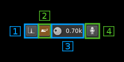
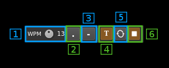
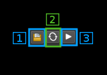

<h1>SSB modulator plugin</h1>

<h2>Introduction</h2>

This plugin can be used to generate a single sideband or double sidebands modulated signal.

<h2>Interface</h2>

&#9758; In order to toggle USB or LSB mode in SSB mode you have to set the "BW" in channel filter cutoff control (8) to a positive (USB) or negative (LSB) value. The above screenshot shows a USB setup. See the (7) to (9) paragraphs below for details.

&#9758; The channel marker in the main spectrum display shows the actual band received taking in channel filtering into account.

<h3>1: Frequency shift from center frequency of transmission</h3>

Use the wheels to adjust the frequency shift in Hz from the center frequency of transmission. Left click on a digit sets the cursor position at this digit. Right click on a digit sets all digits on the right to zero. This effectively floors value at the digit position. Wheels are moved with the mousewheel while pointing at the wheel or by selecting the wheel with the left mouse click and using the keyboard arroews. Pressing shift simultanoeusly moves digit by 5 and pressing control moves it by 2.

<h3>2: Channel power</h3>

Average total power in dB relative to a +/- 1.0 amplitude signal generated in the pass band.

<h3>3: Binaural mode</h3>

Use this button to toggle between monaural and binaural mode. Monaural is classical single sideband or double sidebands modulation. In binaural mode I and Q samples are taken from the left and right stereo channels (or reversed).

When in monaural mode the icon shows a single loudspeaker and when in binaural mode it shows a pair of loudspeakers.

<h3>4: Reverse left and right channels in binaural mode</h3>

Effective only in binaural mode: reverses left and right audio channels so that the left is connected to Q and the right to the I complex signal channel. 

<h3>5: Sideband flip</h3>

Flip LSB/USB. Mirror filter bandwidth around zero frequency and change from LSB to USB or vice versa. Works in SSB mode only.

<h3>6: SSB/DSB</h3>

Selects between SSB and DSB operation. When in SSB mode the icon shows a single sideband spectrum (USB side). When in DSB mode the icon shows a double sideband spectrum. In SSB mode the shape of the icon represents LSB or USB operation.

<h3>7: Spectrum display frequency span</h3>

The transmitted signal in the sideband (SSB) or sidebands (DSB) sample rate of 48 kHz is further decimated by a power of two before being applied to the channel spectrum display and used to set the in channel filter limits. This effectively sets the total available bandwidth depending on the decimation:

  - 1 (no decimation): 24 kHz (SSB) or 48 kHz (DSB)
  - 2: 12 kHz (SSB) or 24 kHz (DSB)
  - 4: 6 kHz (SSB) or 12 kHz (DSB)
  - 8: 3 kHz (SSB) or 6 kHz (DSB)
  - 16: 1.5 kHz (SSB) or 3 kHz (DSB)

The span value display is set as follows depending on the SSB or DSB mode:

  - In SSB mode: the span goes from zero to the upper (USB: positive frequencies) or lower (LSB: negative frequencies) limit and the absolute value of the limit is displayed.
  - In DSB mode: the span goes from the lower to the upper limit of same absolute value and &#177; the absolute value of the limit is displayed.

This is how the Span (7) and bandpass (8, 9) fitler controls look like in the 3 possible modes:

**DSB**:

  - Decimation factor is 4 hence span is 6 kHz from -3 to +3 kHz and &#177;3.0k is displayed
  - In channel filter bandwidth is 5.2 kHz from -2.6 to +2.6 kHz and &#177;2.4k is displayed
  - In channel filter "low cut" is disabled and set to 0

**USB**:

  - Decimation factor is 4 hence span is 3 kHz from 0 to 3 kHz and 3.0k is displayed
  - In channel filter upper cutoff is 2.4 kHz and 2.6k is displayed
  - In channel filter lower cutoff is 0.3 kHz and 0.3k is displayed
  - Hence in channel filter bandwidth is 2.3 kHz

**LSB**:

  - Decimation factor is 4 hence span is 3 kHz from 0 to -3 kHz and -3.0k is displayed
  - In channel filter lower cutoff is -2.6 kHz and -2.6k is displayed
  - In channel filter upper cutoff is -0.3 kHz and -0.3k is displayed
  - Hence in channel filter bandwidth is 2.3 kHz

<h3>8: "BW": In channel bandpass filter cutoff frequency farthest from zero</h3>

Values are expressed in kHz and step is 100 Hz.

  - In SSB mode this is the upper (USB: positive frequencies) or lower (LSB: negative frequencies) cutoff of the in channel single side band bandpass filter. The value triggers LSB mode when negative and USB when positive
  - In DSB mode this is half the bandwidth of the double side band in channel bandpass filter therefore the value is prefixed with the &#177; sign. 

<h3>9: "Low cut": In channel bandpass filter cutoff frequency closest to zero</h3>

Values are expressed in kHz and step is 100 Hz.

  - In SSB mode this is the lower cutoff (USB: positive frequencies) or higher cutoff (LSB: negative frequencies) of the in channel signe side band bandpass filter.
  - In DSB mode it is inactive and set to zero (double side band filter).

<h3>10: Volume</h3>

This is the volume of the audio signal from 0.0 (mute) to 2.0 (maximum). It can be varied continuously in 0.1 steps using the dial button. The Loudspeaker button is the audio mute toggle.

<h3>11: Level meter in %</h3>

  - top bar (beige): average value
  - bottom bar (brown): instantaneous peak value
  - tip vertical bar (bright red): peak hold value

You should aim at keepimg the peak value below 100% using the volume control

<h3>12: Audio compression</h3>

The audio compressor uses the same AGC as on the receive side (SSB demodulator) with the following changes:

  - The clamping is always active to prevent modulation overload
  - The amplitude (magnitude) order control is tunable (2.2)
  - The squelch delay after return below threshold is tunable (2.6) 

The audio compressor works only in monaural mode controlled by (4)

<h4>12.1: Audio compressor toggle</h4>

Use this button to toggle audio compressor on and off. In "on" mode the button is lit as on the picture.

<h4>12.2: AGC magnitude order</h4>

This is the ratio to maximum signal magnitude aimed by the AGC. The higher the stronger is the compression but the signal will have more chances to get clamped and therefore will get more severly distorted.

The default value is 0.2 which is rather mild. For normal voice you should not exceed 0.4 however the criteria is rather subjective. It is flexible enough to be tuned between 0 and 1 in 0.01 increments.

<h4>12.3: AGC time constant</h4>

Audio power is averaged during this period in ms. The lower the closer the compression reacts to audio signal variations and the "harder" it feels. This period can be set among these values: 1, 2, 5, 10, 20, 50, 100, 200, 500, 990 ms

The default value is 200 ms which is relatively "soft". Most practically useful values are between 20 and 500 ms.

<h4>12.4: Power threshold</h4>

in order to avoid small signals due to background noise or power wiggle to enter the system and raise to normal voice level a power based squelch is in place. This control allows to select a threshold in dB above which a signal will open the squalch if it lasts longer than the squelch gate (2.5). Default is -40 dB.

<h4>12.5: Squelch gate</h4>

This prevents short bursts to open the squelch. This is the time in ms after a signal with a power constantly above the threshold will effectively open the squelch. Default is 4 ms.

<h4>12.6: Squelch cut-off delay</h4>

This controls the delay in ms after which a signal drop below threshold will close the squelch. Default value is 50 ms.

<h3>13: Input source control</h3>

<h4>13.1: Tone input select</h4>

Switches to the tone input. You must switch it off to make other inputs available.

<h4>13.2: Morse keyer input select</h4>

Switches to the Morse keyer input. You must switch it off to make other inputs available.

<h4>13.3: Tone frequency (kHz)</h4>

Adjusts the tone frequency from 0.1 to 2.5 kHz in 0.01 kHz steps

<h4>13.4: Audio input select</h4>

Switches to the audio input. You must switch it off to make other inputs available.

<h3>14: CW (Morse) text</h3>

Enter the text to be keyed when Morse input is active and in text mode

<h3>15: Clear CW text</h3>

Clears the CW (Morse) text

<h3>16: Morse keyer controls</h3>

<h4>16.1: CW keying speed</h4>

Sets the CW speed in Words Per Minute (WPM). This is based on the word "PARIS" sent 5 times. For 5 WPM the dot length is 240 ms. In other terms the dot length is calculated as 1.2 / WPM seconds. The dot length is used as the base to compute other timings:

  - Element (dot or dash) silence separator: 1 dot length
  - Dash: 3 dot lengths
  - Character silence separator: 3 dot lengths
  - Word silence separator: 7 dot lengths
  
<h4>16.2: Dots keying</h4>

Switch this button to send dots continuously

<h4>16.3: Dashes keying</h4>

Switch this button to send dashes continuously

<h4>16.4: Text keying</h4>

Switch this button to send the text typed into the text box (13)

<h4>16.5: Text auto repeat</h4>

Switch this button to auto repeat the text keying

<h4>16.6: Text play/stop</h4>

Use this button to stop sending text. When resuming keying restarts at the start of text

<h3>17: Audio file path</h3>

The path to the selected audio file to be played or dots if unselected

<h3>18: Audio file play controls</h3>

<h4>18.1: Audio file select</h4>

Opens a file dialog to select the audio file to be played. It must be mono 48 kHz 16LE raw format.

<h4>18.2: Audio file loop</h4>

Audio replay file at the end

<h4>18.3: Play/pause file play</h4>

Toggle play/pause file play. When paused the slider below (20) can be used to randomly set the position in the file when re-starting.

<h3>19: Play file current position</h3>

This is the current audio file play position in time units relative to the start

<h3>20: Play file length</h3>

This is the audio file play length in time units

<h3>21: Play file position slider</h3>

This slider can be used to randomly set the currennt position in the file when file play is in pause state (button 17.3)

<h3>22: Channel spectrum display</h3>

This is the channel spectrum display. Controls at the bottom of the panel are the same as with the central spectrum display.